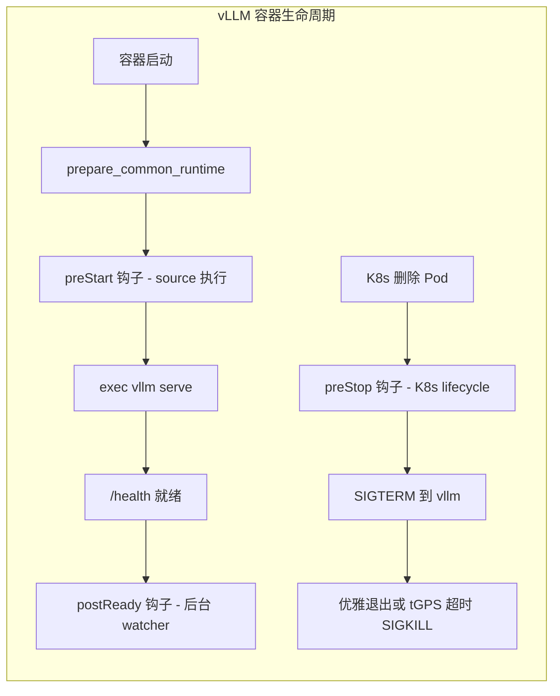

# Developer Guide：Unified Cache 模型适配与环境变量管理

本文面向需要在 Unified Cache Helm Chart 上进行**模型适配**、**环境变量增删**与**启动参数调整**的开发者。
目标是：在不改模板（template）的前提下，通过新增/调整 values 文件实现可复用的模型部署。

> 本 chart 已是 **kthena-only**：只渲染 kthena CRD `ModelServing`（必有）+ 可选 `ModelServer` / `ModelRoute`，**没有 native（Deployment / StatefulSet / Ray / ucm-router）路径**。部署形态完全由 `servingEngineSpec.modelSpec.roles[]` 的形状决定。集群侧前置：kthena 控制面（controller-manager + kthena-router + CRDs）+ 可选 Volcano（PD/多机 gang 调度），本 chart 不负责安装。
>
> 完整 values schema 参见 [uc-stack-kthena-values.md](uc-stack-kthena-values.md)。

---

## 1. 目录与配置层级总览

### 1.1 推荐目录结构

* `values.yaml`：全局默认配置（镜像、通用 `configs`、网卡自动探测、`nodeTopologyConfig`、探针等）
* `models/<platform>/values-<model>-<topology>.yaml`：每个模型的“模型模板”
    * `<platform>`：`cuda`（NVIDIA GPU）或 `ascend`（华为昇腾 NPU）—— 目录名表示平台，不再是必填的 `chipType`
    * `<topology>`：`1e1`（1 engine 单机）/ `1e2`（1 engine 双机）/ `1p1-1d1`、`2p1-2d1`、`2p2-2d2`（PD 分离，格式为 `<P副本数>p<每个P实例机器数>-<D副本数>d<每个D实例机器数>`）
* `doc/`：网络、多机、排障等文档

实际文件示例：

```
models/
  cuda/
    values-qwen3-0p6b-1e1.yaml
    values-qwen3-0p6b-1e2.yaml
    values-qwen3-0p6b-1p1-1d1.yaml
    values-qwen3-0p6b-2p1-2d1.yaml
    values-qwen3-0p6b-2p2-2d2.yaml
    values-deepseek-r1-awq-single.yaml
    values-deepseek-r1-awq-multi.yaml
  ascend/
    values-qwen3-0p6b-1e1.yaml
    values-qwen3-0p6b-1e2.yaml
    values-qwen3-0p6b-1p1-1d1.yaml
    values-qwen3-0p6b-2p1-2d1.yaml
    values-qwen3-0p6b-2p2-2d2.yaml
    values-deepseek-v3p1-multi.yaml
    values-qwen3-235b-multi.yaml
```

### 1.2 配置优先级与覆盖规则

通常配置由三层叠加（后者覆盖前者）：

1. `values.yaml`（全局默认）
2. `values.yaml` 顶层 `nodeTopologyConfig`（环境/网络/多机差异，按节点名注入）
3. `models/.../values-xxx.yaml`（模型模板：`modelPath`、`roles[]`、`vllmArgs`、`unifiedcacheConfig` 等）

典型安装命令：

```bash
helm install qwen3-0p6b-1e1 -n yulei-test --create-namespace \
  . \
  -f values.yaml \
  -f models/ascend/values-qwen3-0p6b-1e1.yaml
```

---

## 2. 模型适配开发流程

模型适配的核心是为单模型 release 维护一个 `modelSpec`（或新增一份模型 values 文件），并确保以下几个方面正确。

### 2.1 基础信息

在 `modelSpec` 中至少需要：

* `name`：模型标识（用于资源命名、标签）。CRD 名 = `<release>-<name>`；仅支持小写字母、数字、`-`，起止为字母或数字；`<release>-<name>` 总长需 <= 63
* `modelPath`：模型加载路径或仓库 ID，会原样作为 `vllm serve <modelPath>` 的位置参数（**由 chart 接管，不要写进 `vllmArgs`**）
* `modelName`：**对外服务名**。统一注入到 `--served-model-name` + `ModelRoute.modelName` + `ModelServer.model`；**留空时回退为 `modelPath`**。客户端请求体里的 `"model"` 字段必须等于它
* `roles[]`：**唯一的形态来源**。每个 role 至少有 `name` / `replicas` / `workerReplicas` / `resources` / `vllmArgs`
    * `name`：role 名，仅支持小写字母、数字、`-`，起止为字母或数字，最长 12（kthena CRD 约束）
    * `replicas`：该 role 的副本数（PD 下即 xPyD 的 x/y）
    * `workerReplicas`：`0` = 单机（1 个 entry pod）；`>=1` = 跨机（1 entry + N worker，引擎内做跨机 TP/PP/DP）
* `resources`：**raw k8s ResourceRequirements**，直接写设备键（见 §2.2），不再有 `requestCPU/requestGPU/requestNPU` 这类标量字段
* `unifiedcacheConfig`（可选）：Unified Cache 主配置（`config.ucm_connectors[]`）；`enabled`（默认 `true`，别名 `enable`）为显式开关，`false` = 不使用 UCM（即使 `config` 非空）
* 多机/PD 场景还会用到：`recoveryPolicy` / `gangPolicy.minRoleReplicas` / `pd.kvTransfer` / `router`

> 已删除字段（不要再写）：`modelURL`、`replicaCount`、`startupMode`、`vllmConfig`、`config.properties`、`deployMode`、`raySpec`、`chipType`（必填语义），以及 PD 旧字段 `pd.connector`、`pd.mooncakePort`、`pd.ucm`。后三者即使为空或 `false` 也会渲染失败并提示迁移。

### 2.2 芯片差异：chip-agnostic

chart 是 **chip-agnostic** 的：模板里**不读 `chipType`**，后端由镜像 + vLLM 自动探测。芯片差异只体现在你写的 values 内容里：

* **设备资源 key**：你在 `roles[].resources.limits/requests` 里直接写真实设备键
    * CUDA：`nvidia.com/gpu`
    * Ascend：`huawei.com/Ascend910`（由 device-plugin 暴露的键，按你集群实际为准）
* **通信栈环境变量**：GPU 用 `NCCL_*`，Ascend 用 `HCCL_*`；多机网卡名通过顶层 `nodeTopologyConfig` 按节点注入，或交给 `autoDetectInterface` 自动探测（见 §5）
* **runtimeClassName**：若节点需要特定 runtimeClass，在 **role 级** 写 `roles[].runtimeClassName`（不再从芯片类型自动推断）

---

## 3. 参数归属规范（重点）

参数分为四层，开发者在加配置时，先判断它属于下面哪一层，再决定写到哪里：

| 层 | 位置 | 作用域 |
|---|---|---|
| 全局环境变量 | `servingEngineSpec.configs` | 所有模型 |
| 模型级环境变量 | `modelSpec.env` | 当前模型 |
| 节点级环境变量 | 顶层 `nodeTopologyConfig` | 按节点名 |
| vLLM 启动参数 | `roles[].vllmArgs`（flags-only） | 当前 role |

---

## 3.1 `servingEngineSpec.configs`：全局环境变量

**定义位置：**

```yaml
servingEngineSpec:
  configs:
    VLLM_LOGGING_LEVEL: "INFO"
    START_TIMEOUT: "6000"
    ENABLE_GC: "True"
    ...
```

**语义：**

* 对所有模型通用（通过 `<release>-configs` ConfigMap 的 `envFrom` 注入）
* 与平台/部署形态相关（日志、超时、GC、UC 算法开关、存储后端信息等）
* 常用于：
    * UC 服务通用开关
    * 通用超时/日志（`VLLM_LOGGING_LEVEL`、`START_TIMEOUT`）
    * 与存储阵列/后端服务相关的全局配置

**建议：**

* `configs` 只放“**对所有模型都成立**”的默认值
* 模型若需要特例，优先用 `modelSpec.env` 覆盖（优先级更高），而不是把模型差异塞回全局默认

---

## 3.2 `modelSpec.env`：模型级环境变量

**定义位置：**

```yaml
modelSpec:
  name: qwen3-0p6b-1e1
  env:
    - name: VLLM_SERVER_DEV_MODE
      value: "1"
```

**语义：**

* 仅对该模型生效，**优先级高于 `servingEngineSpec.configs`**
* 用于模型/权重/Tokenizer/框架插件的差异化配置
* Ascend PD 场景常在这里补 `HCCL_SOCKET_IFNAME`、`HCCL_IF_IP: "$(HOST_IP)"` 等（见 `models/ascend/values-qwen3-0p6b-1p1-1d1.yaml`）

**建议：**

* 不要把“只对某一个模型有效”的变量放进 `configs`
* `modelSpec.env` 的变化应跟随“模型模板文件”提交，方便回溯
* **不要把 env 变量写进 `vllmArgs`**：`vllmArgs` 只接受 vLLM CLI flags

---

## 3.3 `nodeTopologyConfig`：节点级环境变量

`nodeTopologyConfig` 是顶层配置（与 `servingEngineSpec` 同级），专门管理“同一个模型、不同节点上需要注入的环境变量”，典型场景是多机通信网卡绑定。

> 网卡类 `*_IFNAME` 默认已由顶层 `autoDetectInterface`（默认 `true`，与 `nodeTopologyConfig` 同级）按节点 IP（`HOST_IP`）**自动探测并扇出**到 `GLOO/HCCL/NCCL/TP_SOCKET_IFNAME` 及 `VLLM_NETWORK_INTERFACE/VLLM_USE_NETIF`（并派生 `HCCL_IF_IP/VLLM_HOST_IP`、置 `VLLM_DETECT_MULTI_IP=0`）。`nodeTopologyConfig` 退化为**可选显式覆盖**（优先级最高）。仅在自动探测会选错（独立 fabric / 管理网与高速网分离）或需精确控制时才手填；需 `hostNetwork: true`。

适合放这里的变量：

* GPU：`NCCL_SOCKET_IFNAME`、`GLOO_SOCKET_IFNAME`、`VLLM_NETWORK_INTERFACE`、`NCCL_IB_*`
* Ascend：`HCCL_IF_NAME`、`HCCL_SOCKET_IFNAME`、`GLOO_SOCKET_IFNAME`

写法（key 必须与 `kubectl get nodes` 的节点名一致）：

```yaml
nodeTopologyConfig:
  gpu-1:
    GLOO_SOCKET_IFNAME: "ens10f0"
    NCCL_SOCKET_IFNAME: "ens10f0"
    VLLM_NETWORK_INTERFACE: "ens10f0"
  npu-1:
    HCCL_SOCKET_IFNAME: "enp189s0f0"
    HCCL_IF_NAME: "enp189s0f0"
    VLLM_NETWORK_INTERFACE: "enp189s0f0"
```

不要把这类节点差异变量塞进 `servingEngineSpec.configs`。
`UC_PD_GROUP_NAME`、`UC_PD_ROLE_ID`、`UC_USES_UCM`、`UC_SKIP_KV_CONNECTOR_REGISTRY_PROBE`、`VLLM_ARGS_FILE` 属于 Chart 托管的 KV 运行时变量，禁止写入 `nodeTopologyConfig`；Helm 会直接拒绝，避免节点配置覆盖实例身份或 UCM 角色判定。

---

## 4. vLLM 启动配置：`roles[].vllmArgs`（flags-only）

### 4.1 写法

每个 role 在 `vllmArgs` 里写**原生 vLLM CLI flags**，一行一个，直接对应 `vllm serve` 的命令行参数。这是配置 vLLM 的**唯一**方式（已无 `vllmConfig` / `config.properties` / `run_vllm.sh`）。

单机 / 双机只有一个 role（`name: engine`），就一段 `vllmArgs`：

```yaml
roles:
  - name: engine                  # role 名：小写字母/数字/-，起止字母或数字，最长 12
    replicas: 1
    workerReplicas: 0
    resources:
      limits:   { nvidia.com/gpu: "4", cpu: "32", memory: 256Gi }
      requests: { nvidia.com/gpu: "4", cpu: "32", memory: 256Gi }
    vllmArgs: |
      --tensor-parallel-size 4
      --data-parallel-size 1
      --pipeline-parallel-size 1
      --max-model-len 20000
      --block-size 128
      --gpu-memory-utilization 0.87
      --distributed-executor-backend mp
      --no-enable-prefix-caching
      --trust-remote-code
```

PD 场景有两个 role（`prefill` / `decode`），**各写各的** `vllmArgs`：

```yaml
roles:
  - name: prefill                 # role 名：小写字母/数字/-，起止字母或数字，最长 12
    replicas: 1
    workerReplicas: 0
    resources:
      limits:   { nvidia.com/gpu: "1", cpu: "16", memory: 64Gi }
      requests: { nvidia.com/gpu: "1", cpu: "16", memory: 64Gi }
    vllmArgs: |
      --tensor-parallel-size 1
      --max-model-len 20000
      --gpu-memory-utilization 0.85
      --trust-remote-code
  - name: decode                  # role 名：小写字母/数字/-，起止字母或数字，最长 12
    replicas: 1
    workerReplicas: 0
    resources:
      limits:   { nvidia.com/gpu: "1", cpu: "16", memory: 64Gi }
      requests: { nvidia.com/gpu: "1", cpu: "16", memory: 64Gi }
    vllmArgs: |
      --tensor-parallel-size 1
      --max-model-len 20000
      --gpu-memory-utilization 0.85
      --trust-remote-code
      --no-enable-prefix-caching
```

> 若某个 role 没写 `vllmArgs`，会回退到 `modelSpec.vllmArgs`。

### 4.2 哪些参数由 Chart 接管（不要写进 `vllmArgs`）

下列参数由 chart / 运行时统一管理，**写进 `vllmArgs` 会直接报错**（`chart.validateVllmArgs` 校验，报错信息形如 `servingEngineSpec.modelSpec.vllmArgs must not set chart-managed argument <arg>`）：

| 参数 | 来源 |
|---|---|
| `--served-model-name` | 取自 `modelSpec.modelName`（空则 `modelPath`），统一注入 |
| `--host` / `--port` | 由 `containerPort` 决定，entrypoint 注入 |
| `--headless` | 多机 worker 节点由 entrypoint 注入 |
| `--data-parallel-address` / `-dpa` | 多机由运行时 `MASTER_IP` 注入 |
| `--data-parallel-rpc-port` / `-dpp` | 多机由运行时注入 |
| `--data-parallel-start-rank` / `-dpr` | 多机由 `NODE_RANK × dp_size_local` 推导注入 |
| `--kv-transfer-config` | Pod 启动时由统一 resolver 根据 role 模板、`group-name` 和 `role-id` 生成并追加；每个逻辑 P/D 实例身份唯一 |
| `--config` | 禁止使用；外部 YAML 会绕过 Helm 对并行布局、端口跨度和托管参数的校验 |
| `--kv-offloading-size` / `--kv-offloading-backend` | role 已启用 Chart KV template/meta 时禁止；vLLM 否则会在解析后替换既有 connector。无 Chart KV 的普通 role 不受限 |

此外，位置参数 `modelPath` 也由 chart 写死在 `vllm serve <modelPath>`，不要在 `vllmArgs` 里重复；`VLLM_ARGS_FILE` 固定指向当前 role 的投影文件，不允许从环境或 `preStart` 覆盖。Chart KV 生效时，最终启动前会清除 `VLLM_DP_SIZE/RANK/RANK_LOCAL/MASTER_IP/MASTER_PORT`，保证实际 DP 布局与 Helm 解析出的 metadata/端口跨度一致。

**对外服务名的三方一致性**（结构上保证，不会漂移）：客户端请求体 `"model"` → `ModelRoute.spec.modelName` → 命中 `ModelServer` → 选中 pod 的 `--served-model-name`，三者全部来自同一个 `chart.servedModelName`（= `modelName ?? modelPath`）。所以你只需设好 `modelSpec.modelName` 一处。

**UCM 文件路径**（运行时链路）：

* 模板文件：`/vllm-workspace/UnifiedCache/config/ucm_config.template.yaml`
* 运行时文件：`/vllm-workspace/UnifiedCache/config/ucm_config.runtime.yaml`

容器启动时会复制模板文件到运行时文件；当 `unifiedcacheConfig.kvcsStoreIdAutoDetect=true` 时，还会按 PVC 对应 PV 的 CSI attributes 回填 `kvcs_store_id`。`--kv-transfer-config` 里的 `UCM_CONFIG_FILE` 指向的就是这个运行时文件。`storage_backends` / `kvcs_instance_name` / `kvcs_store_id` / `kvcs_tls_enable` 这几项由 chart 自动接管，**不要在 `unifiedcacheConfig.config` 里手写**；`use_layerwise` 已不再托管，需要时直接写进 `unifiedcacheConfig.config`。

### 4.3 常用 flags 对照

老的 `key=value` 习惯映射到 flag 写法：

| 旧 key=value | 现 flag |
|---|---|
| `tp_size=4` | `--tensor-parallel-size 4` |
| `dp_size=2` | `--data-parallel-size 2` |
| `dp_size_local=1` | `--data-parallel-size-local 1` |
| `pp_size=1` | `--pipeline-parallel-size 1` |
| `max_model_len=20000` | `--max-model-len 20000` |
| `max_num_batched_tokens=16384` | `--max-num-batched-tokens 16384` |
| `block_size=128` | `--block-size 128` |
| `gpu_memory_utilization=0.87` | `--gpu-memory-utilization 0.87` |
| `distributed_executor_backend=mp` | `--distributed-executor-backend mp` |
| `enable_prefix_caching=false` | `--no-enable-prefix-caching` |

其它常见 flags：`--enable-expert-parallel`、`--quantization ascend`、`--compilation-config '{...}'`、`--enforce-eager`、`--trust-remote-code`。

> chart 会解析 `--tensor-parallel-size/-tp` 来决定是否挂载 `/dev/shm`：当 `vllmArgs` 写了 `--tensor-parallel-size/-tp`（任意值）或设置了 `shmSize` 时挂载 `/dev/shm`；不写该 flag（默认 TP1）则不挂。注意显式写 `-tp 1` 也会挂载。

---

## 5. 多机与网络：开发者需要知道的最小集合

### 5.1 kthena 多机模型：roles[] 形态决定一切

**没有 `deployMode`、没有 `replicaCount`、没有 StatefulSet vs Deployment 的选择**。三种形态都通过 `roles[]` 表达，统一渲染为 `ModelServing`：

| 形态 | roles[] 形状 | 额外配置 | 渲染 |
|---|---|---|---|
| **单机** | 1 个 role（`name: engine`，`workerReplicas: 0`） | — | `ModelServing`(1 pod) + `Service` 直连 |
| **多机/双机** | 1 个 role（`name: engine`，`workerReplicas: >=1`） | `recoveryPolicy: ServingGroupRecreate` + `gangPolicy` | `ModelServing`(entry + worker，引擎内跨机 TP/PP/DP) + `Service` 直连 |
| **PD / xPyD** | 2 个 role（`prefill` + `decode`） | `modelSpec.pd.kvTransfer` + `pd.{prefill,decode}` + `router` | `ModelServing`(2 role) + `ModelServer` + `ModelRoute` |

**多机身份由 kthena 运行时托管，不再依赖 `POD_INDEX` / `-0` master：**

* kthena 向各 pod 注入 `WORKER_INDEX`（0/空 = entry，rank 0；>=1 = worker）和 `ENTRY_ADDRESS`（entry 的地址）。
* chart 注入 `REPLICA_COUNT = 1 + workerReplicas`，作为所有多机分支的开关。
* entrypoint（`node-topology-setup.sh`）短路推导：`NODE_RANK = WORKER_INDEX`，`MASTER_IP =` entry 自身 `POD_IP` 或 worker `getent hosts $ENTRY_ADDRESS` 解析结果。
* entry pod 起 API server（`--host 0.0.0.0 --port 8000` + DP coordinator）；worker 起 `--headless`，拨入 entry 的 `--data-parallel-address $MASTER_IP`，并由 chart 计算非冲突的 `--data-parallel-start-rank = NODE_RANK × dp_size_local`。
* 跨机 TP/PP/DP 由 vLLM 引擎自身负责：你在 `vllmArgs` 里写的 `--tensor-parallel-size` / `--pipeline-parallel-size` / `--data-parallel-size` 决定并行拓扑（双机示例见 `models/cuda/values-qwen3-0p6b-1e2.yaml`：`DP2 × TP1`，配 `--data-parallel-size-local 1`）。

“双机一损俱损、同时拉起” = `recoveryPolicy: ServingGroupRecreate`（任一 pod 丢失则整 ServingGroup 重建）。多引擎扩缩用 `modelSpec.replicas`（= ServingGroup 数）。

### 5.2 hostNetwork 与 dnsPolicy

PD / 多机通常需要 `hostNetwork: true`：

* Mooncake 绑定的每实例 `kv_port` 需要对外可路由地址；CUDA 示例从 `kvPortBase: 20001` 起、Ascend 从 `kvPortBase: 36000` 起按 `instanceStride: 100` 分配，后者可避开 AscendDirectTransport 的 `20000` 起动态端口段；
* RDMA/HCCL 互联与宿主机网卡自动探测都要求 pod 共享宿主机网络命名空间。

根 `values.yaml` 已统一默认：

```yaml
servingEngineSpec:
  hostNetwork: true
  hostIPC: true                       # PD 跨进程共享内存
  dnsPolicy: "ClusterFirstWithHostNet"
```

模型模板无需重复写这三项；确有特殊场景时可在模型 values 中覆盖 `servingEngineSpec.modelSpec.hostNetwork` / `hostIPC` / `dnsPolicy`。`ClusterFirstWithHostNet` 保证 worker 仍能解析集群 DNS（`getent hosts $ENTRY_ADDRESS` 依赖它）。`hostNetwork` 下 chart 会给 vLLM(8000) 声明 `hostPort`，并默认加 hostname `podAntiAffinity`（PD 或 `workerReplicas>0` 时），防止同机 `kv_port`/端口冲突。

---

## 6. 新增一个模型模板的标准步骤（Checklist）

1. **复制一个同平台同形态模板**：
    * CUDA：`models/cuda/values-<model>-<topology>.yaml`
    * Ascend：`models/ascend/values-<model>-<topology>.yaml`
    * 形态决定从哪个文件起步：单机 `-1e1` / 多机 `-1e2` / PD `-1p1-1d1`、`-2p1-2d1`、`-2p2-2d2`
2. **改基础信息**：
    * `name`（资源命名）
    * `modelPath`（`vllm serve` 路径）
    * `modelName`（对外服务名；客户端 `"model"` 字段就用它）
3. **改 `roles[]`**：
    * `replicas`（PD 下即 xPyD 的 x/y）
    * `workerReplicas`（`0`=单机；`>=1`=多机）
    * `resources.limits/requests`：写真实设备键 `nvidia.com/gpu` / `huawei.com/Ascend910` + `cpu` / `memory`
    * `vllmArgs`：flags-only（`--tensor-parallel-size` / `--data-parallel-size` / `--max-model-len` 等），**不要写 §4.2 的托管参数**
4. **多机额外**：`recoveryPolicy: ServingGroupRecreate` + `gangPolicy.minRoleReplicas.{engine: 1}`
5. **PD 额外**：
    * `gangPolicy.minRoleReplicas.{prefill: N, decode: N}`
    * `pd.kvTransfer.{connector,routerType,identity}` + `pd.{antiAffinity,prefill,decode[,mooncake.master.enabled]}`。`connector` 精确支持 `MooncakeConnectorV1` / `MooncakeHybridConnector` / `NixlConnector`；对应 `routerType` 必须为 `mooncake` / `mooncake` / `nixl`。Mooncake identity 填 `engineIdBase`、`kvPortBase`、`instanceStride`，NIXL 只填 `engineIdBase`（`pd.prefill`/`pd.decode` 必须引用某个 `roles[].name`）
    * 自创建 Mooncake master 时按需调整顶层 `mooncakeMaster.resources`；它是独立 Deployment 的 CPU/内存资源，不写进 `roles[].resources`，也**不要写加速卡键**（master 是纯 CPU 控制面，不占 NPU/GPU 配额）；Ascend 的 `/usr/local/Ascend/driver` 与 `/etc/hccn.conf` 宿主挂载由模板按 `client.config.protocol=ascend` 自动内置，用 `mooncakeMaster.nodeSelector`/`affinity`（或保留 `rdma/rdma_shared`）把 master 钉到 NPU 节点
    * `router.{enabled: true, inferenceEngine: vLLM[, trafficPolicy]}`
    * `hostNetwork` / `hostIPC` / `dnsPolicy` 默认由根 `values.yaml` 继承；特殊模型再显式覆盖
6. **UCM 缓存（可选）**：填 `unifiedcacheConfig.config.ucm_connectors[]` + `storage.unifiedcacheStorage[]`；`unifiedcacheConfig.enabled` 是唯一开关（旧别名 `enable` 仍兼容）。生效时 Mooncake producer 自动用 `MultiConnector` 叠加 UCM(kv_both)，decode 保持纯传输 connector；NIXL + UCM 会在 Helm 阶段失败
7. **如需模型专属环境变量**：写到 `modelSpec.env`
8. **如需全局默认环境变量**：写到 `servingEngineSpec.configs`
9. **如需节点级网络变量**：写到顶层 `nodeTopologyConfig`
10. **部署验证**：
    * `helm template ... | less`（先本地渲染对一眼 CRD）
    * `kubectl get modelserving,modelserver,modelroute`
    * `kubectl get pod -o wide`、`curl /health`、查看主容器日志
    * 确认 `--kv-transfer-config` 注入正确、`ucm_config.runtime.yaml` 已生成；启用 Mooncake master 时确认 `MOONCAKE_MASTER` / `MOONCAKE_CONFIG_PATH` 与 `mooncake.json` 挂载存在

---

## 7. 常见问题（FAQ）

### Q1：我应该把变量放在 configs 还是 env？

* **所有模型通用** → `servingEngineSpec.configs`
* **仅某模型需要** → `modelSpec.env`（优先级更高）

### Q2：节点网卡变量应该放哪里？

* **节点相关、依赖 nodeName** → 顶层 `nodeTopologyConfig`（或交给 `autoDetectInterface` 自动探测）
* **模型相关、只对当前模型生效** → `modelSpec.env`
* **所有模型共用默认值** → `servingEngineSpec.configs`

### Q3：为什么多机必须有 `nodeTopologyConfig`/网络变量？

因为分布式通信依赖 NCCL/HCCL 的网卡绑定与可达性；不配置很容易出现 init hang 或性能极差。默认 `autoDetectInterface: true` 已能覆盖大多数场景，只有自动探测会选错时才需要在 `nodeTopologyConfig` 里手填。

### Q4：为什么用 `roles[].vllmArgs`（flags-only），而不是 `config.properties` / `vllmConfig` map？

因为 chart 已是 kthena-only，引擎直接走 `vllm serve <modelPath> <flags...>`，不再经过镜像里的 `run_vllm.sh` + `config.properties` 中转。flags-only 的好处：

* 与 vLLM 官方 CLI 完全一致，排查时直接对照 `vllm serve --help`，无字段映射成本；
* 每个 role 独立一段 `vllmArgs`，PD 的 prefill/decode 能写不同参数；
* 托管参数（`--served-model-name` / `--host` / `--port` / `--kv-transfer-config` / DP 网络 6 参数）由 chart 统一注入并强校验；`--config` 也被禁止，避免外部 YAML 绕过校验。

---

## 8. 约定与最佳实践

* 模型 values 文件命名建议：`values-<model>-<topology>.yaml`，其中非 PD 用 `1e1` / `1e2`，PD 用 `1p1-1d1` / `2p1-2d1` / `2p2-2d2`，放在 `models/cuda/` 或 `models/ascend/` 下
* 不要在模板里写“某模型特判 `if name==xxx`”——所有差异都通过 values 表达
* `modelName` 一处设定，对外名三方自动一致，不要再去别处写 `--served-model-name`
* 任何环境变量新增/删除都要在文档里追加一条说明（便于维护）

---

## 9. 生命周期钩子（`modelSpec.hooks`，可选）

在 vLLM 容器生命周期的三个位置留有用户 shell 钩子，值为脚本块字符串（同 `vllmArgs` 风格），全部可选；不配置时渲染产物与无此功能完全一致。



| 钩子 | 实现机制 | 环境变量 | 失败语义 |
|---|---|---|---|
| `preStart` | chart 自有：entrypoint 内 `source` 执行（`prepare_common_runtime` 之后、`exec vllm` 之前）。**不是 K8s 原生钩子** | 可读全部运行时变量（`MASTER_IP`/`NODE_RANK`/`UCM_CONFIG_FILE`/...）；**`export` 的变量直达 vllm 进程**，且能覆盖 `dp_rpc_port`/`server_port` 等托管值（慎用） | 任一命令失败 = 启动失败（`set -e` 截停） |
| `postReady` | chart 自有：entry 的后台 watcher 轮询 `/health`，就绪后执行一次（每次容器启动仅一次；worker `--headless` 无本地 HTTP 不触发） | 可读全部运行时变量；子进程执行，`export` 不回传 | 失败仅打 `[WARN]`，不影响 vllm |
| `preStop` | K8s 原生：渲染为 `containers[].lifecycle.preStop.exec`，SIGTERM 之前执行 | 仅容器静态 env（spec `env` + `envFrom` + Downward API + 镜像 ENV，创建时固化；**无** entrypoint 运行期导出变量） | K8s 语义：失败只记 `FailedPreStopHook` 事件，不阻断终止 |

### 9.1 写法与覆盖规则

```yaml
servingEngineSpec:
  modelSpec:
    terminationGracePeriodSeconds: 120   # Pod 优雅终止上限（K8s 默认 30）
    hooks:
      preStart: |
        export VLLM_LOGGING_LEVEL=DEBUG
      postReady: |
        curl -m 5 -s -X POST "http://lb.example/register?ip=${POD_IP}" || true
      preStop: |
        curl -m 5 -s -X POST "http://lb.example/deregister?ip=${POD_IP}" || true
        sleep 5          # 给 kthena-router watch 摘流留传播窗口
    roles:
      - name: prefill
        hooks:
          preStop: |     # 按钩子键整体覆盖 modelSpec.hooks
            ...
      - name: decode
        hooks:
          preStop: null  # 显式 null = 禁用该 role 的此钩子
```

* `roles[].hooks` 按键整体覆盖 `modelSpec.hooks`（有键取 role 的，无键回退全局）；键值显式 `null` 为禁用。
* 空白串视为未配置；未知键 / `onExit`（预留）/ 非字符串值在渲染期直接报错。
* entry/worker 分流：配置了钩子的 role 会注入 `UC_POD_KIND`（`entry`|`worker`），脚本内自行判断——preStart（sourced）写 `[[ "${UC_POD_KIND:-entry}" == "entry" ]] || return 0`；preStop（子进程）写 `... || exit 0`。
* 想忽略某条命令的失败：在该行写 `|| true`（脚本本身就是 shell，无需额外开关）。

### 9.2 preStart 的 sourced 契约（重要）

preStart 在 entrypoint 同一 shell 内执行，这是 `export` 能直达 vllm 的原因，也带来三条硬规则：

1. **提前结束用 `return 0`，禁止 `exit`**——`exit 0` 会让 entrypoint 以 0 退出，vllm 永不启动且容器以「成功」结束，极难排查；
2. 顶层禁用 `local`（只能在函数内用）；
3. 勿覆盖入口内部变量（`cmd`/`ENTRYPOINT_DIR`/`VLLM_ARGS_FILE` 等），勿更改 shell 选项（如 `set +e` 后不还原）。

### 9.3 触发边界与摘流（使用契约）

* **preStop 只覆盖优雅路径**（API 删除 / 驱逐 / 滚动更新）；**容器 crash / OOM / 进程自退不触发**。注册型用例必须以外部 LB 的 TTL / 健康检查为主通道，preStop 只是加速手段；postReady 注册要设计成幂等 + 可续租。
* 时间预算：`preStop 耗时 + vllm SIGTERM 优雅退出耗时 <= terminationGracePeriodSeconds`（超限 kubelet 仅留约 2s 即 SIGKILL）。preStop 里的网络调用务必 `curl -m <n>` 限时。
* kthena-router 靠 watch Pod 摘流（非 Endpoints），存在传播延迟，preStop 建议 `sleep 5~10` 缓冲；滚更无 maxSurge（先删旧组再建新组），注销与新组注册之间有天然空窗。
* preStop 的 stdout 已由 chart 包壳重定向进容器日志（K8s exec 钩子默认不进 `kubectl logs`）；postReady watcher 结束后会留一个 `<defunct>` 进程条目直到 Pod 终止，属预期。
