# Unified Cache Stack Helm Chart - 功能总结

> **项目**: Unified-Cache-Server
> **版本**: 0.1.0
> **类型**: 生产级 Kubernetes Helm Chart（**kthena-only**）
> **用途**: 基于 kthena CRD 的企业级 vLLM 大语言模型推理引擎部署解决方案

> **重要说明**：本 chart 已切换为 **kthena-only**。所有工作负载只渲染 kthena CRD —— `ModelServing` / `ModelServer` / `ModelRoute`，**不再渲染** 原生 Deployment / StatefulSet / Ray，也不再有 `startupMode` / `vllmConfig` / `replicaCount` / `raySpec` / `ranktable` 等旧字段；`vllmConfig` map 与 `run_vllm.sh` 机制已移除，vLLM 参数走 `vllmArgs` / `vllm.args`（不再依赖 `config.properties` 提供参数）；`chipType` 不再必填、不再决定资源键/后端。部署形态完全由 `servingEngineSpec.modelSpec.roles[]` 的形状决定。

---

## 📋 目录

- [项目概览](#项目概览)
- [核心架构](#核心架构)
- [功能模块详解](#功能模块详解)
- [模型模板目录](#模型模板目录)
- [kthena 化改造清单](#kthena-化改造清单)
- [支持的资源类型](#支持的资源类型)
- [快速开始](#快速开始)
- [总结](#总结)

---

## 🎯 项目概览

Unified Cache Stack 是一个功能完整、生产就绪的 Helm Chart，用于在 Kubernetes 集群中部署和管理大语言模型推理服务。它以 **kthena** 作为统一编排层：单机、双机（跨机 TP/PP/DP）、PD 分离（Prefill/Decode）三种形态均由 `modelSpec.roles[]` 表达，配合 **Volcano** 的 gang 调度与整组恢复（`recoveryPolicy`），并内置 **Unified Cache（UCM）** 与 **Mooncake / NIXL** 的 KV 传输能力。

### 前置依赖（集群级，本 chart 不安装）

- **kthena 控制面**：controller-manager + kthena-router + kthena CRDs（`ModelServing` / `ModelServer` / `ModelRoute`）。
- **Volcano 调度器**：PD / 多机的 gang 调度依赖（`schedulerName: "volcano"`）。

### 核心特性

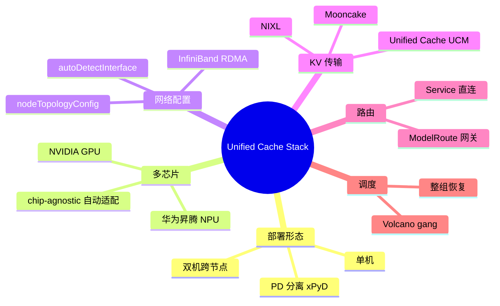
```mermaid
mindmap
  root(("Unified Cache Stack"))
    部署形态
      单机
      双机跨节点
      PD 分离 xPyD
    多芯片
      NVIDIA GPU
      华为昇腾 NPU
      chip-agnostic 自动适配
    网络配置
      nodeTopologyConfig
      autoDetectInterface
      InfiniBand RDMA
    KV 传输
      Unified Cache UCM
      Mooncake
      NIXL
    路由
      ModelRoute 网关
      Service 直连
    调度
      Volcano gang
      整组恢复
```

### 技术栈

| 组件 | 说明 | 版本 |
|------|------|------|
| **Kubernetes** | 容器编排平台 | ≥1.19.0 |
| **Helm** | Kubernetes 包管理器 | 3.x |
| **kthena** | 推理工作负载 CRD 控制面（ModelServing / ModelServer / ModelRoute） | - |
| **Volcano** | gang 调度 + 队列（PD / 多机） | - |
| **vLLM** | 高性能 LLM 推理引擎 | latest |
| **Mooncake** | PD 分离 KV 传输连接器 | - |
| **NCCL** | NVIDIA 集合通信库 | - |
| **HCCL** | 华为昇腾集合通信库 | - |

---

## 🏗️ 核心架构

### 整体架构图

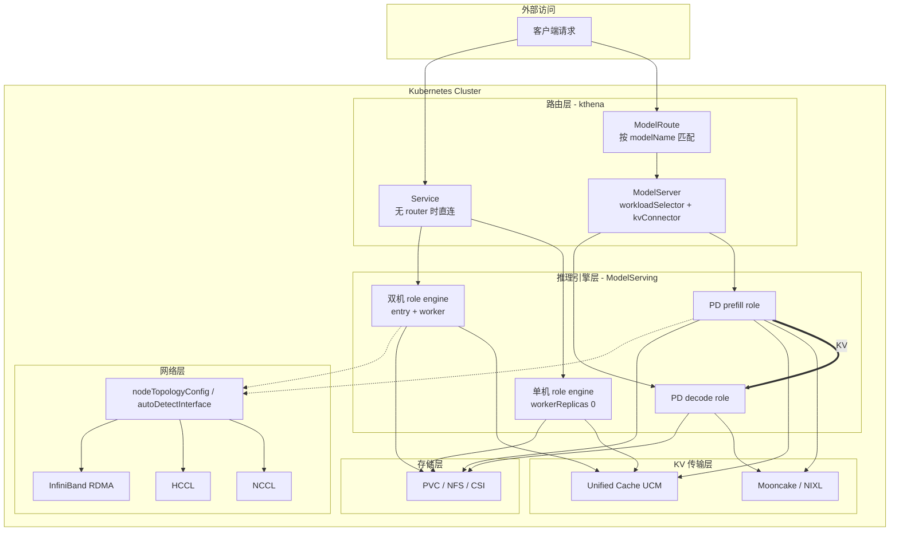
```mermaid
graph TB
    subgraph external["外部访问"]
        A["客户端请求"]
    end

    subgraph cluster["Kubernetes Cluster"]
        subgraph routing["路由层 - kthena"]
            MR["ModelRoute<br/>按 modelName 匹配"]
            MS["ModelServer<br/>workloadSelector + kvConnector"]
            SVC["Service<br/>无 router 时直连"]
        end

        subgraph engine["推理引擎层 - ModelServing"]
            E1["单机 role engine<br/>workerReplicas 0"]
            E2["双机 role engine<br/>entry + worker"]
            P["PD prefill role"]
            D["PD decode role"]
        end

        subgraph kv["KV 传输层"]
            UCM["Unified Cache UCM"]
            MC["Mooncake / NIXL"]
        end

        subgraph storage["存储层"]
            F["PVC / NFS / CSI"]
        end

        subgraph net["网络层"]
            NT["nodeTopologyConfig / autoDetectInterface"]
            G1["NCCL"]
            G2["HCCL"]
            G3["InfiniBand RDMA"]
        end
    end

    A --> MR
    MR --> MS
    A --> SVC
    MS --> P
    MS --> D
    SVC --> E1
    SVC --> E2
    P ==KV==> D
    P --> MC
    D --> MC
    E1 --> UCM
    E2 --> UCM
    P --> UCM
    E1 --> F
    E2 --> F
    P --> F
    D --> F
    E2 -.-> NT
    P -.-> NT
    NT --> G1
    NT --> G2
    NT --> G3
```

### 部署形态决策树

形态不再由 `raySpec.enabled` / `replicaCount` 决定，而是完全由 `modelSpec.roles[]` 的形状与是否存在 `modelSpec.pd` 决定。

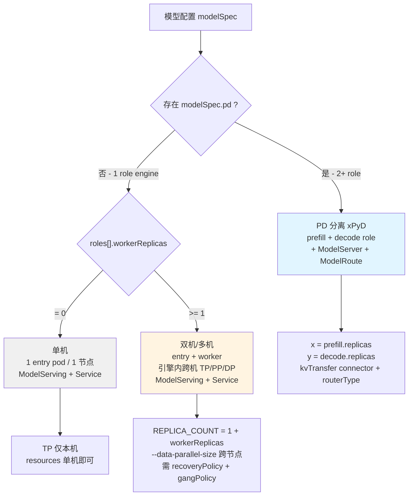
```mermaid
flowchart TD
    Start["模型配置 modelSpec"] --> PDCheck{"存在 modelSpec.pd ?"}

    PDCheck -->|"是 - 2+ role"| PD["PD 分离 xPyD<br/>prefill + decode role<br/>+ ModelServer + ModelRoute"]
    PDCheck -->|"否 - 1 role engine"| WRCheck{"roles[].workerReplicas"}

    WRCheck -->|"= 0"| Single["单机<br/>1 entry pod / 1 节点<br/>ModelServing + Service"]
    WRCheck -->|">= 1"| Multi["双机/多机<br/>entry + worker<br/>引擎内跨机 TP/PP/DP<br/>ModelServing + Service"]

    PD --> F1["x = prefill.replicas<br/>y = decode.replicas<br/>kvTransfer connector + routerType"]
    Multi --> F2["REPLICA_COUNT = 1 + workerReplicas<br/>--data-parallel-size 跨节点<br/>需 recoveryPolicy + gangPolicy"]
    Single --> F3["TP 仅本机<br/>resources 单机即可"]

    style PD fill:#e1f5ff
    style Multi fill:#fff4e1
    style Single fill:#f0f0f0
```

### 路由决策

是否渲染 kthena 路由对象由 `pd.kvTransfer.routerType` 或 `router.enabled` 决定；二者皆无则只渲染 `Service` 供客户端直连。

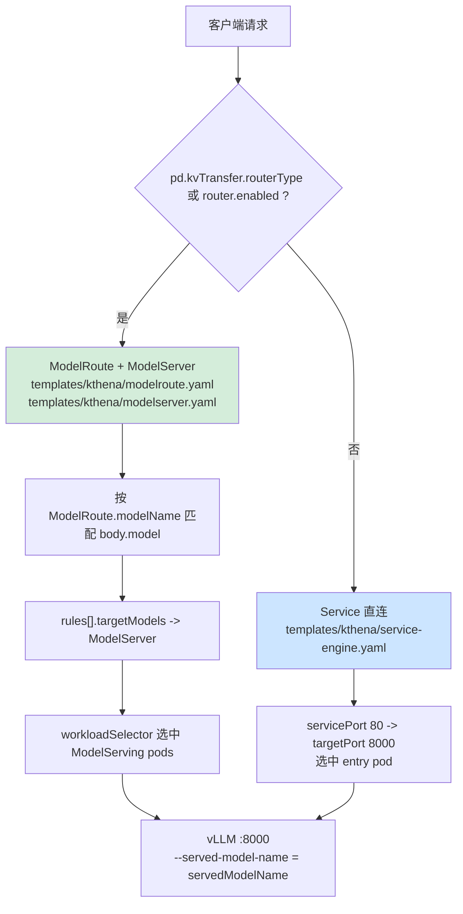
```mermaid
flowchart TD
    Req["客户端请求"] --> RouterCheck{"pd.kvTransfer.routerType 或 router.enabled ?"}

    RouterCheck -->|"是"| Route["ModelRoute + ModelServer<br/>templates/kthena/modelroute.yaml<br/>templates/kthena/modelserver.yaml"]
    RouterCheck -->|"否"| Direct["Service 直连<br/>templates/kthena/service-engine.yaml"]

    Route --> Match["按 ModelRoute.modelName 匹配 body.model"]
    Match --> Select["rules[].targetModels -> ModelServer"]
    Select --> Pods["workloadSelector 选中 ModelServing pods"]

    Direct --> SvcPort["servicePort 80 -> targetPort 8000<br/>选中 entry pod"]

    Pods --> VLLM["vLLM :8000<br/>--served-model-name = servedModelName"]
    SvcPort --> VLLM

    style Route fill:#d4edda
    style Direct fill:#cce5ff
```

> **三方名称一致性（核心不变量）**：客户端请求体的 `model` 字段、`ModelRoute.spec.modelName`、`ModelServer.spec.model`、vLLM 的 `--served-model-name` 全部来自同一 helper `chart.servedModelName`（= `modelSpec.modelName`，留空回退 `modelSpec.modelPath`）。用户**只需写 `modelSpec.modelName` 一处**，三方结构上不可能漂移；`--served-model-name` 由 chart 注入，禁止写进 `vllmArgs`。

---

## 🎨 功能模块详解

### 1. 多模型推理引擎部署（roles[] 驱动）

每个 `helm install` release 对应一个 `servingEngineSpec.modelSpec`，渲染为一组 kthena CRD。在同一集群中部署多个模型 = 多个 release（或多个 values 文件叠加）。形态由 `roles[]` 表达，资源用原生 `resources.{limits,requests}`，参数用 `roles[].vllmArgs`（仅 flags）。

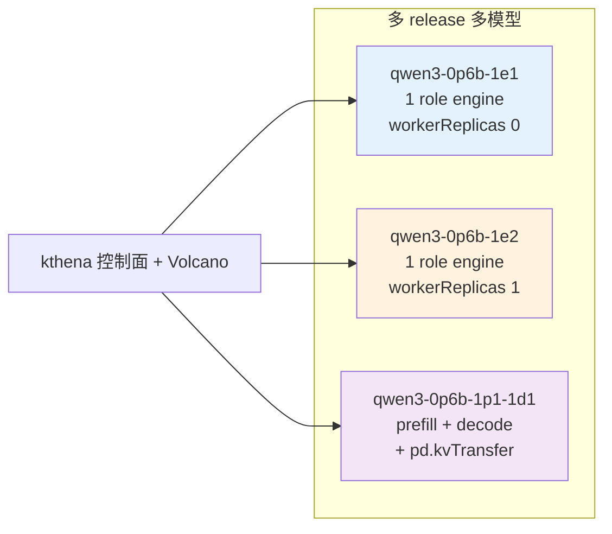
```mermaid
graph LR
    subgraph multi["多 release 多模型"]
        M1["qwen3-0p6b-1e1<br/>1 role engine<br/>workerReplicas 0"]
        M2["qwen3-0p6b-1e2<br/>1 role engine<br/>workerReplicas 1"]
        M3["qwen3-0p6b-1p1-1d1<br/>prefill + decode<br/>+ pd.kvTransfer"]
    end

    K["kthena 控制面 + Volcano"] --> M1
    K --> M2
    K --> M3

    style M1 fill:#e3f2fd
    style M2 fill:#fff3e0
    style M3 fill:#f3e5f5
```

**单机配置示例**（真实文件 `models/cuda/values-qwen3-0p6b-1e1.yaml`）：

```yaml
servingEngineSpec:
  enableEngine: true
  containerPort: 8000
  modelSpec:
    name: "qwen3-0p6b-1e1"        # K8s 资源名片段：小写字母/数字/-，起止字母或数字；<release>-<name> <= 63
    modelPath: "/mnt/model/Qwen3-0.6B"
    modelName: "Qwen3-0.6B"
    shmSize: "256Gi"
    roles:
      - name: engine              # role 名：小写字母/数字/-，起止字母或数字，最长 12
        replicas: 1
        workerReplicas: 0            # 0 = 单机单 pod
        resources:
          limits:   { nvidia.com/gpu: "4", cpu: "32", memory: 256Gi }
          requests: { nvidia.com/gpu: "4", cpu: "32", memory: 256Gi }
        vllmArgs: |
          --tensor-parallel-size 4
          --data-parallel-size 1
          --pipeline-parallel-size 1
          --max-model-len 20000
          --block-size 128
          --gpu-memory-utilization 0.87
          --distributed-executor-backend mp
          --no-enable-prefix-caching
          --trust-remote-code
```

**三种部署形态（仅由 roles[] + pd 表达，无 `deployMode`）**：

| 形态 | roles[] 形状 | 渲染对象 |
|------|-------------|---------|
| **单机** | 1 个 role（`workerReplicas: 0`） | `ModelServing`（1 role / 1 pod / 1 节点）+ `Service` 直连 |
| **双机/多机** | 1 个 role（`workerReplicas: ≥1`） | `ModelServing`（entry + N worker，引擎内跨机 TP/PP/DP）+ `Service`；需 `recoveryPolicy` + `gangPolicy` |
| **PD / xPyD** | ≥2 个 role（prefill/decode）+ `modelSpec.pd` | `ModelServing`（2 role）+ `ModelServer`（pdGroup + kvConnector）+ `ModelRoute` |

> 多引擎扩缩用 `modelSpec.replicas`（= ServingGroup 数，各自独立 gang / 恢复单元）。

---

### 2. 智能路由（kthena ModelRoute）

路由由 kthena 的 `ModelRoute` + `ModelServer` 提供，渲染条件为 `pd.kvTransfer.routerType` 或 `router.enabled` 为真；否则只渲染 `Service` 供直连。ModelServer 只消费 `routerType`，vLLM KV JSON 只消费 `connector`，两条配置链不互相推导。

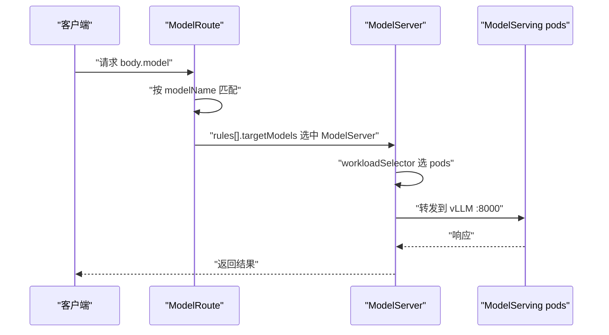
```mermaid
sequenceDiagram
    participant C as "客户端"
    participant R as "ModelRoute"
    participant S as "ModelServer"
    participant P as "ModelServing pods"

    C->>R: "请求 body.model"
    R->>R: "按 modelName 匹配"
    R->>S: "rules[].targetModels 选中 ModelServer"
    S->>S: "workloadSelector 选 pods"
    S->>P: "转发到 vLLM :8000"
    P-->>S: "响应"
    S-->>C: "返回结果"
```

**服务实现（与当前模板对齐）**：

- **`ModelRoute`**（`templates/kthena/modelroute.yaml`）：`spec.modelName` 取自 `chart.servedModelName`；`spec.rules` 缺省时 chart 生成默认规则，100% 权重指向同名 `ModelServer`；可选 `rateLimit` / `loraAdapters` / `parentRefs`（Gateway 挂载）。
- **`ModelServer`**（`templates/kthena/modelserver.yaml`）：`spec.model` 取自 `chart.servedModelName`；`workloadPort.port` 指向 vLLM 端口（默认 8000）；PD 时附加 `workloadSelector.pdGroup`（prefill/decode 标签）与 `kvConnector.type`。
- **`Service`**（`templates/kthena/service-engine.yaml`）：**仅当无 router 时**渲染；`servicePort`（默认 80）→ `targetPort`（容器端口 8000），选中 entry pod。
- **`ServiceMonitor`**（`templates/servicemonitor-vllm.yaml`）：Prometheus-Operator 抓取，支持 `path/interval/scrapeTimeout/scheme/relabelings`（注意 `scrapeTimeout <= interval`）。

**router 关键字段**（`modelSpec.router`）：

```yaml
modelSpec:
  router:
    enabled: true
    inferenceEngine: vLLM        # -> ModelServer.inferenceEngine（vLLM | SGLang）
    trafficPolicy:
      timeout: 60s               # -> ModelServer.trafficPolicy
    # rules / rateLimit / loraAdapters / parentRefs 均可选
```

> 注意：**没有** `router.model` / `router.modelName` 字段 —— 对外名只来自 `modelSpec.modelName`（空则 `modelPath`）。

---

### 3. Unified Cache（UCM）配置

UCM 提供 KV Cache 的多级缓存与卸载，**与 kthena 拉起形态基本正交**：单机 / 双机，以及使用 Mooncake 的 PD 均可叠加；NIXL PD 不支持与 UCM 组合。启用条件为 `modelSpec.unifiedcacheConfig.config` 非空，且唯一显式开关 `unifiedcacheConfig.enabled`（默认 `true`，别名 `enable`）未设为 `false`。设 `enabled: false` 即完全不使用 UCM——不渲染 ucm ConfigMap、不注 UCMConnector、不挂 UCM 卷/缓存盘、不建 SA/RBAC，等价于未填 `config`；`enabled: true` 但 `config` 为空会直接渲染失败，防止静默不生效。

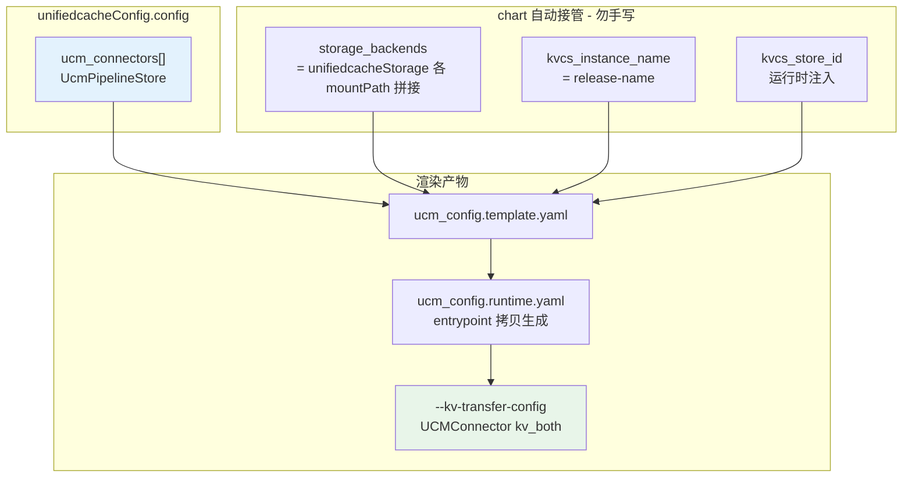
```mermaid
graph TB
    subgraph cfg["unifiedcacheConfig.config"]
        UC["ucm_connectors[]<br/>UcmPipelineStore"]
    end

    subgraph chart["chart 自动接管 - 勿手写"]
        SB["storage_backends<br/>= unifiedcacheStorage 各 mountPath 拼接"]
        IN["kvcs_instance_name<br/>= release-name"]
        SID["kvcs_store_id<br/>运行时注入"]
    end

    subgraph render["渲染产物"]
        TPL["ucm_config.template.yaml"]
        RT["ucm_config.runtime.yaml<br/>entrypoint 拷贝生成"]
        KVT["--kv-transfer-config<br/>UCMConnector kv_both"]
    end

    UC --> TPL
    SB --> TPL
    IN --> TPL
    SID --> TPL
    TPL --> RT
    RT --> KVT

    style UC fill:#e3f2fd
    style KVT fill:#e8f5e9
```

**配置示例**（真实片段，所有单机 / 多机 / PD 文件一致）：

```yaml
modelSpec:
  unifiedcacheConfig:
    enabled: true                  # 默认 true；false = 不使用 UCM
    kvcsStoreIdAutoDetect: false
    config:
      ucm_connectors:
        - ucm_connector_name: "UcmPipelineStore"
          ucm_connector_config:
            io_direct: false
            store_pipeline: "Cache|Posix"
            cache_buffer_capacity_gb: 128
            use_gdr: false
  storage:
    unifiedcacheStorage:
      - name: model-data                    # Volume/PVC 名片段：小写字母/数字/-，起止字母或数字
        mountPath: /mnt/data          # 即 storage_backends（按序拼接）
        dynamicPVC:
          pvcStorage: "1Ti"
          storageClass: a800-192-168-4-106
          pvcAccessMode: [ "ReadWriteMany" ]
```

**chart 自动接管的字段（用户勿手写）**：`storage_backends`（由 `unifiedcacheStorage[*].mountPath` 按序 `:` 拼接）、`kvcs_instance_name`（默认 `<release>-<name>`）、`kvcs_store_id`（运行时注入；`kvcsStoreIdAutoDetect: true` 时按 PV 顺序读 `csi.volumeAttributes.kvcacheStoreId` 拼接如 `"0:1"`）、`kvcs_tls_enable`。（`use_layerwise` 已不再托管，需要时直接写进 `unifiedcacheConfig.config`。）

**非 PD 时** chart 据此生成单个 `UCMConnector(kv_both)` 的 `--kv-transfer-config`，`UCM_CONFIG_FILE` 指向运行时拷贝的 `/vllm-workspace/UnifiedCache/config/ucm_config.runtime.yaml`。

---

### 4. PD 分离（Prefill/Decode）⭐

PD 分离是一等形态：`≥2` 个 role（prefill + decode）+ `modelSpec.pd` 配对，KV 经 Mooncake（或 NIXL）在 P/D 间传输，prefill 侧可叠加 UCM 的 MultiConnector。

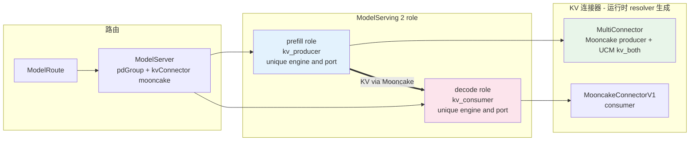
```mermaid
graph LR
    subgraph route["路由"]
        MR["ModelRoute"]
        MSV["ModelServer<br/>pdGroup + kvConnector mooncake"]
    end

    subgraph pd["ModelServing 2 role"]
        PF["prefill role<br/>kv_producer<br/>unique engine and port"]
        DC["decode role<br/>kv_consumer<br/>unique engine and port"]
    end

    subgraph kv["KV 连接器 - 运行时 resolver 生成"]
        PFC["MultiConnector<br/>Mooncake producer + UCM kv_both"]
        DCC["MooncakeConnectorV1<br/>consumer"]
    end

    MR --> MSV
    MSV --> PF
    MSV --> DC
    PF ==KV via Mooncake==> DC
    PF --> PFC
    DC --> DCC

    style PF fill:#e3f2fd
    style DC fill:#fce4ec
    style PFC fill:#e8f5e9
```

**配置示例**（真实文件 `models/cuda/values-qwen3-0p6b-1p1-1d1.yaml`，节选）：

```yaml
servingEngineSpec:
  enableEngine: true
  containerPort: 8000
  modelSpec:
    name: "qwen3-0p6b-1p1-1d1"    # K8s 资源名片段：小写字母/数字/-，起止字母或数字；<release>-<name> <= 63
    modelPath: "/mnt/model/Qwen3-0.6B"
    modelName: "Qwen3-0.6B"
    recoveryPolicy: ServingGroupRecreate    # 可选：ServingGroupRecreate（整组）| RoleRecreate（单 Role，默认）| None（Pod/Deployment 默认行为）
    restartGracePeriodSeconds: 60
    gangPolicy:
      minRoleReplicas: { prefill: 1, decode: 1 }
    pd:
      kvTransfer:
        connector: MooncakeConnectorV1      # 可选（区分大小写）：MooncakeConnectorV1 | MooncakeHybridConnector | NixlConnector
        routerType: mooncake                 # Mooncake 两种 connector 对应 mooncake；NixlConnector 对应 nixl
        identity:
          engineIdBase: 0
          kvPortBase: 20001
          instanceStride: 100
      antiAffinity: true                    # 默认 hostname 反亲和，防同机端口冲突
      prefill: prefill                      # 引用 roles[].name（小写字母/数字/-，最长 12）
      decode: decode                        # 引用 roles[].name（小写字母/数字/-，最长 12）
    router:
      enabled: true
      inferenceEngine: vLLM
      trafficPolicy: { timeout: 60s }
    roles:
      - name: prefill                       # role 名：小写字母/数字/-，起止字母或数字，最长 12
        replicas: 1                         # xPyD 的 x
        workerReplicas: 0
        resources:
          limits:   { nvidia.com/gpu: "1", cpu: "16", memory: 64Gi }
          requests: { nvidia.com/gpu: "1", cpu: "16", memory: 64Gi }
        vllmArgs: |
          --tensor-parallel-size 1
          --max-model-len 20000
          --block-size 128
          --gpu-memory-utilization 0.85
          --trust-remote-code
      - name: decode                        # role 名：小写字母/数字/-，起止字母或数字，最长 12
        replicas: 1                         # xPyD 的 y
        workerReplicas: 0
        resources:
          limits:   { nvidia.com/gpu: "1", cpu: "16", memory: 64Gi }
          requests: { nvidia.com/gpu: "1", cpu: "16", memory: 64Gi }
        vllmArgs: |
          --tensor-parallel-size 1
          --max-model-len 20000
          --block-size 128
          --gpu-memory-utilization 0.85
          --trust-remote-code
          --no-enable-prefix-caching
```

**KV 连接器在 Pod 启动时解析（用户勿写 `--kv-transfer-config`）**：

- 每个 role ConfigMap 携带 KV template/meta；resolver 根据 `group-name`、`role-id` 和 `pd.kvTransfer.identity` 为每个逻辑 P/D 实例生成稳定且唯一的 `engine_id` 与 Mooncake `kv_port`。同实例 entry/worker 共享身份，`WORKER_INDEX` 不参与计算。
- `unifiedcacheConfig` 生效时，Mooncake producer 自动生成 `MultiConnector{selected connector,UCMConnector}`，decode 保持纯 selected connector；它是唯一 UCM 开关。NIXL 与 UCM 不允许组合。
- 纯 Mooncake 的 engine/port 位于根节点；MultiConnector 的唯一 engine 位于根节点、Mooncake 子项只含 port；NIXL 根节点仅写 engine。
- `MooncakeConnectorV1` 的 `kv_rank` 固定 producer=0、consumer=1；Hybrid 不继承 V1 专用字段。启动前会校验 connector registry，Hybrid 缺失时不降级。

| `connector` | `routerType` | identity | UCM |
|---|---|---|---|
| `MooncakeConnectorV1` | `mooncake` | engine + port | 支持 |
| `MooncakeHybridConnector` | `mooncake` | engine + port | 支持，registry 门禁 |
| `NixlConnector` | `nixl` | 仅 engine | 不支持组合 |

> 名称精确且区分大小写；未知 connector、routerType 不匹配、Mooncake 端口或跨度无效均直接失败。旧 `pd.connector`、`pd.mooncakePort`、`pd.ucm` 已删除。昇腾版 PD 使用 `kvPortBase: 36000` / `instanceStride: 100`，避开 AscendDirectTransport 的动态端口段。

---

### 5. 多芯片支持（chip-agnostic）

`chipType` **不再必填、不再决定资源键/后端**（旧的全局/模型级芯片开关已移除）；仅 `storage.chipExtraStorage` 可选地按 `chipType` 合并额外挂载。后端由镜像 + vLLM 自动探测；芯片差异完全体现在 `roles[].resources` 写哪个资源键与 `modelSpec.env` 注入的通信变量。

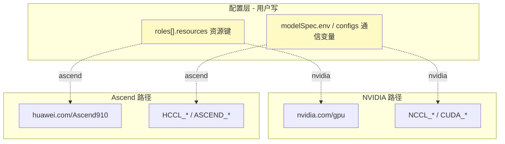
```mermaid
graph TB
    subgraph cfg["配置层 - 用户写"]
        RES["roles[].resources 资源键"]
        ENV["modelSpec.env / configs 通信变量"]
    end

    subgraph nvidia["NVIDIA 路径"]
        NRES["nvidia.com/gpu"]
        NENV["NCCL_* / CUDA_*"]
    end

    subgraph ascend["Ascend 路径"]
        ARES["huawei.com/Ascend910"]
        AENV["HCCL_* / ASCEND_*"]
    end

    RES -.nvidia.-> NRES
    RES -.ascend.-> ARES
    ENV -.nvidia.-> NENV
    ENV -.ascend.-> AENV

    style RES fill:#fff9c4
    style ENV fill:#fff9c4
```

**芯片对比**：

| 特性 | NVIDIA | Ascend |
|------|--------|--------|
| **资源键（写在 `resources`）** | `nvidia.com/gpu` | `huawei.com/Ascend910` |
| **通信库** | NCCL | HCCL |
| **常见环境变量** | `NCCL_*`, `CUDA_*` | `HCCL_*`, `ASCEND_*` |
| **后端选择** | 镜像 + vLLM 自动探测 | 镜像 + vLLM 自动探测 |

**昇腾单机示例**（真实文件 `models/ascend/values-qwen3-0p6b-1e1.yaml`，节选）：

```yaml
modelSpec:
  name: "qwen3-0p6b-1e1"        # K8s 资源名片段：小写字母/数字/-，起止字母或数字；<release>-<name> <= 63
  modelPath: "/mnt/model/Qwen3-0.6B"
  modelName: "Qwen3-0.6B"
  roles:
    - name: engine              # role 名：小写字母/数字/-，起止字母或数字，最长 12
      replicas: 1
      workerReplicas: 0
      resources:
        limits:   { huawei.com/Ascend910: "1", cpu: "16", memory: 64Gi }
        requests: { huawei.com/Ascend910: "1", cpu: "16", memory: 64Gi }
      vllmArgs: |
        --tensor-parallel-size 4
        --max-model-len 20000
        --trust-remote-code
```

> `runtimeClassName` 可在 **role 级**（`roles[].runtimeClassName`）显式设置；chart **不再**根据芯片类型自动推断 runtimeClass。

---

### 6. Kubernetes 安全上下文 ⭐

由 `servingEngineSpec.securityContext`（Pod 级）与 `containerSecurityContext`（容器级）配置，无全局 `securityContextDefaults`。

```yaml
servingEngineSpec:
  securityContext: {}
  containerSecurityContext:
    privileged: false
    seccompProfile:
      type: Unconfined
    capabilities:
      add: [ "ALL" ]
```

---

### 7. 网络配置（nodeTopologyConfig + autoDetectInterface）

多节点跨机通信的网卡配置由顶层的 `nodeTopologyConfig`（按节点名注入环境变量）与 `autoDetectInterface`（自动探测网卡）负责，**取代了已移除的 `ranktable`**。

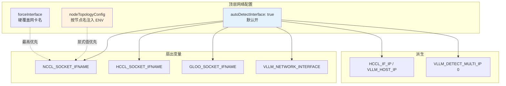
```mermaid
graph TB
    subgraph top["顶层网络配置"]
        AD["autoDetectInterface: true<br/>默认开"]
        FI["forceInterface<br/>硬覆盖网卡名"]
        NT["nodeTopologyConfig<br/>按节点名注入 ENV"]
    end

    subgraph fanout["扇出变量"]
        F1["NCCL_SOCKET_IFNAME"]
        F2["HCCL_SOCKET_IFNAME"]
        F3["GLOO_SOCKET_IFNAME"]
        F4["VLLM_NETWORK_INTERFACE"]
    end

    subgraph derive["派生"]
        D1["HCCL_IF_IP / VLLM_HOST_IP"]
        D2["VLLM_DETECT_MULTI_IP 0"]
    end

    AD --> F1
    AD --> F2
    AD --> F3
    AD --> F4
    AD --> D1
    AD --> D2
    NT -.显式值优先.-> F1
    FI -.最高优先.-> F1

    style AD fill:#e3f2fd
    style NT fill:#fff3e0
```

**`autoDetectInterface`（默认 `true`）**：启动脚本按「K8s 节点 IP（`HOST_IP`）→ 归属网卡」自动探测，扇出到 `GLOO/HCCL/NCCL/TP_SOCKET_IFNAME` 与 `VLLM_NETWORK_INTERFACE`/`VLLM_USE_NETIF`，派生 `HCCL_IF_IP`/`VLLM_HOST_IP`，并置 `VLLM_DETECT_MULTI_IP=0`。**需 `hostNetwork: true`** 才能看到宿主机网卡。

**`nodeTopologyConfig`** —— 按节点名（须与 `kubectl get nodes` 一致）注入节点级环境变量；显式值优先于自动探测。InfiniBand/RDMA 在此追加 `NCCL_IB_*` 即可：

```yaml
# 顶层（与 servingEngineSpec 同级）
nodeTopologyConfig:
  gpu-1:
    NCCL_SOCKET_IFNAME: "ib0"
    NCCL_IB_DISABLE: "0"          # 启用 InfiniBand
    NCCL_IB_HCA: "mlx5_0,mlx5_1"
    VLLM_NETWORK_INTERFACE: "ib0"
  npu-1:
    HCCL_SOCKET_IFNAME: "enp189s0f0"
    HCCL_IF_NAME: "enp189s0f0"
    VLLM_NETWORK_INTERFACE: "enp189s0f0"
```

**InfiniBand / 双平面网络**：管理平面（K8s API、监控）与数据平面（GPU/NPU 通信、NCCL/HCCL、RDMA）分离，配合 `hostNetwork: true` + `dnsPolicy: ClusterFirstWithHostNet`，在 `nodeTopologyConfig` 中把数据平面网卡指向 `ib0`/RDMA NIC 即可。

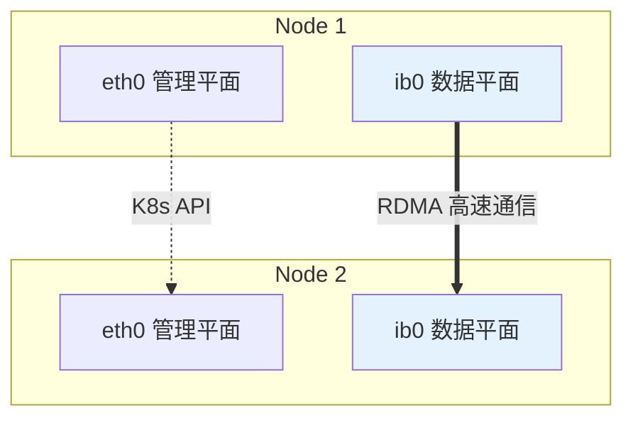
```mermaid
graph TB
    subgraph node1["Node 1"]
        N1E["eth0 管理平面"]
        N1D["ib0 数据平面"]
    end
    subgraph node2["Node 2"]
        N2E["eth0 管理平面"]
        N2D["ib0 数据平面"]
    end
    N1E -.K8s API.-> N2E
    N1D ==RDMA 高速通信==> N2D
    style N1D fill:#e3f2fd
    style N2D fill:#e3f2fd
```

---

### 8. 集中化镜像管理 ⭐

所有组件镜像集中在 `images:` 顶层块，切换环境只改这里。

```yaml
images:
  registry: ""              # 全局仓库前缀；留空不加
  pullPolicy: "Always"
  image: "registry.dev.huawei.com/flash_stor/ucm-vllm-cuda:v25.5.0"
  mooncakeMasterImage: ""   # 空值复用 images.image；拉取策略走 images.pullPolicy
```

> kthena-only：旧 `router` / `sidecar` / `initContainer` / `runtimeSidecar` 镜像随 native + ucm-router 一并移除（chart 不再渲染）。`modelSpec.image` 可单独覆盖 vLLM 镜像；自创建 Mooncake master 镜像由 `images.mooncakeMasterImage` 覆盖，空值默认复用 `images.image`，拉取策略走 `images.pullPolicy`。
> 当前 kthena PodSpec 也**不渲染下载用 initContainer** —— 模型经存储卷（NFS / PVC）挂载到 `/mnt/model`。

---

### 9. Pod 元数据自动注入（Downward API）

每个 vLLM 容器自动注入 Pod/Node 元数据，供 entrypoint 计算 master/rank 与网卡探测。

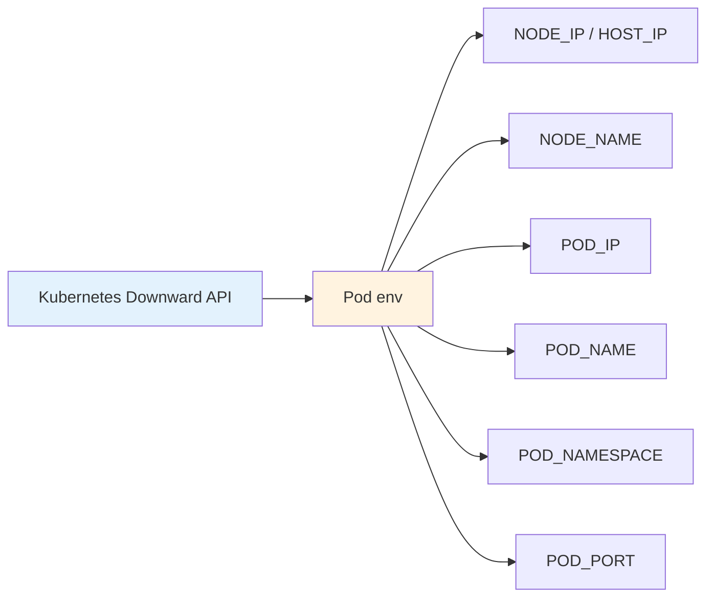
```mermaid
graph LR
    DPI["Kubernetes Downward API"] --> Env["Pod env"]
    Env --> C1["NODE_IP / HOST_IP"]
    Env --> C2["NODE_NAME"]
    Env --> C3["POD_IP"]
    Env --> C4["POD_NAME"]
    Env --> C5["POD_NAMESPACE"]
    Env --> C6["POD_PORT"]
    style DPI fill:#e3f2fd
    style Env fill:#fff3e0
```

**注入变量**：`NODE_IP`/`HOST_IP`、`NODE_NAME`、`POD_IP`、`POD_NAME`、`POD_NAMESPACE`、`POD_PORT`，以及 chart 注入的 `UC_KTHENA=1`、`REPLICA_COUNT`（=`1 + workerReplicas`）、`PYTHONHASHSEED`、`HF_HOME`（= 首个 UCM 存储 mountPath）等。多机身份变量 `ENTRY_ADDRESS`/`WORKER_INDEX` 由 kthena 注入。

---

### 10. 存储管理

灵活的模型与缓存存储方案，分两类：`storage.unifiedcacheStorage[]`（UCM 高性能缓存盘，逐模型）与 `storage.extraStorage[]`（所有 role 共享的公共挂载，在根 `values.yaml` 统一维护）。

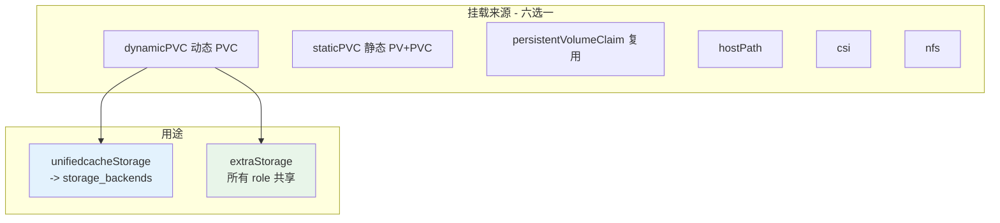
```mermaid
graph TB
    subgraph sources["挂载来源 - 六选一"]
        S1["dynamicPVC 动态 PVC"]
        S2["staticPVC 静态 PV+PVC"]
        S3["persistentVolumeClaim 复用"]
        S4["hostPath"]
        S5["csi"]
        S6["nfs"]
    end
    subgraph use["用途"]
        U1["unifiedcacheStorage<br/>-> storage_backends"]
        U2["extraStorage<br/>所有 role 共享"]
    end
    S1 --> U1
    S1 --> U2
    style U1 fill:#e3f2fd
    style U2 fill:#e8f5e9
```

**UCM 缓存盘（动态 PVC）**：

```yaml
storage:
  unifiedcacheStorage:
    - name: model-data          # Volume/PVC 名片段：小写字母/数字/-，起止字母或数字
      mountPath: /mnt/data
      dynamicPVC:
        pvcStorage: "1Ti"
        storageClass: a800-192-168-4-106
        pvcAccessMode: [ "ReadWriteMany" ]
```

**公共挂载（根 values.yaml，NFS 模型盘 + 时区）**：

```yaml
storage:
  extraStorage:
    - name: timezone-volume     # Volume 名片段：小写字母/数字/-，起止字母或数字
      mountPath: /etc/localtime
      hostPath: { path: /usr/share/zoneinfo/Asia/Shanghai, type: File }
    - name: models              # Volume 名片段：小写字母/数字/-，起止字母或数字
      mountPath: /mnt/model
      nfs: { server: 192.168.3.6, path: /public_model }
```

> 每个列表项必须含 `name` + `mountPath`，且 source **六选一**：`dynamicPVC` / `staticPVC` / `persistentVolumeClaim` / `hostPath` / `csi` / `nfs`。`unifiedcacheStorage` 的各 `mountPath` 按序拼成 UCM 的 `storage_backends`；首个 mountPath 作为 `HF_HOME`。华为 CSI 等存储类的检查不变。

---

### 11. 监控与可观测性

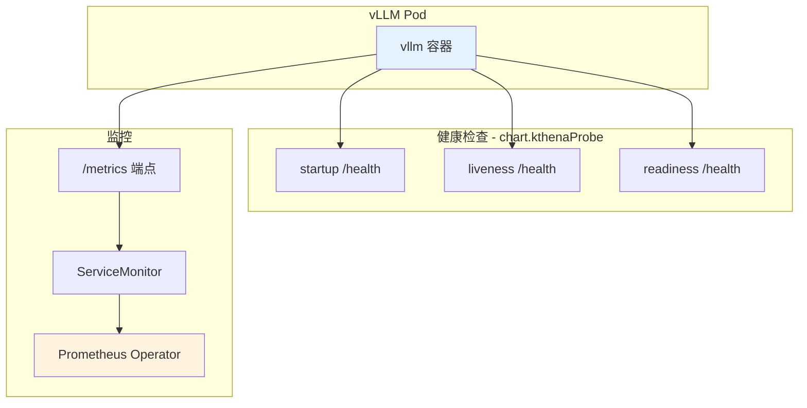
```mermaid
graph TB
    subgraph pod["vLLM Pod"]
        Main["vllm 容器"]
    end
    subgraph probe["健康检查 - chart.kthenaProbe"]
        SP["startup /health"]
        LP["liveness /health"]
        RP["readiness /health"]
    end
    subgraph mon["监控"]
        Metrics["/metrics 端点"]
        SM["ServiceMonitor"]
        Prom["Prometheus Operator"]
    end
    Main --> SP
    Main --> LP
    Main --> RP
    Main --> Metrics
    Metrics --> SM
    SM --> Prom
    style Main fill:#e3f2fd
    style Prom fill:#fff3e0
```

**健康检查**：由 `chart.kthenaProbe` 注入，startup / liveness / readiness 均 exec `curl /health` —— 仅 entry pod 自探 `127.0.0.1:$POD_PORT/health`；worker（`--headless`）无本地 HTTP，**不渲染探针**（避免「worker 探 leader」的跨 pod liveness 反模式），靠进程随 leader 失联自退 + `recoveryPolicy`/`gangPolicy` 整组重建。

**ServiceMonitor**（`servingEngineSpec.serviceMonitor`）：

```yaml
serviceMonitor:
  enabled: true
  path: "/metrics"
  interval: "5s"
  scrapeTimeout: "4s"     # 必须 <= interval
  scheme: "http"
```

> PD 形态走 router（无 Service），ServiceMonitor 可能抓不到，按需改用 PodMonitor 或 metrics Service。

---

### 12. vLLM 参数配置（roles[].vllmArgs，仅 flags）

vLLM 参数**仅以 flags-only 多行块**写在 `roles[].vllmArgs`（每个 role 一份；缺省时回退 `modelSpec.vllmArgs`）。`vllmConfig` map 与 `run_vllm.sh` 机制已移除，vLLM 参数走 `vllmArgs` / `vllm.args`（不再依赖 `config.properties` 提供参数）。

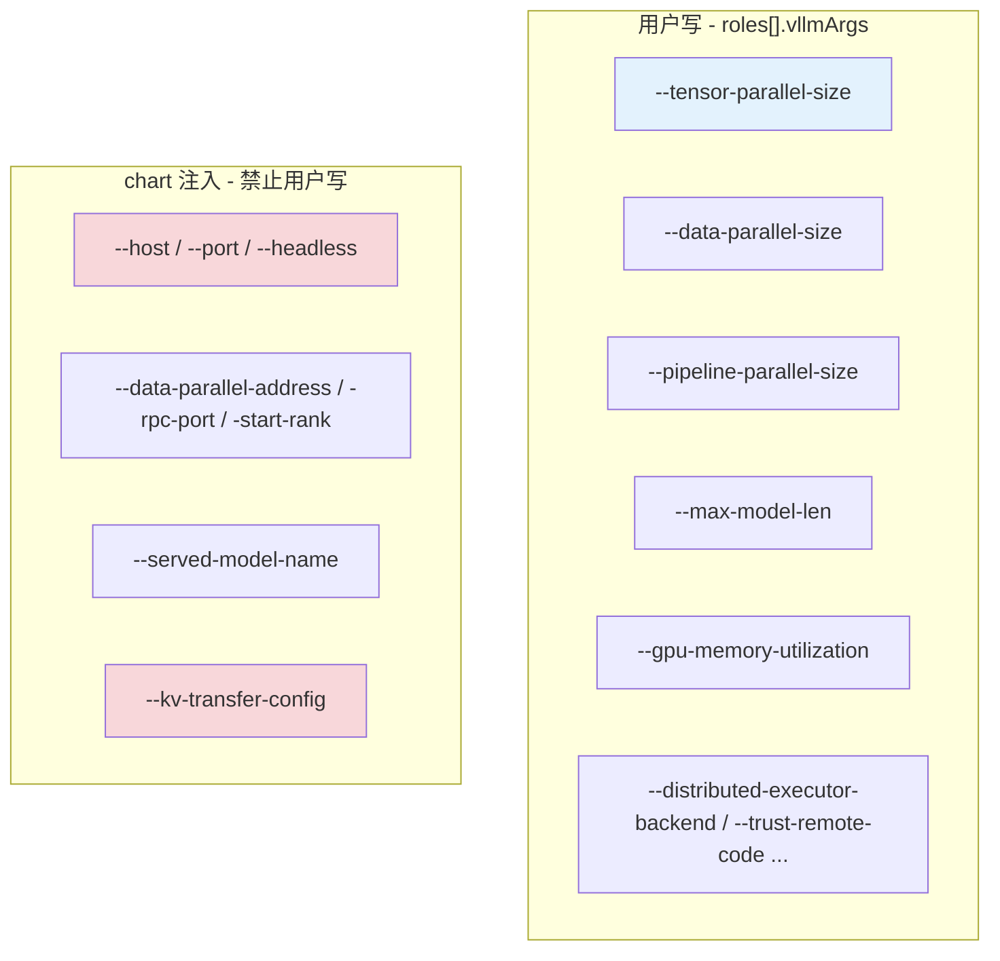
```mermaid
graph TB
    subgraph user["用户写 - roles[].vllmArgs"]
        TP["--tensor-parallel-size"]
        DP["--data-parallel-size"]
        PP["--pipeline-parallel-size"]
        ML["--max-model-len"]
        GM["--gpu-memory-utilization"]
        EX["--distributed-executor-backend / --trust-remote-code ..."]
    end
    subgraph chart["chart 注入 - 禁止用户写"]
        H["--host / --port / --headless"]
        D["--data-parallel-address / -rpc-port / -start-rank"]
        SN["--served-model-name"]
        KV["--kv-transfer-config"]
    end
    style TP fill:#e3f2fd
    style H fill:#f8d7da
    style KV fill:#f8d7da
```

**示例（双机，真实文件 `models/ascend/values-qwen3-0p6b-1e2.yaml`）**：

```yaml
roles:
  - name: engine                # role 名：小写字母/数字/-，起止字母或数字，最长 12
    replicas: 1
    workerReplicas: 1            # >=1 触发跨机
    resources:
      limits:   { huawei.com/Ascend910: "1", cpu: "16", memory: 64Gi }
      requests: { huawei.com/Ascend910: "1", cpu: "16", memory: 64Gi }
    vllmArgs: |
      --tensor-parallel-size 4
      --data-parallel-size 2
      --data-parallel-size-local 1
      --pipeline-parallel-size 1
      --max-model-len 20000
      --gpu-memory-utilization 0.4
      --distributed-executor-backend mp
      --no-enable-prefix-caching
      --trust-remote-code
```

**chart 接管、禁止写进 `vllmArgs` 的参数**（`chart.validateVllmArgs` 校验，违则 `fail`）：

```
--host  --port  --headless
--data-parallel-address/-dpa  --data-parallel-rpc-port/-dpp  --data-parallel-start-rank/-dpr
--served-model-name  --kv-transfer-config  --config
```

前 6 个网络参数由 entrypoint 按 kthena 注入的 `ENTRY_ADDRESS`/`WORKER_INDEX` 在运行时注入；`--served-model-name` 取自 `modelSpec.modelName`；`--kv-transfer-config` 由统一 resolver 根据 role 模板和 Downward API 标签生成。`--config` 被禁止，因为外部 YAML 会绕过渲染期校验。role 已生成 Chart KV template/meta 时，`--kv-offloading-size` / `--kv-offloading-backend` 也被禁止，避免 vLLM 静默替换既有 connector；无 Chart KV 的普通 role 仍可使用。**环境变量也勿写进 `vllmArgs`**，统一放 `servingEngineSpec.configs` / `modelSpec.env`；`VLLM_ARGS_FILE` 除外，它由 Chart 固定。

> 旧 `key=value` 与 flag 的对照：`tensorParallelSize` → `--tensor-parallel-size`、`dataParallelSize` → `--data-parallel-size`、`pipelineParallelSize` → `--pipeline-parallel-size`、`maxModelLen` → `--max-model-len`、`gpuMemoryUtilization` → `--gpu-memory-utilization`。

---

### 13. 双机/多机机制（entry vs headless worker）

`workerReplicas ≥ 1` 时，一个 role 渲染为 1 个 entry pod + N 个 worker pod，构成**一套**引擎，引擎内由 vLLM 自身负责跨机 TP/PP/DP。

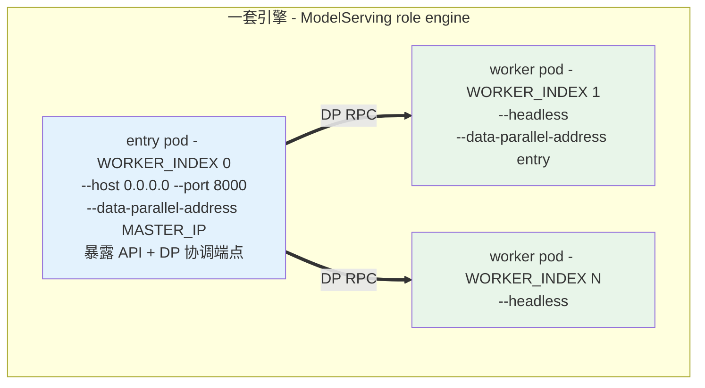
```mermaid
graph TB
    subgraph engine["一套引擎 - ModelServing role engine"]
        Entry["entry pod - WORKER_INDEX 0<br/>--host 0.0.0.0 --port 8000<br/>--data-parallel-address MASTER_IP<br/>暴露 API + DP 协调端点"]
        W1["worker pod - WORKER_INDEX 1<br/>--headless<br/>--data-parallel-address entry"]
        W2["worker pod - WORKER_INDEX N<br/>--headless"]
    end
    Entry ==DP RPC==> W1
    Entry ==DP RPC==> W2
    style Entry fill:#e3f2fd
    style W1 fill:#e8f5e9
    style W2 fill:#e8f5e9
```

- **`REPLICA_COUNT`** = `1 + workerReplicas`，chart 注入，门控所有多机分支（=1 走单机路径）。
- **`WORKER_INDEX`** 由 kthena 注入：0/空 = entry（rank 0），≥1 = worker；驱动 `NODE_RANK` 与探针 host 选择。
- **`ENTRY_ADDRESS`** 由 kthena 注入到 worker，worker 解析为 `MASTER_IP` 后用于 `--data-parallel-address`。
- chart 还会计算非冲突的 `--data-parallel-start-rank = NODE_RANK × dp_size_local`，避免 worker 与 head 的 DP rank 冲突。

---

## 📚 模型模板目录

`models/<platform>/` 下提供真实可用的预配置 values 文件（`<platform>` = `cuda` | `ascend`），命名规则 `values-<model>-<topology>.yaml`。非 PD 用 `1e1` / `1e2`，PD 用 `<P副本数>p<每个P实例机器数>-<D副本数>d<每个D实例机器数>`，例如 `1p1-1d1`、`2p1-2d1`、`2p2-2d2`。部署时叠加：`-f values.yaml -f models/<platform>/<file>.yaml`。

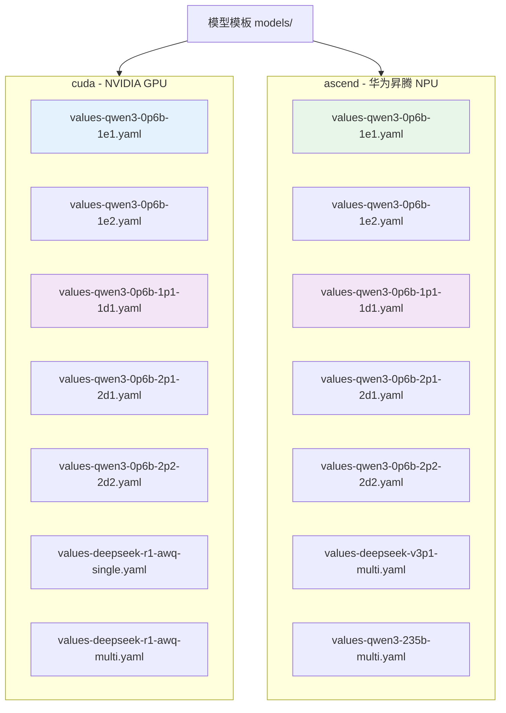
```mermaid
graph TB
    Templates["模型模板 models/"]

    subgraph cuda["cuda - NVIDIA GPU"]
        C1["values-qwen3-0p6b-1e1.yaml"]
        C2["values-qwen3-0p6b-1e2.yaml"]
        C3["values-qwen3-0p6b-1p1-1d1.yaml"]
        C4["values-qwen3-0p6b-2p1-2d1.yaml"]
        C5["values-qwen3-0p6b-2p2-2d2.yaml"]
        C6["values-deepseek-r1-awq-single.yaml"]
        C7["values-deepseek-r1-awq-multi.yaml"]
    end

    subgraph ascend["ascend - 华为昇腾 NPU"]
        A1["values-qwen3-0p6b-1e1.yaml"]
        A2["values-qwen3-0p6b-1e2.yaml"]
        A3["values-qwen3-0p6b-1p1-1d1.yaml"]
        A4["values-qwen3-0p6b-2p1-2d1.yaml"]
        A5["values-qwen3-0p6b-2p2-2d2.yaml"]
        A6["values-deepseek-v3p1-multi.yaml"]
        A7["values-qwen3-235b-multi.yaml"]
    end

    Templates --> cuda
    Templates --> ascend

    style C1 fill:#e3f2fd
    style C3 fill:#f3e5f5
    style A1 fill:#e8f5e9
    style A3 fill:#f3e5f5
```

### 模板分类

| 形态 | cuda 文件 | ascend 文件 |
|------|-----------|-------------|
| **单机** | `values-qwen3-0p6b-1e1.yaml`、`values-deepseek-r1-awq-single.yaml` | `values-qwen3-0p6b-1e1.yaml` |
| **双机/多机** | `values-qwen3-0p6b-1e2.yaml`、`values-deepseek-r1-awq-multi.yaml` | `values-qwen3-0p6b-1e2.yaml`、`values-deepseek-v3p1-multi.yaml`、`values-qwen3-235b-multi.yaml` |
| **PD 1P1D** | `values-qwen3-0p6b-1p1-1d1.yaml` | `values-qwen3-0p6b-1p1-1d1.yaml` |
| **PD 2P2D** | `values-qwen3-0p6b-2p1-2d1.yaml` | `values-qwen3-0p6b-2p1-2d1.yaml` |
| **PD 2P2D 双机实例** | `values-qwen3-0p6b-2p2-2d2.yaml` | `values-qwen3-0p6b-2p2-2d2.yaml` |

### 选型流程图

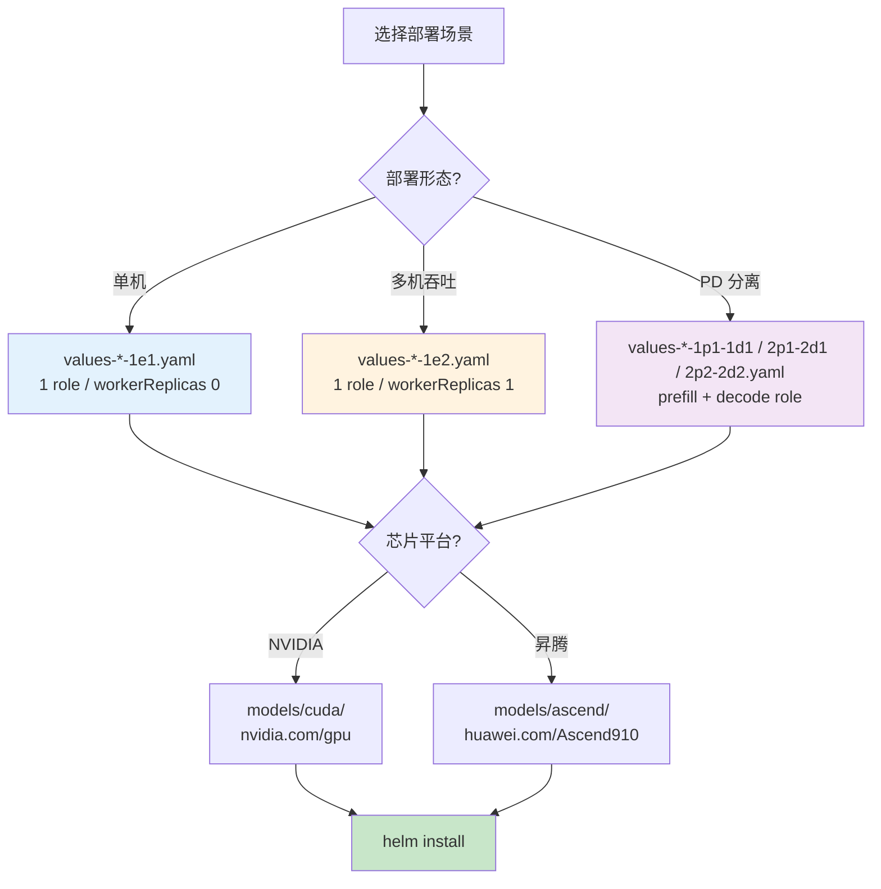
```mermaid
flowchart TD
    Start["选择部署场景"] --> Form{"部署形态?"}

    Form -->|"单机"| Single["values-*-1e1.yaml<br/>1 role / workerReplicas 0"]
    Form -->|"多机吞吐"| Multi["values-*-1e2.yaml<br/>1 role / workerReplicas 1"]
    Form -->|"PD 分离"| PD["values-*-1p1-1d1 / 2p1-2d1 / 2p2-2d2.yaml<br/>prefill + decode role"]

    Single --> Plat{"芯片平台?"}
    Multi --> Plat
    PD --> Plat

    Plat -->|"NVIDIA"| Cuda["models/cuda/<br/>nvidia.com/gpu"]
    Plat -->|"昇腾"| Ascend["models/ascend/<br/>huawei.com/Ascend910"]

    Cuda --> Deploy["helm install"]
    Ascend --> Deploy

    style Single fill:#e3f2fd
    style Multi fill:#fff3e0
    style PD fill:#f3e5f5
    style Deploy fill:#c8e6c9
```

---

## 🔧 kthena 化改造清单

本 chart 已从「原生 Deployment/StatefulSet/Ray + 旧 schema」整体迁移到 **kthena-only**。下表概述 native → kthena 的关键变化。

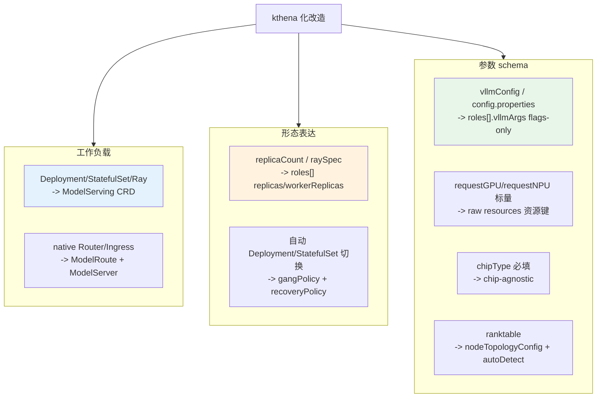
```mermaid
graph TB
    Mods["kthena 化改造"]

    subgraph workload["工作负载"]
        W1["Deployment/StatefulSet/Ray<br/>-> ModelServing CRD"]
        W2["native Router/Ingress<br/>-> ModelRoute + ModelServer"]
    end

    subgraph form["形态表达"]
        F1["replicaCount / raySpec<br/>-> roles[] replicas/workerReplicas"]
        F2["自动 Deployment/StatefulSet 切换<br/>-> gangPolicy + recoveryPolicy"]
    end

    subgraph schema["参数 schema"]
        S1["vllmConfig / config.properties<br/>-> roles[].vllmArgs flags-only"]
        S2["requestGPU/requestNPU 标量<br/>-> raw resources 资源键"]
        S3["chipType 必填<br/>-> chip-agnostic"]
        S4["ranktable<br/>-> nodeTopologyConfig + autoDetect"]
    end

    Mods --> workload
    Mods --> form
    Mods --> schema

    style W1 fill:#e3f2fd
    style F1 fill:#fff3e0
    style S1 fill:#e8f5e9
```

### 关键迁移对照

| 维度 | native（旧） | kthena（现） |
|------|-------------|-------------|
| **工作负载** | Deployment / StatefulSet / RayCluster | `ModelServing`（+ `ModelServer` / `ModelRoute`） |
| **形态决定** | `raySpec.enabled` / `replicaCount`（1=Deployment，≥2=StatefulSet） | `roles[]` 形状（`workerReplicas` / `pd`） |
| **多机** | StatefulSet + `POD_INDEX` + Ray | role `workerReplicas` + `ENTRY_ADDRESS`/`WORKER_INDEX` + Volcano gang |
| **vLLM 参数** | `vllmConfig` map / `config.properties` / `run_vllm.sh` | `roles[].vllmArgs`（flags-only） |
| **资源** | 标量 `requestGPU` / `requestNPU` | raw `resources.{limits,requests}`（资源键直写） |
| **芯片** | `chipType`（必填，分支选择） | chip-agnostic（镜像 + vLLM 自动探测） |
| **网络** | `ranktable` + `ranktable-setup.sh` | `nodeTopologyConfig` + `autoDetectInterface` |
| **路由** | native Router Service / Ingress / HTTPRoute | `ModelRoute` + `ModelServer`（或 `Service` 直连） |
| **KV / PD** | `kvRole` / `enableNixl` / `nixlRole` | `modelSpec.pd.kvTransfer` + `pd.{prefill,decode}` + 运行时 resolver |

---

## 📦 支持的资源类型

工作负载主体已变为 kthena CRD，配套 Service 与配置/存储/RBAC 资源保留。

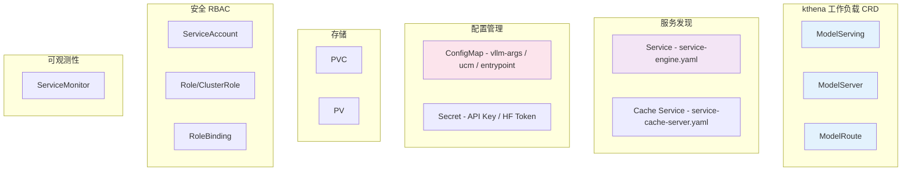
```mermaid
graph TB
    subgraph kthena["kthena 工作负载 CRD"]
        MServing["ModelServing"]
        MServer["ModelServer"]
        MRoute["ModelRoute"]
    end

    subgraph svc["服务发现"]
        SVC["Service - service-engine.yaml"]
        CSVC["Cache Service - service-cache-server.yaml"]
    end

    subgraph cfg["配置管理"]
        CM["ConfigMap - vllm-args / ucm / entrypoint"]
        SEC["Secret - API Key / HF Token"]
    end

    subgraph store["存储"]
        PVC["PVC"]
        PV["PV"]
    end

    subgraph sec["安全 RBAC"]
        SA["ServiceAccount"]
        ROLE["Role/ClusterRole"]
        RB["RoleBinding"]
    end

    subgraph obs["可观测性"]
        SM["ServiceMonitor"]
    end

    style MServing fill:#e3f2fd
    style MServer fill:#e3f2fd
    style MRoute fill:#e3f2fd
    style SVC fill:#f3e5f5
    style CM fill:#fce4ec
```

### 资源清单

| 资源类型 | 用途 | 渲染条件 |
|---------|------|---------|
| **ModelServing** | 推理引擎工作负载（单机/多机/PD） | 始终（`enableEngine` 且 `roles[]` 非空） |
| **ModelServer** | 路由后端 + pdGroup + kvConnector | `pd.kvTransfer.routerType` 或 `router.enabled` |
| **ModelRoute** | 按 modelName 的请求路由 | `pd.kvTransfer.routerType` 或 `router.enabled` |
| **Service** | engine 直连暴露（ClusterIP） | **无** router 时（单机/多机不开 router） |
| **Cache Service** | UnifiedCache 相关服务 | 按需 |
| **ConfigMap** | vllm-args / ucm / entrypoint / nodeTopology | 1-N |
| **Secret** | API Keys、HF Tokens | 0-N |
| **PVC / PV** | 模型与缓存存储 | 0-N（dynamicPVC/staticPVC 时自动创建） |
| **ServiceAccount** | Pod 身份 | 按需 |
| **Role/ClusterRole / RoleBinding** | RBAC | 按需 |
| **ServiceMonitor** | Prometheus Operator 指标采集 | `serviceMonitor.enabled` |

> 已**不再渲染**：Deployment、StatefulSet、RayCluster、Headless Service、Pod-0 Service、HTTPRoute、native Router Service。

---

## 🚀 快速开始

### 部署流程

```mermaid
flowchart TD
    Start["开始"] --> Pre{"kthena + Volcano 控制面就绪?"}
    Pre -->|"否"| InstallCtrl["1. 安装 kthena CRDs + controller + Volcano"]
    Pre -->|"是"| Choose["2. 选择模型模板"]
    InstallCtrl --> Choose

    Choose --> Scene{"形态选择"}
    Scene -->|"单机"| S["models/cuda/values-qwen3-0p6b-1e1.yaml"]
    Scene -->|"多机"| M["models/ascend/values-qwen3-0p6b-1e2.yaml"]
    Scene -->|"PD 分离"| P["models/cuda/values-qwen3-0p6b-1p1-1d1.yaml"]

    S --> Install["3. helm install"]
    M --> Install
    P --> Install

    Install --> Verify["4. 验证 CR 与 Pod"]
    Verify --> Test["5. 测试推理"]

    style Start fill:#c8e6c9
    style Install fill:#fff9c4
    style Test fill:#e3f2fd
```

### 一键部署命令（真实文件）

```bash
# 1. 单机（CUDA，Qwen3-0.6B，TP1）
helm install qwen3-0p6b-1e1 -n yulei-test --create-namespace \
  . -f values.yaml -f models/cuda/values-qwen3-0p6b-1e1.yaml

# 2. 单机（昇腾，Qwen3-0.6B，TP1）
helm install qwen3-0p6b-1e1 -n yulei-test --create-namespace \
  . -f values.yaml -f models/ascend/values-qwen3-0p6b-1e1.yaml

# 3. 双机/多机（昇腾，Qwen3-0.6B，DP2×TP1）
helm install qwen3-0p6b-1e2 -n yulei-test --create-namespace \
  . -f values.yaml -f models/ascend/values-qwen3-0p6b-1e2.yaml

# 4. PD 分离 1P1D（CUDA，Mooncake + UCM）
helm install qwen3-0p6b-1p1-1d1 -n yulei-test --create-namespace \
  . -f values.yaml -f models/cuda/values-qwen3-0p6b-1p1-1d1.yaml

# 5. PD 分离 1P1D（昇腾，Mooncake + UCM）
helm install qwen3-0p6b-1p1-1d1 -n yulei-test --create-namespace \
  . -f values.yaml -f models/ascend/values-qwen3-0p6b-1p1-1d1.yaml

# 6. PD 分离 2P2D 双机实例（CUDA，每个 P/D 实例 entry+worker）
helm install qwen3-0p6b-2p2-2d2 -n yulei-test --create-namespace \
  . -f values.yaml -f models/cuda/values-qwen3-0p6b-2p2-2d2.yaml
```

### 验证和测试

```bash
# 1. 查看 kthena CR
kubectl get modelserving,modelserver,modelroute -n <namespace>

# 2. 查看 Pod / Service
kubectl get pods -n <namespace>
kubectl get svc -n <namespace>

# 3. 检查 UCM 运行时配置（在 vllm 容器内）
kubectl exec -n <namespace> <pod> -c vllm -- \
  cat /vllm-workspace/UnifiedCache/config/ucm_config.runtime.yaml

# 4. 端口转发（单机/多机走 Service；PD 走 router）
kubectl port-forward svc/<service-name> 8000:80 -n <namespace>

# 5. 发送测试请求（model 字段 = modelSpec.modelName）
curl http://localhost:8000/v1/completions \
  -H "Content-Type: application/json" \
  -d '{
    "model": "Qwen3-0.6B",
    "prompt": "你好，请介绍一下 vLLM。",
    "max_tokens": 100
  }'
```

> 请求体的 `"model"` 必须等于 `modelSpec.modelName`（本例 `Qwen3-0.6B`，留空时回退为 `modelPath`）—— 它就是 `ModelRoute.modelName` / `ModelServer.model` / `--served-model-name` 的统一来源。

---

## 📊 总结

### 核心优势

```mermaid
mindmap
  root(("Unified Cache Stack<br/>核心优势"))
    统一编排
      kthena ModelServing
      单机/多机/PD 一套 schema
      Volcano gang 整组恢复
    PD 分离
      Mooncake / NIXL KV
      prefill 叠加 UCM
      xPyD 灵活配比
    多芯片
      NVIDIA + 昇腾
      chip-agnostic
      资源键直写
    KV 缓存
      Unified Cache UCM
      多级卸载
      自动接管字段
    易用性
      真实预配置模板
      flags-only vllmArgs
      中文文档
```

### 技术亮点

1. **🧩 统一形态**：单机 / 双机（跨机 TP/PP/DP）/ PD 分离全部由 `roles[]` 表达，无需在 Deployment/StatefulSet/Ray 间手动切换。
2. **🔀 PD 一等公民**：`modelSpec.pd.kvTransfer` 将 vLLM connector、Kthena routerType 和实例 identity 解耦；运行时 resolver 自动生成 Mooncake / NIXL / MultiConnector 的唯一 KV 配置。
3. **🎯 名称零漂移**：`modelSpec.modelName` 一处定义，贯穿 ModelRoute / ModelServer / `--served-model-name`，结构上不可能不一致。
4. **🪙 chip-agnostic**：`chipType` 不再必填、不再决定资源键/后端（仅 `storage.chipExtraStorage` 可选按其合并挂载），资源键直写（`nvidia.com/gpu` / `huawei.com/Ascend910`），后端由镜像 + vLLM 自动探测。
5. **🛡️ gang 调度与整组恢复**：Volcano `gangPolicy` + `recoveryPolicy: ServingGroupRecreate`，多机/PD 一损俱损、整组重建。
6. **📦 真实模板开箱即用**：`models/{cuda,ascend}/` 覆盖单机 / 多机 / PD-1p1d / PD-2p2d。
7. **🌐 网络自适配**：`autoDetectInterface` + `nodeTopologyConfig` 取代 ranktable，支持 NCCL/HCCL/InfiniBand。

### 适用场景

- ✅ 企业级大模型推理服务
- ✅ Prefill/Decode 分离的高吞吐部署
- ✅ 跨机分布式推理（TP/PP/DP）
- ✅ 国产化昇腾芯片适配
- ✅ 多级 KV 缓存（UCM）降本提速
- ✅ 研发测试环境

---

## 📖 相关文档

- [README.md](../README.md) - 项目介绍和快速开始
- [GET_START.md](GET_START.md) - 部署上手指南
- [DEVELOPER_GUIDE.md](DEVELOPER_GUIDE.md) - 模型适配开发指南
- [uc-stack-kthena-values.md](uc-stack-kthena-values.md) - kthena values 配置参考
- [kthena-native-pd-multinode.md](kthena-native-pd-multinode.md) - kthena 原生 PD / 多机字段语义

---

**项目**: Unified-Cache-Server
**版本**: 0.1.0
**维护者**: yulei136
**更新时间**: 2026-06-23
