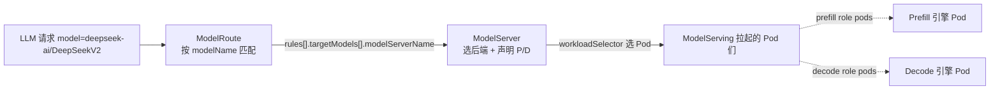
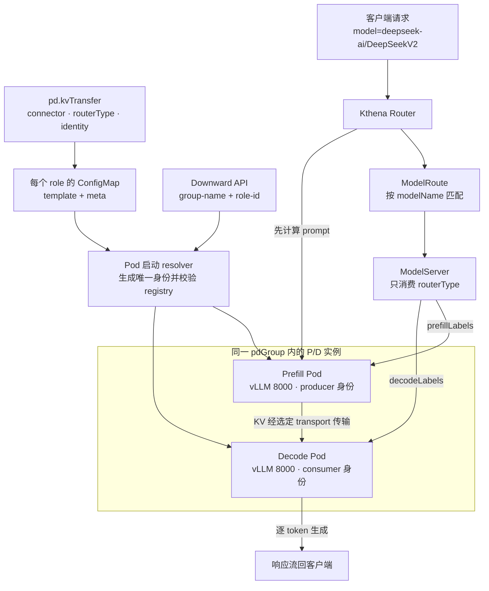

# kthena 原生配置详解：PD 分离 + 双机服务

> 本文所有字段均以本地 CRD 为准（已逐行核对），引用格式 `文件:行`。三份 CRD 路径：
> - ModelServing：`/Users/yulei/Downloads/kthena/charts/workload/crds/workload.serving.volcano.sh_modelservings.yaml`（下称 **MS-CRD**，共 17657 行）
> - ModelServer：`/Users/yulei/Downloads/kthena/charts/networking/crds/networking.serving.volcano.sh_modelservers.yaml`（下称 **MSrv-CRD**，共 167 行）
> - ModelRoute：`/Users/yulei/Downloads/kthena/charts/networking/crds/networking.serving.volcano.sh_modelroutes.yaml`（下称 **MR-CRD**，共 365 行）
>
> 凡 CRD 未明确写出的控制器或运行时行为，文中会区分 Chart 已实现逻辑与仍需集群实测的外部契约，不臆造。

---

## 1. kthena 对象模型（ModelServing / ModelServer / ModelRoute 各管什么）

kthena 把“推理服务”拆成三层关注点，分别由三个 CRD 承载：

| CRD | API Group / Kind | 管什么 | 类比 |
| --- | --- | --- | --- |
| **ModelServing** | `workload.serving.volcano.sh/v1alpha1` · `ModelServing` | **工作负载编排**：把模型引擎拉起成 Pod，定义 role（角色）、副本数、entry/worker 拓扑、gang 调度、故障恢复策略 | 类似“带角色拓扑的 StatefulSet/Deployment” |
| **ModelServer** | `networking.serving.volcano.sh/v1alpha1` · `ModelServer`（MSrv-CRD:11） | **后端发现 + PD 配对**：通过 label selector 把上面那些 Pod 认作一个“模型后端”，并声明它们是 prefill 还是 decode、用哪种 KV 连接器、引擎类型、后端端口 | 类似“带 PD 语义的 Service/EndpointSlice” |
| **ModelRoute** | `networking.serving.volcano.sh/v1alpha1` · `ModelRoute`（MR-CRD:rules required，MR-CRD:350-351） | **流量路由**：把请求里的 `model` 名字映射到一个或多个 ModelServer，支持按权重分流、URI/header/body 匹配 | 类似“L7 路由规则 / Ingress” |

三者的关系：



关键分工原则：

- **ModelServing 只管“把进程跑起来”**，它根本不知道自己是不是 PD 的一部分——它只有 `roles[]`，role 名字可以叫 `prefill`/`decode`，也可以叫别的，纯粹是自由字符串（MS-CRD:8880-8884，`name` 仅约束 `maxLength: 12` 和 DNS 风格 pattern）。
- **PD 的 P/D 语义在 ModelServer 里声明**，靠 `workloadSelector.pdGroup.prefillLabels`/`decodeLabels` 显式贴标签来区分（MSrv-CRD:128-154），而不是靠 role 名字。
- **单纯的多机/双机（无 PD）只需要 ModelServing**，不需要 ModelServer / ModelRoute（除非你还想给它做路由）。

---

## 2. 双机 / 多机服务（无 PD）—— 逐字段讲 ModelServing

场景：单个推理引擎实例太大，单机放不下（如 Llama-3.1-405B，TP8×PP2 共 16 卡），需要**跨 2 个节点拼成一个引擎**。kthena 的做法是：一个 role 里用 **1 个 entry pod（leader）+ N 个 worker pod（follower）**，引擎内部用 **Ray** 把它们组成一个集群跨机做 TP/PP。

### 2.1 verbatim 多机示例（Llama-405B，TP8×PP2，跨 2 节点，用 Ray）

```yaml
apiVersion: workload.serving.volcano.sh/v1alpha1
kind: ModelServing
metadata: { name: llama-multinode, namespace: default }
spec:
  schedulerName: volcano
  replicas: 1
  template:
    restartGracePeriodSeconds: 60
    gangPolicy: { minRoleReplicas: { "405b": 1 } }
    roles:
      - name: 405b
        replicas: 2
        entryTemplate:
          spec:
            containers:
              - name: leader
                image: vllm/vllm-openai:latest
                command: [sh, -c, "bash .../multi-node-serving.sh leader --ray_cluster_size=2; python3 -m vllm.entrypoints.openai.api_server --port 8080 --model meta-llama/Llama-3.1-405B-Instruct --tensor-parallel-size 8 --pipeline_parallel_size 2"]
                resources: { limits: { nvidia.com/gpu: "8", memory: 1124Gi, ephemeral-storage: 800Gi } }
                ports: [{containerPort: 8080}]
                volumeMounts: [{mountPath: /dev/shm, name: dshm}]
            volumes: [{name: dshm, emptyDir: {medium: Memory, sizeLimit: 15Gi}}]
        workerReplicas: 1
        workerTemplate:
          spec:
            containers:
              - name: worker
                image: vllm/vllm-openai:latest
                command: [sh, -c, "bash .../multi-node-serving.sh worker --ray_address=$(ENTRY_ADDRESS)"]
                resources: { limits: { nvidia.com/gpu: "8", memory: 1124Gi, ephemeral-storage: 800Gi } }
            volumes: [{name: dshm, emptyDir: {medium: Memory, sizeLimit: 15Gi}}]
```

### 2.2 逐字段讲解

**`spec.schedulerName`（MS-CRD:151-155）**
调度器名，`default: volcano`（MS-CRD:152）。多机场景配合 gang 调度需要 volcano。

**`spec.replicas`（MS-CRD:97-103）**
`default: 1`。注意 CRD 原文定义：它是 **ServingGroup（服务组）的数量**，即“运行推理任务的实例数”（MS-CRD:100 "Number of ServingGroups"）。一个 ServingGroup 是一整套 roles 的组合。这里 `replicas: 1` 表示只起一组（一个完整的 405B 引擎）。

**`spec.recoveryPolicy`（MS-CRD:88-96）**
`default: RoleRecreate`，枚举三选一：`ServingGroupRecreate` / `RoleRecreate` / `None`。决定某个 Pod 挂了之后重建的粒度。本例未写，走默认 `RoleRecreate`。

**`spec.template.restartGracePeriodSeconds`（MS-CRD:240-246）**
`default: 0`。控制器在出错后重建 ServingGroup 前的等待宽限时间。默认 0 表示出错立即重建（MS-CRD:244）。本例设 60s，给引擎一点缓冲。

**`spec.template.gangPolicy.minRoleReplicas`（MS-CRD:159-184）**
gang 调度配置。`minRoleReplicas` 是一个 `map[roleName]int32`（MS-CRD:162-165），声明每个 role 至少要同时调度多少副本才能整体起跑。本例 `{ "405b": 1 }` 表示该 role 至少调度 1 个完整实例（含其 entry+worker）才放行。CRD 原文还给了 2P4D 的范例（MS-CRD:171-180）。该字段 `immutable`（创建后不可改，MS-CRD:182-184）。

**`spec.template.roles[]`（MS-CRD:247-251）**
角色列表。每个 role 描述“执行推理任务的特定 Pod 实例角色”。

逐 role 子字段：

- **`roles[].name`（MS-CRD:8880-8884）**：role 名，`maxLength: 12`，DNS 风格 pattern。**仅是标识，与 P/D 语义无关**。本例 `405b`。
- **`roles[].replicas`（MS-CRD:8886-8894）**：`default: 1`，“该角色的实例数”。CRD 原文（MS-CRD:8890-8891）直接点明：PD 场景里 P 和 D 各设 1 就是 1P1D，可推广到 xPyD。本例 `replicas: 2` 表示该 role 有 2 个实例（即 2 套 leader+worker，每套是一个 405B 引擎）。
- **`roles[].entryTemplate`（MS-CRD:252-256）**：**entry（leader）pod 的模板**。CRD 原文（MS-CRD:253-255）强调：“一个 role 当前必须有且仅有一个 entry-pod”。本例 leader 容器跑 `multi-node-serving.sh leader --ray_cluster_size=2`，先把自己作为 Ray 集群 head 拉起，再起 vLLM api_server。
- **`roles[].workerReplicas`（MS-CRD:8895-8900）**：worker（follower）pod 的数量。CRD 原文（MS-CRD:8897-8898）标注为 Required。本例 `workerReplicas: 1`，即每个 role 实例 1 个 worker，凑成 leader+worker = 2 节点。
- **`roles[].workerTemplate`（MS-CRD:8901-8903）**：worker（follower）pod 模板。本例 worker 跑 `multi-node-serving.sh worker --ray_address=$(ENTRY_ADDRESS)`，作为 Ray 集群成员加入 leader。

### 2.3 entry=leader / worker=follower，与三个注入变量契约

- **entry = leader，worker = follower**。一个 role 实例 = 1 个 leader pod + `workerReplicas` 个 worker pod，它们在引擎内部（这里用 Ray）合成“一个引擎”。
- **worker 用 `$(ENTRY_ADDRESS)` 连 leader**：worker 的 command 里 `--ray_address=$(ENTRY_ADDRESS)`。`$()` 是 k8s env 引用语法；kthena 把 `ENTRY_ADDRESS` 注入到每个 worker pod，值为**对应 entry 的 headless DNS 地址**，worker 借此找到 leader 加入 Ray 集群。
- **command 覆盖 ENTRYPOINT 跑 Ray**：本例 leader/worker 都显式写了 `command: [sh, -c, "..."]`，**覆盖镜像默认 ENTRYPOINT**，改为先跑 `multi-node-serving.sh` 起 Ray，再起引擎。这是“单引擎跨机靠 Ray”的关键。
- **注入变量契约**（kthena 注入，CRD schema 不显式声明这些 env，属运行时约定）：
  - `ENTRY_ADDRESS`：注入到 **worker pod**，= 对应 entry 的 headless DNS，worker 用它连 leader。
  - `WORKER_INDEX`：注入到 **worker pod**，worker 自身序号。
  - `GROUP_SIZE`：注入到 **所有 pod**，组内总规模。

> 说明：这三个变量是 kthena 运行时注入的约定，本地 CRD 的 schema 里没有列出它们（它们不是用户填的字段，而是平台填给容器的 env），属于“文档/运行时契约”。

本节小结：**双机/多机（无 PD）= 1 个 role + `workerReplicas≥1`，worker 经 `$(ENTRY_ADDRESS)` 连 leader，引擎内部用 Ray 做跨机 TP/PP；不需要 runtime sidecar，也不需要 ModelServer/ModelRoute。**

---

## 3. PD 分离 —— Chart 同时生成 ModelServing、ModelServer 与 ModelRoute

PD（Prefill-Decode）分离把 prompt 计算与逐 token 解码拆到不同 role。当前 uc-stack Chart 不要求用户手写最终 `--kv-transfer-config`；values 只声明 connector、router 与身份基址，最终 JSON 在每个 Pod 启动 vLLM 前生成。

### 3.1 values 接口

下面是 1P1D Mooncake 配置的核心部分。`unifiedcacheConfig.enabled` 是唯一的 UCM 开关；不需要也不允许再配置 `pd.ucm`。

```yaml
servingEngineSpec:
  enableEngine: true
  containerPort: 8000
  modelSpec:
    name: deepseek-v2-lite
    modelPath: /mnt/model/DeepSeek-V2-Lite
    modelName: deepseek-ai/DeepSeekV2
    recoveryPolicy: ServingGroupRecreate  # 可选：ServingGroupRecreate（整组）| RoleRecreate（单 Role，默认）| None（Pod/Deployment 默认行为）

    pd:
      prefill: prefill
      decode: decode
      antiAffinity: true
      kvTransfer:
        connector: MooncakeConnectorV1    # 可选（区分大小写）：MooncakeConnectorV1 | MooncakeHybridConnector | NixlConnector
        routerType: mooncake              # Mooncake 两种 connector 对应 mooncake；NixlConnector 对应 nixl
        identity:
          engineIdBase: 0
          kvPortBase: 36000
          instanceStride: 100
      mooncake:
        master:
          enabled: true

    roles:
      - name: prefill
        replicas: 1
        workerReplicas: 0
        vllmArgs: |
          --tensor-parallel-size 2
          --max-model-len 8192
      - name: decode
        replicas: 1
        workerReplicas: 0
        vllmArgs: |
          --tensor-parallel-size 2
          --max-model-len 8192
          --no-enable-prefix-caching

    router:
      enabled: true
      inferenceEngine: vLLM
      trafficPolicy:
        timeout: 60s

    unifiedcacheConfig:
      enabled: true
      config:
        ucm_connectors:
          - ucm_connector_name: UcmPipelineStore
            ucm_connector_config:
              store_pipeline: Cache|Posix
```

三个配置概念彼此独立：

| 字段 | 消费方 | 规则 |
| --- | --- | --- |
| `pd.kvTransfer.connector` | vLLM KV JSON | 使用 vLLM 原始、区分大小写的类名，只支持 `MooncakeConnectorV1`、`MooncakeHybridConnector`、`NixlConnector` |
| `pd.kvTransfer.routerType` | Kthena `ModelServer.spec.kvConnector.type` | 只支持 `mooncake` 或 `nixl`，不能从 connector 名推导 |
| `pd.kvTransfer.identity` | Pod 内 resolver | 给出全局身份基址；不在 P/D role 的 `vllmArgs` 中手写 `engine_id` 或 `kv_port` |

当前允许的精确组合如下：

| connector | routerType | identity | UCM |
| --- | --- | --- | --- |
| `MooncakeConnectorV1` | `mooncake` | engine + port | 支持 |
| `MooncakeHybridConnector` | `mooncake` | engine + port | 支持；启动前必须通过 connector registry 门禁 |
| `NixlConnector` | `nixl` | 仅 engine | 不支持组合；UCM 有效时渲染失败 |

Mooncake 必须提供 `kvPortBase` 和 `instanceStride`；NIXL 禁止提供这两个端口字段。`engineIdBase` 必须非负，端口必须落在 `1..65535`，`instanceStride` 至少为 100，并覆盖从双方 `vllmArgs` 解析出的 DP、TP、PP 和 context-parallel 保守跨度。只有 `routerType: mooncake` 才能启用 `pd.mooncake.master.enabled`。

### 3.2 从 values 到 vLLM argv

Chart 将身份解析拆成渲染期和 Pod 启动期两步：

1. 每个 role 的 ConfigMap 保存该 role 的 `vllm.args`、`kv-transfer.template.json` 和 `kv-transfer.meta.json`；共享 ConfigMap 保存 `resolve-kv-transfer-config.py` 与启动脚本。
2. KV template 使用精确 sentinel 占位，Helm 不把最终实例身份静态写入 `vllmArgs`。
3. Pod 通过 Downward API 把 `modelserving.volcano.sh/group-name` 注入为 `UC_PD_GROUP_NAME`，把 `modelserving.volcano.sh/role-id` 注入为 `UC_PD_ROLE_ID`。
4. resolver 校验标签、ordinal、端口跨度、sentinel 数量与残留字段，生成当前实例的 JSON，并只追加一次 `--kv-transfer-config`。
5. 启动 vLLM 前，resolver 通过插件加载和 `KVConnectorFactory` 检查根 connector 及 MultiConnector 子 connector。`MooncakeHybridConnector` 未注册时直接失败，不降级到 V1。

同一 role replica 的 entry 与 workers 使用相同 `role-id`，因此共享一个逻辑 `engine_id` 和端口基址；`WORKER_INDEX` 不参与身份计算。角色的 DP/TP/PP 并行布局从 P/D 双方的 `vllmArgs` 自动解析，不再通过旧的 Ascend 专用字段配置。

### 3.3 稳定身份公式

resolver 从 group 标签和 role 标签解析 ordinal，并按下面的公式生成身份：

```text
instanceIndex =
  groupOrdinal × (prefillReplicas + decodeReplicas)
  + (prefill ? roleOrdinal : prefillReplicas + roleOrdinal)

engine_id = string(engineIdBase + instanceIndex)
kv_port   = kvPortBase + instanceIndex × instanceStride
```

例如 `engineIdBase=0`、`kvPortBase=36000`、`instanceStride=100` 的单 ServingGroup 2P2D 会得到：

| 实例 | engine_id | kv_port |
| --- | ---: | ---: |
| P0 | 0 | 36000 |
| P1 | 1 | 36100 |
| D0 | 2 | 36200 |
| D1 | 3 | 36300 |

这张表是公式的运行时结果，不是要复制进 values 的静态配置。增加 ServingGroup 时，`groupOrdinal` 让后一组继续使用不冲突的身份区间。

### 3.4 运行时 KV JSON 形状

template 中的 `__UC_ENGINE_ID__` 与 `__UC_KV_PORT__` 只是在启动前等待替换的 sentinel。resolver 输出时 `engine_id` 为字符串、`kv_port` 为整数，并保证身份字段只出现在规定位置：

| 场景 | 根节点 | transport 子项 | UCM 子项 |
| --- | --- | --- | --- |
| 纯 Mooncake | `kv_connector`、`kv_role`、`engine_id`、`kv_port` | 无 | 无 |
| Mooncake producer + UCM | `MultiConnector`、`kv_producer`、唯一 `engine_id` | 选定的 Mooncake connector，包含唯一 `kv_port` | `UCMConnector(kv_both)`，不重复身份字段 |
| Mooncake decode | 选定的 Mooncake connector、`kv_consumer`、`engine_id`、`kv_port` | 无 | 无 |
| NIXL | `NixlConnector`、角色、唯一 `engine_id` | 无 | 无 |

`MooncakeConnectorV1` 继续写 `kv_rank`，producer 固定为 0、consumer 固定为 1；`MooncakeHybridConnector` 不继承 V1 专用字段。UCM 只在 PD producer 侧与 Mooncake 组合成 MultiConnector，decode 保持纯 transport connector。非 PD 场景的单 `UCMConnector(kv_both)` 行为不变。

### 3.5 ModelServer 只消费 routerType

Chart 根据 `pd.kvTransfer.routerType` 生成下面的 `kvConnector.type`；它不读取或改写 vLLM connector 类名。

```yaml
apiVersion: networking.serving.volcano.sh/v1alpha1
kind: ModelServer
spec:
  inferenceEngine: vLLM
  model: deepseek-ai/DeepSeekV2
  workloadPort:
    port: 8000
  workloadSelector:
    matchLabels:
      modelserving.volcano.sh/name: <chart-generated-name>
    pdGroup:
      groupKey: modelserving.volcano.sh/group-name
      prefillLabels:
        modelserving.volcano.sh/role: prefill
      decodeLabels:
        modelserving.volcano.sh/role: decode
  kvConnector:
    type: mooncake
```

`pdGroup` 必须位于 `workloadSelector` 下。`groupKey` 负责隔离不同 ServingGroup，P/D label selector 由 `pd.prefill` 与 `pd.decode` 生成；`workloadPort.port` 指向 vLLM 容器端口。Chart 会单独校验允许的 connector/routerType 组合，但两条链不会相互推导。

### 3.6 ModelRoute

启用 `modelSpec.router.enabled` 后，Chart 生成 ModelRoute，将请求中的模型名指向同一 Chart 生成的 ModelServer：

```yaml
apiVersion: networking.serving.volcano.sh/v1alpha1
kind: ModelRoute
spec:
  modelName: deepseek-ai/DeepSeekV2
  rules:
    - name: default
      targetModels:
        - modelServerName: <chart-generated-name>
```

`rules` 是有序列表，第一个匹配规则生效；`targetModels[].weight` 未设置时使用 CRD 默认值。ModelRoute 管 L7 请求映射，ModelServer 管后端发现与 PD 配对，KV transport 类名只进入 vLLM JSON。

### 3.7 配置与请求链路



---

## 4. 易错点

1. **资源键取决于 device-plugin。** CUDA、Ascend 资源键都应以 `kubectl describe node` 的 allocatable 为准，不要把某个示例里的键名视为跨集群固定值。

2. **`pdGroup` 必须放在 `workloadSelector` 下。** 原始 CRD 结构是 `spec.workloadSelector.pdGroup`；在本 Chart 中由 `pd.prefill`、`pd.decode` 与默认 `groupKey` 生成，不要另写一份冲突的 ModelServer。

3. **connector 与 routerType 是两条独立链。** `connector` 必须是三种受支持的 vLLM 原始类名之一，`routerType` 只进入 ModelServer。Chart 校验允许的配对，但不会通过字符串改名或相互推导。

4. **不要手写 `--kv-transfer-config`、`engine_id` 或 `kv_port`。** 身份依赖 Kthena 注入的 `group-name` 与 `role-id` 标签；标签缺失、ordinal 畸形、端口越界或 sentinel 残留都会在 vLLM 启动前失败。

5. **Chart 中 P/D role 名由 `pd.prefill` 与 `pd.decode` 显式引用。** 改 role 名时必须同步这两个字段；Chart 再据此生成 ModelServer 的 P/D label selector。

6. **ServingGroup 数与 role 实例数不要混淆。** ModelServing 的顶层 `replicas` 是 ServingGroup 数，`roles[].replicas` 分别控制 xPyD 中的 x 和 y；身份公式同时使用两层 ordinal，保证多组之间不冲突。

7. **旧字段不会兼容迁移。** `pd.connector`、`pd.mooncakePort`、`pd.ucm` 即使为空或为 `false` 也会使 Helm 渲染失败；请迁移到 `pd.kvTransfer.*` 与 `modelSpec.unifiedcacheConfig.enabled`。`MultiConnector`、`UCMConnector` 也不能作为用户填写的 PD connector，它们由 Chart 按角色自动组合。

8. **UCM 与 NIXL 不能组合。** UCM 配置有效且 PD connector 为 `NixlConnector` 时 Helm 直接失败；Mooncake master 也只能与 `routerType: mooncake` 一起启用。

---

相关实现与参考文件：

- role 级 KV template/meta：`templates/configmap-vllm-args.yaml`
- Pod Downward API 注入：`templates/kthena/modelserving.yaml`
- ModelServer routerType 映射：`templates/kthena/modelserver.yaml`
- 运行时身份解析：`files/resolve-kv-transfer-config.py`
- CUDA / Ascend PD 样例：`models/cuda/values-qwen3-0p6b-*.yaml`、`models/ascend/values-qwen3-0p6b-*.yaml`
- ModelServing CRD：`/Users/yulei/Downloads/kthena/charts/workload/crds/workload.serving.volcano.sh_modelservings.yaml`
- ModelServer CRD：`/Users/yulei/Downloads/kthena/charts/networking/crds/networking.serving.volcano.sh_modelservers.yaml`
- ModelRoute CRD：`/Users/yulei/Downloads/kthena/charts/networking/crds/networking.serving.volcano.sh_modelroutes.yaml`
