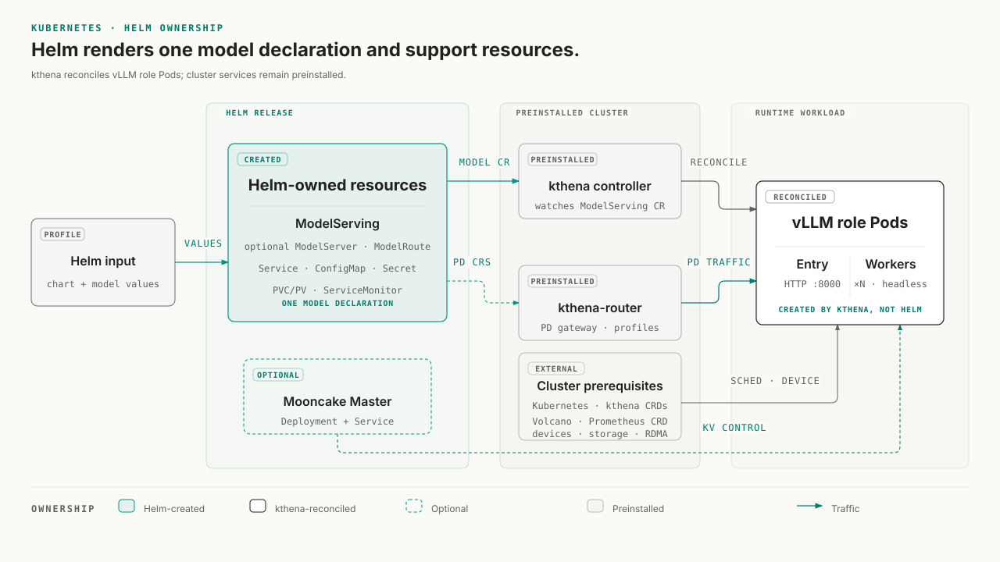

# Kubernetes

The `unified-cache-chart` packages the configuration needed to run one
vLLM-UC model on an existing Kubernetes cluster. One Helm release owns one
model; deploy another release when you need another model.

The inference-engine path is **kthena-only**. Helm creates a `ModelServing`
declaration, and the pre-installed kthena control plane turns its roles into
vLLM entry and worker Pods. A PD deployment also creates `ModelServer` and
`ModelRoute` declarations so requests can enter through the cluster's
kthena-router.

The whole Chart is not CRD-only. Helm also creates native Kubernetes support
resources such as Services, ConfigMaps, Secrets, storage objects, and an
optional `ServiceMonitor`. A Mooncake PD profile can additionally create a
Mooncake master `Deployment` and `Service`.

[Open the architecture diagram at full size](../../../assets/images/kubernetes-helm-architecture.svg).
On narrow screens, scroll horizontally to inspect it without shrinking the labels.

<div style="overflow-x: auto; margin: 1.2rem 0;" markdown>

[{ style="display: block; width: 100%; min-width: 680px; max-width: none; height: auto;" }](../../../assets/images/kubernetes-helm-architecture.svg)

</div>

The Chart does not install kthena, Volcano, device plugins, storage drivers,
or Prometheus Operator. Those cluster services must already exist when the
selected configuration depends on them.

## Choose a deployment profile

The Chart archive includes 14 profiles under `models/`. A profile selects a
platform's device resources, a model, and a deployment shape by filling
`servingEngineSpec.modelSpec.roles[]` and, for PD, `modelSpec.pd`.
It does not select a matching engine image.

| Platform | Model | Included profiles |
| --- | --- | --- |
| CUDA | Qwen3-0.6B | single-node `1e1`, two-node `1e2`, PD `1p1-1d1`, `2p1-2d1`, and `2p2-2d2` |
| CUDA | DeepSeek-R1-AWQ | single-node and multi-node |
| Ascend | Qwen3-0.6B | single-node `1e1`, two-node `1e2`, PD `1p1-1d1`, `2p1-2d1`, and `2p2-2d2` |
| Ascend | DeepSeek-V3.1 | multi-node |
| Ascend | Qwen3-235B | multi-node |

The current Qwen profiles render these engine layouts when
`modelSpec.replicas` remains `1`:

| Shape | Role configuration | vLLM Pods | Request path |
| --- | --- | ---: | --- |
| `1e1` | one engine role, `replicas: 1`, `workerReplicas: 0` | 1 entry | release Service |
| `1e2` | one engine role, `replicas: 1`, `workerReplicas: 1` | 1 entry + 1 worker | release Service |
| `1p1-1d1` | one prefill and one decode instance, no workers | 2 | kthena-router |
| `2p1-2d1` | two prefill and two decode instances, no workers | 4 | kthena-router |
| `2p2-2d2` | two prefill and two decode instances, each with one worker | 8 | kthena-router |

All six bundled PD profiles currently create a Mooncake master and use
`MooncakeConnectorV1` with UCM. Other connector combinations are Chart
configuration capabilities, not packaged deployment profiles.

!!! important "Profiles are deployment examples"

    The bundled profiles are not portable, ready-to-run values. The combined
    base and profile configuration contains cluster-specific storage classes,
    NFS paths, RDMA resource names, resource requests, and scheduling
    assumptions. Its presence in the archive proves that the Chart can render
    those configurations; it does not prove that the model has passed GPU/NPU,
    RDMA, storage, or kthena cluster acceptance in your environment.

## Before you install

### Cluster services

Prepare the following services and resources before rendering the release:

| Requirement | Why it is needed | How to adapt the Chart |
| --- | --- | --- |
| Kubernetes `>=1.19` and Helm 3 | Declared Chart runtime | Verify with `kubectl version` and `helm version` |
| kthena controller and CRDs | Reconciles `ModelServing` and creates the engine Pods | Install kthena before this Chart |
| kthena-router for PD or routed profiles | Resolves `ModelServer` and `ModelRoute` and accepts client traffic | Use the gateway from the existing kthena installation |
| Matching GPU/NPU driver and device plugin | Supplies the resource keys requested by the selected profile | Keep only resource keys that exist on your nodes |
| Engine image and pull credentials | Runs vLLM with UCM integration for the selected platform | Set `images.engine` or `modelSpec.image`, plus `imagePullSecret` when required |
| Model and UCM storage | Makes `modelPath` and cache backends visible inside the container | Replace the example NFS and StorageClass values |

Two defaults create additional dependencies:

- `servingEngineSpec.schedulerName` defaults to `volcano`. Install Volcano, or
  set it to an empty string to use the default Kubernetes scheduler.
- `servingEngineSpec.serviceMonitor.enabled` defaults to `true`. If the
  cluster does not have the Prometheus Operator `ServiceMonitor` CRD, set it
  to `false` before installation.

The Chart also defaults to `hostNetwork: true`, `hostIPC: true`, and host port
`8000` for every vLLM container. Each engine Pod therefore needs a node where
port `8000` is free, including when several releases share the cluster.
Multi-node and PD profiles must have enough eligible nodes, and their security
context must be allowed by the namespace's Pod security policy.

### Get and unpack the Chart

Open the matching
[GitHub Release](https://github.com/ModelEngine-Group/unified-cache-management/releases),
copy the `unified-cache-chart` asset URL, and let Helm download and unpack it:

```bash
helm pull "<chart-url>" --untar
cd unified-cache-chart
```

When working from a source checkout instead, enter
`charts/unified-cache-chart` directly. Helm loads the Chart's root
`values.yaml` automatically; do not install that file by itself because it
does not define `modelSpec.roles[]`.

### Create site-specific values

Start from the smallest profile that matches your accelerator:

=== "CUDA"

    ```bash
    cp models/cuda/values-qwen3-0p6b-1e1.yaml values-site.yaml
    ```

=== "Ascend"

    ```bash
    cp models/ascend/values-qwen3-0p6b-1e1.yaml values-site.yaml
    ```

Edit the copied file before running Helm:

| Configuration | Required change |
| --- | --- |
| Engine image | Add a matching `images.engine.repository` and `tag` or `digest`; profiles do not select the image for you. |
| Model identity | Set `modelSpec.modelPath` to the container-visible path and set `modelName` to the name clients will send to the OpenAI-compatible API. |
| Model mount | Replace the root `extraStorage` NFS example, or provide another supported `hostPath`, PVC, CSI, or NFS source that exposes `modelPath`. |
| UCM storage | Replace the example `unifiedcacheStorage` StorageClass and capacity with a cache backend available in the cluster. |
| Accelerator resources | Keep the correct `nvidia.com/gpu` or `huawei.com/Ascend910` key and replace RDMA, CPU, memory, runtime class, labels, and tolerations with values from your nodes. |
| Scheduling and monitoring | Decide whether to keep Volcano and `ServiceMonitor`; change the defaults when those cluster services are absent. |
| Network topology | Keep automatic interface detection only when it selects the correct fabric; otherwise provide `nodeTopologyConfig` or `forceInterface`. |

Helm replaces list values instead of merging their individual elements. Edit
the copied profile as a complete deployment file rather than layering a
partial `roles[]` or storage list on top of it.

The base Chart does not enable UCM by itself. UCM becomes effective when
`modelSpec.unifiedcacheConfig.config` is non-empty and its `enabled` switch is
not `false`. The bundled profiles supply both the configuration and
`unifiedcacheStorage`; changing either side must preserve that relationship.

## Render and install

Set a release name and namespace, then validate the site values before
changing the cluster:

```bash
export UCM_RELEASE=qwen3
export UCM_NAMESPACE=ucm

helm lint --strict . -f values-site.yaml
helm template "$UCM_RELEASE" . \
  --namespace "$UCM_NAMESPACE" \
  -f values-site.yaml \
  > /tmp/ucm-rendered.yaml
```

Inspect `/tmp/ucm-rendered.yaml`. For a single-node profile, it should contain
`ModelServing`, a release Service, and the configured support resources. A PD
profile should additionally contain `ModelServer` and `ModelRoute`; profiles
that create a Mooncake master also contain its `Deployment` and `Service`.

When the namespace and required CRDs already exist, ask the Kubernetes API to
validate the rendered objects without persisting them:

```bash
kubectl apply --dry-run=server -f /tmp/ucm-rendered.yaml
```

Install only after the local render and optional server-side validation match
the intended platform and topology:

```bash
helm upgrade --install "$UCM_RELEASE" . \
  --namespace "$UCM_NAMESPACE" \
  --create-namespace \
  -f values-site.yaml
```

## Verify the deployment

Start with the resources owned or declared by the release:

```bash
kubectl -n "$UCM_NAMESPACE" get modelserving
kubectl -n "$UCM_NAMESPACE" get pod,pvc,service -o wide
```

For a PD profile, also inspect the routing declarations and the optional
Mooncake master:

```bash
kubectl -n "$UCM_NAMESPACE" get modelserver,modelroute
kubectl -n "$UCM_NAMESPACE" get deployment,service
```

### Single-node and multi-node access

For non-PD profiles, the Chart creates a Service named
`<release>-<modelSpec.name>`. Its Service port is `80` and its vLLM target port
is `8000`:

```bash
export UCM_MODEL_RESOURCE=qwen3-0p6b-1e1
export UCM_MODEL_NAME=Qwen3-0.6B

kubectl -n "$UCM_NAMESPACE" port-forward \
  "svc/${UCM_RELEASE}-${UCM_MODEL_RESOURCE}" 8000:80
```

In another terminal, check the API and send one request:

```bash
curl --fail http://127.0.0.1:8000/health
curl --fail http://127.0.0.1:8000/v1/models

curl http://127.0.0.1:8000/v1/chat/completions \
  -H "Content-Type: application/json" \
  -d "{
    \"model\": \"${UCM_MODEL_NAME}\",
    \"messages\": [{\"role\": \"user\", \"content\": \"Hello\"}],
    \"max_tokens\": 128
  }"
```

`UCM_MODEL_RESOURCE` is `modelSpec.name`; `UCM_MODEL_NAME` is
`modelSpec.modelName`. They serve different purposes and do not need to be
identical.

### PD access

PD traffic must enter through the gateway exposed by the pre-installed
kthena-router. This Chart creates the `ModelServer` and `ModelRoute`
declarations but does not create or name that gateway Service. Use the
endpoint documented by your kthena installation, then send the same health,
model-list, and chat requests through that endpoint.

The release's engine Service still exists in a PD deployment so
`ServiceMonitor` can discover entry Pods. It selects both prefill and decode
entries and is not the PD client traffic endpoint.

### Confirm the UCM runtime configuration

When UCM is enabled, inspect the runtime file in an engine Pod. For PD, select
a prefill Pod because the decode role uses only the transfer connector:

```bash
export UCM_ENGINE_POD="replace-with-engine-pod-name"

kubectl -n "$UCM_NAMESPACE" exec "$UCM_ENGINE_POD" -- \
  cat /vllm-workspace/UnifiedCache/config/ucm_config.runtime.yaml
```

These checks prove different things:

| Check | Evidence |
| --- | --- |
| `helm lint` and `helm template` | The values satisfy the Chart's local rendering contract. |
| `kubectl apply --dry-run=server` | The current Kubernetes API and installed CRDs accept the rendered objects. |
| Ready Pods, bound storage, and routing objects | kthena, scheduling, devices, images, and storage converged in this cluster. |
| A successful chat request | The selected access path and model work end to end. |

## Upgrade and uninstall

After changing `values-site.yaml`, rerun the render checks and apply the same
`helm upgrade --install` command.

Remove the release with:

```bash
helm uninstall "$UCM_RELEASE" --namespace "$UCM_NAMESPACE"
```

Helm requests deletion of the PVC and static PV objects created by this
release. For dynamically provisioned storage, the PV and stored data then
follow the PV or StorageClass reclaim policy. A PVC referenced through
`persistentVolumeClaim` is not created by this Chart and is therefore not
deleted with the release. Confirm the storage and backup policy before
uninstalling.

## References

- [UCM GitHub Releases](https://github.com/ModelEngine-Group/unified-cache-management/releases)
- In the unpacked Chart: `README.md`, `values.yaml`, and the CUDA/Ascend files under `models/`
- [kthena documentation](https://kthena.volcano.sh/)
- [Volcano documentation](https://volcano.sh/)
