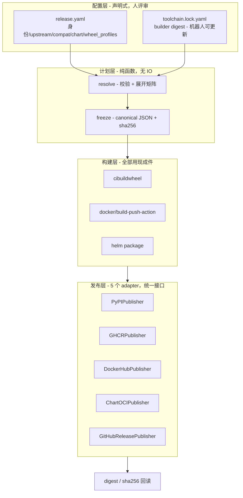
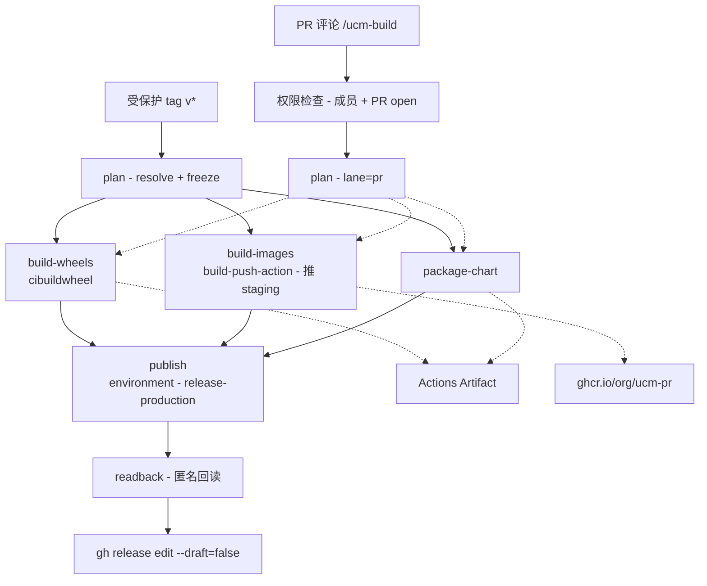

# UCM 发布自动化：需求评审意见 + 现有实现审计 + 架构重构建议

> 评审对象：
> - 需求侧：`docs/ucm-release-automation-technical-review.md`、`docs/ucm-release-automation-detailed-design.md`
> - 实现侧：`feature/cicd` 分支上的 `.github/release/`（22.4k LOC 实现 + 25.4k LOC 测试）与 `.github/workflows/`（3.0k LOC）
>
> 所有结论均带 `file:line` 出处，由直接读代码得到。

---

## 0. 结论先行

**需求文档最需要改的三件事**

| # | 问题 | 一句话裁决 |
| --- | --- | --- |
| R1 | wheel 包模型：文档要求拆三个 dist，实现用 local version，**两条路都发不了 PyPI** | 按文档拆 dist，但必须补上文档没写的顶层包冲突方案 |
| R2 | PR bot 的安全模型只写了「成员批准」，没写 trigger 和可信边界 | 必须写死「不可信构建 job 无 secret → artifact → 可信发布 job」 |
| R3 | 「从失败处续跑」反复承诺，但**没有指定状态载体** | 必须显式选一个 ledger，否则这条需求不可实现 |

**现有实现最需要改的三件事**

| # | 问题 | 严重度 |
| --- | --- | --- |
| I1 | 整条流水线硬编码个人 fork `SuperMarioYL/...`（15 处 gate），**合到上游后会静默空跑** | blocker |
| I2 | `cli.py:460` 的 `main()` 是**单个 1567 行函数**；barrier job 全冗余；bash 里手搓 20 次文件系统 RPC | blocker |
| I3 | 测试:实现 > 1:1，其中 `test_workflows.py` 5503 行是 change-detector，锁死 YAML 结构 | major |

**推荐架构一句话**

保留「计划即契约」的思路，但把契约压缩成 **一个 frozen `ReleasePlan` + 5 个 publisher adapter**，其余全部交给 cibuildwheel / gh-action-pypi-publish / build-push-action / crane / helm 等现成件 —— 实现从 22.4k 降到 ≤3.5k LOC。

---

## 第一部分 需求评审：不合理之处

### R1 [blocker] wheel 包模型：文档与实现方向相反，且两边都上不了 PyPI

**文档说什么**（技术评审 4.8.2，行 293-301）

> 「公开版本也不使用 `+cuda`、`+cann` 这类本地版本后缀区分后端」
> 「CUDA 发布为 `uc-manager-cuda`；CANN A2 发布为 `uc-manager-cann-a2`；CANN A3 发布为 `uc-manager-cann-a3`」

**代码是什么**

| 位置 | 内容 |
| --- | --- |
| `setup.py:542` | `name="uc-manager"` —— 单一 dist 名 |
| `release.yaml:700` | `wheel_version: 0.5.0rc1+cuda130` |
| `release.yaml:788` | `wheel_version: 0.5.0rc1+cann900.a2` |
| `release.yaml:876` | `wheel_version: 0.5.0rc1+cann900.a3` |

实现走的**恰好是文档明确否决的那条路**。

**后果（两条路各自的死法）**

1. **实现这条路物理上发不了 PyPI。** `+cuda130` 是 PEP 440 的 local version identifier，PyPI/warehouse 直接拒绝上传带 local version 的发行版。也就是说当前 wheel 版本方案连第一步都过不去。
2. **文档这条路有一个没写的坑。** 三个 dist 共用顶层包名 `ucm`，pip 对「不同 dist 提供同名顶层包」**没有冲突检测**，后装的会静默覆盖先装的文件。文档自己也意识到了，所以要求「增加混装检查……发现多个 UCM 后端发行包时应直接报错」—— 但那是运行期补丁，装的时候已经坏了。

**裁决：以文档为准，实现必须改；同时补三点文档缺失**

- 参照 `cupy-cuda12x` / `onnxruntime-gpu` 的做法是对的（不同 dist 名、相同 import 名），文档路线是业界主流。
- 但必须补：
  - `uc-manager` 这个已存在的名字怎么处置？（建议：作为 meta-package 占位，`install_requires` 为空，长期只做名字保护 + 文档跳板，**不要**让它 pull 任何后端）
  - 三个 dist 的 `Provides-Dist` / `Conflicts-Dist` 元数据要不要写？（写了 pip 也不强制，但对 uv/poetry 有意义）
  - 混装检查放在哪：建议放在 `ucm/__init__.py` 的 import 期，用 `importlib.metadata.distributions()` 扫描，发现 ≥2 个后端 dist 立即 `raise ImportError` 并给出卸载命令。

---

### R2 [blocker] PR bot 的安全模型没有定义到可实现的程度

**文档说什么**（4.8.6 / 4.8.7）：「默认只接受项目成员或具有写权限的协作者，外部贡献者需要成员批准后执行」「来自 fork 的代码在成员批准前不能接触任何写入凭据」。

**为什么不够**：这是整套设计里**唯一能造成凭据泄露的地方**，却是描述最粗的一节。文档没有指定 trigger，而 GitHub 上能做到「读评论 → 构建 fork 代码 → 推 GHCR」的组合只有两种，各自都有致命默认行为：

| trigger | 行为 | 危险 |
| --- | --- | --- |
| `issue_comment` | 在**默认分支**的 workflow 定义上运行，带写权限 token | 一旦在同一 job 里 checkout PR head，等于给 fork 代码发写权限 token |
| `pull_request_target` | 同样在基分支定义上运行，带 secret | 同上，且这是历史上最经典的 Actions 逃逸路径 |

「成员批准」只解决了**谁能触发**，没有解决**代码在哪个信任级别里执行**。一个成员误批一个恶意 fork PR，凭据就出去了。

**裁决：文档必须把可信边界写死为一条硬规则**

```
不可信构建 job：
  - permissions: contents: read（无任何 write，无 environment，无 secret）
  - checkout PR head SHA
  - 产出 → actions/upload-artifact
可信发布 job：
  - needs: 上面那个 job
  - 有 packages: write / environment
  - 【绝不 checkout PR 代码】，只 download-artifact
  - 发布前对 artifact 做形态校验（是 wheel/OCI tar，不是脚本）
```

以及：`GITHUB_TOKEN` 对 fork PR 天然是只读的，真正的风险是 `pull_request_target` + 显式 checkout。文档应当直接点名禁止这个组合。

---

### R3 [major] 「从失败处续跑」没有状态载体，当前不可实现

文档在 2.1、4.8.5、4.9 三处承诺「保留 Release 草稿，修复失败渠道后续跑，不重新生成已确认的产物」，但**从未说明续跑时那些「已确认的产物」存在哪里**。

GitHub Actions 的现实约束：

- `re-run failed jobs` 只重跑失败 job，上游成功 job 的**输出会保留**，但其 artifact 受保留期约束；
- 当前实现的保留期是混乱的：`3` / `1` / `90` 天三种混用共 16 处（见 I10），而 `.github/release/README.md:107` 又说「Artifacts have the workflow's three-day retention」；
- 跨 **run** 续跑（比如三天后修好了 Docker Hub 凭据再发）在 Actions 里没有原生机制。

**裁决：必须在文档里显式选一个 ledger，三选一**

| 方案 | 载体 | 优点 | 缺点 |
| --- | --- | --- | --- |
| A（推荐） | **各渠道的 `exists` 查询作幂等键** | 无状态，天然抗过期；PyPI 查文件名+sha256、GHCR/DockerHub/OCI Chart 查 digest | 需要每个 adapter 实现 `exists()` |
| B | Release draft body 里嵌一段 JSON ledger | 跟着 Release 走，人可读 | body 有长度上限，且是公开可见的 |
| C | 一个 90 天保留的 `release-ledger` artifact | 简单 | 跨 run 要手动指定 run id，90 天后失效 |

建议 **A 为主、B 为辅**：幂等性由渠道自身承载（发布前先 `exists()`，已存在且 digest 一致就跳过、不一致就停），draft body 只作为人类可读的进度展示。这样「续跑」退化成「重跑整个发布 job，天然跳过已完成的」，不需要任何持久状态。

---

### R4 [major] 版本映射不可逆，镜像 tag 信息不足

**版本映射**（4.8.1 表格）：`1.2.0rc1` → chart `1.2.0-rc.1`。这个映射对 rc 成立，但文档没定义其余 PEP 440 形态：

| PEP 440 | 文档定义? | SemVer 该是什么 |
| --- | --- | --- |
| `1.2.0rc1` | ✅ | `1.2.0-rc.1` |
| `1.2.0b2` | ❌ | ? |
| `1.2.0.post1` | ❌ | SemVer 无对应概念 |
| `1.2.0.dev123+gabcdef0` | 文档用作 PR wheel 版本 | 含 local version，且 `.dev` 排序低于 `1.2.0rc1` |

顺带：文档 4.8.1 把 `1.2.0.dev123+gabcdef0` 定为 PR 临时 wheel 版本 —— 它带 local version，作为 Actions Artifact 无所谓，但如果有人想 `pip install` 它，排序上会低于任何正式版，这个语义要写清楚（这其实是对的，只是没说）。

**镜像 tag**：`ucm-1.2.0rc1-<upstream>-<backend>` 不含 CPU 架构（多架构索引可以吸收，OK）也**不含 Python ABI**。当前只有 cp312 所以不显；一旦支持 cp311/cp313，同一 tag 会指向不同 ABI 的镜像。建议现在就把 ABI 放进 tag 或明确写「镜像永远只带一个 ABI，由 release.yaml 单点决定」。

---

### R5 [major] 「现状」描述与仓库事实不符，且防御性表述过量

文档在 **7 处**强调「这不是现有能力」：题头注、1.1、1.4、2.3、3.4、4.5、6。原文如：

> 「当前代码库尚未提交正式的产品发布流水线；工作区中的未提交实现属于个人原型」

但 `feature/cicd` 相对 `develop` 已经 **committed** 了：

```
106 files changed, 52032 insertions(+), 51 deletions(-)
```

`git log` 上有 15+ 个 `feat(release)/fix(release)` 提交。README 里还引用了真实的 hosted run（`31329098205`）和它的 sha256。

**问题不在于"该不该谨慎"，而在于对读者的效果**：一个评审者读到「没有流水线」，然后 checkout 分支看到 4.9 万行流水线代码，会开始怀疑文档其余部分的准确性。防御性表述重复 7 次，也挤占了本该用来写清 R2/R3 那种真正模糊之处的篇幅。

**建议**：把「现状」一节改写为事实陈述 —— 「`feature/cicd` 上已有 X（GHCR 发布、wheel/镜像构建、Chart 打包），距离目标缺 Y（PyPI、Docker Hub、Chart OCI push、PR bot）」，并在 2.3 保留**一句**「本文评审的是目标体系，分支上的实现未经上游评审，不作为既成事实」。一次足够。

---

### R6 [major] 方案对比是稻草人，且漏掉了真正的备选

三个候选里，方案一（一个大 workflow）和方案三（完全独立）都不是任何人会认真提的方案，方案二胜出是预设的。真正该比的是：

**漏掉的备选 1：方案二其实不是"架构选择"，是 GitHub 的标准用法。** 「协调器 + reusable workflow」就是 `workflow_call` 的教科书形态。把它写成一个需要论证的架构决策，抬高了它的份量，也掩盖了真正的设计问题（矩阵从哪来、计划怎么冻结、可信边界画哪）。

**漏掉的备选 2：现成 release 工具链。** 尤其是 **cibuildwheel** —— 它就是为「多 Python × 多 CPU 架构 × manylinux」设计的，UCM 的 wheel 线几乎是它的教科书用例（`_build-wheel.yml` 328 行 + `wheel.py` 2454 行里有相当比例是它已经解决的问题）。文档完全没提。同类还有：

| 环节 | 现成件 | 现在的自研量 |
| --- | --- | --- |
| 多架构 wheel 构建 | `cibuildwheel` | `_build-wheel.yml` 328 行 + 部分 `wheel.py` |
| PyPI 发布 | `pypa/gh-action-pypi-publish` + trusted publishing | 0（未实现） |
| 镜像构建/推送 | `docker/build-push-action` | `_build-image.yml` 510 行 |
| 多架构索引 | `docker buildx imagetools create` | 已在用 ✅ |
| 跨 registry 同步 | `crane copy`（保 digest） | 已在用 ✅ |
| provenance | `actions/attest-build-provenance` | 0（被 2.3 推迟） |

**建议**：3.1 增加「方案零：最大化复用生态现成件，自研只保留矩阵展开 + 计划冻结 + 结果汇总」，并说明为什么它不够（如果确实不够）。这会让最终选择有说服力得多。

---

### R7 [major] 推迟 SBOM/attestation 的理由已经不成立

2.3 把「代码签名、SBOM、供应链证明」列为「主流程稳定后补充」。但：

- `actions/attest-build-provenance` 是 **5 行 YAML**，产出的 attestation 直接进 GitHub 的 attestation store；
- PyPI trusted publishing 本身走 OIDC，**签名不是可分离的后续项** —— 你配 trusted publishing 的同时就已经在做身份证明了；
- 对一个要给外部用户发镜像的项目，`cosign` 签名的边际成本也是个位数行。

**建议**：把 provenance attestation 从 2.3「不包含」移到阶段 1/2 的完成标准里。SBOM（syft/grype）可以继续推迟，那个确实有维护成本。

---

### R8 [major] 缺失的需求

| 缺失项 | 说明 |
| --- | --- |
| nightly / dev 通道 | 只设计了正式 tag 和 PR 临时。develop 上的持续可用产物从哪来？ |
| release notes 来源 | 文档说 Release 要有 notes，但没说是手写、conventional commits 生成、还是 GitHub 自动生成 |
| 硬件门禁未接线 | `.github/workflows/hardware-e2e.yml` 已存在（225 行）但**没有被任何发布流程 needs**，文档 2.3 说「真机验证可以作为质量门槛」却没设计怎么接 |
| 撤回 / yank | 发出去的坏版本怎么办？PyPI 支持 yank，镜像 tag 怎么办（不能删，只能出新版本 + Release 标注） |
| 国内镜像 | `release.yaml:95` 已经在用 `repo.huaweicloud.com` 的 pypi 镜像，说明有国内分发需求，两篇文档都没提 |
| version.ini vs tag 谁是 source of truth | 代码里 `core.py:2204` 已经做了交叉校验，文档没定义规则 |

---

### R9 [minor] 可以砍掉的范围

- 4.8.6 的 `/ucm-build status` 和 `/ucm-build cancel` 是首版不需要的：status 用 GitHub 自带的 check run 链接就够，cancel 用 Actions UI。两个命令各自要维护任务索引，成本不低。
- 4.8.5 的「重跑发现版本已存在，内容一致则复用」中的「内容一致」判定，对 wheel 要求字节可复现。这个前提当前**是成立的**（README 记录了两次 attempt 字节一致），但它依赖锁死的 builder digest；一旦上游 builder 镜像被 GC，这条规则会静默退化成「永远停止」。建议把规则改成 **digest 一致则复用，不一致则停止并要求人工判断**，不要求字节可复现。

---

## 第二部分 现有实现审计

### 2.1 架构

#### I1 [blocker] 整条流水线硬编码个人 fork，合到上游后静默空跑

| 位置 | 内容 |
| --- | --- |
| workflows 中 15 处 | `github.repository == 'SuperMarioYL/unified-cache-management'`（`_build-image.yml` ×5、`release-ucm.yml` ×5、`release-vllm-images-protected.yml` ×2、`_build-wheel.yml`、`_publish-image-member.yml`、`hardware-e2e.yml` 各 ×1） |
| `release.yaml:6` | `repository: SuperMarioYL/unified-cache-management` |
| `release.yaml:7` | `staging_repository: ghcr.io/supermarioyl/ucm-release-staging` |
| `release.yaml:385,398` | `target_repository: ghcr.io/supermarioyl/vllm-openai` / `.../vllm-ascend` |
| `chart.py:46` | `"remote": "https://github.com/SuperMarioYL/uc-stack.git"` |
| `registry.py:266` | `FIXTURE_STAGING_REPOSITORY = "ghcr.io/supermarioyl/ucm-release-staging"` |

而 `git remote` 显示 upstream 是 **`ModelEngine-Group/unified-cache-management`**。

**后果**：这些 gate 全部写在 job 的 `if:` 里。合并到上游后，`github.repository` 变成 `ModelEngine-Group/...`，所有 protected 发布 job 的 `if:` 求值为 false → **job 被 skip，workflow 整体报 success**。流水线不会报错，它会安静地什么都不做。这直接否定了技术评审 1.1 的核心目标「可供项目共同维护的产品发布流水线」。

**修法**：所有 owner/namespace 从 `release.yaml` 的 `source` 段单点读取，workflow 里的 gate 改成 `github.repository == <从 plan 输出的 repository>`（`release-ucm.yml:450` 已经有这个模式的雏形：`test "${release_repository}" = "${GITHUB_REPOSITORY}"`，把它推广到全部 15 处即可）。

#### I2 [blocker] `cli.py:460` 的 `main()` 是单个 1567 行函数

| 函数 | 行数 | 位置 |
| --- | --- | --- |
| `main` | **1567** | `cli.py:460` |
| `build_parser` | 355 | `cli.py:102` |
| `validate_resolved_plan` | 477 | `registry.py:2155` |
| `run_loopback_registry_contract` | 375 | `registry.py:6056` |
| `github_release_publication_evidence` | 351 | `verify.py:2091` |
| `expand_release_plan` | 313 | `core.py:1801` |

`cli.py` 全文 2031 行，其中 **1922 行在这两个函数里**。`main()` 的结构是一条超长 `elif (args.group, args.action) == ("wheel", "fixture-build"):` 链（如 `cli.py:681`、`:695`）。

全包 381 个实现函数中，**68 个 >100 行，17 个 >200 行**。

**修法**：argparse 的 `set_defaults(func=...)` 即可把 1567 行拆成每个子命令一个 handler；分组 handler 下沉到各自模块。这是纯机械重构。

#### I3 [major] barrier job 完全冗余，每个白烧一次 runner

`release-ucm.yml:290` 的 `feature-barrier` 整个 job body：

```yaml
run: |
  set -euo pipefail
  test "${WHEELS}" = success
  test "${CHART}" = success
  test "${IMAGES}" = success
```

而紧接着的 `aggregate-evidence`（`:308`）在自己的 `if:` 里**又把同样三个条件重查了一遍**：

```yaml
needs.build-wheels.result == 'success' &&
needs.package-chart.result == 'success' &&
needs.reconcile-images-feature.result == 'success' &&
needs.feature-barrier.result == 'success'
```

`needs: [A, B, C]` 在不加 `always()`/`!cancelled()` 时**本身就是**「三者全部 success 才运行」。barrier 提供的信息量为零。

同样的模式出现在 `release-vllm-images-protected.yml:319` 的 `index-barrier`、`:52` 的 `member-barrier`、`release-vllm-images.yml:48` 的 `feature-barrier`。

**代价**：每个 barrier 一次完整 runner 排队 + 启动（约 10–30s），一次 protected tag 至少烧掉 4 次。

**修法**：删掉全部 barrier job，把下游的 `if:` 简化为默认 `needs` 语义。只有一种情况需要保留显式检查 —— 当下游确实需要 `always()` 来处理部分失败时；当前四处都不是。

#### I4 [major] bash 里手搓文件系统 RPC

`release-ucm.yml:403-506` 的 `prepare-release-draft` 一个 job 内约 **20 次**这个循环：

```
python -c '...json.dump(request, open("out/xxx-request.json","w"))...'
python -m ucm_release release <verb> --input out/xxx-request.json --output out/yyy.json
python -c '...json.load(open("out/yyy.json"))...拆出下一步的入参...'
```

`:458-465` 连续三次：`plan-state` → `select-pages` → `plan-state`。单行 `python -c` 最长的一条超过 400 字符（`:463` 那条一次写 4 个文件）。

**问题**：

1. 这些 `python -c` 是**没有任何测试覆盖**的逻辑，也不过 `ruff`/`black`（它们只检查 `.py` 文件）；
2. 每次调用是一次完整的 Python 解释器启动 + `import yaml` + 载入 952 行 catalog；
3. 出错时 bash 的报错定位极差。

**修法**：把整个 draft 编排收成 **一个** CLI 命令 `python -m ucm_release release prepare-draft --plan ... --output-dir ...`，内部是普通 Python 函数调用。job 里只剩一行。

#### I5 [major] feature lane 构建完镜像立刻删掉，评审者拿不到可用产物

`_build-image.yml:411-412`：

```yaml
test ! -e out/image.oci.tar
rm -f out/image.oci.tar
```

上传的只有 compact evidence（index / manifest / config / descriptor 闭包 / 日志，**不含 layer blob**，见 README:85-88）。

这是个合理的成本权衡（完整 OCI archive 是 GB 级，Actions artifact 存不起），但后果要说清楚：**feature lane 产出的不是镜像，是关于镜像的 JSON**。技术评审 2.1 的「PR 临时交付 = GHCR 的 PR 专用标签」这个目标，在当前实现里是结构性落空的 —— 评审者无法 `docker pull` 任何东西。

**修法**：feature lane 直接 `--push` 到一个 GHCR 的 PR 专用 repo（`ghcr.io/<org>/ucm-pr/<image>:pr-<n>-<sha>`），配保留策略。推到 registry 比塞进 artifact 便宜得多，也正好满足需求。

#### I6 [major] import 有环 + 测试脚手架长在产品包里

```
registry.py ↔ verify.py     （registry 中 8 处函数内 from . import verify）
registry.py ↔ image.py      （函数内 from . import image）
```

函数内 import 是绕开循环依赖的典型症状。

更严重的是 **`verify.py` 的定位**：4846 行，docstring 自称 `"""Deterministic, fixture-only evidence for the registry reconciliation loop."""`，却是 `cli.py:13` 的正式依赖，并且在 `verify.py:18` 从 `core` 导入**私有**符号 `_build_fixture_release_manifest`。

CLI 还对外暴露三组 fixture 命令：`wheel fixture-build`（`cli.py:268`）、`registry fixture-scan`（`:284`）、`fixture-reconcile` 命令组（`:336`）。

**判断**：这是测试脚手架被当成产品功能发布了。fixture 相关代码应当整体移到 `tests/`，产品包里不留 `fixture` 字样。

#### I7 [major] 版本字符串在 release.yaml 里手抄 8 次，其中 5 处无校验

| 行 | 字段 | 有交叉校验? |
| --- | --- | --- |
| `:3` | `ucm_version: 0.5.0rc1` | ✅ `core.py:2204` 对 `version.ini` |
| `:9` | `release_tag: v0.5.0rc1` | ✅ `core.py:2208` |
| `:670` | `chart.app_version: 0.5.0rc1` | ✅ `core.py:2210` |
| `:386` | `target_tag_suffix: -ucm-0.5.0rc1-r1` | ❌ **无** |
| `:399` | `target_tag_suffix: -ucm-0.5.0rc1-r1` | ❌ **无** |
| `:700` | `wheel_version: 0.5.0rc1+cuda130` | ❌ 只校验了是合法 PEP 440（`core.py:1058`） |
| `:788` | `wheel_version: 0.5.0rc1+cann900.a2` | ❌ 同上 |
| `:876` | `wheel_version: 0.5.0rc1+cann900.a3` | ❌ 同上 |

加上 `version.ini` 共 9 处。`registry.py:1904` 显示 `target_tag_suffix` 是直接字符串拼接：`selected["tag"] + target_tag_suffix`，没有任何版本一致性检查。

**后果**：升到 0.6.0 时漏改 `target_tag_suffix`，会静默产出带旧版本号的镜像 tag，且流水线全绿。

**修法**：`ucm_version` 单点定义（就用 `version.ini`），其余 8 处全部**派生**，不允许在 YAML 里手写。

#### I8 [major] protected tag 被强制等于 develop HEAD

`release-ucm.yml:472-475`：

```bash
git diff --quiet HEAD:.github/workflows origin/develop:.github/workflows
git diff --quiet HEAD:.github/release  origin/develop:.github/release
test "$(git rev-parse HEAD)" = "$(git rev-parse refs/remotes/origin/develop)"
```

第三行要求 **tag 指向的 commit 必须严格等于 `origin/develop` 的当前 tip**。

**后果**：
- develop 在打 tag 到 workflow 实际运行之间前进一个 commit，发布就失败；
- 无法从 release 分支发 patch 版本；
- 无法重发历史 tag。

前两行（要求 `.github/workflows` 和 `.github/release` 与 develop 一致）作为供应链保护是**合理且聪明的**，应该保留。第三行过度了。

这个约束在两篇文档里都没有描述。

### 2.2 契约与配置

#### I9 [major] `release.yaml` 把四个不相关的关注点塞进一个 952 行文件

| 行范围 | 段 | 行数 | 真的属于「发布契约」吗 |
| --- | --- | --- | --- |
| `24-380` | `docker_recipes` | **356（37%）** | ❌ 是仓库里手写 Dockerfile 的清单，供 PR 冒烟 + 生成 `docs/source/getting-started/docker-recipes.generated.md` |
| `437-599` | `runtime_patch_rules` | 163 | ❌ 是 vLLM 版本适配补丁规则，属于产品能力 |
| `607-665` | `python_runtime_dependencies` + `python_build_lock` | 59 | ❌ 是构建工具链 lockfile |
| `381-436` | `upstream_products` + `compatibility` | 56 | ✅ |
| `666-952` | `chart` + `wheel_profiles` | 287 | ✅ |
| `1-23` | 身份 / lanes / runner_map / pr_smoke | 23 | ✅ |

真正的发布契约只占约 366 行，其余 586 行是被"顺手"塞进来的。`docker_recipes` 由 `core.py:1325 validate_repository_recipe_inventory` 消费，服务于 `pull-request.yml:102 repository-recipe-plan` / `:132 repository-docker-smoke` —— **和发布矩阵没有任何关系**。

**修法（四个文件）**：

```
.github/release/release.yaml        # 发布契约：身份/lanes/upstream/compat/chart/wheel_profiles
.github/release/toolchain.lock.yaml # builder digest / 构建依赖锁（可由机器人更新）
.github/docker-recipes.yaml         # 仓库 Dockerfile 清单（PR 冒烟 + 文档生成）
ucm/integration/runtime-patches.yaml# 运行时补丁规则（跟产品代码一起演进）
```

每个文件的评审规则也不同：发布契约要 release owner 评审，toolchain lock 可以让 dependabot/renovate 自动提 PR。

#### I10 [minor] retention 策略不一致

16 处 `retention-days`，取值 `1` / `3` / `90` 混用，而 `README.md:107` 说「Artifacts have the workflow's three-day retention」。`_build-image.yml:484` 和 `_build-wheel.yml:328` 用了一个三元表达式在 fork 判断里切换 90/3。没有任何地方说明为什么是 90。

### 2.3 测试

#### I11 [major] `test_workflows.py` 5503 行是 change-detector，会锁死重构

测试:实现 = **25.4k : 22.4k**，超过 1:1。最大的两个测试函数分别 **588 行**（`test_workflows.py:4915`）和 **437 行**（`:4288`）。

`test_workflows.py` 的主体模式是：

```python
entry = _load_workflow(WORKFLOW_DIR / "release-ucm.yml")   # :984, :1058, :1253, :1685, :1948, :2075 ...
entry_text = (WORKFLOW_DIR / "release-ucm.yml").read_text() # :2037, :2078, :2218
```

—— 解析 workflow YAML（有时直接读原文），然后断言 job 名、step 顺序、input 集合、artifact 名。例如 `:938` 断言「`release-ucm.yml` must define a build-wheels candidate job」。

**这类断言测的是「文件里写了我们写进去的东西」**，不测行为。它的实际效果是：任何 YAML 重构（比如删掉 I3 说的冗余 barrier）都必须同步改数百行测试。

**有价值的部分要留**：`test_fork_isolation_rejects_reusable_workflow_publish_mutations`（`:1604`）、`test_reusable_build_contract_gate_runs_before_checkout_or_untrusted_code`（`:1881`）—— 这两类是**安全不变量**测试，测的是「不可信代码不能碰凭据」，值得保留并加强。

**该删的**：job 名/step 顺序/input 集合的结构断言。用 `actionlint`（已配置）+ 少量安全不变量测试替代。

#### I12 [major] 测试没有覆盖真正会失败的地方

release pipeline 的真实故障模式是：registry 认证失败、429 限流、部分推送、digest 不一致、PyPI 409 重复版本、arm64 构建失败、artifact 过期。当前测试的重心在 fixture 化的确定性证据（`verify.py` 整体 4846 行 + `test_registry_reconcile.py` 7399 行）。

`registry.py:6056` 有一个 375 行的 `run_loopback_registry_contract`（起本地 `registry:2.8.3` 做回环测试）—— **这个方向是对的**，应该扩大它、缩小 fixture 那部分。

---

## 第三部分 目标架构

### 3.1 主张

保留「计划即契约」，但把契约从 22.4k 行的自研机制压缩成：

> **一个 frozen `ReleasePlan`（typed + canonical JSON + sha256）+ 5 个薄 publisher adapter + 一个纯函数 planner**，其余全部交给生态现成件。

之所以不是"纯减法"：UCM 的真实难点确实是 `3 后端 × 2 架构 × N upstream` 在 5 个渠道上的一致性，这需要一个显式的计划对象。但那个对象应该是 **一个数据结构**，不是一套证据机制。

### 3.2 分层



### 3.3 计划数据模型

```python
# ucm_release/plan.py  —— 约 250 行
@dataclass(frozen=True)
class WheelTask:
    spec_id: str            # cuda130-amd64
    dist_name: str          # uc-manager-cuda      <- R1 的裁决落在这里
    version: str            # 1.2.0rc1             <- 不含 local version
    python_abi: str         # cp312
    cpu_arch: str           # amd64
    wheel_platform: str     # manylinux_2_28
    builder_digest: str     # 来自 toolchain.lock
    required_native: tuple[str, ...]
    forbidden_native: tuple[str, ...]

@dataclass(frozen=True)
class ImageMember:
    family_id: str          # vllm-ascend-a2
    upstream_ref: str       # quay.io/ascend/vllm-ascend@sha256:...
    wheel_spec_id: str      # 引用 WheelTask
    cpu_arch: str

@dataclass(frozen=True)
class ImageFamily:
    family_id: str
    target_tag: str         # ucm-1.2.0rc1-vllm-ascend-0.22.1rc1-a2
    members: tuple[ImageMember, ...]

@dataclass(frozen=True)
class ReleasePlan:
    schema_version: int
    lane: Literal["pr", "tag"]
    source_sha: str
    ucm_version: str        # 唯一版本真相，其余全部派生  <- I7 的修法
    chart_version: str      # 由 ucm_version 派生
    repository: str         # 从配置读，不硬编码        <- I1 的修法
    wheels: tuple[WheelTask, ...]
    families: tuple[ImageFamily, ...]
    chart: ChartTask
    targets: tuple[PublishTarget, ...]

    def freeze(self) -> tuple[bytes, str]:
        """canonical JSON + sha256；下游每个 job 用 sha256 校验自己拿到的是同一份。"""
```

### 3.4 Publisher adapter 接口

```python
class Publisher(Protocol):
    def exists(self, item) -> ExistState:     # absent | present_same | present_different
    def publish(self, item) -> PublishRecord
    def readback(self, record) -> ReadbackRecord
```

`exists()` 就是 R3 裁决里的幂等键 —— **发布前先查，present_same 跳过，present_different 立即停**。不需要任何外部状态存储。

| Adapter | 底层 | 幂等键 | 预估行数 |
| --- | --- | --- | --- |
| `PyPIPublisher` | `gh-action-pypi-publish`（trusted publishing）+ `pip download` 回读 | 文件名 + sha256 | ~180 |
| `GHCRPublisher` | `crane copy` / `buildx imagetools` | manifest digest | ~250 |
| `DockerHubPublisher` | `crane copy`（从 GHCR 同步，**保 digest**） | manifest digest | ~200 |
| `ChartOCIPublisher` | `helm push oci://` | chart digest | ~150 |
| `GitHubReleasePublisher` | `gh release create/upload/edit` | asset name + sha256 | ~300 |

Docker Hub 用 `crane copy` 从 GHCR 同步（而不是二次 push）是关键：它保留 digest，天然满足文档 4.8.3 的「从同一构建结果同步」。

### 3.5 目标目录与行数预算

```
.github/release/
├── release.yaml              ~370   (从 952 拆出)
├── toolchain.lock.yaml       ~120
├── ucm_release/
│   ├── catalog.py            ~400   配置载入 + 校验
│   ├── plan.py               ~250   数据模型 + freeze
│   ├── planner.py            ~450   矩阵展开（纯函数）
│   ├── publishers/           ~1080  5 个 adapter
│   ├── verify_artifact.py    ~400   wheel ELF 检查 / OCI identity（UCM 特有，保留）
│   └── cli.py                ~250   薄分发（set_defaults(func=)）
└── tests/                    ~2500
```

**实现 ≈ 2.9k（现 22.4k，↓87%）；测试 ≈ 2.5k（现 25.4k，↓90%）。**

配套：
```
.github/docker-recipes.yaml            # 从 release.yaml 拆出
ucm/integration/runtime-patches.yaml   # 从 release.yaml 拆出
```

### 3.6 目标 workflow 编排



**可信边界（R2 的落地）**：

| Job | permissions | environment | checkout PR 代码 |
| --- | --- | --- | --- |
| `plan` / `build-*` | `contents: read` | 无 | ✅ 允许 |
| `publish` | `packages/contents: write`, `id-token: write` | `release-production` | ❌ **禁止**，只 download-artifact |

对比现状：删掉全部 4 个 barrier job；`publish` 从当前散落在 `prepare-release-draft` / `publish-indexes` / `authenticated-readback` 三处的 ~20 次 RPC 收成三个 CLI 调用。

### 3.7 用现成件替换的自研代码

| 删除 | 行数 | 替代 |
| --- | --- | --- |
| `verify.py` 全部 | 4846 | 各 adapter 的 `readback()` |
| `registry.py` 的 fixture / loopback 部分 | ~2500 | 保留 `run_loopback_registry_contract` 思路，缩到 ~200 行集成测试 |
| `image.py` 的 compact-OCI 证据机制 | ~1800 | `crane digest` + attestation |
| `wheel.py` 的构建编排部分 | ~800 | `cibuildwheel` |
| 全部 barrier job | 4 job | `needs:` 默认语义 |
| workflow 里的 `python -c` 内联 RPC | ~200 行 bash | 3 个 CLI 命令 |
| `test_workflows.py` 的结构断言 | ~4500 | `actionlint` + ~300 行安全不变量测试 |

**保留（UCM 特有，现成件不管）**：`required_native` / `forbidden_native` / `allowed_dt_needed` 的 ELF 检查（CANN 的 `libascend_hal.so` 作为 `kind=external-required` 的处理是对的），以及 `compatibility` 的矩阵过滤规则。

---

## 第四部分 迁移路线

按可独立评审、可独立合并的 PR 切分。**与文档 4.8.8 五阶段的关系：阶段 0 要拆成 0a/0b，阶段 1-3 顺序不变但每个都要先解决 P0/P1 的阻塞项，阶段 5 提前到阶段 2 之后**（因为 PR bot 复用镜像线，而镜像线是最先能跑通的）。

| PR | 内容 | 验收标准 | 风险 |
| --- | --- | --- | --- |
| **P0** | 去掉 15 处硬编码 fork gate，owner/namespace 全部从 `release.yaml.source` 派生 | 在 fork 和上游两个仓库跑同一个 tag，job 选择行为一致 | 低，纯机械 |
| **P1** | `ucm_version` 单点化：8 处手抄改为派生 + 一致性校验 | 改 `version.ini` 一处，`catalog validate` 通过，8 处派生值全部更新 | 低 |
| **P2** | 删除 4 个 barrier job，简化下游 `if:` | 制造一次 wheel 失败，确认 `aggregate`/`publish` 正确 skip | 中，需要跑真实失败用例 |
| **P3** | 引入 `ReleasePlan` 数据模型 + `freeze()`，`plan` job 输出 frozen plan | plan sha256 在所有下游 job 校验通过 | 中 |
| **P4** | `cli.py` 的 `main()` 拆成 per-command handler | 全部 CLI 命令行为不变 | 低，机械 |
| **P5** | 配置四拆（release / toolchain.lock / docker-recipes / runtime-patches） | 各文件独立 schema 校验；PR 冒烟仍工作 | 中 |
| **P6** | **wheel 包模型改造**：`uc-manager-{cuda,cann-a2,cann-a3}`，去掉 local version，加混装检查 | TestPyPI 上三个 dist 各自可装，混装报错 | **高，需求变更** |
| **P7** | `PyPIPublisher` + trusted publishing + TestPyPI 联调 | 从 TestPyPI 装回的 wheel 与构建产物 sha256 一致 | 中，需 PyPI 项目权限（**提前申请**） |
| **P8** | `ChartOCIPublisher`（`helm push oci://`） | `helm pull` 回来能 lint + template | 低 |
| **P9** | `DockerHubPublisher`（`crane copy` from GHCR，保 digest） | 两个 registry 的 digest 完全相同 | 中，需 Docker Hub org（**提前申请**） |
| **P10** | `GitHubReleasePublisher` + draft→publish，替换 `prepare-release-draft` 的 20 次 RPC | 一次 tag 得到完整 Release 页面 | 中 |
| **P11** | PR bot：`issue_comment` → 不可信构建 job → 可信发布 job | fork PR 的构建 job 拿不到任何 secret（用一个故意打印 env 的测试 PR 验证） | **高，安全** |
| **P12** | 删除 `verify.py` / fixture 机制 / `test_workflows.py` 结构断言 | 前面 PR 全绿后执行；`actionlint` + 安全不变量测试保留 | 中 |
| **P13** | `attest-build-provenance` 接入 wheel + image | Release 页面能查到 attestation | 低 |

**关键前置**：P7 的 PyPI 项目和 P9 的 Docker Hub org 是**组织管理员的审批事项，有前置周期**，应当在 P0 开始时就并行申请 —— 文档 4.8.8 的五阶段表把它们隐含在阶段 1/2 里，实际会成为关键路径。

---

## 第五部分 明确不做 / 明确删除

**明确不做（首版）**

- `/ucm-build status` 和 `/ucm-build cancel`（用 GitHub 自带 check run + Actions UI 替代）
- `latest` / `stable` 移动标签（同意文档 2.3）
- SBOM（syft/grype）—— 但 **provenance attestation 要做**（见 R7）
- 自托管制品库（同意文档 2.3）
- 「wheel 字节可复现」作为发布前置（改为 digest 一致即可复用，见 R9）

**明确删除（现有代码）**

| 对象 | 行数 | 理由 |
| --- | --- | --- |
| `ucm_release/verify.py` | 4846 | fixture 证据机制，被 adapter 的 `readback()` 替代 |
| `registry.py` 的 fixture 部分 | ~2500 | 同上 |
| `image.py` 的 compact-OCI 证据 | ~1800 | 被 `crane digest` + attestation 替代 |
| 4 个 barrier job | — | `needs:` 本身就是这个语义（I3） |
| workflow 中的 `python -c` 内联 RPC | ~200 | 无测试、无 lint（I4） |
| `test_workflows.py` 的 YAML 结构断言 | ~4500 | change-detector（I11） |
| CLI 的 `fixture-*` 命令组 | — | 测试脚手架不应是产品接口（I6） |
| `release-ucm.yml:475` 的 `test HEAD = develop` | 1 | 过度约束（I8）；前两行的 workflow/release 目录一致性检查保留 |
| `chart.py:46` 硬编码 `uc-stack.git` | 1 | 应从配置读 |

---

## 附：本次未验证的部分

- 未运行 `pytest .github/release/tests`（会话中被中断），测试**是否通过**未经确认，本文对测试的判断基于代码阅读。
- 未验证 hosted run `31329098205` 的实际产物（README 引用的历史证据）。
- `detailed-design.md` 的第 4 章之后（300-612 行）未逐行核对。
