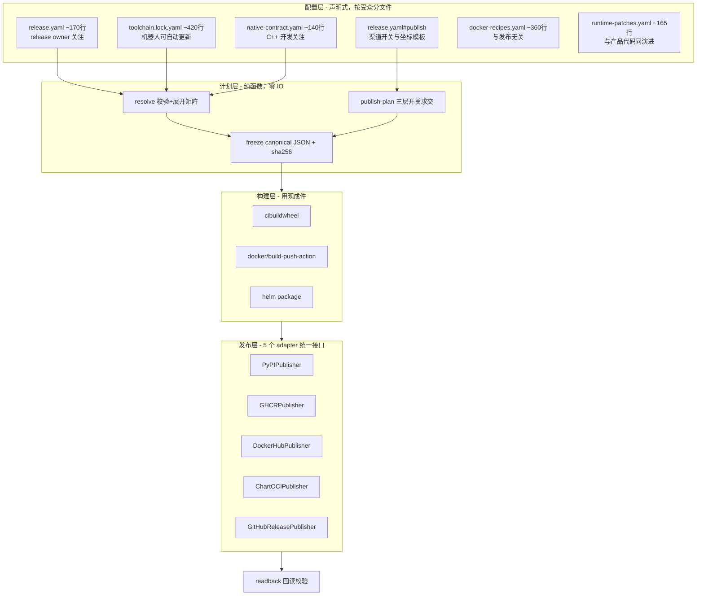
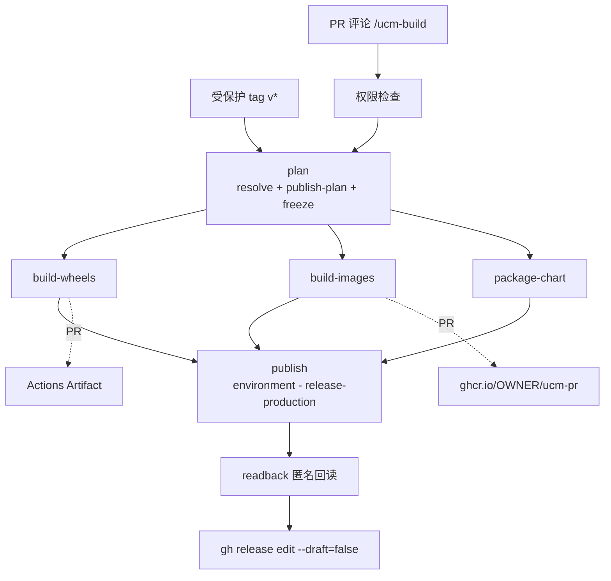
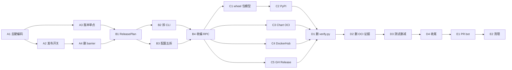

# UCM 发布流水线改造计划

> **文档性质**：可执行的改造施工图。每一项都给出「现状位置 → 目标形态 → 具体改法 → 验收标准」。
> **适用对象**：接手改造的开发会话（人或 agent）。使用方式见文末第 8 章。
> **基线**：`feature/cicd` 分支，`.github/release/` 22.4k LOC 实现 + 25.4k LOC 测试，`.github/workflows/` 3.0k LOC。
> **配套评审意见**：`docs/2026-08-16-ucm-release-automation-review-feedback.md`

---

## 1. 改造目标

| # | 目标 | 现状 | 目标态 | 量化 |
| --- | --- | --- | --- | --- |
| G1 | **去 fork 硬编码** | 15 处 `github.repository == 'SuperMarioYL/...'` + 4 处 `ghcr.io/supermarioyl/` | 0 处硬编码 owner；一律从 `github.repository_owner` 运行时派生 | 19 → 0 |
| G2 | **发布渠道可控** | 只有 GHCR，且开关写死在 `if:` 里 | 三层开关（配置 / 仓库变量 / 单次运行），默认全关 | 新增 |
| G3 | **release.yaml 瘦身** | 953 行，61% 与发布契约无关 | ~170 行，只留 release owner 需要关注的 | ↓82% |
| G4 | **测试删减** | 25412 行 / 459 个用例，测试:实现 > 1:1 | ~2500 行，只留行为测试 + 安全不变量 | ↓90% |
| G5 | **实现瘦身** | 22.4k LOC，`main()` 单函数 1567 行 | ~2.9k LOC，最大函数 <120 行 | ↓87% |
| G6 | **补齐缺失渠道** | 无 PyPI / 无 Docker Hub / 无 Chart OCI push | 5 个 publisher adapter 齐备 | 新增 |
| G7 | **删除冗余编排** | 4 个 barrier job；20 次 bash 内联 RPC | 0 barrier；3 个 CLI 调用 | — |

**不改变的**（明确保留）：
- `compatibility` 的矩阵过滤规则（`release.yaml:412-436`）—— 这是 UCM 的真实业务逻辑
- `required_native` / `forbidden_native` / `allowed_dt_needed` 的 ELF 契约 —— CANN 的 `libascend_hal.so` 作为 `kind=external-required` 的处理是正确的，现成工具不管这个
- `crane copy` / `buildx imagetools create` 的用法 —— 已经是正确的原语
- `release-ucm.yml:472-473` 对 `.github/workflows` 与 `.github/release` 和 develop 一致性的检查 —— 这是有效的供应链保护

---

## 2. 目标架构

### 2.1 分层



### 2.2 目标目录与行数预算

```
.github/release/
├── release.yaml                    ~170   发布契约（release owner 评审）
├── toolchain.lock.yaml             ~420   builder digest + 构建依赖锁（renovate 可自动 PR）
├── native-contract.yaml            ~140   required/forbidden/allowed_dt_needed（C++ owner 评审）
├── ucm_release/
│   ├── catalog.py                  ~400   配置载入 + 强校验
│   ├── plan.py                     ~250   ReleasePlan 数据模型 + freeze()
│   ├── planner.py                  ~450   矩阵展开（纯函数，无 IO）
│   ├── publish_plan.py             ~150   三层开关求交            【新增】
│   ├── publishers/
│   │   ├── base.py                 ~80    Publisher Protocol
│   │   ├── pypi.py                 ~180                          【新增】
│   │   ├── ghcr.py                 ~250
│   │   ├── dockerhub.py            ~200                          【新增】
│   │   ├── chart_oci.py            ~150                          【新增】
│   │   └── github_release.py       ~300
│   ├── artifact_verify.py          ~400   wheel ELF / OCI identity（UCM 特有，保留）
│   └── cli.py                      ~250   薄分发 set_defaults(func=)
└── tests/                          ~2500
.github/docker-recipes.yaml         ~360   （从 release.yaml 迁出）
ucm/integration/runtime-patches.yaml ~165  （从 release.yaml 迁出）
```

### 2.3 目标 workflow 编排



**可信边界（不可协商）**：

| Job | permissions | environment | checkout PR 代码 |
| --- | --- | --- | --- |
| `plan` / `build-*` | `contents: read` | 无 | ✅ 允许 |
| `publish` / `readback` | `packages: write` `contents: write` `id-token: write` | `release-production` | ❌ **禁止**，只 `download-artifact` |

---

## 3. 关键设计详解

### 3.1 【G1】去 fork 硬编码

#### 3.1.1 现状清单（19 处，全部要改）

| 文件:行 | 现状 | 改法 |
| --- | --- | --- |
| `release-ucm.yml:96` | bash `[[ "${REPOSITORY}" == SuperMarioYL/... ]]` | 删除该条件，只留 `REF`/`EVENT_NAME` 判断 |
| `release-ucm.yml:107` | 同上 | 同上 |
| `release-ucm.yml:274` | job `if:` 内 `github.repository == '...'` | 改用 `needs.plan.outputs.protected == 'true'` |
| `release-ucm.yml:409` | 同上 | 同上 |
| `release-ucm.yml:586` | 同上 | 同上 |
| `release-vllm-images-protected.yml:35` | 同上 | 改用 `inputs.lane == 'protected-tag'` |
| `release-vllm-images-protected.yml:157` | 同上 | 同上 |
| `_publish-image-member.yml:52` | 同上 | 改用 `inputs.lane == 'protected-tag'` |
| `_build-image.yml:374` | `if:` full-oci 保留 | 改用 `inputs.deliver_full_oci \|\| inputs.lane == 'protected-tag'` |
| `_build-image.yml:398` | bash `output_mode` 判定 | 改用 `inputs.lane` |
| `_build-image.yml:418` | `if:` | 同 374 |
| `_build-image.yml:499` | `if:` 上传 protected bridge | 同 374 |
| `_build-image.yml:484` | `retention-days:` 三元里的 repo 判断 | 改用 `inputs.lane == 'protected-tag' && 90 \|\| 3` |
| `_build-wheel.yml:328` | 同上 | 同上 |
| `hardware-e2e.yml:42` | `if:` | 改用 `github.repository == github.repository`（即删除该条件），靠 `workflow_dispatch` 本身的权限 |
| `release.yaml:6` | `repository: SuperMarioYL/...` | **删除该字段**，运行时用 `github.repository` |
| `release.yaml:7` | `staging_repository: ghcr.io/supermarioyl/...` | 改为模板 `ghcr.io/{owner}/ucm-release-staging` |
| `release.yaml:385` | `target_repository: ghcr.io/supermarioyl/vllm-openai` | 改为 `ghcr.io/{owner}/vllm-openai` |
| `release.yaml:398` | `target_repository: ghcr.io/supermarioyl/vllm-ascend` | 改为 `ghcr.io/{owner}/vllm-ascend` |
| `chart.py:46` | `"remote": "https://github.com/SuperMarioYL/uc-stack.git"` | 从 `release.yaml` 读，或改为可选字段 |
| `registry.py:266` | `FIXTURE_STAGING_REPOSITORY = "ghcr.io/supermarioyl/..."` | 随 fixture 机制一起删除（P12） |

#### 3.1.2 `{owner}` 模板的解析规则

`release.yaml` 里所有 registry 坐标一律写成模板，**只允许一个占位符**：

```yaml
# release.yaml
publish:
  ghcr:
    namespace: "ghcr.io/{owner}"
```

解析发生在 `catalog.py` 载入时，唯一输入来自环境：

```python
# catalog.py
def resolve_owner_templates(catalog: dict, *, repository: str) -> dict:
    """repository 形如 'ModelEngine-Group/unified-cache-management'。
    {owner} → repository.split('/')[0].lower()   （registry 路径必须小写）
    {repo}  → repository.split('/')[1].lower()
    未知占位符 → 立即 ValueError，不允许静默保留。
    """
```

CI 传入：`--repository "${{ github.repository }}"`。本地开发传入 `--repository` 或从 `git remote get-url origin` 推断。

**验收**：`grep -rn "supermarioyl\|SuperMarioYL" .github/ ucm/ | wc -l` 结果为 `0`。

#### 3.1.3 移除硬编码后，靠什么防止误发布？

原先 `repository == 'SuperMarioYL/...'` 承担的是「防止 fork 误发」。改造后由三个**GitHub 原生机制**替代，强度更高：

| 机制 | 作用 | fork 上的表现 |
| --- | --- | --- |
| `environment: release-production` | 需要仓库显式创建该 environment 并配 reviewer | fork 没建 → job 直接失败，不会发布 |
| `vars.UCM_PUBLISH_*`（见 3.2） | 仓库级发布许可，默认不存在 | fork 没设 → 求值 false → 渠道不启用 |
| `github.ref_protected` | tag 保护规则 | fork 没配保护 tag → 走不进 protected lane |
| 各渠道 secret | `PYPI` 用 trusted publishing 绑定 repo；`DOCKERHUB_TOKEN` 是 secret | fork 没有 → 发布失败而非误发 |

这比字符串比对更强：字符串比对只要有人改一行就绕过了，而 environment + OIDC trusted publishing 是 GitHub 侧强制的。

---

### 3.2 【G2】发布渠道开关：三层与逻辑

#### 3.2.1 设计

```
渠道生效 = 配置层 AND 仓库层 AND 运行层 AND lane 为 protected-tag
```

| 层 | 载体 | 回答的问题 | 谁改 | 默认 |
| --- | --- | --- | --- | --- |
| **配置层** | `release.yaml` 的 `publish:` 段 | 这个渠道存不存在？目标坐标是什么？ | release owner，走 PR 评审 | 见下 |
| **仓库层** | Repository Variables `vars.UCM_PUBLISH_<CHANNEL>` | **这个仓库**允不允许推？ | 仓库管理员，在 GitHub 设置里改 | 不存在 = false |
| **运行层** | `workflow_dispatch` 的 `publish_channels` 输入 | 这一次推哪些？ | 发布人 | 空 = 按前两层 |

**仓库层是「在哪个代码库就在哪个代码库触发」的落地点** —— 上游仓库设了 `UCM_PUBLISH_PYPI=true` 就能发，fork 没设就自动不发，全程零硬编码。

#### 3.2.2 配置格式

```yaml
# release.yaml —— 新增 publish 段
publish:
  pypi:
    enabled: true
    index: https://upload.pypi.org/legacy/
    dists: [uc-manager-cuda, uc-manager-cann-a2, uc-manager-cann-a3]
  ghcr:
    enabled: true
    namespace: "ghcr.io/{owner}"
  dockerhub:
    enabled: false                      # 首版默认关，等 org 审批下来再开
    namespace: "docker.io/{owner}"
  chart_oci:
    enabled: true
    namespace: "ghcr.io/{owner}/charts"
  github_release:
    enabled: true
```

#### 3.2.3 Workflow 接线

```yaml
# release-ucm.yml
on:
  workflow_dispatch:
    inputs:
      publish_channels:
        description: "逗号分隔子集，留空=用仓库变量的默认。可选: pypi,ghcr,dockerhub,chart_oci,github_release"
        type: string
        default: ""
      dry_run:
        description: "只计算 publish plan 并打印，不实际发布"
        type: boolean
        default: true

jobs:
  plan:
    outputs:
      publish: ${{ steps.pub.outputs.publish }}   # JSON: {"pypi":true,"ghcr":true,...}
    steps:
      - id: pub
        env:
          ALLOW: >-
            {"pypi":"${{ vars.UCM_PUBLISH_PYPI }}",
             "ghcr":"${{ vars.UCM_PUBLISH_GHCR }}",
             "dockerhub":"${{ vars.UCM_PUBLISH_DOCKERHUB }}",
             "chart_oci":"${{ vars.UCM_PUBLISH_CHART_OCI }}",
             "github_release":"${{ vars.UCM_PUBLISH_GITHUB_RELEASE }}"}
        run: |
          PYTHONPATH=.github/release python -m ucm_release publish-plan \
            --lane "${LANE}" \
            --repository "${GITHUB_REPOSITORY}" \
            --allow "${ALLOW}" \
            --request "${{ inputs.publish_channels }}" \
            --dry-run "${{ inputs.dry_run }}" \
            --output publish-plan.json
          echo "publish=$(jq -c . publish-plan.json)" >>"${GITHUB_OUTPUT}"
```

下游每个发布 job 的 `if:` 从 8 行布尔表达式缩成一行：

```yaml
  publish-pypi:
    needs: [plan, build-wheels]
    if: ${{ fromJSON(needs.plan.outputs.publish).pypi }}
    environment: release-production
    permissions: { id-token: write, contents: read }
```

#### 3.2.4 `publish_plan.py` 实现要点

```python
CHANNELS = ("pypi", "ghcr", "dockerhub", "chart_oci", "github_release")

def compute(catalog, *, lane, allow, request, dry_run) -> dict[str, bool]:
    requested = set(request.split(",")) if request.strip() else None
    out = {}
    for ch in CHANNELS:
        cfg = catalog["publish"].get(ch, {}).get("enabled", False)
        repo_allows = str(allow.get(ch, "")).strip().lower() == "true"  # 未设置=false
        run_wants = requested is None or ch in requested
        out[ch] = bool(cfg and repo_allows and run_wants
                       and lane == "protected-tag" and not dry_run)
    # 请求了一个未知渠道 → 报错，不静默忽略
    if requested and (unknown := requested - set(CHANNELS)):
        raise ValueError(f"unknown publish channels: {sorted(unknown)}")
    return out
```

**关键约束**：`dry_run` 默认 `true`。发布人必须显式关掉才会真发。

**验收**：
- 在 fork 上跑一次 protected tag，`publish-plan.json` 全 false，无任何发布 job 运行；
- 上游设 `UCM_PUBLISH_GHCR=true` 后，只有 GHCR 一个 job 运行；
- `--request pypi,unknown` 报错退出。

---

### 3.3 【G3】release.yaml 从 953 行瘦到 ~170 行

#### 3.3.1 现状构成（实测）

| 段 | 行数 | 占比 | 判定 |
| --- | --- | --- | --- |
| `docker_recipes` | **357** | 37.5% | ❌ 迁出 —— 是仓库里 18 个手写 Dockerfile 的清单，服务于 PR 冒烟和文档生成，与发布矩阵无关 |
| `wheel_profiles` | 266 | 27.9% | ⚠️ 拆分 —— 其中 `builders` 265 行迁 lock，`required/forbidden/allowed_dt_needed` 131 行迁 native-contract，**只剩 ~45 行是发布契约** |
| `runtime_patch_rules` | **163** | 17.1% | ❌ 迁出 —— 16 条 vLLM 版本适配补丁规则，属于产品能力 |
| `python_build_lock` | 46 | 4.8% | ❌ 迁出 —— 构建工具链 lockfile |
| `upstream_products` | 31 | 3.3% | ✅ 保留 |
| `compatibility` | 25 | 2.6% | ✅ 保留 |
| `chart` | 22 | 2.3% | ✅ 保留 |
| `python_runtime_dependencies` | 13 | 1.4% | ❌ 迁出 —— 同 lock |
| `pr_smoke` | 8 | 0.8% | ❌ 迁出 —— 跟 docker_recipes 走 |
| `source` / 其余 | ~22 | 2.3% | ⚠️ 精简（删 `repository`，`staging_repository` 改模板） |

#### 3.3.2 拆分结果

```
.github/release/release.yaml         ~170   ← release owner 只看这一个文件
.github/release/toolchain.lock.yaml  ~420   ← builders(265) + build_lock(46) + runtime_deps(13) + 余量
.github/release/native-contract.yaml ~140   ← required_native + forbidden_native + allowed_dt_needed
.github/docker-recipes.yaml          ~360   ← docker_recipes(357) + pr_smoke(8)
ucm/integration/runtime-patches.yaml ~165   ← runtime_patch_rules(163)
```

#### 3.3.3 目标 `release.yaml` 骨架

```yaml
kind: release-config
schema_version: 3
ucm_version: 0.5.0rc1          # 唯一版本真相；其余全部派生（见 3.4）
version_file: version.ini

source:
  default_branch: develop
  release_policy: owner-reviewed-v1
  protected_environment: release-production
  # repository 字段已删除 —— 运行时从 github.repository 取

lanes: [pr, feature-candidate, protected-tag]
runner_map: { amd64: ubuntu-24.04, arm64: ubuntu-24.04-arm }

publish:                        # 见 3.2.2
  pypi: { enabled: true,  index: https://upload.pypi.org/legacy/, dists: [...] }
  ghcr: { enabled: true,  namespace: "ghcr.io/{owner}" }
  dockerhub: { enabled: false, namespace: "docker.io/{owner}" }
  chart_oci: { enabled: true, namespace: "ghcr.io/{owner}/charts" }
  github_release: { enabled: true }

upstream_products:              # 保持现状结构，只把 target_repository 改成 {owner} 模板
  - id: vllm
    repository: docker.io/vllm/vllm-openai
    target_repository: "ghcr.io/{owner}/vllm-openai"
    version_specifier: ">=0.21,<0.22"
    # target_tag_suffix 已删除 —— 由 ucm_version 派生（见 3.4）
    ...

compatibility:                  # 原样保留，这是真实业务规则
  rules: [...]
  excluded_upstream_patterns: [...]

chart:
  source: charts/ucm
  name: unified-cache-pd
  # version / app_version 已删除 —— 由 ucm_version 派生
  validation_cases: [...]

wheel_profiles:                 # 只留发布契约字段
  - id: cuda130
    accelerator: cuda
    accelerator_runtime: cuda-13.0
    dist_name: uc-manager-cuda        # 【新增】见 3.6
    cpu_arch: [amd64, arm64]
    python_abi: cp312
    wheel_platform: manylinux_2_28
    # wheel_version 已删除 —— 由 ucm_version 派生
    # builders → toolchain.lock.yaml
    # required_native / forbidden_native / allowed_dt_needed → native-contract.yaml
```

**验收**：`wc -l .github/release/release.yaml` ≤ 200；`python -m ucm_release catalog validate` 通过；五个文件各有独立 schema 且都在 CI 校验。

---

### 3.4 版本单点化（消除 8 处手抄）

#### 3.4.1 现状

| 位置 | 字段 | 有交叉校验？ |
| --- | --- | --- |
| `version.ini` | `VLLM_UC_VERSION=0.5.0rc1` | — |
| `release.yaml:3` | `ucm_version` | ✅ `core.py:2204` |
| `release.yaml:9` | `release_tag: v0.5.0rc1` | ✅ `core.py:2208` |
| `release.yaml:670` | `chart.app_version` | ✅ `core.py:2210` |
| `release.yaml:669` | `chart.version: 0.5.0-rc.1` | ❌ |
| `release.yaml:386` | `target_tag_suffix: -ucm-0.5.0rc1-r1` | ❌ **无** |
| `release.yaml:399` | `target_tag_suffix` | ❌ **无** |
| `release.yaml:700/788/876` | `wheel_version: 0.5.0rc1+*` | ❌ 只验了是合法 PEP 440 |

`registry.py:1904` 是裸拼接 `selected["tag"] + target_tag_suffix`，无一致性检查。升版本漏改 → 静默产出旧版本号的镜像 tag，流水线全绿。

#### 3.4.2 改法

`version.ini` 是唯一真相，`release.yaml` 只保留 `ucm_version` 做一次冗余校验，**其余 6 处全部删除并改为派生**：

```python
# plan.py
@dataclass(frozen=True)
class Versions:
    ucm: str            # 0.5.0rc1        ← version.ini
    tag: str            # v0.5.0rc1       ← f"v{ucm}"
    chart: str          # 0.5.0-rc.1      ← pep440_to_semver(ucm)
    app: str            # 0.5.0rc1        ← ucm
    image_suffix: str   # -ucm-0.5.0rc1-r1 ← f"-ucm-{ucm}-r{revision}"
    # wheel 不再有 local version（见 3.6），wheel 版本 == ucm

def pep440_to_semver(v: str) -> str:
    """1.2.0rc1→1.2.0-rc.1  1.2.0b2→1.2.0-b.2  1.2.0→1.2.0
    1.2.0.post1 / 含 local version → 明确 raise，不猜。"""
```

`image_suffix` 里的 `r{revision}` 是「同一 UCM 版本重新出图」的计数器，从 `release.yaml` 的 `image_revision: 1` 读（这个是唯一需要人工维护的，且语义清晰）。

**验收**：改 `version.ini` 一处 → `catalog validate` 通过 → `catalog resolve` 输出的 plan 里所有版本字段同步更新；在 `release.yaml` 里手写 `wheel_version` 会被 schema 拒绝（`additionalProperties: false`）。

---

### 3.5 【G7】删除 barrier job 与内联 RPC

#### 3.5.1 barrier（4 个，全删）

| 位置 | 现状 | 改法 |
| --- | --- | --- |
| `release-ucm.yml:290` `feature-barrier` | job body 就是 3 行 `test X = success`，下游 `aggregate-evidence:308` 的 `if:` 又重查一遍 | 删 job；`aggregate-evidence` 的 `needs` 去掉 `feature-barrier`，`if:` 简化为 `needs.plan.outputs.feature == 'true'` |
| `release-vllm-images.yml:48` `feature-barrier` | 同上 | 同上 |
| `release-vllm-images-protected.yml:52` `member-barrier` | 同上 | 同上 |
| `release-vllm-images-protected.yml:319` `index-barrier` | 同上 | 同上 |

**原理**：`needs: [A,B,C]` 在**不加** `always()` / `!cancelled()` 时，语义就是「三者全 success 才运行」。barrier 提供的信息量为零，代价是每个一次完整 runner 排队+启动。

**唯一例外**：如果下游确实需要 `always()` 来处理部分失败（比如收集失败报告），那才需要显式检查。当前四处都不是。

**验收**：制造一次 wheel 构建失败，确认 `aggregate-evidence` / `publish` 正确 skip（而不是运行后失败）。

#### 3.5.2 内联 RPC（~200 行 bash，全删）

`release-ucm.yml:403-506` 的 `prepare-release-draft` 一个 job 里约 20 次：

```
python -c '...json.dump(request,...)'  →  python -m ucm_release release <verb> --input --output  →  python -c '...拆 response...'
```

`:458-465` 连续三次 `plan-state` → `select-pages` → `plan-state`；`:463` 那条单行 `python -c` 超过 400 字符、一次写 4 个文件。

**问题**：这些 `python -c` 无测试覆盖、不过 `ruff`/`black`（只检查 `.py`）、每次一个完整解释器启动 + 载入 953 行 catalog、出错定位极差。

**改法**：整个 draft 编排收成一个 CLI 命令：

```yaml
- run: |
    PYTHONPATH=.github/release python -m ucm_release publish github-release \
      --plan input/plan/resolved-plan.json \
      --plan-sha256 "${RESOLVED_PLAN_SHA256}" \
      --repository "${GITHUB_REPOSITORY}" \
      --stage draft \
      --output-dir out/draft
```

内部是普通 Python 函数调用，可测、可 lint、一次解释器启动。

**验收**：`grep -c "python -c" .github/workflows/*.yml` 为 0；`prepare-release-draft` job 的 `run:` 块 ≤ 20 行。

---

### 3.6 wheel 包模型改造（需求变更，风险最高）

#### 3.6.1 为什么必须改

- 现状：`setup.py:542` 单包 `uc-manager` + `release.yaml` 的 `0.5.0rc1+cuda130` / `+cann900.a2` / `+cann900.a3`
- `+xxx` 是 PEP 440 **local version identifier**，**PyPI 直接拒收** → 当前方案连第一步都过不去
- 技术评审 4.8.2 的方案（拆三个 dist）是对的，但漏了顶层包冲突

#### 3.6.2 目标

| dist 名 | 后端 | 版本 | import 名 |
| --- | --- | --- | --- |
| `uc-manager-cuda` | CUDA 13.0 | `0.5.0rc1` | `ucm` |
| `uc-manager-cann-a2` | CANN 9.0 A2 | `0.5.0rc1` | `ucm` |
| `uc-manager-cann-a3` | CANN 9.0 A3 | `0.5.0rc1` | `ucm` |
| `uc-manager` | —— | `0.5.0rc1` | —— |

`uc-manager` 保留为**占位 meta-package**：`install_requires` 为空，只在 long_description 里指向三个后端包。**绝不**让它 pull 任何后端（否则用户 `pip install uc-manager` 会装到错误的后端）。

#### 3.6.3 混装防护

pip 对「不同 dist 提供同名顶层包」没有冲突检测，后装的会静默覆盖先装的。三道防线：

1. **元数据**：三个 dist 互相声明 `Conflicts-Dist`（pip 不强制，但 uv/poetry 会用）
2. **import 期检查**（必做）：

```python
# ucm/__init__.py
_BACKENDS = ("uc-manager-cuda", "uc-manager-cann-a2", "uc-manager-cann-a3")

def _guard_single_backend() -> None:
    from importlib.metadata import distributions
    found = sorted({
        name for d in distributions()
        if (name := (d.metadata["Name"] or "").lower().replace("_", "-")) in _BACKENDS
    })
    if len(found) > 1:
        raise ImportError(
            f"检测到多个 UCM 后端发行包同时安装: {', '.join(found)}。\n"
            f"它们提供同名的 ucm 包，文件会互相覆盖。请只保留一个：\n"
            f"  pip uninstall -y {' '.join(found[1:])}"
        )

_guard_single_backend()
```

3. **CI 混装检查**：在干净环境依次装两个后端，断言 `import ucm` 抛 `ImportError`

**验收**：TestPyPI 上三个 dist 各自可 `pip install` + `import ucm` + 后端原生库加载成功；任意两个混装时 `import ucm` 报错并给出卸载命令。

---

### 3.7 【G4】测试删减：25412 行 → ~2500 行

#### 3.7.1 现状（实测，459 个用例）

| 文件 | 行数 | 用例数 | 均行 | 处置 |
| --- | --- | --- | --- | --- |
| `test_registry_reconcile.py` | 7400 | 98 | 75 | ⚠️ 保留 ~400 行（loopback registry 集成测试），其余删 |
| `test_workflows.py` | 5504 | 69 | 79 | ⚠️ 保留 ~300 行（安全不变量），其余删 |
| `test_image_build.py` | 3102 | 61 | 50 | ⚠️ 保留 ~350 行（OCI identity + ELF 契约） |
| `test_core_release.py` | 3075 | 67 | 45 | ⚠️ 保留 ~500 行（planner 纯函数测试，最有价值） |
| `test_catalog_resolution.py` | 2379 | 61 | 39 | ⚠️ 保留 ~400 行（矩阵展开 + compatibility 过滤） |
| `test_repository_recipes.py` | 1373 | 42 | 32 | ➡️ 随 docker-recipes.yaml 迁出，缩到 ~150 行 |
| `test_catalog_model.py` | 1365 | 36 | 37 | ⚠️ 保留 ~250 行（schema 校验） |
| `test_runtime_patch.py` | 568 | 9 | 63 | ➡️ 随 runtime-patches.yaml 迁出，缩到 ~120 行 |
| `test_dynamic_workflows.py` | 463 | 12 | 38 | ❌ 删 |
| `test_config.py` | 183 | 4 | 45 | ✅ 保留 |

#### 3.7.2 删除判据（按此三条机械执行）

**删除条件 1 —— YAML 结构断言（change-detector）**

```python
entry = _load_workflow(WORKFLOW_DIR / "release-ucm.yml")   # :984 :1058 :1253 :1685 :1948 :2075
entry_text = (WORKFLOW_DIR / "release-ucm.yml").read_text() # :2037 :2078 :2218
# ...然后断言 job 名 / step 顺序 / input 集合 / artifact 名
```

这类测的是「文件里写了我们写进去的东西」，不测行为，且会锁死 YAML 重构。**全删**，由 `actionlint`（已配置）替代。

**删除条件 2 —— fixture 证据机制的测试**

随 `verify.py`（4846 行）和 `registry.py` 的 fixture 部分一起删。判据：测试里出现 `fixture_` 前缀的构造函数、或断言 `second_reconcile.task_count == 0` 这类 marker。

**删除条件 3 —— 对内部 JSON 形状的过度断言**

断言中间产物的精确 key 集合 / 精确排序 / 精确字符串的，全删。这些是重构税。

#### 3.7.3 必须保留并加强的

| 类别 | 例子 | 理由 |
| --- | --- | --- |
| **安全不变量** | `test_fork_isolation_rejects_reusable_workflow_publish_mutations`（`test_workflows.py:1604`）、`test_reusable_build_contract_gate_runs_before_checkout_or_untrusted_code`（`:1881`） | 测「不可信代码不能碰凭据」，这是唯一能造成真实损失的地方 |
| **planner 纯函数** | 矩阵展开、`compatibility` 过滤、版本派生 | 纯输入输出，测试便宜且有效 |
| **publish-plan 三层开关** | 【新增】各种 allow/request 组合 | 新逻辑，必须覆盖 |
| **loopback registry** | `registry.py:6056 run_loopback_registry_contract` 的思路 | 起本地 `registry:2.8.3` 测真实推拉，**方向正确，应扩大** |
| **混装防护** | 【新增】两个后端 dist 混装报错 | 见 3.6.3 |

#### 3.7.4 补上现在完全没测的（真实故障模式）

| 场景 | 现状 | 要加 |
| --- | --- | --- |
| registry 429 限流 | 无 | mock 429 + 断言退避重试 |
| 部分推送（多架构索引推到一半） | 无 | loopback registry 断连 |
| PyPI 409 重复版本 | 无 | mock 409 + 断言「停止而非覆盖」 |
| digest 不一致 | 无 | `exists()` 返回 present_different → 断言终止 |
| artifact 过期 | 无 | download 404 → 断言明确报错 |

**验收**：`wc -l .github/release/tests/*.py` 合计 ≤ 3000；`pytest` 全绿；上表 5 个新场景各有用例。

---

### 3.8 其余问题（一并处理）

| # | 问题 | 位置 | 改法 |
| --- | --- | --- | --- |
| O1 | `main()` 单函数 1567 行 | `cli.py:460` | argparse `set_defaults(func=handler)`，每子命令一个 handler，下沉到各模块。`build_parser`（355 行）按命令组拆 |
| O2 | import 有环 | `registry↔verify`、`registry↔image`（8 处函数内 import） | 删 `verify.py` 后自然消解；剩余用 `plan.py` 作为共享数据层打断 |
| O3 | fixture 命令暴露为产品接口 | `cli.py:268/284/336` | 删除 `wheel fixture-build`、`registry fixture-scan`、`fixture-reconcile` 三组 |
| O4 | feature lane 构建完镜像即删除 | `_build-image.yml:411-412` | 改为 `--push` 到 `ghcr.io/{owner}/ucm-pr/<image>:pr-<n>-<sha>`，配 GHCR 保留策略。推 registry 比塞 artifact 便宜 |
| O5 | protected tag 强制等于 develop HEAD | `release-ucm.yml:475` | 删除 `test "$(git rev-parse HEAD)" = "$(git rev-parse refs/remotes/origin/develop)"`。**保留** `:472-473` 的 `.github/workflows` 与 `.github/release` 一致性检查（有效的供应链保护） |
| O6 | retention 策略混乱 | 16 处，取值 1/3/90 混用 | 统一为两档：`protected → 90`、其余 → `7`。在 `release.yaml` 里定义，workflow 引用 |
| O7 | `chart.py:46` 硬编码 `uc-stack.git` | `chart.py:46` | 从配置读；无配置时该 provenance 字段留空而非报错 |
| O8 | 无 provenance attestation | 全无 | 加 `actions/attest-build-provenance`（wheel + image 各 5 行 YAML）。PyPI trusted publishing 本身走 OIDC，顺带完成 |
| O9 | `hardware-e2e.yml` 未接入发布门禁 | 独立 workflow | 作为 protected lane 的**可选**前置 gate：`vars.UCM_REQUIRE_HW_E2E=true` 时 `publish` job `needs` 它 |
| O10 | 无 dry-run | 全无 | `workflow_dispatch` 的 `dry_run` 默认 `true`（见 3.2.3） |

---

## 4. 分阶段改造计划

每个阶段是一个可独立评审、独立合并的 PR。**顺序有依赖，不要跳。**

### 阶段 A：止血（不改架构，先让流水线能在任何仓库跑）

| PR | 内容 | 涉及文件 | 验收 | 风险 |
| --- | --- | --- | --- | --- |
| **A1** | 去 fork 硬编码（19 处），`{owner}` 模板解析 | 6 个 workflow + `release.yaml` + `catalog.py` + `chart.py` | `grep -ri supermarioyl .github/ ucm/` 为 0；在 fork 和上游各跑一次，job 选择行为一致 | 低（机械） |
| **A2** | 发布开关三层模型 + `publish-plan` CLI + `dry_run` 默认 true | `release.yaml`(+publish 段)、`publish_plan.py`(新)、`release-ucm.yml` | fork 上跑 tag → 全 false 无发布；设 `UCM_PUBLISH_GHCR=true` → 只 GHCR 运行 | 低 |
| **A3** | 版本单点化：删 6 处手抄，改为派生 + schema 拒绝手写 | `release.yaml`、`plan.py`(新)、`core.py` | 改 `version.ini` 一处，plan 里所有版本字段同步 | 低 |
| **A4** | 删 4 个 barrier job，简化下游 `if:` | 3 个 workflow | 制造 wheel 失败，确认下游 skip 而非 fail | 中（需真实失败用例） |

**阶段 A 完成标志**：流水线可以在 `ModelEngine-Group/unified-cache-management` 上跑通 feature lane，且默认不发布任何东西。

### 阶段 B：结构（引入目标架构骨架）

| PR | 内容 | 验收 | 风险 |
| --- | --- | --- | --- |
| **B1** | 引入 `ReleasePlan` 数据模型 + `freeze()`，`plan` job 输出 frozen plan，下游校验 sha256 | 所有下游 job 校验通过；篡改 plan 会被拒 | 中 |
| **B2** | `cli.py` 的 `main()` 拆成 per-command handler | 全部 CLI 行为不变（用现有测试兜底，此时还没删测试） | 低（机械） |
| **B3** | 配置五拆（release / toolchain.lock / native-contract / docker-recipes / runtime-patches） | `wc -l release.yaml` ≤ 200；五个文件各有 schema 且 CI 校验；PR 冒烟仍工作 | 中 |
| **B4** | 收编内联 RPC：`prepare-release-draft` 的 20 次调用收成 1 个 CLI 命令 | `grep -c "python -c" .github/workflows/*.yml` 为 0 | 中 |

### 阶段 C：渠道（补齐缺失能力）

> **前置提醒**：C2 的 PyPI 项目和 C4 的 Docker Hub org 是**组织管理员审批事项，有前置周期**。应在阶段 A 开始时就并行申请，否则会成为关键路径。

| PR | 内容 | 验收 | 风险 |
| --- | --- | --- | --- |
| **C1** | wheel 包模型改造（三个 dist + 混装防护） | TestPyPI 上三个 dist 各自可装可 import；混装报错 | **高（需求变更）** |
| **C2** | `PyPIPublisher` + trusted publishing + TestPyPI 联调 | 从 TestPyPI 装回的 wheel 与构建产物 sha256 一致 | 中（需 PyPI 权限） |
| **C3** | `ChartOCIPublisher`（`helm push oci://`） | `helm pull` 回来能 lint + template | 低 |
| **C4** | `DockerHubPublisher`（`crane copy` from GHCR，保 digest） | 两个 registry 的 digest 完全相同 | 中（需 org 权限） |
| **C5** | `GitHubReleasePublisher` + draft→publish + 匿名回读 | 一次 tag 得到完整 Release 页面 | 中 |
| **C6** | `attest-build-provenance` 接入 wheel + image | Release 页面能查到 attestation | 低 |

### 阶段 D：清理（删除被替代的旧机制）

> **必须在 A/B/C 全绿之后执行**，否则失去回归保护。

| PR | 内容 | 验收 | 风险 |
| --- | --- | --- | --- |
| **D1** | 删除 `verify.py`（4846 行）+ `registry.py` fixture 部分 + CLI 的 `fixture-*` 命令组 | 实现 LOC ≤ 4000；import 无环 | 中 |
| **D2** | 删除 `image.py` 的 compact-OCI 证据机制（~1800 行），改用 `crane digest` + attestation | 镜像身份仍可校验 | 中 |
| **D3** | 测试删减（见 3.7），补 5 个真实故障场景 | 测试 LOC ≤ 3000；`pytest` 全绿；新场景各有用例 | 中 |
| **D4** | feature lane 改推 PR 专用 GHCR（O4）；retention 统一（O6）；删 develop HEAD 约束（O5） | 评审者能 `docker pull` PR 镜像 | 低 |

### 阶段 E：PR bot

| PR | 内容 | 验收 | 风险 |
| --- | --- | --- | --- |
| **E1** | `/ucm-build` bot：`issue_comment` 触发 → 权限检查 → 不可信构建 job → 可信发布 job | 用一个故意打印 `env` 的 fork PR 验证：构建 job 拿不到任何 secret | **高（安全）** |
| **E2** | PR 临时产物清理（PR 关闭时删 GHCR PR 版本） | PR 关闭后 24h 内临时 tag 消失 | 低 |

**E1 的可信边界是不可协商的**：

```yaml
build-untrusted:                      # 构建 fork 代码
  permissions: { contents: read }     # 无任何 write
  # 无 environment，无 secrets
  steps:
    - uses: actions/checkout@...
      with: { ref: <PR head SHA> }    # ← 只有这个 job 允许 checkout PR 代码
    - ...build...
    - uses: actions/upload-artifact@...

publish-trusted:
  needs: build-untrusted
  permissions: { packages: write }
  environment: release-production
  steps:
    - uses: actions/download-artifact@...   # ← 绝不 checkout PR 代码
    - name: 校验 artifact 形态             # 必须验：是 wheel/OCI tar，不是脚本
    - ...push...
```

**明令禁止**：`pull_request_target` + checkout PR head 的组合。

---

## 5. 依赖关系图



**可并行**：C3 / C4 / C5 三者互不依赖；A2 与 A3 可并行。

---

## 6. 每个 PR 的通用要求

1. **提交署名**：使用用户本人的 git 身份。**禁止**出现 Claude / Anthropic 作为 author 或 committer，禁止 `Co-Authored-By: Claude`，禁止 `🤖 Generated with` 之类的行。
2. **一个 PR 只做一件事**，标题用 `<type>(release): <what>` 格式。
3. **验收标准必须可机械执行**（一条命令能验），不接受「看起来对」。
4. **不得跨阶段合并** —— 阶段 D 的删除动作在 A/B/C 全绿前不许做。
5. 每个 PR 必须跑通：
   ```bash
   PYTHONPATH=.github/release python -m ucm_release catalog validate
   PYTHONPATH=.github/release python -m pytest -q .github/release/tests
   ruff check .github/release/ucm_release .github/release/tests
   black --check .github/release/ucm_release .github/release/tests
   pre-commit run actionlint --all-files --hook-stage manual
   ```

---

## 7. 全局验收清单

改造完成时，以下命令全部通过：

```bash
# G1 零硬编码
test "$(grep -ril 'supermarioyl' .github/ ucm/ charts/ | wc -l)" -eq 0

# G3 配置瘦身
test "$(wc -l < .github/release/release.yaml)" -le 200

# G5 实现瘦身
test "$(find .github/release/ucm_release -name '*.py' | xargs cat | wc -l)" -le 3500

# G4 测试瘦身
test "$(find .github/release/tests -name '*.py' | xargs cat | wc -l)" -le 3000

# G7 零内联 RPC
test "$(grep -c 'python -c' .github/workflows/*.yml | awk -F: '{s+=$2} END {print s}')" -eq 0

# 无 barrier job
test "$(grep -c 'barrier:' .github/workflows/*.yml | awk -F: '{s+=$2} END {print s}')" -eq 0

# 契约与测试
PYTHONPATH=.github/release python -m ucm_release catalog validate
PYTHONPATH=.github/release python -m pytest -q .github/release/tests
```

---

## 8. 如何使用本文件：给新开发会话的启动 Prompt

将下面整段复制到新会话。**按阶段分多次会话执行**，每次只改一个 PR 对应的范围。

````text
你要在 /Users/yulei/workspace/unified-cache-management 仓库执行一次发布流水线改造。

【必读文件，按顺序】
1. docs/2026-08-16-ucm-release-pipeline-refactor-plan.md   ← 施工图，你的唯一权威
2. docs/2026-08-16-ucm-release-automation-review-feedback.md ← 问题的来龙去脉与证据
3. docs/ucm-release-automation-technical-review.md          ← 原始需求（注意：其中 wheel 包模型
   一节与现有实现冲突，以施工图 3.6 节的裁决为准）

【本次任务】
执行施工图第 4 章的 <阶段编号，例如 A1>。只做这一个 PR 的范围，不要顺手改别的。
施工图里该 PR 那一行给出了：内容 / 涉及文件 / 验收 / 风险。3.x 节有对应的详细设计。

【工作方式】
- 动手前先把该 PR 涉及的文件全部读一遍，确认施工图里的 file:line 仍然准确（分支可能已前进）。
  如果对不上，以代码现状为准，并在最后报告哪里对不上。
- 施工图里的行数预算是目标不是硬指标，差 10% 以内可接受，差很多要说明原因。
- 遇到施工图没覆盖的情况：先做完不依赖该决策的部分，然后明确提出问题，不要自己猜一个方案往下做。
- 不要跨阶段：阶段 D 的删除动作在 A/B/C 全绿之前一律不做。

【硬性约束】
- 提交必须用用户本人的 git 身份。绝不能出现 Claude / Anthropic 作为 author 或 committer，
  绝不能有 Co-Authored-By: Claude 或 "Generated with Claude Code" 之类的行。commit message
  和 PR 描述里也不要出现。
- 不要硬编码任何仓库 owner。所有 registry 坐标用 {owner} 模板，运行时从 github.repository_owner 派生。
- 发布相关的改动默认关闭（dry_run 默认 true，vars 未设置视为 false）。
- 一个 PR 只做一件事。

【完成前必须跑通】
PYTHONPATH=.github/release python -m ucm_release catalog validate
PYTHONPATH=.github/release python -m pytest -q .github/release/tests
ruff check .github/release/ucm_release .github/release/tests
black --check .github/release/ucm_release .github/release/tests
pre-commit run actionlint --all-files --hook-stage manual

【交付】
- 改完后报告：实际改了哪些文件、验收命令的真实输出、与施工图预期的差异、
  以及你发现但没在本 PR 范围内处理的问题。
- 测试如果没跑通，直接说没跑通并贴输出，不要说"应该可以"。
````

**分会话建议**：

| 会话 | 执行 | 说明 |
| --- | --- | --- |
| 1 | A1 + A2 | 都是低风险机械改动，可合并一次做 |
| 2 | A3 + A4 | A4 需要造一次真实失败用例 |
| 3 | B1 | 数据模型是后续一切的基础，单独做 |
| 4 | B2 + B3 | 机械拆分 |
| 5 | B4 | 收编 RPC |
| 6 | C1 | wheel 包模型，需求变更，单独做并单独评审 |
| 7 | C2 / C3 / C4 / C5 | 可分别开会话并行 |
| 8 | D1 + D2 | 删除动作，需要前面全绿 |
| 9 | D3 + D4 | 测试删减 |
| 10 | E1 | 安全敏感，单独做并单独评审 |

---

## 附：本计划未验证的部分

- 未运行 `pytest .github/release/tests`（会话中被中断），**当前测试是否通过未经确认**。阶段 A 的第一个 PR 应当先跑一次并记录基线。
- 行数预算基于对现有代码的静态估算，实际实现可能有 ±20% 偏差。
- `docs/ucm-release-automation-detailed-design.md` 的 300-612 行未逐行核对。
