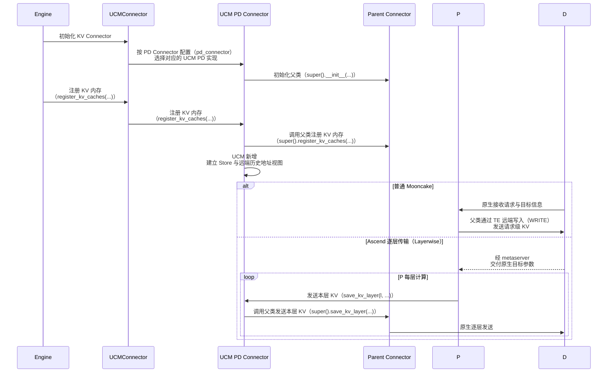
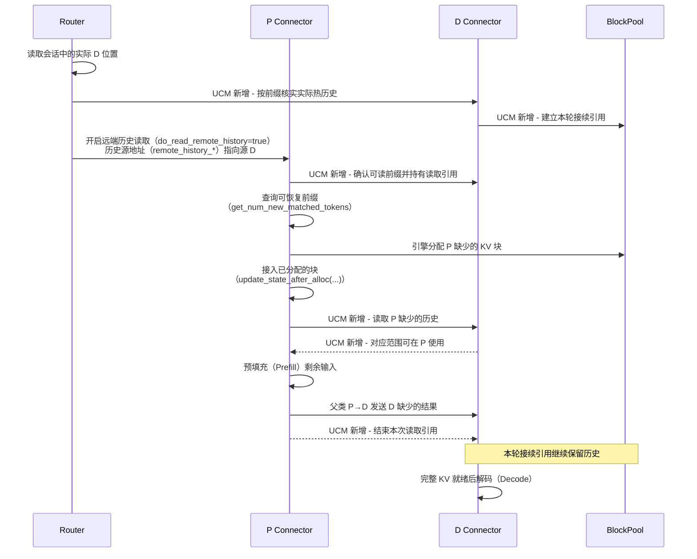
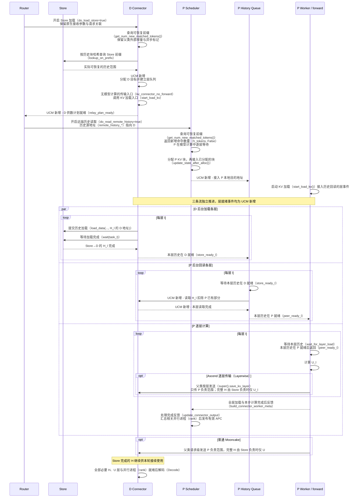
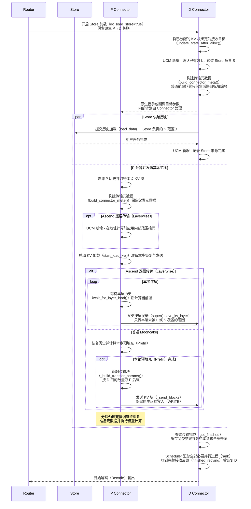
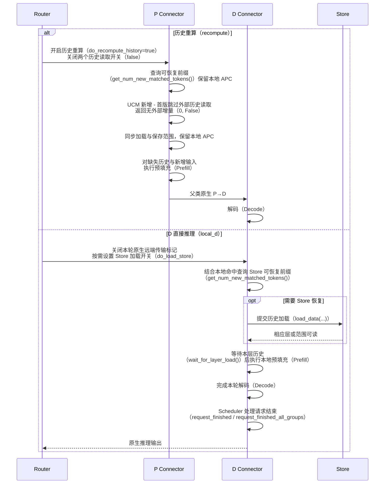

# Connector 具体实现方案

P 要恢复历史 KV 才能计算新增输入，D 要接回 P 的结果才能继续生成。UCM 将 Store、已有 D 历史和父类 P→D 接到同一次请求上：Router 选择路径，Connector 安排读写范围与依赖，引擎分配和回收实际 KV blocks。

下面按五个技术点展开实现。架构与性能目标见 [总方案](%E8%B0%83%E5%BA%A6%E6%96%B9%E6%A1%88.md)，请求派发见 [Router 具体实现方案](%E6%96%B9%E6%A1%88%E5%AE%9E%E7%8E%B0%E2%80%94%E2%80%94Router.md)。时序图中标记“UCM 新增”的事件是待实现的协调或数据操作，其余函数名对应已有入口。


两个实现各自继承父类 P→D，在此基础上增加 Store 恢复、D→P 和多来源处理。[编辑源图](img/pd-new-capabilities.excalidraw)

<a id="section-1"></a>

## 1. 统一入口，复用原生 P→D

P、D 都在 `KVTransferConfig` 中配置 `UCMConnector`。外层读取启动字段 `kv_connector_extra_config.pd_connector`：取值为 `MooncakeConnector` 时创建 `UCMMooncakePDConnector`，取值为 `MooncakeLayerwiseConnector` 时创建 `UCMMooncakeLayerwisePDConnector`，再把引擎调用转交给选中的实现。两个 UCM 类分别继承对应父类。父类保存原有 Scheduler/Worker、metadata 和收发状态，UCM 为新增来源单独保存计划与任务。

普通 Mooncake 由 D 发起接收请求，P 使用 TE WRITE 发送请求级结果；Ascend 先回传 D 的接收参数，再由 P 在每层 `save_kv_layer()` 中发送。两个子类都通过 `super()` 保留这些行为，Store 加载方式不改变父类 P→D 的粒度。



| 函数或入口 | 这个技术点的修改 |
| --- | --- |
| 外层选择与 `__init__()` | 读取 `pd_connector`，按 `MooncakeConnector` / `MooncakeLayerwiseConnector` 映射到对应 UCM PD 子类，只导入选中的实现；子类先调用父类初始化，再按 role 建立新增状态。现有未启用的 `UCMPDConnector(UCMDirectConnector)` 占位类不作为新实现的父类 |
| `get_required_kvcache_layout()` | 外层按同一个 `pd_connector` 取值调用对应实现的布局方法；固定普通父类返回 HND，MLA 返回 `None`，避免入口默认值覆盖父类要求 |
| `register_kv_caches()` | 先保留父类布局与注册，再按真实缓存组、层、stride、block IDs 建立 UCM Store/peer 视图；共享底层 storage 时明确注册所有者 |
| `build_connector_meta()` | 每步取一次父类 metadata，再附加 UCM 内容；保留父类对本步及 Ascend 跨 chunk 状态的处理 |
| `bind_connector_metadata()` | 将父类兼容对象交给 `super()`，再绑定本步 UCM 动作，使后续父类加载仍通过类型检查 |
| `start_load_kv()` | 用 `super()` 启动已准备好的父类动作，再处理新增动作；未携带 UCM 扩展的请求直接沿原生路径执行 |
| `save_kv_layer()` | Ascend 在原有每层回调中调用 `super()` 执行发送，再记录新增 Store 保存；普通父类此处为 no-op |
| `wait_for_save()` | 保留父类调用，等待本次 forward 确实需要完成的 UCM 保存；不改变原生 P→D 的发送时点 |
| `shutdown()` | 停止新增任务并排空相关传输，再由所有者关闭共享资源；两个顶层父类此入口都是 Base no-op，底层 TE 的实际关闭责任仍需接到其原有资源管理 |

未设置 `pd_connector` 时沿用现有 UCM 实现选择；设置后，在启动时选择上述两个既定 PD 实现，不动态改变类的继承关系，也不使用 Store 的 `use_layerwise` 推断 PD Connector 类型。外层的布局选择也要转发给具体实现，固定 vLLM v0.26.0 普通父类要求 HND，MLA 返回 `None`。Store 配置继续走现有入口，`UCM_CONFIG_FILE` 的解析结果不能覆盖 `pd_connector` 的选择。新增六个字段直接放在现有 `kv_transfer_params` 字典中。完整字段、组合与 D/P 示例见 [请求级 KV 参数设计](%E6%96%B9%E6%A1%88%E5%AE%9E%E7%8E%B0%E2%80%94%E2%80%94Router.md#ucm-pd-params)；父类 `transfer_id`、bootstrap、metaserver 参数与全局 producer/consumer 角色保留。

下面列出普通 Mooncake 的 Connector 选择片段，其余启动配置沿用原入口；P 的 `kv_role` 保持 `kv_producer`，D 保持 `kv_consumer`。

```json
{
  "kv_connector": "UCMConnector",
  "kv_connector_extra_config": {
    "pd_connector": "MooncakeConnector"
  }
}
```

使用 Ascend 逐层实现时，将 `pd_connector` 改为 `MooncakeLayerwiseConnector`。同一 P/D 组合使用相同的 PD Connector 类型。此字段确定原生 P→D 的协议与实现；两种实现都可扩展 Store→D→P 的逐层恢复，六个请求参数继续单独控制本轮动作。

共享 TE、地址注册复用与后台提交继续作为性能工作。Store 的地址账本仍记录实际可访问区间，新增任务持有共享实例的强引用；共享实例的所有者在关闭时确认所有相关操作已排空后再释放资源，单个请求结束只解除该请求的引用。Scatter 或其他窄绑定只补足已有接口无法表达的新增读取和排空能力。`direct_pd` 使用 P 本地或 UCM Store prefix cache 后接父类 P→D，仍是优化后的直接路径。

### 六个扁平参数如何进入 Connector

`do_load_store`、`do_read_remote_history`、`do_recompute_history` 都是布尔值，默认 `false`。远端历史读取开启时，`remote_history_engine_id`、`remote_history_host`、`remote_history_port` 成组提供，定位源 D 的 history 服务。未提供这些新增功能开关的请求继续执行父类行为；启动时的 `pd_connector` 只负责选择 UCM PD 实现，不放进 `kv_transfer_params`。

| 参数与消费者 | 具体处理 |
| --- | --- |
| `do_load_store` → `get_num_new_matched_tokens()`、`start_load_kv()` | 查询本实例配置的 Store 并加载到本实例 blocks。P 开启时恢复 P 历史；PD 的 D 将 Store H 作为父类整请求接收计划中的分工，保留父类外部增量和异步接收结果 |
| `do_read_remote_history` → `get_num_new_matched_tokens()`、`start_load_kv()` | 消费端按下面三个定位字段查询指定 D，确认当前请求可用的历史或同轮供数计划，再发起 D→P；开关本身不表示历史已存在 |
| `do_recompute_history` → `get_num_new_matched_tokens()` | 首版保留本地 APC，跳过本次全部外部历史读取，返回外部增量 `(0, False)`；D 仍正常接收父类 P→D。该请求不同时启用 Store 或远端历史读取 |
| `remote_history_engine_id` → 来源核实 | 定位源 D 的实际 engine/KV 池，与当前前缀、模型上下文和布局一起核实；相同主机或 HTTP 地址不等于同一 KV 池 |
| `remote_history_host`、`remote_history_port` → history 客户端 | 使用源 D 明确公布的 history 服务地址；不根据父类 bootstrap、KV 侧通道或 TE 端口猜测这个入口 |

普通同轮请求继续用原生 `transfer_id` 及已有请求 ID 关联 P、D；Ascend 沿父类回调中的请求 ID 和实际 engine/core 映射定位。PD 后端需要新增 history 服务并公布地址：它可以查询同一原生请求记录下的 Store 供数计划，也可以按当前请求前缀和上下文查找该 D 已有效的热历史。返回的实际可恢复范围、块映射和读取持有描述均为 Connector 内部信息，不新增用户填写的请求 ID 或引用参数。

| 核心函数 | 参数落到执行时的处理 |
| --- | --- |
| `get_num_new_matched_tokens()` | PD 的 D 在 `do_remote_prefill=true` 时保留 `super()` 返回的整请求外部增量与异步标记，Store H 只参与内部来源分工；P 或本地 D 执行 forward 时，才按开关返回本地 APC 之外的历史增量 `h_tokens` 或重算的 0 |
| `update_state_after_alloc()` | 将引擎实际分配的本地 blocks 接入已确认的供数计划；P 的分配在命中查询后发生，不列入 D 计划就绪的前提 |
| `build_connector_meta()` | 根据 D 已有效 L、Store 负责 S 确定 P 发送 `K \ (L ∪ S)`。普通连续前缀场景裁剪 D 的接收列表，再复用父类取 P 后缀；Ascend 使用内部范围适配，接收期望随实际任务一致 |
| `bind_connector_metadata()` | 将父类兼容 metadata 与新增任务信息交给 Worker，真实 rank 地址仍由 Worker 握手交换 |
| `start_load_kv()` | 执行已核实的 Store/历史读取任务；D 后台逐层供数，P 接入自己的目的地址，实际 KV payload 由 Store 与 TE 搬运 |
| `wait_for_layer_load()` | 等待本层实际可读后放行 attention；`relay_plan_ready` 和各层 ready 是执行结果，不是这六个请求参数 |

Store→D→P 使用两份独立参数：D 开启 `do_load_store=true`；P 关闭 Store 直读，开启 `do_read_remote_history=true` 并指向这台 D。双方 `do_recompute_history=false`，其余父类字段仍由原生流程生成。P 读取的历史与 P 最后把结果交给谁分别定位：热回读可指向 `D_source`，原生 P→D 参数仍指向 `D_target`。

Router 会话记录只维护实际 D 位置及已有请求关联，每轮重新核实有效前缀。同 D 接续需落到同一实际 engine；共享入口的 DP 部署沿原生 `X-data-parallel-rank` 定向。新增 history 服务和 Connector 请求记录管理内部描述符及读取持有，所有相关层/rank 读取结束或取消排空后解除对应持有；原生 JSON/SSE 输出形状保持不变。

`h_tokens`、Store 负责范围、block IDs、层 ready、APC 发布和释放状态都由 Connector 依据实际数据生成。`do_load_store=false` 不会阻止 D 接收父类 P→D；`do_recompute_history=false` 也不保证一定命中，恢复不到的剩余输入照常进入 Prefill。三个开关及 history 服务尚需接入实现，填写参数本身不会自动完成供数和裁剪。

<a id="section-2"></a>

## 2. D 热回读与同 D 接续

上一轮 D 留有历史时，P 可以直接读取这些 KV，省去一次 Store 恢复。Router 优先让持有历史的 `D_source` 同时成为本轮 `D_target`；P 只恢复自己缺少的历史，D 接回 P 生成的其余 KV。这样能够同时减少 Store→P 和重复 P→D，但收益依赖 D 的历史确实仍在。



| 函数 | 这个技术点的修改 |
| --- | --- |
| `get_num_new_matched_tokens()` | 保留父类必要预处理，再按 `remote_history_*` 查询源 D，核实当前前缀的上下文、布局和有效范围；命中只返回 P 本地已有前缀之外的 `h_tokens`，D→P 范围同步扣除本地部分 |
| `update_state_after_alloc()` | 将确认后的历史范围映射到 P 的真实 blocks；D 接续先建立新请求引用，再释放旧引用，避免中间出现 unpin 空窗 |
| `build_connector_meta()` | 在父类 metadata 上附加已有请求关联、内部供数描述与目标块映射，供 Worker 建立回读任务 |
| `bind_connector_metadata()` | 绑定父类兼容 metadata 和新增来源信息；物理地址由 Worker peer 握手解析 |
| `start_load_kv()` | 调用父类后，根据本轮来源与目标提交 D→P 读取 |
| `wait_for_layer_load()` | 调用父类后等待 P 当前层回读完成，再让 attention 使用该层历史 |
| `request_finished()` | Scheduler 在本轮生成结束后调用对应 `super()` 一次，再合并读取和接续持有。普通父类的原生延迟释放保留；Ascend 当前返回 `(False, None)`，新增使用者由 UCM 继续保护 |
| `request_finished_all_groups()` | 对完整缓存组调用对应父类结束方法，再合并各组新增持有；不扁平化后重复调用单组入口 |

P 读完一层后可以清理该层任务句柄；请求级源持有要等所有相关层/rank 的读取完成后才解除。同 D 的本轮接续持有继续保护 H，直到新的 D 请求接管或本轮结束。

history 服务只把全部必要层/rank 上有效的热前缀作为可直接读取的历史。P 按当前请求重新查询，源 D 同时取得本次读取持有；未命中的剩余输入由 P 计算，关闭 Store 直读时不额外转去读取 Store。上一轮已输出 token 数不能当作可恢复 KV 数，内部描述也不自动等于永久保留。共享尾块按引擎原有引用和可写性规则处理。

首版允许在目标绑定前改选 D：先停止旧准备的新提交，排空在途写入，再为新 D 建立地址与引用。普通 Mooncake 的原生传输关系绑定后、Ascend 已向 P 下发 D 目标后固定本轮接收方。复用已完成 P 结果再改选保留为后续方向，需要源保留、重新握手和唯一输出控制一并实现。

## 3. Store→D→P 的逐层流水

<a id="layerwise-relay"></a>

Store 保存历史 H，P 为本轮其余输入计算 U。第 l 层只依赖自己的历史 `H_l`，因此 D 加载完一层就可以供 P 回读，下一层 Store 加载与 P 当前层计算重叠。`store_d_relay` 按这条逐层路径实现；整块恢复作为同负载、同资源的性能对照。


D 确认 Store 实际范围、自己的目标映射和层任务已建立后，由 history 服务提供 `relay_plan_ready` 与内部供数信息。服务沿同轮 `transfer_id` 或父回调已有请求 ID 查询本轮计划，并核实当前前缀/上下文；这些就绪状态不由 Router 填入请求。P 不必等 H 全部进入 D，也不能先等待自己尚未分配的 blocks；P 得到可执行的供数范围后返回命中，Scheduler 才分配其目标。`history_ready` 保留为全部 H 层完成后的汇总状态。

| 函数或接入 | 这个技术点的修改 |
| --- | --- |
| `__init__()` | 为 D 建立跨 step 存活的后台层队列与每层 Store/peer 完成记录；复用 UCM 的分片加载和地址工具，将推进逻辑从模型回调中抽出 |
| `get_num_new_matched_tokens()` | P 的远端历史计划未就绪时返回 `(None, False)`，就绪后返回 `(h_tokens, False)`；PD 的 D 保留 `super()` 的整请求外部增量与异步标记，既不换成 Store 命中 H，也不把两者相加 |
| `update_state_after_alloc()` | P 分配后才接入本地目的地址；PD 的 D 由父类异步接收计划取得 H+U 对应 blocks，再分给 Store 与 P 写入，已有本地块照常复用。目标分配与数据有效分别记录 |
| `build_connector_meta()` | 普通连续前缀场景裁剪 D 的目的 block 列表，再复用父类按数量取 P 后缀；Ascend 携带内部范围 mask，在其原有地址计算前应用。所需发送任务和接收期望保持一致 |
| `bind_connector_metadata()` | 将父类 metadata 和本步层任务绑定到 Worker；持久队列与 D 持有的 H 保存在请求状态中，不随本步清理 |
| `start_load_kv()` | D 通过 `kv_connector_no_forward()` 也能启动层队列；P 接入目标与事件。每层 Store 完成后，后台继续提交下一层并驱动 D→P，无需 D 执行 attention |
| `wait_for_layer_load()` | 调用父类后，只等 P 当前层 `H_l` 到位再执行 attention；两种固定父类在此均无实际加载等待，反向层等待由 UCM 新增 |
| `save_kv_layer()` | Ascend 按层调用 `super()` 发送裁剪后的范围，保留原生事件和线程；普通父类继续请求级发送 |
| `wait_for_save()` | 单独处理 UCM 保存的完成需求，不在 forward 末尾等待与本次保存无关的后续层任务 |
| `build_connector_worker_meta()` | 在全层加载与本步计算完成后反馈实际有效范围，保留既有 metadata；本层 ready 只用于推进当前计算 |
| `update_connector_output()` | Scheduler 汇总相关 rank 的加载和计算结果，与分配时的延迟 APC 发布配合，只发布完整有效前缀 |
| `get_block_ids_with_load_errors()` | 反馈本层加载失败的实际 blocks；RUNNING P 经 UCM 的错误反馈退出请求，不能伪造整请求接收完成来放行 |

现有 `UCMLayerWiseConnector` 通过 Store 的 `load_data()` 提交分片任务、`wait()` 确认完成，在 `start_load_kv()` 提交首层，靠 `wait_for_layer_load()` 提交后续层。D 此时不运行模型，所以仅复用这个类无法推进全部层；持久后台队列和 Worker 间层就绪事件是明确的新增内容。事件在 Worker 之间传递，Router 不逐层调度。

这里的 `(h_tokens, False)` 只用于恢复历史后仍要执行 forward 的 P 或本地 D。PD 的 D 在 `do_remote_prefill=true` 时保留父类返回的整请求外部增量和异步 `True`，让引擎分配接收 blocks 并等待 H、U 的全部来源；Store H 是这份接收计划内部的分工，不覆盖或累加父类 count。D 全本地命中、父类 count 为 0 时沿用其原有特殊行为。

P 返回 `False` 是为了进入 forward 内按层等待。如果使用 `True`，它会进入 `WAITING_FOR_REMOTE_KVS`，直到整请求接收完才开始模型计算，失去上述重叠。APC 发布与整请求等待分开：P 当前层可读就继续计算，其他请求可命中的前缀则须全部相关层和分片有效。Scheduler 暂缓发布待恢复 blocks，P 在全层加载与本步计算完成后经 Worker metadata 反馈，再由 `update_connector_output()` 汇总各 rank 的实际有效范围并发布 APC。运行中的 P（RUNNING）不通过 `finished_recving` 反馈这类事件；v0.26.0 该集合用于整请求远端接收等待或已结束请求。

D 持有 Store 已恢复的 H 供 P 回读和本轮 Decode 使用；尚在加载的 H 仍由原 Store 任务负责。父类 P→D 只补 D 未有效持有、且 Store 也未负责的范围：H 已完整保留或全部由 Store 负责时仅发送 U，其余情况下发送未被两者覆盖的历史缺口加 U。普通连续前缀场景由 UCM 在 D 侧筛选目的 blocks，父类据其数量取 P 的对应后缀；具体映射见下一节。Ascend 仍保留原生目标列表和真实 `remote_cached_tokens`，在内部地址描述符生成前应用 Store 范围 mask，并同步接收期望。在途 H 不冒充已缓存 token，也不通过先全量发送再覆盖来实现。

默认接收位置是 D 的 HBM。Store 后端需要 host staging 时，逐层队列串联 staging 与本层 H2D，并等最终设备地址可读后通知 P。DRAM 接收池保留为可选方向，单独计算容量、注册和 H2D 成本。可编辑的层级时间线见 [Store→D→P 逐层执行图](img/store-d-p-layerwise.excalidraw)，预览见 [逐层时间线预览](img/store-d-p-layerwise.png)。

<a id="section-4"></a>

## 4. Store 与 P 分源补齐 D

P→D 成为瓶颈时，D 可以自行从 Store 恢复历史前缀，只让 P 发送其余范围。设 K 为本轮 D 所需 KV，L 为 D 已有效的部分，S 为 Store 负责的部分，父类发送范围为 `K \ (L ∪ S)`。S 包括尚在途的加载；只有未被 L、S 覆盖的历史缺口才随 U 由 P 补齐。`split_store_p` 据此划分目标空间，完整 H 已保留或由 Store 负责时只发送 U。P 仍需自己恢复历史，P、D 都读 Store 时两次读取分别计入流量。

### 连续前缀直接复用父类的后缀配对

普通 Mooncake v0.26.0 已有部分 prefix hit 的处理。D Worker 将本次目的 `local_block_ids` 放入握手 metadata 的 `req_blocks`；P 的 `_build_transfer_params()` 按缓存组比较源、目的数量，`n_local > n_remote` 时使用下面的实际逻辑：

```python
local_group = local_group[-n_remote:] if n_remote > 0 else []
```

因此，D/Store 负责连续前缀 H、P 只需交接后缀 U 时，UCM 可以在 D 的原生接收 metadata 中只保留 U 的目的 IDs，再调用父类原有握手、地址计算和 `_send_blocks()` WRITE。已经有效的 H 或许能由父类的 unhashed 选择排除，但 Store 在途 H 仍可能出现在 unhashed blocks 中；UCM 必须依据自身 Store 计划筛选，不能只调用 `super()` 就假定已经排除。

Store 查询使用按前缀生成的 block hashes，P/D 传输使用各自块池的物理 IDs；两类标识通过逻辑位置关联。以下例子中，P 尚无本地历史，逻辑位置与两端物理 IDs 分开：

| 逻辑块 | H0 | H1 | H2 | U0 |
| --- | --- | --- | --- | --- |
| P 实际 blocks | 101 | 7 | 56 | 23 |
| D 实际 blocks | 9 | 80 | 13 | 42 |
| D 上的来源 | Store | Store | Store | P |

Store 将 H 写到 D 的 `[9, 80, 13]`。在本节的独立分源路径中，P 自己从 Store 把 H 读到 `[101, 7, 56]`；将同一组 IDs 用于第 3 节 relay 时，才执行 D→P 回读 `9→101`、`80→7`、`13→56`。两种恢复方式共用相同的部分发送规则：P 完成剩余 Prefill 后，D 的原生接收列表仅包含 `[42]`，父类取 P 最后一个源块 `[23]`，执行 `P[23]→D[42]`，D 中 H 的本轮持有继续有效。这些 IDs 全部由引擎和 Connector 生成，用户只填写功能与来源定位参数。

物理 IDs 不能求集合差，它们只在各自 KV 池内有意义。如果缺失的是逻辑块 `[H1, U0]`，仅传 D 的 `[80, 42]` 会让父类取 P 最后两个 `[56, 23]`，将 H2 错配到 H1。任意稀疏缺口需要 Connector 内部的逻辑位置映射，首版不默认启用，也不新增公开 block ID 字段。示例采用普通 attention 前缀块；特殊缓存组、滑窗、空块与布局继续遵守父类约束，不将不同组扁平化套用。

Ascend 的 `remote_block_ids` 参与原有逻辑位置与并行映射，不能照搬普通后端、只缩短这个列表。已真正有效的前缀继续使用父类 `remote_cached_tokens`；Store 在途范围使用 UCM 内部 mask，在原有地址描述符生成前排除，之后仍用 `super()` 执行逐层事件、线程和传输。



| 函数 | 这个技术点的修改 |
| --- | --- |
| `get_num_new_matched_tokens()` | 分别核实本地、Store 与 peer 的恢复前缀，按逻辑覆盖范围计算命中，避免相同 H 被累计两次；在途 Store 范围不写入父类 cached-token 字段 |
| `update_state_after_alloc()` | 一次使用引擎实际 blocks 建立两个来源的目的映射。按本次阶段接入分配，避免异步加载前后两次回调重复提交 |
| `build_connector_meta()` | 先按逻辑范围计算 `K \ (L ∪ S)`；普通连续前缀场景筛选 D 的后缀目的列表，Ascend 保留原目标列表并附加内部 mask。S 包括在途任务，接收期望与实际任务一致 |
| 普通父类 `_build_transfer_params()` | 直接复用各组 `local_group[-n_remote:]` 的后缀配对；只在已确认是连续前缀排除后的场景使用，UCM 不重写父类地址与布局算法 |
| 普通父类 `_send_blocks()` | 保留 TE WRITE 与父类统计；调用它的父类传输流程继续处理完成响应和源块释放，零传输也保留原生结束通知 |
| Ascend `_get_kv_split_metadata()` | 保留真实 `remote_cached_tokens`（内部 `remote_cache_tokens`）与已发送进度的原生起点计算；在这条逻辑位置到 block/地址映射路径接入 UCM Store 范围 mask，再交原生逐层发送，不直接缩短 `remote_block_ids` |
| `start_load_kv()` | forward 前准备本步恢复与父类发送，和 D 的 Store 任务各写指定范围；父类原有全命中通知、取消与释放动作保留 |
| `wait_for_layer_load()` | P 在本层所需历史就绪后进入计算，保持加载范围与来源计划一致 |
| `save_kv_layer()` | Ascend 调用 `super()` 发送本层裁剪后的范围；普通父类此处无发送。chunked prefill 每步先构建 metadata，再执行 forward |
| `get_finished()` | 每次调用一次父类并分别缓存 sending/receiving 结果，再检查 Store 与其他实际依赖；保留 `(finished_sending, finished_recving)` 顺序。每个 Worker 先汇总本 rank，再由引擎汇总全部必要 rank，来源数量不改变 rank 完成计数 |
| `get_block_ids_with_load_errors()` | 合并父类与 Store 加载错误；异步失败请求仍需终结，失败块最晚与接收终结同轮反馈。Ascend 的失败接收与完成集合分别记录，需要接通这条错误路径 |

父类先报告完成时，UCM 保存这个结果，继续等 Store；Store 先完成时同样保留其结果。只有该请求全部必要来源的数据有效、所需层和 rank 都已成功完成接收，才把完整接收反馈给 Scheduler，允许 D 开始 Decode。缓存父类已取出的结果可以跨轮等待另一来源，避免丢失一次性的完成通知。

首轮以完整连续前缀块划分来源，未对齐的尾部归 P 计算。Worker 按缓存组、层和实际非连续 block IDs 生成地址；相同 token 数不直接换算为连续字节偏移。已有写入尚未结束时保留原来源负责的范围，改派前先排空，避免 Store 与 P 先后覆盖同一地址。

<a id="section-5"></a>

## 5. 按请求重算与 D 直接推理

某些请求读取历史的时间高于重算，另一些请求留在 D 计算少量新增输入即可继续生成。Router 分别选择 `recompute` 和 `local_d`，Connector 把选择转换为本次恢复范围与本地计算范围，实例的全局 P/D 角色保持原配置。



| 函数 | 这个技术点的修改 |
| --- | --- |
| `get_num_new_matched_tokens()` | `do_recompute_history=true` 保留本地 APC、跳过本次全部外部历史读取；D 本地执行时按 `do_load_store` 决定是否查 Store。两者保留父类必要预处理和真实外部增量 |
| `update_state_after_alloc()` | 将选定恢复范围映射到实际 blocks，其余由引擎分配给计算；已经提交的读任务先排空，再允许同范围重算 |
| `build_connector_meta()` | 同步调整 load、计算进度和 dump 范围；`local_d` 不建立远端 P 收发动作，其他请求的父类状态继续保留 |
| `start_load_kv()` | 提交本次选择保留的外部加载，重算范围不再发起读取 |
| `wait_for_layer_load()` | 等待当前层仍需要的外部数据；其余 token 由本地模型计算 |
| `save_kv_layer()` | 保留父类调用，保存本层实际计算的有效 KV；`local_d` 的 metadata 不包含远端发送动作 |
| `request_finished()` | Scheduler 在本轮生成结束后调用父类一次，再检查保存和其他使用者；D 本地执行不等待远端 P，有在途使用者时仍需延迟释放 |
| `request_finished_all_groups()` | 保留完整缓存组结构，调用对应父类一次并合并各组持有，不再重复调用单组入口 |
| `wait_for_save()` | 处理本次保存依赖，跨 step 保存仍留在请求任务记录中，结束后参与安全释放判断 |

读算选择根据 Store/I/O 排队、剩余计算量和 P/D 负载调整，延续原有重算方向。D 本地执行还要检查额外 Prefill 对 ITL 的影响。相同输入下同时比较恢复字节、计算时间和输出质量，避免仅按少传多少 KV 判断收益。

请求结束与传输结束分别处理：Scheduler 在生成结束后调用 `request_finished()` 或 `request_finished_all_groups()`，决定是否继续持有 blocks；返回延迟释放时，Worker 后续通过 `get_finished()` 报告可释放的请求。读取、保存和接续使用者都结束后，才将对应引用交回块池。

取消、某层读取失败或改用重算时，UCM 停止该请求的新提交，让参与 rank 退出等待，并保留目标到在途 DMA 真正排空。超时只结束等待期限，不能据此在同一地址重算或释放。这个顺序同样适用于前面的热回读、逐层 relay 和分源接收。

`BlockPool.free_blocks()` 减少引用，引用归零的块进入可分配队列，并不会立即清零 KV。有效前缀在被覆盖前仍可能命中；引擎重新分配时移除旧缓存映射。新增传输持有覆盖真实访问期间，才能避免仍被读取或写入的地址提前复用。
