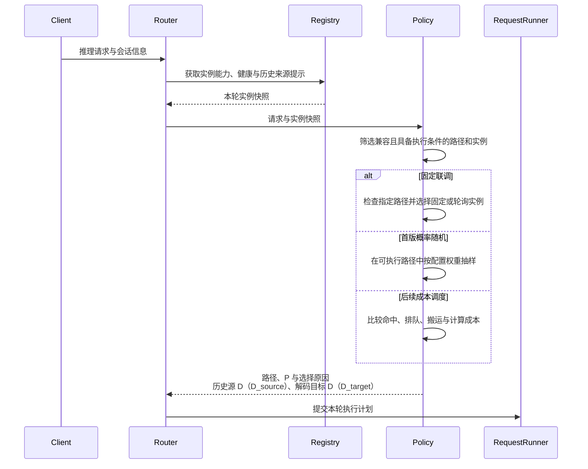
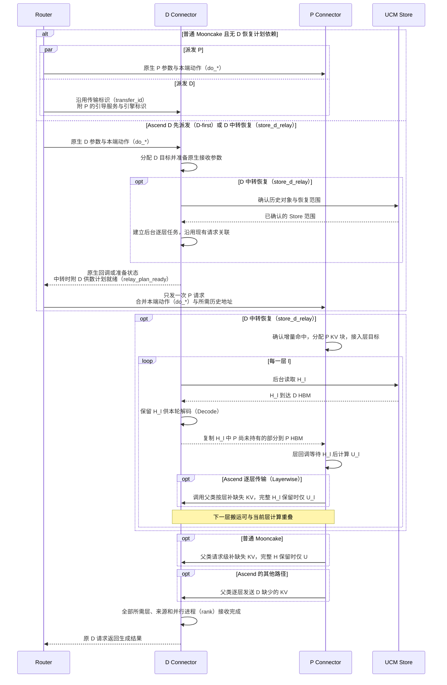
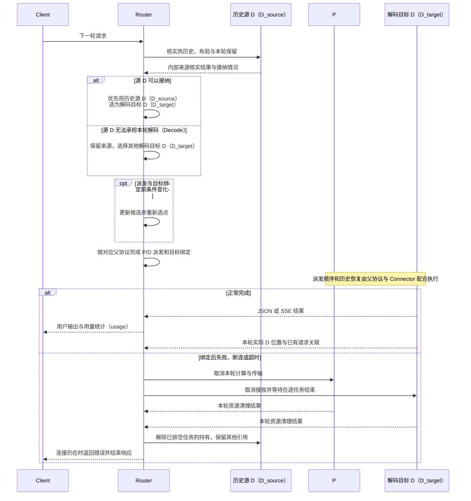

# Router 具体实现方案

[总方案与系统架构](%E8%B0%83%E5%BA%A6%E6%96%B9%E6%A1%88.md) · [Connector 具体实现方案](%E6%96%B9%E6%A1%88%E5%AE%9E%E7%8E%B0%E2%80%94%E2%80%94Connector.md)

Router 接收推理请求，决定使用哪条 KV 路径、交给哪些 P/D 实例，再按 Connector 的协议派发请求并返回 D 的输出。实现分为三个技术点：请求选路、两端派发与逐层启动、会话接续与请求结束。下文 Router 函数均为拟新增实现；Connector hooks 沿已有接口扩展。

<a id="section-1"></a>

## 1. 按请求选择路径与 P/D

Router 根据实例能力和本轮可用历史形成候选组合。首版先固定路径联调，随后按配置概率随机选择可执行路径，实例采用固定或轮询选点；热回读可以优先使用仍能接纳请求的源 D。后续成本调度继续使用同一份选择结果驱动请求。



`D_source` 提供历史 KV，`D_target` 执行本轮 Decode。下面的策略名称只用于 Router 内部选路和日志，不写入请求参数。实例是否支持相应后端、模型和布局是否兼容、历史来源是否存在，决定一条路径能否进入候选集合；数据读取前仍由 Connector 核实实际范围。

| 路径 | 选择后执行的工作 |
| --- | --- |
| `direct_pd` | P 使用 APC 与 UCM Store→P prefix cache，完成 Prefill 后由父类交接 D |
| `hot_d_read` | P 读取 D_source 的热历史并计算，优先回到能接纳的同一 D；否则选其他 D_target |
| `store_d_relay` | D 建立恢复计划，按层 Store→D HBM→P HBM，P 计算后沿父类 P→D 交接 |
| `split_store_p` | P 计算与 D 的 Store 恢复重叠，Store 和父类 P→D 分别补齐 D 的不同范围 |
| `recompute` | 保留 P 本地 APC，关闭本次外部历史读取，对缺失历史执行更多 Prefill |
| `local_d` | 仅向 D 发送完整推理请求，由 D 利用本地/Store 历史执行剩余 Prefill 和 Decode |

随机阶段只对可执行集合中的权重归一化，零权重路径不参与，首版不做成本评分。固定路径不可执行时返回具体原因；`local_d` 和 `recompute` 在派发前确定，避免已有 P 计算被 D 重复执行。

### 实现修改

| 位置与函数 | 具体实现 |
| --- | --- |
| `registry.py` · `Registry.get_snapshot()`（拟新增） | 提供实例健康、协议后端、布局和会话来源提示，保留快照与实际执行时核实的区别 |
| `policy.py` · `Policy.select_plan()`（拟新增） | 筛选可执行组合，完成固定选择或概率抽样，返回路径和 P/D 选择；同 D 偏好作为热回读选点规则 |
| `policy.py` · `Policy.estimate_cost()`（后续新增） | 结合命中、队列、设备利用率、链路与 D 显存占用，比较到 D 可继续生成这一终点的关键路径 |
| `runner.py` · `RequestRunner.run()`（拟新增） | 接收选择结果，记录候选、权重、选中路径与实际路径，并进入对应父协议的请求流程 |

后续引擎 `estimate` 复用正式 renderer/tokenizer 返回真实前缀与可恢复范围，Router 使用这些结果选路。分源恢复需要统计 P/D 重复读取 Store 的流量和 D 提前保留 H 的空间；D 本地推理还要考虑对已有 Decode 请求的影响。成本策略参考 [后续调度决策图](img/02-decision.excalidraw)。

远期可将同一请求待恢复的 KV 分段，前段走 Store→P，后段走 Store→D→P，以同时使用两侧存储入口；具体分段维度留待后续确定。当前仍按 request 选择一条恢复路径。这里讨论的是 P 的历史恢复由两条路径分担，与当前 `split_store_p` 在 D 端汇合 Store 和 P 的不同范围分开处理，本次不展开实现或验收。

## 2. 联合派发与逐层启动

两端都使用 `UCMConnector`。普通实现继承 `MooncakeConnector`，保留并发 P/D 请求与 `transfer_id` 关联；Ascend 实现继承 `MooncakeLayerwiseConnector`，保留 D 分配接收 blocks、回调 metaserver、Router 再发 P 的顺序。两种父类的 P→D 功能继续经 `super()` 执行。

`store_d_relay` 增加的是 D 的供数准备：D 确认 Store 对象及范围、D 目标和接收参数，并建立逐层后台任务后，回报 `relay_plan_ready`。Router 此时即可发 P，历史 H 的各层读取继续在后台推进。



图中的 Hₗ 是第 l 层历史 KV，Uₗ 是 P 为本轮新增输入计算的 KV。D 保留从 Store 恢复的 H，P→D 只补 D 缺少的部分，完整 H 保留时只回传 U；发送范围及描述符由 Connector 生成。Router 每端只创建一次推理请求，并传递一次执行意图；层间读写、等待与预取由 Worker 推进。D 后台队列独立于本请求的模型 forward，保证 D 等待 P 时仍能持续提供 Hₗ。

P 的 blocks 在它自己的命中查询之后分配。`get_num_new_matched_tokens()` 返回本地已计算部分之外、已确认可恢复的 `h_tokens`，引擎据此分配 blocks，`update_state_after_alloc()` 再接上目标地址。P 在每层 attention 前等待本层历史；完整 H 的 `history_ready` 留作状态汇总，不作为启动 P 的条件。详细函数与层间依赖见 [逐层恢复实现](%E6%96%B9%E6%A1%88%E5%AE%9E%E7%8E%B0%E2%80%94%E2%80%94Connector.md#layerwise-relay)。

### 实现修改

| 位置与函数 | 具体实现 |
| --- | --- |
| `runner.py` · `RequestRunner.run_mooncake()`（拟新增） | 选择 P 与 DP rank，读取 bootstrap/engine 信息，生成同轮 `transfer_id`，持有 P/D 任务；relay 请求在 D 计划可用后推进 P |
| `runner.py` · `RequestRunner.run_layerwise()`（拟新增） | 先发 D，等待原生目标回调；relay 还需 `relay_plan_ready`，满足后只派发一次 P，并持续读取原 D 响应 |
| `api.py` · `handle_metaserver()`（拟新增） | 关联回调中的实际请求 ID，保存完整原生接收参数，交给持有本轮请求的 Runner |
| `runner.py` · `merge_transfer_params()`（拟新增） | 以父类字典为基础合并本端 do_* 动作与历史地址，复用原生请求关联，保持原生地址、block ID、rank 等字段完整 |
| Connector · `get_num_new_matched_tokens()` | 返回本地命中之外的可恢复增量，使 P 能进入分配阶段 |
| Connector · `update_state_after_alloc()` | 接上引擎刚分配的 P blocks；D 的计划就绪条件不依赖这些 blocks 提前存在 |
| Connector · `start_load_kv()` | 启动本轮 Store/peer 任务，D 后台队列随后独立推进 |
| Connector · `wait_for_layer_load()` | 在 P 使用当前层历史前等待本层数据 |
| Connector · `save_kv_layer()` | Ascend 调用父类完成逐层发送；普通父类保持请求级发送时机，细节见 Connector 方案 |

普通 Mooncake 的 P 参数包含 `do_remote_decode=true`、`do_remote_prefill=false` 和 `transfer_id`，D 使用相反角色标记及 `remote_bootstrap_addr`、`remote_engine_id`。[vLLM v0.26.0 原生代理](https://github.com/vllm-project/vllm/blob/v0.26.0/examples/disaggregated/mooncake_connector/mooncake_connector_proxy.py#L249)

Ascend 回调保留 `remote_block_ids`、`remote_block_size`、`remote_engine_id`、`remote_host`、`remote_port`、`remote_tp_size`、`remote_pcp_size`、`remote_dcp_size`、`remote_cached_tokens` 等完整字段。`remote_cached_tokens` 只表示实际缓存，Store 计划恢复的范围独立放在 UCM metadata；Router 不以计划量覆盖它。父类发送范围如何避开 Store 负责的 H，由 Connector 适配。[Ascend 原生代理](https://github.com/vllm-project/vllm-ascend/blob/d6e8f1ad4/examples/disaggregated_prefill_v1/load_balance_proxy_layerwise_server_example.py#L459) · [D 目标回调](https://github.com/vllm-project/vllm-ascend/blob/d6e8f1ad4/vllm_ascend/distributed/kv_transfer/kv_p2p/mooncake_layerwise_connector.py#L927)

## 3. 会话接续、改选与请求结束

新一轮请求到来时，Router 读取上一轮 D 的来源提示，Connector 重新确认可读前缀和保留结果。源 D 仍能接纳时优先在同一实际 engine/KV 池接续；容量不足时可以选择其他 D_target，P 的历史来源仍是 D_source。D 自动持有本轮供数与接续所需历史，保留时间由请求生命周期决定。

改选窗口受原生协议约束。首版在派发和目标绑定前重新选点；普通 Mooncake 已绑定传输目标，或 Ascend 已把 D 接收元数据交给 P 后，本轮固定目标。绑定后的失败进入取消流程，避免旧目标映射被发送到新 D。



历史访问服务只把全部必要层/rank 已有效的前缀作为热历史提供；正在恢复的 relay 沿已有请求标识和层事件推进。准备期间复用 P 结果改选 D 保留为后续能力，需要先支持结果保留、解绑、重新握手、旧写入排空及新目标范围确认。用户输出开始后不再改选重放。

### 实现修改

| 位置与函数 | 具体实现 |
| --- | --- |
| `registry.py` · `Registry.get_source()`、`update_source()`（拟新增） | 保存会话的来源位置与已有请求关联；下一轮由指定 D 核实当前前缀，内部来源描述符只覆盖真实可读范围 |
| `runner.py` · `RequestRunner.handle_target_failure()`（拟新增） | 绑定前重新调用选路，绑定后取消本轮；不使用旧 D 元数据重放，也不重试执行状态不明的 P |
| `runner.py` · `RequestRunner.forward_response()`（拟新增） | 转发 D 的 JSON/SSE，保持客户端采样、停止条件和生成上限，处理错误发生在响应前或响应后的差别 |
| `runner.py` · `RequestRunner.cancel()`（拟新增） | 停止并等待本地任务退出，再取消实际引擎请求和搬运，确认引用释放；D_source 被其他任务使用的引用继续保留 |
| Connector · `get_finished()` | Worker 合并父类最终收发集合与对应新增依赖；RUNNING P 的层加载完成通过 Worker metadata 反馈 |
| Connector · `request_finished()` | Scheduler 侧在请求结束后合并父类与新增持有，决定是否延迟释放 |
| Connector · `request_finished_all_groups()` | 按完整缓存组执行相同的结束与持有判断，保留父类对应接口 |

Runner 保存已有客户端请求 ID、原生 transfer_id（普通 Mooncake）或父类回调请求 ID（Ascend），并关联真实 engine request/core。Chat/completion serving 会转换请求 ID，Layerwise 回调沿其原生规则关联；查询和取消定向原 Engine Core，取得持有该请求的 core 的结果。

D 保留客户端 `stream`、采样参数、停止条件和生成上限。P 的内部请求按父类约定设置 Prefill 触发参数，其触发 token 不拼入用户响应。非流式返回 D 的最终 JSON；SSE 保留 role、内容、工具调用、finish_reason、usage 和一个终止事件，过滤内部传输元数据。首 token 遵守父类有效 KV 规则，prompt_tokens 按完整输入计数，completion_tokens 只计用户生成结果。

任一分支失败、客户端断开或总期限到达时，Runner 结束两端任务并确认引擎和传输清理。响应体尚未发出时返回 HTTP 错误；SSE 已开始则发送错误事件并结束流。

## 4. 实现组织与配置

Router 在 UCM 仓库中作为独立 `router/` 子项目发布，发行名 `ucm-router`，导入名 `ucm_router`，入口 `ucm-router --config router.yaml`。使用 `pyproject.toml`、setuptools 和 `src/ucm_router/`，Python ≥3.10，依赖 FastAPI、HTTPX、Uvicorn、Pydantic、PyYAML，日志采用标准库。wheel 为纯 Python 包，安装启动无需 vLLM、Torch、Mooncake 或设备运行时。

`api.py` 接收请求和回调，`registry.py` 维护实例与来源提示，`policy.py` 选择执行计划，`runner.py` 管理一轮请求；`engine_client.py` 集中处理 HTTP，`protocol.py` 保存原生参数和新增动作的类型，`cli.py`、`config.py` 负责启动。现有代理提供 API 和连接池参考，其串行 P/D 调用改为上述两种协议流程。[UCM `f00a1f1` 代理](https://github.com/ModelEngine-Group/unified-cache-management/blob/f00a1f1ac52c4ce35c32e893870db02092df3069/ucm/pd/toy_proxy_server.py#L235)

HTTPX 客户端由应用 lifespan 创建、复用和关闭，推理流与控制请求使用独立、有上限的连接池。首版单进程、配置文件维护实例；多副本运行时再接入会话共享或入口亲和路由。

### 请求级 KV 参数设计

`KVTransferConfig` 选择实例使用的 Connector，`kv_transfer_params` 指定本轮需要执行的动作。P/D 均配置 `UCMConnector`，通过启动字段 `kv_connector_extra_config.pd_connector` 指定 `MooncakeConnector` 或 `MooncakeLayerwiseConnector`，由 UCM 创建对应继承实现；P 保留 `kv_producer`，D 保留 `kv_consumer`，父类和 Store 的启动配置沿用原入口。

<a id="ucm-pd-params"></a>

新增字段直接放在现有 `kv_transfer_params` 中，与 Mooncake 的 `do_remote_prefill`、`do_remote_decode` 和 `remote_*` 并列。Router 内部可以继续使用 `direct_pd`、`store_d_relay` 等策略名称，发请求时将选择转换为下面六个字段。
| 新增字段 | 类型与默认值 | 本轮执行的动作 |
| --- | --- | --- |
| `do_load_store` | 布尔值，默认 `false` | 本端通过 UCM 从 Store 恢复当前请求可复用的历史；P、D 均可使用 |
| `do_read_remote_history` | 布尔值，默认 `false` | P 从指定 D 的历史访问服务核实并读取当前请求所需历史 |
| `do_recompute_history` | 布尔值，默认 `false` | P 保留本地 APC，对缺失历史执行重算，跳过本次外部历史读取 |
| `remote_history_engine_id` | 字符串；远端历史读取时必填 | 指定历史所在的实际 D engine/KV 池，可与本轮 D_target 不同 |
| `remote_history_host` | 字符串；与另外两个历史源字段成组使用 | D 历史访问服务公布的可访问主机地址 |
| `remote_history_port` | 整数；与另外两个历史源字段成组使用 | D 历史访问服务公布的端口，Worker 经该入口握手后取得实际传输信息 |

P 的 `do_load_store` 与 `do_read_remote_history` 首版不能同时为真；`do_recompute_history` 也不能与任一加载动作同时为真，冲突时报告参数错误。未启用远端历史读取时无需填写历史源字段。三个动作都为假时不增加 UCM 外部恢复动作，本地 APC 和原生 P→D 仍按各自流程工作；完全没有这些新增字段的请求保留父类行为。

普通 Mooncake 继续使用原生 `transfer_id` 和已有 request ID 关联本轮。Ascend 复用 metaserver 回调已有的请求 ID，并维护它到实际 engine request/core 的映射。原生 `remote_engine_id` 在 D 请求中仍指向 P；新增的 `remote_history_engine_id` 专门定位历史来源，二者分别处理。父类会修改 `do_remote_prefill` 等标记，UCM 将自己已经解析的动作保存在内部请求记录中。

#### 每条路径如何填写

表中未列出的新增动作取默认 `false`。远端历史读取启用时，P 同时携带 `remote_history_engine_id/host/port`；它们描述 D_source，而原生 P→D 参数仍描述本轮交接关系。

| Router 内部选择 | P 的新增动作 | D_target 的新增动作 | 执行方式 |
| --- | --- | --- | --- |
| Store→P（`direct_pd`） | `do_load_store=true` | 无 | P 恢复历史并计算，D 沿父类接收 |
| D 热回读（`hot_d_read`） | `do_read_remote_history=true`，历史源指向 D_source | 无 | P 从 D_source 读历史；同 D 接续自动持有 H，不同 D 按目标实际缺失范围交接 |
| Store→D→P（`store_d_relay`） | `do_load_store=false`、`do_read_remote_history=true`，历史源指向本轮 D | `do_load_store=true` | D 按层加载 H 并供 P 回读，P→D 只补 D 缺少的部分 |
| Store/P 分源（`split_store_p`） | `do_load_store=true`，不读远端历史 | `do_load_store=true` | P/D 各自恢复历史，Connector 将 D 的 Store 范围从父类接收范围中排除 |
| 重算（`recompute`） | `do_recompute_history=true`，两个加载动作均为 `false` | 无 | P 保留本地 APC，重算其余历史和新增输入，再按父类交接 |
| D 直接推理（`local_d`） | 不创建 P 请求 | 本地 APC；需要外存恢复时可设 `do_load_store=true` | D 请求的原生两个 remote 标记均为 `false`，本地完成 Prefill 与 Decode |

“同 D”指同一实际 engine/KV 池，并满足模型、布局与接纳条件。Router 选择对应独立端点；共享 API 入口的多 DP 部署通过原生 `X-data-parallel-rank` 把新 D 请求定向到历史所在 engine。无法确认或定向时，保留 D_source 供 P 回读，并按不同 D_target 处理本轮接收，不能仅凭 API 地址相同就扣除历史传输。[原生 DP 定向入口](https://github.com/vllm-project/vllm/blob/v0.26.0/vllm/entrypoints/generate/base/serving.py#L204)

#### Store→D→P 的普通 Mooncake 请求示例

下面两份片段使用同一个原生 `transfer_id`；`X-Request-Id`、模型、输入和生成参数按既有流程传递。Router 先向 D 发送请求，让 D 同时准备原生接收和 Store 恢复：

```json
{
  "kv_transfer_params": {
    "do_remote_decode": false,
    "do_remote_prefill": true,
    "transfer_id": "xfer-42",
    "remote_bootstrap_addr": "http://p0:8998",
    "remote_engine_id": "p0-engine",
    "do_load_store": true
  }
}
```

D 确认 Store 的实际前缀范围、自己的目标 blocks 和后台层队列后，沿已有请求关联回报准备完成。Router 即可发 P，无需等待全部 H 到达。P 使用 D 公布的历史访问地址读取本轮数据：

```json
{
  "kv_transfer_params": {
    "do_remote_decode": true,
    "do_remote_prefill": false,
    "transfer_id": "xfer-42",
    "do_load_store": false,
    "do_read_remote_history": true,
    "do_recompute_history": false,
    "remote_history_engine_id": "d0-engine",
    "remote_history_host": "d0",
    "remote_history_port": 9000
  }
}
```

`d0:9000` 只是 D 历史访问服务公布地址的示例，9000 不是约定默认端口，也不是 HTTP 推理端口或父类 KV 侧通道端口。这个历史访问服务需要在 D 的 UCM 实现中新增，其主机、端口和实际 engine ID 可在启动时公布。P 根据这些字段握手，再取得真实 rank、block 和设备地址；传输 payload 继续由 TE 完成。

热回读使用相同的三个历史源字段，但它们可以指向另一个 D_source。源端依据当前请求的 token 前缀、模型与布局核实真实可读范围，P 只恢复本地 APC 之外的部分。Router 保存会话曾使用的来源位置和已有请求关联，不保存一份可直接证明 KV 有效的外部引用。

Ascend 仍先发送带 `metaserver` 的 D 请求。D 回调原生目标参数后，Router 保留完整回调字典，再合并 P 本端的扁平动作和历史访问地址；不会把 D 的 `do_load_store=true` 直接复制给 relay 中的 P。原生 blocks、并行参数和真实 `remote_cached_tokens` 全部保留，Store 计划恢复的范围另外保存在 Connector 内部。
