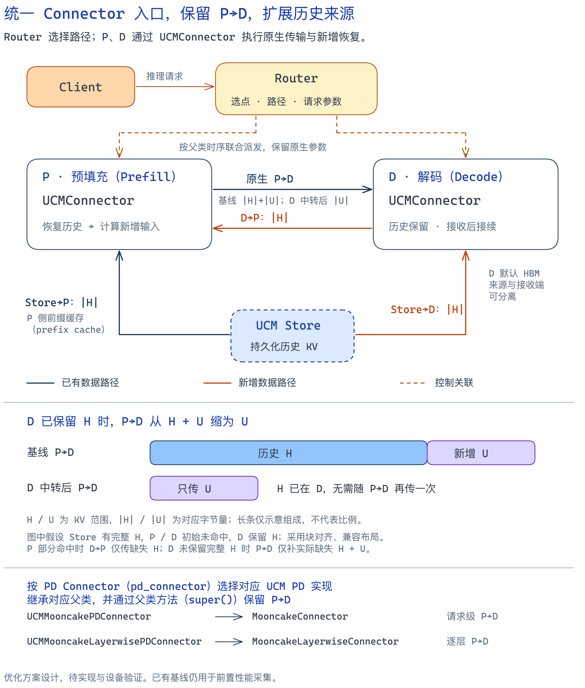
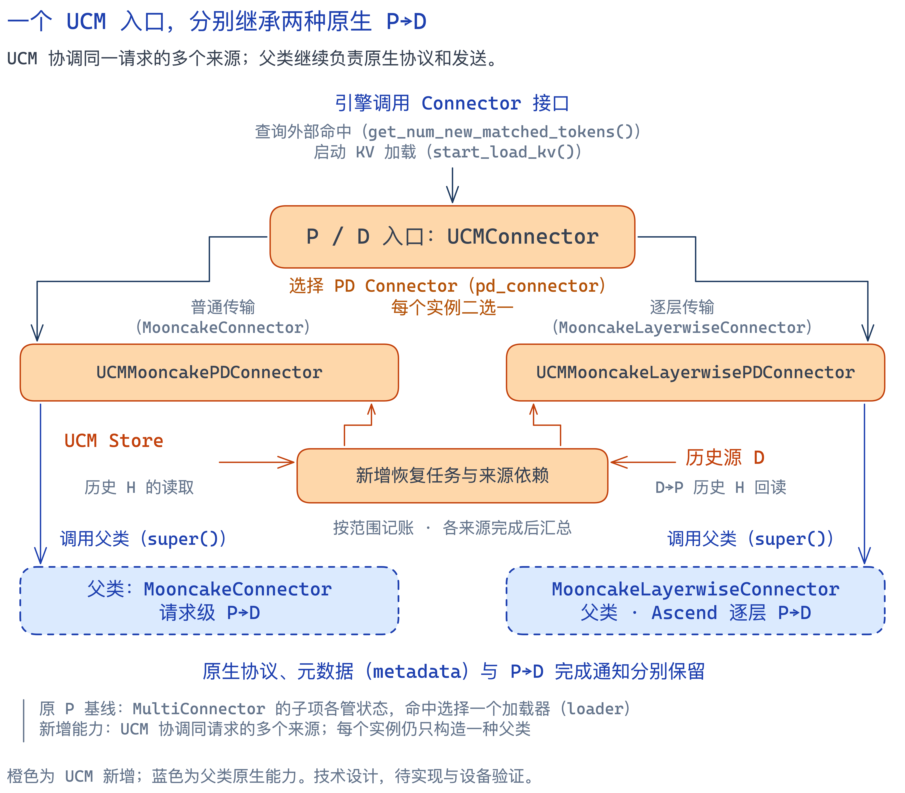
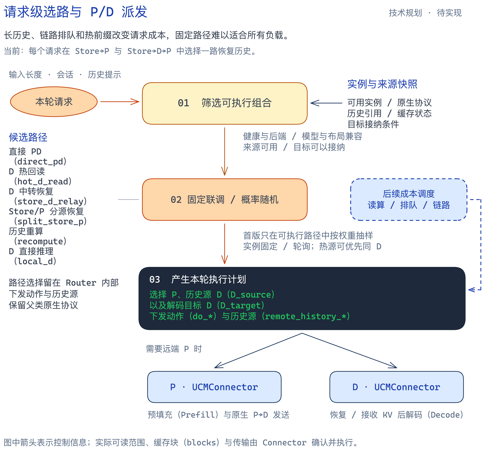
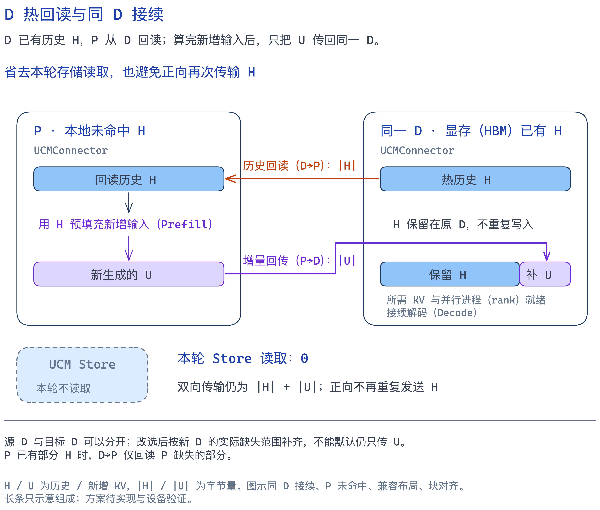
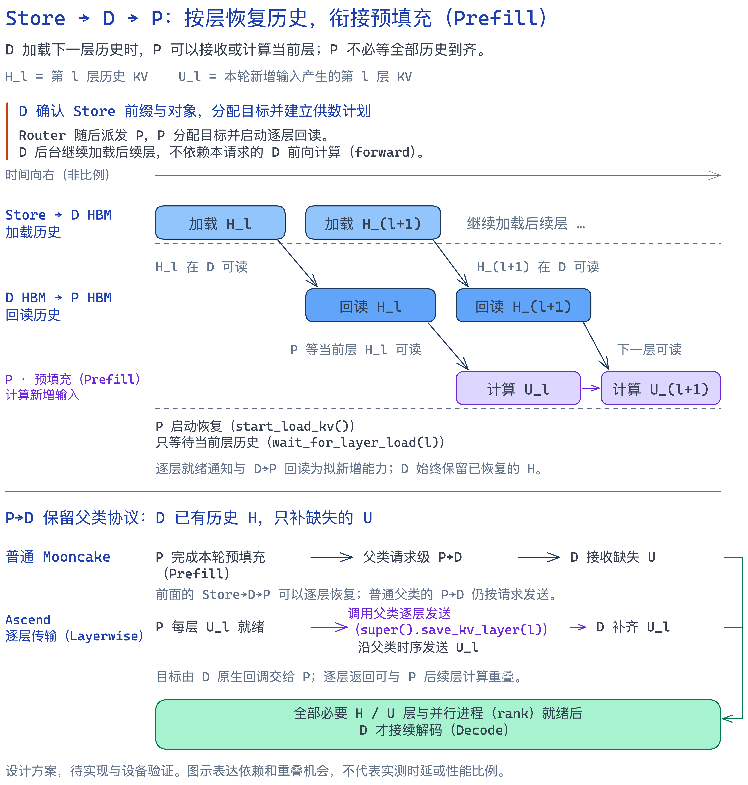
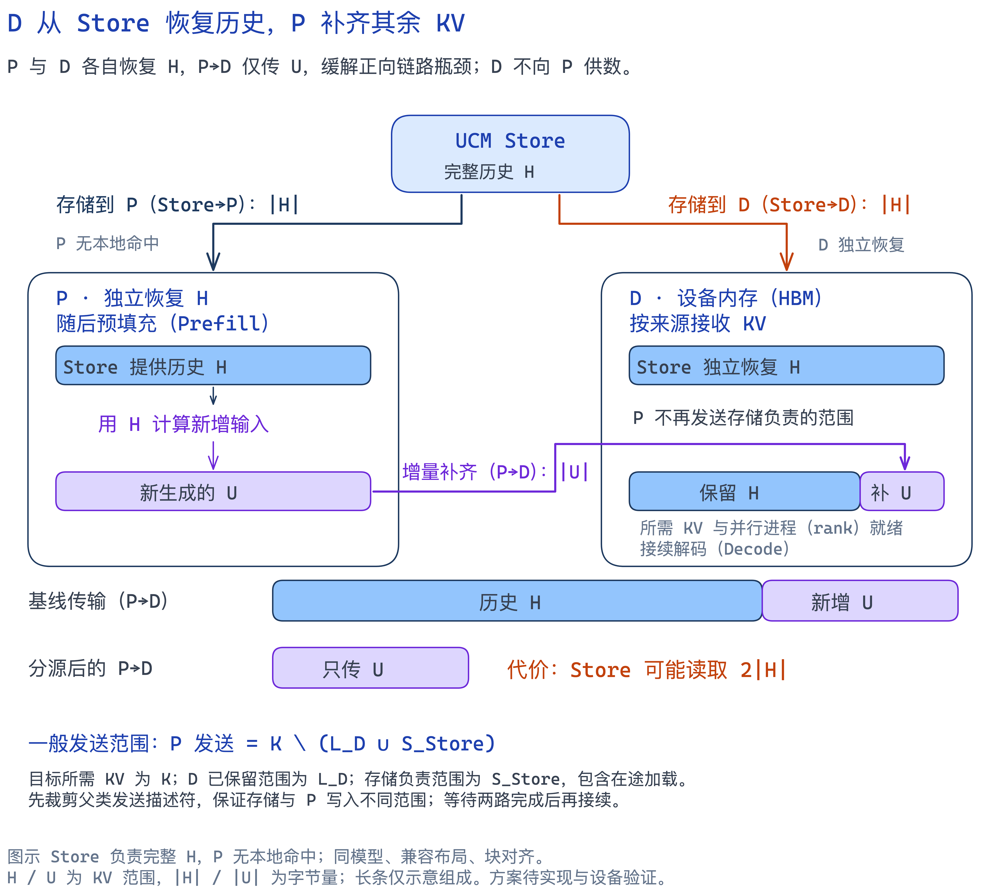
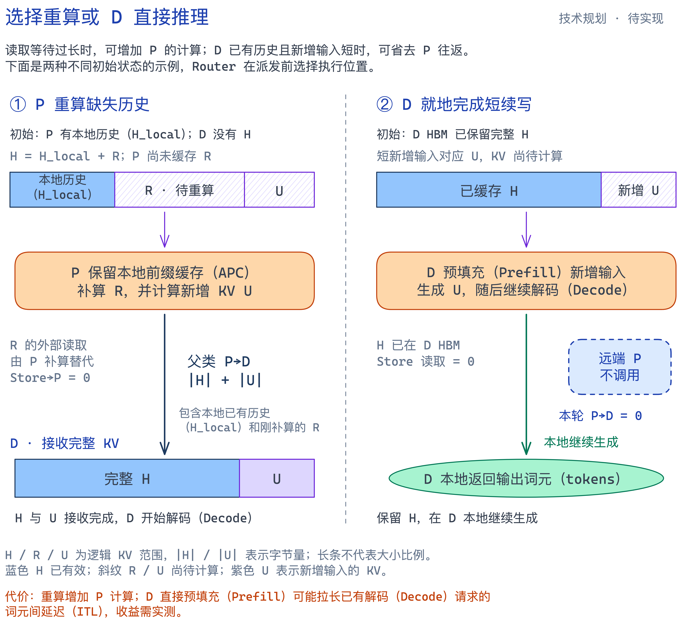

# PD分离调度方案

## 1. 背景与问题

PD 分离将输入计算交给 Prefill（P），输出生成交给 Decode（D）。为了复用历史前缀，P 先从 Store 恢复 KV，再计算新增输入，并把 D 缺少的 KV 交给 D。长历史请求中，Store→P 的读取和 P→D 的交接都可能成为瓶颈，使计算资源等待数据。

此前观察到 P 的存储网卡接近有效上限。D 的存储入口、计算网络及显存是否还有余量，需要通过前置测试确认。本方案希望在相同机器数、卡数和时延要求下，调整历史 KV 的读取位置、传输范围和计算位置，提高系统的持续达标吞吐；同时与非 PD 部署比较，确定适用负载。

## 2. 方案介绍

方案保留现有 P→D，扩展 Store→D 和 D→P。Router 可以让 P 从 Store 恢复历史，也可以让 D 逐层加载历史并供给 P，使加载、回读和 P 计算重叠。D 保留的历史继续用于本轮 Decode，P 只交接它仍缺少的部分。已有 D 热历史可以直接回读；合适的短续写由 D 完成，读取成本过高的请求则由 P 重算相应输入。

实现上，P、D 统一配置 `UCMConnector`。两个 PD 实现分别继承普通 `MooncakeConnector` 和 Ascend `MooncakeLayerwiseConnector`，通过 `super()` 保留原生传输。Router 遵循各自父协议的派发时序，用请求参数选择路径和来源。首版先固定路径联调，再按概率选择；后续结合命中、负载和链路成本调度。

Router 选择 P、D 和路径，P/D 都通过 `UCMConnector` 接入。普通实现保留请求级 P→D，Ascend 实现保留 D-first 回调和逐层 P→D。[编辑架构图](img/pd-system-overview.excalidraw)
图中四条数据线路分别是 Store→P、Store→D、D→P 和 P→D。`D_source` 提供历史，`D_target` 执行本轮 Decode；两者优先使用同一实例，以复用保留的历史。

## 3. 技术规划

H 表示历史 KV，U 表示本轮新增输入产生的 KV；图中的 `|H|`、`|U|` 表示对应字节量。传输示例按相同模型、兼容布局和完整前缀块说明，实际发送范围还要扣除目标已有的部分。

### 功能 A · 统一入口与原生复用

现有 MultiConnector 分别完成 Store 恢复和 P→D 传输。增加 D→P、D 侧 Store 加载后，同一个请求需要协调多个来源的写入范围和完成状态，单独调用几个 Connector 已不足以表达这些关系。

这一功能把 P、D 的入口统一为 `UCMConnector`，启动时通过 `pd_connector` 指定要复用的原生 Connector，内部创建对应的 UCM PD 子类。普通子类继承 `MooncakeConnector`，Ascend 子类继承 `MooncakeLayerwiseConnector`；原有初始化、布局、握手、发送和完成通知继续调用父类，UCM 增加 Store 和反向读取的请求状态。这样可以在保留原生 P→D 的基础上，接入后续各条恢复路径。

`pd_connector` 取 `MooncakeConnector` 或 `MooncakeLayerwiseConnector`；普通 P→D 保持请求级发送，Ascend 保持逐层发送。[编辑功能 A 图](img/direction-a-connectors.excalidraw) · [原生复用与函数修改](%E6%96%B9%E6%A1%88%E5%AE%9E%E7%8E%B0%E2%80%94%E2%80%94Connector.md#section-1)。

D DRAM 暂存、共享 TE、注册复用和层级内存回收继续作为各条路径的传输与内存优化。它们各自的容量、同步和生命周期处理保留在 Connector 实现方案中；逐层流水本身不等于已经减少了 KV 池的分配量。

### 功能 B · 按请求选择路径与 P/D

不同请求的历史位置和计算量不同，P、D 的队列与带宽也在变化。始终使用同一个读取入口或固定 P/D 搭配，可能让一侧排队、另一侧仍有余量。Router 需要先知道哪些路径真正可执行，再把请求交给合适的实例。

这一功能让 Router 为本轮选择恢复动作、P、`D_source` 和 `D_target`，把本端的 `do_*` 动作及 `remote_history_*` 历史源信息直接写入 `kv_transfer_params`，与 Mooncake 原生参数并列。先用固定路径逐项联调，再按配置概率从可执行集合中抽样；后续才加入命中、排队、传输与计算成本评分。层间加载和等待由 Worker 推进，Router 管理请求级选择与派发。原生参数定位 P→D 的传输对端，`remote_history_*` 定位提供历史的 D，两者可以是不同实例。字段与填写规则见 [请求级 KV 参数设计](%E6%96%B9%E6%A1%88%E5%AE%9E%E7%8E%B0%E2%80%94%E2%80%94Router.md#ucm-pd-params)。

图中区分当前的固定/概率选择与后续成本调度。对 Store→P、Store→D→P 这两条恢复路线，当前仍是一请求选一路。[编辑功能 B 图](img/direction-b-routing.excalidraw) · [选路与函数修改](%E6%96%B9%E6%A1%88%E5%AE%9E%E7%8E%B0%E2%80%94%E2%80%94Router.md#section-1)。

### 功能 C · D 热回读与同 D 接续

多轮请求的历史 KV 可能仍在上一轮 D 的显存中。如果下一轮 P 再从 Store 读取同一段历史，计算完成后又把它交回同一个 D，就重复使用了存储入口和正向链路。

这一功能让 P 直接读取 D 上已经确认有效的历史。D 在读取期间保留源 KV，并继续持有本轮 Decode 需要的部分；P 计算新增输入后，只补 D 缺少的 KV。完整历史 H 留在同一 D 时，本轮可以不读 Store，D→P 提供 P 缺少的 H，P→D 只返回 U。读取结束后只解除本次读取的持有，本轮接续需要的历史继续保留；请求取消时先排空在途读写，再释放对应引用。

热回读的代价是 D→P 流量和更长的历史持有时间。若最终 Decode 改到其他 D，交接范围按新目标的实际命中重新计算。[编辑功能 C 图](img/direction-c-hot-read.excalidraw) · [热回读、引用与函数修改](%E6%96%B9%E6%A1%88%E5%AE%9E%E7%8E%B0%E2%80%94%E2%80%94Connector.md#section-2)。

### 功能 D · Store→D→P 逐层恢复

P 的存储入口饱和时，可以利用 D 的入口读取历史。但如果 D 先加载完全部 H，P 再回读全部 H 后开始计算，历史恢复仍会形成较长的串行等待。

这一功能把 Store→D、D→P 和 P 计算按层衔接。D 确认 Store 历史范围、分配目标并建立计划后，P 就可进入自己的分配与执行流程。D 的后台队列逐层加载 H，P 在使用第 l 层前只等 `H_l`；后续层搬运与当前层计算重叠。D 保留已恢复的历史，普通父类在请求级交接剩余 KV，Ascend 在原有每层回调中交接。逐层就绪放行本层计算，相应前缀块的全部必要层完整有效后，才发布到前缀缓存（APC）供其他请求复用。

D 完整保留 H 时，Store→D 共读 `|H|`，D→P 至多传 `|H|`，P→D 只传 `|U|`。P→D 的发送描述符排除 D 已有效和 Store 负责的范围，接收完成计数同步调整。对连续历史前缀，普通 Mooncake 可复用“D 只请求后缀目标 blocks，P 自动选取对应尾部”的机制；物理 IDs 由引擎分配，Router 不手填。D 入口与反向链路要有余量，提前保留 H 也会占用 D 显存。[编辑功能 D 图](img/store-d-p-layerwise.excalidraw) · [逐层执行与函数修改](%E6%96%B9%E6%A1%88%E5%AE%9E%E7%8E%B0%E2%80%94%E2%80%94Connector.md#layerwise-relay)。

### 功能 E · D 从 Store 恢复历史，P 补齐剩余 KV

当 P→D 交接历史 KV 占满带宽，而 Store 和 D 的存储入口仍有余量时，D 可以自己读取历史，减少 P 需要发送的数据。这里 P 独立获取计算所需的历史，D 不承担向 P 供数的工作。

这一功能让 Store 给 D 提供 H，P 根据自己本地或 Store 的历史完成 Prefill，再向 D 发送 U 和其他未被覆盖的缺口。Store 负责的范围与 P 的发送范围在提交前划分好；正在从 Store 加载的部分也保留给 Store，避免两个来源重复写入。父类 P→D 完成只代表 P 负责的部分已到达，D 还要合并 Store 的完成结果，并等全部必要 rank 就绪后继续 Decode。

图中 P、D 初始都没有 H，因此 Store 可能被读取 `2|H|`，P→D 从 `|H|+|U|` 降为 `|U|`。这条路径缓解的是正向交接压力，收益要与额外 Store 读取比较；它与功能 D 的区别是没有 D→P 历史传输。[编辑功能 E 图](img/direction-e-store-and-prefill.excalidraw) · [来源划分与函数修改](%E6%96%B9%E6%A1%88%E5%AE%9E%E7%8E%B0%E2%80%94%E2%80%94Connector.md#section-4)。

### 功能 F · 重算与 D 直接推理

外部读取并不总比计算更便宜。读取排队较长、剩余输入较少时，P 直接重算可能更快；D 已经保留长历史而只需追加少量输入时，再经过一次 P 的恢复和交接也可能得不偿失。

这一功能提供两种请求级执行方式。`recompute` 保留 P 本地命中，放弃一部分外部恢复，让 P 计算缺少的历史与新增输入，再按父协议交给 D。`local_d` 只创建 D 请求，由 D 使用已有历史完成剩余 Prefill 和 Decode。本轮采用哪种方式在派发前确定，并保持实例的全局角色不变。

图中的重算示例用 `H_local` 表示 P 已有的历史，用 R 表示缺失且决定由 P 重算的历史；D 直接推理示例则从 D 已保留完整 H 开始。重算会增加 P 的计算量，D 直接推理会占用原本用于 Decode 的时间。选择时同时评估 TTFT 和已有 Decode 请求的 TPOT/ITL，并与调优后的 P:D 配比比较。[编辑功能 F 图](img/direction-f-compute-placement.excalidraw) · [计算路径与函数修改](%E6%96%B9%E6%A1%88%E5%AE%9E%E7%8E%B0%E2%80%94%E2%80%94Connector.md#section-5)。

## 4. 四块工作与前置采集

| 工作 | 主要内容 |
| --- | --- |
| 1. 前置性能采集 | 使用当前 P 侧 MultiConnector、D 侧 MooncakeConnector；与同机器数、同卡数的非 PD 对照 |
| 2. Router | 两种父协议、请求参数、路径选择、联合派发、输出与取消 |
| 3. 普通 Mooncake 实现 | 继承 `MooncakeConnector`，接入 Store、D→P 和来源协调 |
| 4. Ascend Layerwise 实现 | 继承 `MooncakeLayerwiseConnector`，补充逐层恢复，保留父类逐层发送 |

基线 PD 的 P 使用 `MultiConnector(MooncakeConnector + UCMConnector)`，D 使用 `MooncakeConnector`。非 PD 使用同等 UCM Store、APC 和预热条件，重放相同请求轨迹，两组各自获得同等调参机会。

| 测量内容 | 参数与指标 |
| --- | --- |
| 负载和配置 | 输入/输出长度、前缀复用率、冷暖缓存、并发/到达率、P:D 配比、并行度与 batch |
| 数据线路 | Store→P、P→D 的成功字节、整窗带宽、耗时与排队；优化后增加 Store→D、D→P |
| 设备和请求 | P/D GPU 或 NPU 利用率、KV 占用、计算/等待时间、TTFT、TPOT/ITL、持续达标吞吐、错误与积压 |

## 5. 远期：同一请求分段选路

当前每个 request 在 Store→P 和 Store→D→P 中选择一条恢复路径。远期考虑把同一请求待恢复的 KV 分段，前一段走 Store→P、后一段走 Store→D→P，利用两侧剩余带宽。这里仅保留方向，分段粒度与调度方法后续再定。它面向 P 的历史恢复，与当前 D 从 Store/P 分别接收 KV 的功能分开设计。
