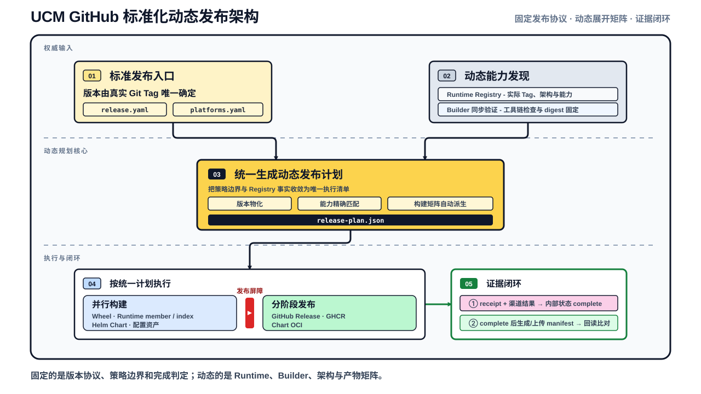
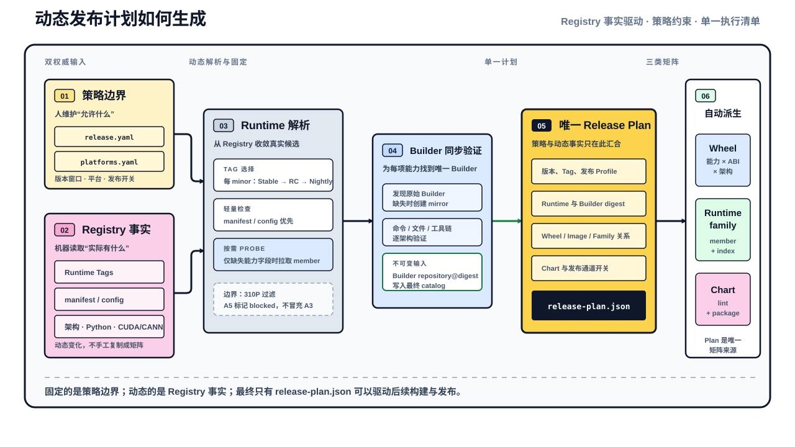
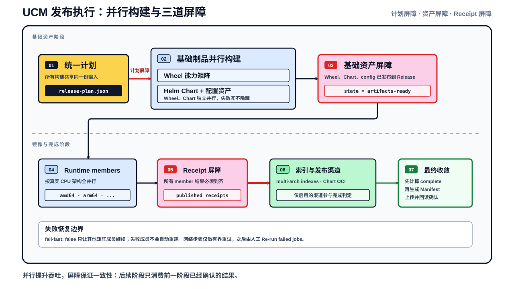
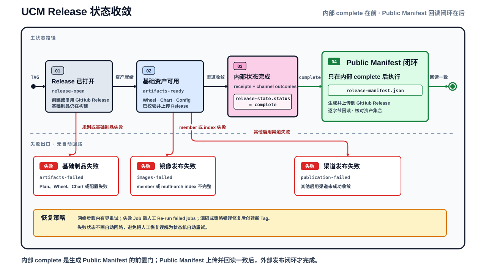
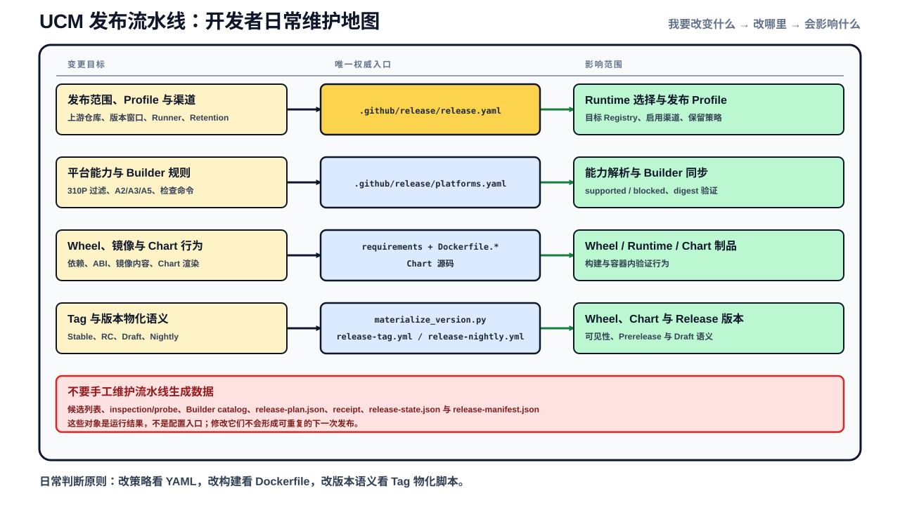

# UCM 标准化发布流水线架构

UCM 蓝区目前缺少一套标准化的产品发布：面向不同后端、Python ABI 和 CPU 架构的 Wheel，安装这些 Wheel 的 vLLM 与 vLLM-Ascend Runtime Image，以及同版本的 Helm Chart 和示例配置。上游 Runtime 持续增加版本、架构和加速能力，如果 Workflow 用静态矩阵复制某一时刻的产品清单，维护者就必须反复同步版本表、Builder、Wheel 和镜像规则；任何一处遗漏，都可能产生“Job 成功，但 Release 不完整”的结果。

标准化发布流水线要提供的核心能力，是从一个不可变 Git Tag 和当前 Registry 中可确认的 Runtime 能力出发，自动生成一致的发布清单，按依赖并行生产制品，并在所有启用渠道完成回读后关闭本次发布。

## 1. 架构目标与范围

流水线围绕以下能力设计：

| 能力 | 目标 |
| --- | --- |
| 统一发布入口 | Stable、Prerelease、Draft 和 Nightly 都通过真实远端 Tag 固定源码与版本语义 |
| 动态能力发现 | 从 Runtime Registry 读取实际存在的 Tag、架构和能力，不在 Workflow 中维护上游版本矩阵 |
| 一致产品规划 | Wheel、Runtime member、multi-arch index、Chart 和发布渠道共享同一份 `release-plan.json` |
| 并行制品生产 | 独立 Wheel、Runtime member 和 Chart 尽量并行，只保留真实依赖形成的屏障 |
| 集中维护边界 | 开发者只修改策略、构建入口和版本规则，不手工编辑流水线生成数据 |

当前策略覆盖 vLLM、vLLM-Ascend、`amd64`、`arm64`，以及 Stable、Prerelease、Draft、Nightly 四类发布。现行 Profile 启用 GitHub Release、GHCR 和 Chart OCI；PyPI 与 Docker Hub 保留渠道接口，但默认关闭。

本文解释软件制品如何形成一致 Release。GPU/NPU 真机运行、模型服务可用性和 Kubernetes 集群部署属于发布后的验收范围，不由流水线的 `complete` 状态代替。

## 2. 发布对象

一次发布包含三类相互关联的产品：

- **Wheel**：按 Backend、Runtime Variant、Python ABI 和 CPU 架构构建。Wheel 记录实际平台标签、GLIBC 符号下限和外部依赖，并绑定生成它的 Builder digest。
- **Runtime Image**：以 digest 固定上游 Runtime member，安装计划指定的 Wheel，验证运行环境、Wheel 安装与 `import ucm`，再发布单架构 member；同一 Runtime family 存在多个架构时，流水线继续生成 multi-arch index。
- **Helm Chart 与示例配置**：Chart 经过 lint、render 和 package 检查；Chart 包、Wheel 和 `ucm_config_example.yaml` 作为 GitHub Release 基础资产发布，Chart 还可以进入 OCI Registry。

## 3. 总体架构

*Git Tag 与策略文件给出稳定发布边界，Registry 提供本次实际存在的 Runtime 与 Builder 能力；Release Planner 生成统一产品清单，Workflow 再按依赖执行并收集完成证据。*

主流程从真实 Tag 开始：

1. Tag Classifier 将 Tag 转换成发布类型、制品版本和 Release 可见性；Workflow 同时冻结 Tag 指向的源码 SHA。
2. Policy Resolver 读取 Runtime 仓库、版本窗口、平台规则、发布 Profile 和渠道开关。
3. Runtime Discovery 从 Registry 选择实际版本和 member，优先读取 OCI manifest/config；只有关键能力字段缺失时，才在对应 CPU 架构上拉取并探测镜像。
4. Builder Sync & Verify 为每项可支持能力准备唯一 Builder，验证工具链与标签，并把 Builder 固定为 `repository@digest`。
5. Release Planner 汇合版本、Runtime Selection 和最终 Builder Catalog，生成唯一 Release Plan 及 Wheel/Image matrix。
6. Workflow 按 Plan 构建 Wheel、Runtime Image 和 Chart，通过发布 receipt 与渠道 Job 结果计算内部状态；只有内部状态为 `complete`，才生成、上传并回读 `release-manifest.json`。

完整发布身份由不可变 Tag、Tag 对应的源码 SHA、Actions Run 和 Release Plan 共同限定。源码 SHA 由 Workflow 输入冻结，不写入 `release-plan.json`；Plan 只保存下游构建和发布需要的产品坐标。

## 4. 动态发布计划

### 4.1 策略只描述支持边界

`.github/release/release.yaml` 维护 Runtime 仓库、最低版本、Runner、四类 Release Profile、发布渠道、保留数量和 Chart smoke 输入；`.github/release/platforms.yaml` 维护平台过滤、Builder family 和 Backend 支持状态。策略明确排除 310P，并把 A5 标记为 blocked，避免流水线把未知实现能力当成已有支持。

这些文件不枚举每个待构建 Runtime。它们只回答哪些产品、平台和渠道允许进入正式发布，因此上游新增符合既有规则的 Runtime 或架构时，不需要同步扩写 Workflow matrix。

### 4.2 Registry 检查得到本次候选

Runtime Discovery 按实际存在的 minor 版本分组，每组优先选择最高 Stable，其次选择最高正式 RC，最后选择 release-nightly。Profile 可以限制本次处理的 minor 数量，但不会虚构 Registry 中不存在的版本。

选中 Tag 后，流水线读取每个 OCI member 的架构、digest 和 config，提取 Python、CUDA/CANN、SOC 与操作系统信息。manifest/config 无法提供关键字段时，原生 probe 才拉取对应 member 补齐信息。无法确认的能力不会带着默认值进入构建阶段。

### 4.3 Builder 在进入 Plan 前固定

Builder Sync & Verify 根据 Runtime Selection 查找兼容的原始 Builder。缺少 UCM Builder mirror 时，它使用现有原始镜像创建只增加标识信息的 mirror；随后在真实 CPU 架构上重新检查命令、文件和工具链，并记录最终 manifest digest。

*策略规定“允许发布什么”，Registry 检查说明“本次实际有什么”；Runtime Selection 和 Builder Catalog 将两类输入固定后，Release Planner 才生成唯一执行清单。*

### 4.4 Release Plan 固定本次产品关系

`release-plan.json` 保存本次发布的版本、Tag、Release Profile、渠道开关、Chart 坐标，以及三组核心任务：

- `wheels`：Wheel 的 Backend、Runtime Variant、Python ABI、CPU 架构和 Builder digest；
- `images`：Runtime member、对应 Wheel、目标仓库和单架构发布坐标；
- `families`：同一 Runtime 的 member 集合、目标 Tag，以及是否需要 multi-arch index。

Planner 同时输出 GitHub Actions 所需的 Wheel 与 Image matrix。找不到 Wheel、一个 Runtime member 匹配到多个 Wheel、Builder 未固定 digest、Backend 被阻断或任务数量超过上限时，Planner 直接失败，不让不完整关系进入执行面。

## 5. 并行执行与发布屏障

*Plan 固定产品坐标后，Workflow 让独立任务并行运行，并在基础资产、member receipt 和最终渠道结果处设置屏障。*

## 6. 发布状态与闭环

## 7. 发布入口、观察与维护

### 7.1 发布入口

| 入口 | 意图 | GitHub Release 行为 |
| --- | --- | --- |
| `vX.Y.Z` | Stable | 创建或复用公开 Release |
| `vX.Y.ZrcN` | Prerelease | 创建或复用公开 prerelease |
| `draft/vX.Y.Z`、`draft/vX.Y.Z-N` | 完整 Hosted 验证 | 始终保持 Draft |
| Scheduled Nightly | 从 `develop` 选择或创建不可变 `nightly/vX.Y.Z-YYYYMMDD-N` Tag | 完成 Manifest 回读后转为公开 prerelease |
| 手工推送 `nightly/vX.Y.Z-YYYYMMDD-N` | 重用 Nightly 核心流程 | 完成 Manifest 回读后转为公开 prerelease |

所有正式执行都锚定真实远端 Tag，但不一定由 Tag push 触发。Scheduled Nightly 会先创建或复用 Nightly Tag，再在同一个 Actions Run 中直接调用公共 Release Core，避免依赖 `GITHUB_TOKEN` 创建 Tag 后再次触发 Workflow。

PR 中的 `/ucm-build wheel/image/chart/all` 用于验证局部或完整构建路径。PR-scoped 制品与正式 Release 分开命名，不代表官方版本已经交付。

### 7.2 开发者修改什么

## 8. 设计取舍与验证边界

动态规划减少了人工矩阵维护，但没有消除对 Registry 的依赖。Registry 不可用、关键能力无法确认、Builder 无法唯一匹配或产品关系不完整时，流水线选择在 Plan 前失败；这是为了阻止“部分正确”的 Release 继续发布。

tag 驱动 plan，同一 Plan 让产品坐标保持一致，代价是后续 Job 不能单独修改版本、目标 Tag 或 Wheel 映射。需要改变这些关系时，必须重新生成 Plan，并在正式发布场景中使用新的不可变 Tag。

## 9. 总结

UCM 标准化发布流水线把持续变化的上游 Runtime 转换成 tag 触发的可重复执行的发布过程。
