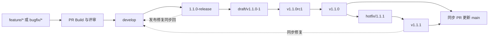
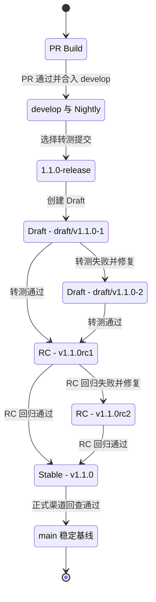
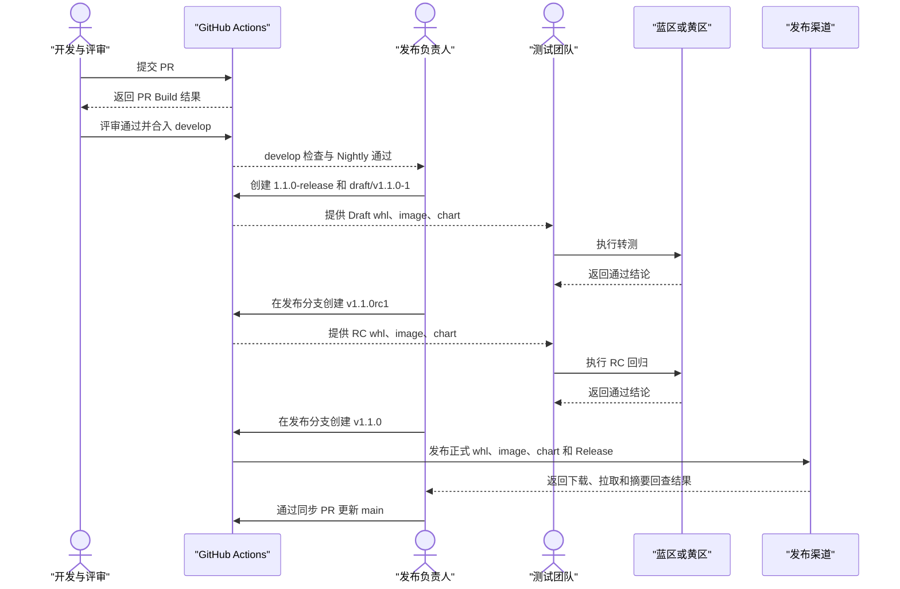

## CICD - 建立 UCM 仓库统一开发、测试与发布流程

UCM 需要建立一套团队可以共同使用的 CI/CD 流程，覆盖代码开发、PR 评审、主干集成、内部转测、RC 验证和正式发布。目前仓库还没有完整落地这套能力，已有本地流水线仅用于验证方案，不作为仓库现状。

本 Issue 用于确定主干流程和首期实施范围。

### 目标

- 普通代码通过 PR 合入 `develop`，每次合入执行集成检查，每日执行一次完整 Nightly；
- PR 支持通过 `/ucm-build whl|image|chart|all` 按需构建临时版本；
- 准备转测时，从选定的 `develop` 提交创建 `X.Y.Z-release`；
- Draft、RC 和 Stable 均从同一发布分支产生，测试对象与发布对象保持一致；
- Stable 发布成功并完成渠道回查后，再更新 `main`；
- 正式发布 `whl`、`image` 和 `chart`，并提供统一的 GitHub Release 说明。

### 发布对象

| 对象 | 首期范围 | 正式发布位置 |
| --- | --- | --- |
| `whl` | `uc-manager-cuda`、`uc-manager-cann-a2`、`uc-manager-cann-a3` | PyPI、GitHub Release |
| `image` | 已支持基础镜像、CUDA/CANN 后端、`amd64`/`arm64` 的组合 | GHCR、Docker Hub |
| `chart` | `unified-cache-pd` Helm OCI 包 | GitHub Packages |

GitHub Release 作为正式版本的统一入口：提供 `whl`，并记录镜像和 Chart 的地址、摘要、兼容范围及安装方式。

### 分支与版本约定

| 项目 | 约定 |
| --- | --- |
| 日常开发 | `feature/*`、`bugfix/*` → PR → `develop` |
| 版本发布分支 | 从选定的 `develop` 提交创建 `X.Y.Z-release`，例如 `1.1.0-release` |
| Draft 转测 | 在发布分支创建 `draft/vX.Y.Z-N` 和 Draft Release |
| RC 预发布 | 在发布分支创建 `vX.Y.ZrcN` 和 GitHub Pre-release |
| Stable 发布 | 在发布分支创建 `vX.Y.Z` 和 GitHub Release |
| 正式基线 | Stable 渠道回查成功后，通过同步 PR 更新 `main` |
| 紧急修复 | 从最近 Stable 创建 `hotfix/X.Y.Z`，发布后同步发布分支、`develop` 和 `main` |

`develop` 负责持续开发，`X.Y.Z-release` 负责当前版本的转测与稳定，`main` 只保存已经正式发布的版本。发布分支建立后，`develop` 可以继续下一版本开发。

### 分支关系图

以下以发布 `v1.1.0` 为例：

Draft 或 RC 测试失败时，在 `1.1.0-release` 上通过 PR 修复并创建新的 Draft 或 RC；已创建的 Tag 不移动、不覆盖。

### 团队角色与主干操作

| 角色 | 主干操作 |
| --- | --- |
| 开发人员 | 从 `develop` 创建短期分支，完成开发和自测，提交 PR；发现问题后提交修复 PR |
| 评审人 / 模块负责人 | 评审代码、兼容性和测试范围，确认 PR 是否允许合入目标分支 |
| 测试团队 | 对 Draft 和 RC 执行门槛测试、用例测试与回归，给出通过或阻断结论 |
| 发布负责人 | 创建发布分支和 Tag，组织发布，检查各渠道结果，发布完成后更新 `main` |

真实环境测试可以在蓝区直接执行，也可以将同一批 `whl`、`image` 和 `chart` 转入黄区执行，二选一。无论选择哪条路径，测试记录都必须对应同一个 Git SHA 和同一组产物摘要。

### 构建与版本类型

| 类型 | 来源与触发 | 主要输出 | 保留期 |
| --- | --- | --- | --- |
| PR Build | PR 新建、更新或 `/ucm-build` | 临时 `whl`、私有镜像、临时 Chart 和检查结果 | 7 天 |
| `develop` / Nightly | 每次合入和每日定时 | 集成检查、完整矩阵构建和回归结果 | 14 天 |
| Draft | 发布分支上的 `draft/vX.Y.Z-N` | Draft Release、私有镜像和测试清单 | 30 天 |
| RC | 发布分支上的 `vX.Y.ZrcN` | GitHub Pre-release、公开 GHCR 镜像、RC Chart | 长期保留 |
| Stable | 发布分支上的 `vX.Y.Z` | PyPI、GHCR、Docker Hub、GitHub Packages、GitHub Release | 长期保留 |
| Hotfix | 最近 Stable 对应的补丁版本 | 与 Stable 相同的正式渠道 | 长期保留 |

PyPI 和 Docker Hub 只接收 Stable 与 Hotfix。Draft、RC 和 Stable 均绑定不可变 Git Tag；本阶段不增加 Alpha 和 Beta。

### 版本流转

### 完整发版时序图

### 首期实施范围

- [ ] 建立 `develop`、`X.Y.Z-release` 和 `main` 的分支保护规则；
- [ ] 实现 `whl`、`image`、`chart` 的可复用构建能力；
- [ ] 实现 PR 自动检查和 `/ucm-build` 命令；
- [ ] 实现 `develop` 合入检查和 Daily Nightly；
- [ ] 实现发布分支上的 Draft、RC、Stable 和 Hotfix 流程；
- [ ] 接通蓝区或黄区真实环境测试及结果回传；
- [ ] 实现 PyPI、GHCR、Docker Hub、GitHub Packages 和 GitHub Release 发布及回查；
- [ ] 实现 PR 7 天、`develop`/Nightly 14 天、Draft 30 天的自动清理。

完成标准是：团队可以从一个 `develop` 提交创建发布分支，依次完成 Draft 转测、RC 回归和 Stable 发布；任何阶段失败都不会进入下一阶段，正式发布成功后 `main` 与 Stable Tag 的源码树完全一致。
