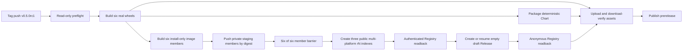

# UCM Tag 自动发布设计

- 状态：feature 真实构建与 same-SHA 双跑确定性已通过；Tag 发布仍未实现
- 日期：2026-08-10
- 决策：用户选择方案 A，一次发布 vLLM OpenAI、Ascend A2、Ascend A3 三个镜像族，每族同时包含 amd64 与 arm64。
- Runner 决策：参考 vLLM Ascend 的公开 Workflow 与成功运行，首选原生 GitHub-hosted x64/ARM64；Tag lane 允许在最终 tag barrier 前写入受保护的 private staging member，跨 Job 只传 digest record，不再要求 self-hosted 持久化大型 OCI layout。

待用户明确确认的发布策略：本设计建议把 `0.5.0rc1` 作为公开 prerelease，即 build/install/import/ABI 通过即可发布，release manifest 继续显示 `runtime/device: external-required`；stable 始终 blocked。若用户不接受这一策略，首版终点改为 private GHCR + draft Release，直至 CUDA/A2/A3 设备门禁通过。当前实现只完成了 feature 分支的真实构建与 same-SHA 确定性闭环，没有登录或写入 GHCR，也没有创建 Tag 或 GitHub Release。

## 1. 目标

当 `SuperMarioYL/unified-cache-management` 收到与 `version.ini` 完全一致的 Git tag，例如 `v0.5.0rc1`，GitHub Actions 必须在该仓库内从源码构建真实 UCM wheel，再把 wheel 安装进三个固定上游 vLLM 镜像族，生成并发布三个双架构 OCI index。

本机不预制、不手工上传 wheel 或镜像。所有发布产物都由 Tag 所指向提交里的 Workflow 构建。正常发布在同一次 GitHub Actions run 内闭合；只有首次 GHCR package 仍为 private 时，允许在 owner 完成一次可见性设置后 rerun 同一 Tag，并复用相同内容 digest。

首个发布矩阵如下。

| 镜像族 | 固定上游 tag | UCM 构建平台 | CPU 架构 | 目标仓库 |
| --- | --- | --- | --- | --- |
| vLLM OpenAI | `docker.io/vllm/vllm-openai:v0.21.0` | CUDA 13.0 | amd64、arm64 | `ghcr.io/supermarioyl/vllm-openai` |
| Ascend A2 | `quay.io/ascend/vllm-ascend:v0.22.1rc1` | CANN 9.0.0 A2 | amd64、arm64 | `ghcr.io/supermarioyl/vllm-ascend` |
| Ascend A3 | `quay.io/ascend/vllm-ascend:v0.22.1rc1-a3` | CANN 9.0.0 A3 | amd64、arm64 | `ghcr.io/supermarioyl/vllm-ascend` |

首版不发布到 PyPI，不发布到 `ModelEngine-Group`，不创建可变的 `latest`、`stable` 或平台别名，也不发布独立 wrapt 产物。

## 2. 当前基线与必须修正的差距

当前四个 release Workflow 已在 feature 分支完成精确六任务的真实 hosted 构建。`release.yaml` 中六个 builder、工具、依赖和 hosted runner 身份均已解析；`_build-wheel.yml` 从源码构建并重开六个原生 wheel，`_build-image.yml` 把同 run wheel 安装进六个固定上游 member，完整扫描本地 OCI 后只上传 compact evidence。六个 image result 都是 `real-verified-unpublished`。

2026-08-10 的当前证据绑定 source SHA `b9de1b3a29ae094e4c6d3895b0b642e92aa8ab42`：

- [Push Commit Checks run 31329098122](https://github.com/SuperMarioYL/unified-cache-management/actions/runs/31329098122) 成功；
- [Release run 31329098205 attempt 1](https://github.com/SuperMarioYL/unified-cache-management/actions/runs/31329098205/attempts/1) 与 [attempt 2](https://github.com/SuperMarioYL/unified-cache-management/actions/runs/31329098205/attempts/2) 均为 `completed/success`；
- 每次均产出 15 个 Actions Artifacts = 6 wheel + 1 Chart + 6 image compact evidence + 1 image aggregate + 1 final aggregate；冻结下载每次均为 15 个目录、213 个 artifact 文件；
- 两次均为 6/6 wheel、6/6 image、3/3 双架构 family 通过；
- 两次 final payload 均为 `sha256:88596b412798e34a037132320044d47283c1bfb9001eab20236f65ad44bcac1b`；image aggregate payload 均为 `sha256:dd2c17b710ddd01b7e836b1dbc25fac866e82a7512d43cbd3e734f083b8a7b37`；
- publication 为 `{status: blocked, attempted: false}`。

冻结证据的严格比较已通过：六个 wheel bytes、Chart tgz/result、六个 image archive checksum、OCI manifest/config/layers/diff IDs/closure、content identity/result/authority/recipe、三个 family、candidate inventory、second-zero 与两个 aggregate payload 均完全一致。日志、磁盘 telemetry 与 BuildKit session metadata 是诊断信息，不是 release identity；两个 canonical aggregate envelope 只排除了预期不同的 `github.run_attempt`。

这次闭环保留了失败链：[旧 run 31324468754](https://github.com/SuperMarioYL/unified-cache-management/actions/runs/31324468754) 在 `166e0f474a3adab88917d65b7af61ea948f7492c` 上两次 Workflow 均成功，但六个 image identity 全部漂移。共同根因是两个 runtime stage 生成的 `/var/cache/ldconfig/aux-cache`；[`ea931a95c231835a4bb4af353821084af9b998e6`](https://github.com/SuperMarioYL/unified-cache-management/commit/ea931a95c231835a4bb4af353821084af9b998e6) 在执行 `ldconfig` 的同一层删除该缓存。之后加入的 bounded wheel-build retry 只增强传输韧性；新 run 两次都没有发生 retry，retry recovery 证据来自动态 shell 测试，不能写成 hosted retry recovery。

Tag 在当前 Workflow 中仍显式进入 blocked job。生产方案尚缺 GHCR 登录与 push-by-digest、三个双架构 index 合并、目标 GHCR 发布 readback、GitHub Release draft/assets/readback、受保护 Environment，以及 CUDA/A2/A3 真设备和 cluster acceptance。这些差距不能由 feature 的 `second_reconcile.task_count=0` 代替；该值只是对同 run 严格 artifact 清单构造的候选 inventory 做重算，不是目标 GHCR 发布 readback。image job 对固定上游 base descriptor 的只读校验是另一条证据链。

CANN wheel closure 中的 `libascend_hal.so` 继续以结构化、已解析的 `kind=external-required` host-driver 依赖记录；它既没有被打进 wheel，也不是被策略放行的 unresolved dependency。

历史 fixture evidence 继续保留为候选链路回归测试，但不再作为当前 feature 主结论，也不作为真实 wheel、GHCR、GPU/NPU 或正式发布证据。以下第 4 至第 8 节描述的是尚未落地的 Tag 生产目标，不得当作当前能力说明。

## 3. 方案选择

### 3.1 方案 A - 单个 Tag 编排四个现有 Workflow

`release-ucm.yml` 作为 Tag 发布入口，依次调用 `_build-wheel.yml`、`release-vllm-images.yml` 和 `_build-image.yml`。wheel、镜像成员、OCI index、Chart 和 GitHub Release 都绑定同一个 Tag SHA。

优点是运行边界最清楚，四个 Workflow 数量不增加，feature candidate 与 Tag production 可以复用同一构建实现。失败后也可以从同一 Tag 重跑并基于 digest 恢复。

这是选定方案。

### 3.2 方案 B - Wheel Release 完成后用 `workflow_run` 再发布镜像

这种拆分减少单次运行长度，但跨运行传递 artifact 和权限更复杂，容易把错误 SHA 或不可信 artifact 带入高权限发布运行，也不利于同一 Tag 的原子证据闭包，因此不选。

### 3.3 方案 C - 首次发布全部 36 个 wheel 声明

这种方式需要当前不存在的 builder/toolchain lock、CUDA 设备、Ascend A2/A3 设备和更多上游 tag，既不能真实验证，也会重新膨胀流水线，因此不选。首版只实现用户选定的六个 wheel 与三个 index。

## 4. 发布前置条件

### 4.1 Git 与仓库边界

生产 Tag 必须同时满足：

- `github.repository == "SuperMarioYL/unified-cache-management"`；
- 首版 Tag 必须匹配 `^v[0-9]+\.[0-9]+\.[0-9]+rc[0-9]+$`，不接受已有 local、dev、post 或 stable 段；去掉 `v` 后与 `version.ini` 的 `VLLM_UC_VERSION` 完全一致；
- 新发布第一次运行时，Tag 指向的 commit 与 `origin/develop` HEAD 完全一致，且 `github.ref_protected == true`；
- draft/published rerun 时，Tag commit 必须与 durable source marker 完全一致，并且仍是受保护 `develop` 的可达祖先；
- Workflow 文件已经存在于默认分支 `develop`，不能只存在于 feature 分支；
- exact source SHA 的 feature candidate run 与 Push Commit Checks 均已成功；
- Release 不存在、是带同一 source SHA marker 的 draft，或是内容完全匹配的已发布 prerelease；其他同 Tag Release 一律拒绝；
- 触发者为仓库 owner `SuperMarioYL`，且生产 job 进入 `release-production` Environment。

要求 Tag 指向默认分支是必要的。GitHub 当前 Release API 文档说明：当 release 的目标 commit 相对默认分支新增或修改 Workflow 时，认证令牌还需要 workflow 修改授权，而 Actions 的 `GITHUB_TOKEN` 不能取得该授权。本设计通过“Tag commit 等于默认分支 HEAD”避开该边界，不引入额外令牌。

首个 Tag 前需要一次仓库设置：

- 把默认 `GITHUB_TOKEN` 权限改为 read；
- 禁止 Actions 代批 PR；
- 保护 `develop` 和 `v*` Tag；
- 创建 `release-production` Environment，required reviewer 为仓库 owner，并只允许受保护 Tag；
- 在该 Environment 设置非敏感变量 `UCM_RELEASE_POLICY=owner-reviewed-v1`；
- 确认 public repository 可以调度原生 `ubuntu-24.04` 与 `ubuntu-24.04-arm`；实际可用磁盘由每个 build job 动态检查，不能只依赖文档标称值；
- 将实现提交合入或快进到 `develop` 后再创建 Tag。

默认 token、PR approval、branch/ruleset 等管理设置不由最小权限 `GITHUB_TOKEN` 动态读取，owner 在首发前按清单配置，GitHub 平台负责强制 ruleset 和 Environment。写 job 进入 Environment 后还必须检查 `github.ref_protected` 和 `vars.UCM_RELEASE_POLICY` 的精确值，再执行 login 或写 API。单 owner fork 若由触发者本人审批，Environment 必须允许 self-review；此时 approval 只是人工确认，真正授权仍来自 tag ruleset、受保护 source 和 exact-SHA checks。若以后有第二位 reviewer，则开启 prevent self-review。

### 4.2 上游镜像固定坐标

配置只接受两个上游仓库：

```text
docker.io/vllm/vllm-openai
quay.io/ascend/vllm-ascend
```

每个目标同时记录上游 tag、index digest、amd64 member digest、arm64 member digest和各 member 的 config digest。Workflow 每次运行都重新从 Registry 读取 tag；读取结果必须与配置固定 digest 完全一致，否则视为上游 tag 漂移并在构建前失败。

2026-08-09 审计到的首发 index 与 member digest 是：

| 上游 tag | index digest | amd64 member | arm64 member |
| --- | --- | --- | --- |
| `vllm-openai:v0.21.0` | `sha256:a230095847e93bd4df9888b33dab956fa9504537b828a23657d2b26fed57b5c9` | `sha256:4ac9b7c6dabc3ec762c0edef4e9245abe98373844da91cc53ee42e5c58280c5b` | `sha256:4f63b83537c4cbd82822403965f395877054dc3b69612e7044ecd649a9badb02` |
| `vllm-ascend:v0.22.1rc1` | `sha256:9008b47081282612abfe4d28069ce34436752c980fd06f7599343213205ce64d` | `sha256:a4176a62da7ff54e8eaf2e68e09578917d5c93dab6d2c9c7ebce551781e117b3` | `sha256:638fc04eaa3654fcf14688096ed4e9d88ea0d905fa8685eed4b36d5fffe8fd8d` |
| `vllm-ascend:v0.22.1rc1-a3` | `sha256:e3d89f09a1c1d85f0ec6a1cc26e3c807b7bc8a7ec0f97a830dbef63ab50d8f81` | `sha256:ac166d960b3cb1b584f6ec413e5f4ef353b78049aa2b85e22b0e04eb8770eae4` | `sha256:28f44b9c94c7667a7cbcd6b7b91432f03e4dffe476784dfd9fd82f036bdb1e4d` |

对应 config digest：

| 上游 tag | CPU 架构 | config digest |
| --- | --- | --- |
| `vllm-openai:v0.21.0` | amd64 | `sha256:2497255b1272ba3ae9581acd51349f840038f228d0709cd9f6a142d39008d290` |
| `vllm-openai:v0.21.0` | arm64 | `sha256:f023269abe06db3a1a7cd9e170a0f5bd2b333a19ef9cb99ed8df97a70345bc25` |
| `vllm-ascend:v0.22.1rc1` | amd64 | `sha256:0539c8ff2dbe3f02d6e5de0d8a463e1d6142482d41e5139dc4b957a191951c8b` |
| `vllm-ascend:v0.22.1rc1` | arm64 | `sha256:1b8f114d14c4d0bea66ca32ebb5afe34bd1e10bfd0802b930ed678a116aaf078` |
| `vllm-ascend:v0.22.1rc1-a3` | amd64 | `sha256:9c5cc2811d8dd9f26e871389723bc432fc321ba7bf46279ec423cbdd4daf9853` |
| `vllm-ascend:v0.22.1rc1-a3` | arm64 | `sha256:c4d766b5f04fe6238a74731d67a215bb6331072ba242c7c5f24a25f99ce36c3b` |

digest 更新必须作为代码审查中的显式配置变更，不能在发布运行里静默接受。

在编译前，六个 member 都必须在对应原生 CPU runner 上执行只读 probe：`uname -m`、`python3 --version`、`sysconfig.get_config_var("SOABI")`、基础镜像 config digest，以及 CUDA 或 CANN/SOC 标识必须与 profile 完全一致。本批次只接受 Python 3.12 / `cp312`；任一 member 不是 cp312 时，六项矩阵整体失败，不能通过改 wheel 文件名绕过。

## 5. 版本与命名

### 5.1 Wheel 版本

`version.ini` 继续保存用户版本 `0.5.0rc1`。为避免同一 CPU 架构上的 CUDA、A2、A3 wheel 文件名冲突，构建时增加受控的 PEP 440 local version：

| profile | wheel version |
| --- | --- |
| CUDA 13.0 | `0.5.0rc1+cuda130` |
| CANN 9.0.0 A2 | `0.5.0rc1+cann900.a2` |
| CANN 9.0.0 A3 | `0.5.0rc1+cann900.a3` |

`setup.py` 只接受配置中声明的 local version，基础版本仍必须来自 `version.ini`。CUDA builder 已产出并验证 `manylinux_2_28` 标签；CANN A2/A3 仍使用 `linux` 标签。

预计六个 asset：

```text
uc_manager-0.5.0rc1+cuda130-cp312-cp312-manylinux_2_28_x86_64.whl
uc_manager-0.5.0rc1+cuda130-cp312-cp312-manylinux_2_28_aarch64.whl
uc_manager-0.5.0rc1+cann900.a2-cp312-cp312-linux_x86_64.whl
uc_manager-0.5.0rc1+cann900.a2-cp312-cp312-linux_aarch64.whl
uc_manager-0.5.0rc1+cann900.a3-cp312-cp312-linux_x86_64.whl
uc_manager-0.5.0rc1+cann900.a3-cp312-cp312-linux_aarch64.whl
```

### 5.2 镜像 Tag

公开镜像名保留原框架仓库 basename，公开 tag 只在完整上游 tag 后增加 UCM 版本与 index 修订号：

```text
ghcr.io/supermarioyl/vllm-openai:<exact-upstream-tag>-ucm-<base-ucm-version>-rN
ghcr.io/supermarioyl/vllm-ascend:<exact-upstream-tag>-ucm-<base-ucm-version>-rN
```

首个成功发布结果应为：

```text
ghcr.io/supermarioyl/vllm-openai:v0.21.0-ucm-0.5.0rc1-r1
ghcr.io/supermarioyl/vllm-ascend:v0.22.1rc1-ucm-0.5.0rc1-r1
ghcr.io/supermarioyl/vllm-ascend:v0.22.1rc1-a3-ucm-0.5.0rc1-r1
```

CUDA/CANN、OS、Python、A2/A3 profile 不由 UCM 再拼成长后缀；只有上游原始 tag 自带的 `-a3` 会保留。内部 recipe、OCI annotation 和 release manifest 记录全部平台细节。

`rN` 属于双架构 OCI index。amd64 与 arm64 是同一个 `r1` 的两个 member，不能分别被分配成 `r1`、`r2`。首版 immutable Tag 路径只允许产生或复用 `r1`；同一 source/config 的 rerun 若得到不同 build key 或 digest，属于不确定构建并硬失败，不能借 `r2` 掩盖。`rN` 为未来显式 image-revision 流程保留，但该流程不在首版范围。

## 6. 四个 Workflow 的职责



### 6.1 `release-ucm.yml`

这是唯一 Tag 入口和顶层编排器。

- feature branch push 继续走 candidate lane，复用真实构建实现，但只上传 Actions Artifact，不登录 GHCR、不创建 Release；
- `v*` Tag 先执行只读 preflight；
- 生成固定六项 wheel matrix；
- 调用 `_build-wheel.yml`；
- 从同一 source tree 确定性打包一个 Helm Chart tgz；三个 index readback 后，再用 CUDA、A2、A3 三组 values 和实际 `repository@digest` 分别执行 lint/template，render evidence 进入 release manifest；
- 调用 `release-vllm-images.yml`；
- 所有 image 的认证 readback 成功后创建或恢复一个空的 draft Release；
- GHCR 匿名 readback 成功后生成最终 release manifest，再上传六个 wheel、Chart、checksums 和 manifest；
- 从 GitHub Release 下载每个 asset 并重算 SHA；
- asset readback 与三个公开 index 全部匹配后，把 `rc` Release 发布为 prerelease。

### 6.2 `_build-wheel.yml`

每次调用只构建一个 `(profile, cpu_arch)`，由顶层 matrix 并行调用六次。

- `amd64` 固定使用 GitHub-hosted `ubuntu-24.04`，`arm64` 固定使用原生 GitHub-hosted `ubuntu-24.04-arm`，不使用 QEMU；
- runner mapping 固定在受信配置中，Workflow caller 不能传 raw `runs-on` labels；
- wheel matrix 设置 `fail-fast: false`，单 job `timeout-minutes: 180`，让六项都产出明确结果但不把超时误报成外部完成；
- checkout 后运行固定 commit `jlumbroso/free-disk-space@54081f138730dfa15788a46383842cd2f914a1be`，保留 Docker 基础镜像但清理无关 SDK、large packages 与 tool cache；随后记录 `df -BG`、Docker data-root 和 BuildKit usage，根分区可用空间低于 `60GiB` 时以 `hosted-capacity-insufficient` 失败；
- 每个任务都在临时 builder 容器中编译；CUDA、Ascend A2、Ascend A3 分别使用独立、原生架构的 builder image，配置必须固定 builder index/member/config digest，不能用 mutable tag；builder 与最终 vLLM runtime image 分离；
- 额外系统包、Python build 包和工具链全部由带制品 digest 的 lock 安装；
- `PLATFORM` 分别为 `cuda`、`ascend`、`ascend-a3`；
- `ENABLE_SPARSE=false`，不构建独立 Ascend custom-op wheel；
- common required native targets 精确为 `ucmtrans`、`metrics`、`ucmmetrics`、`ucmlogger`、`ucmnfsstore`、`ucmpcstore`、`posixstore`、`compressor`、`cachestore`、`emptystore`、`fakestore`、`ucmpipelinestore`；
- CUDA 明确禁止 `mooncakestore`，Ascend A2/A3 明确要求 `mooncakestore`；首版所有 profile 都禁止 `ds3fsstore`、MindIE extension 和全部 sparse targets；
- CMake 增加 required/forbidden component gate，依赖缺失导致配置失败，不能再用日志中的 `Skipping build` 生成不完整 wheel；inspector 对 wheel native member set 做 exact equality；
- 使用 Tag commit time 作为 `SOURCE_DATE_EPOCH`；
- 使用固定工作目录和 `-ffile-prefix-map`、`-fdebug-prefix-map` 消除 runner 绝对路径；native linker 选项和 build-id 策略进入 toolchain digest；
- CMake 下载依赖由 immutable commit 固定，不再只信 mutable tag：
  - fmt `40626af88bd7df9a5fb80be7b25ac85b122d6c21`；
  - spdlog `6fa36017cfd5731d617e1a934f0e5ea9c4445b13`；
  - pybind11 `f5fbe867d2d26e4a0a9177a51f6e568868ad3dc8`；
  - zlib `51b7f2abdade71cd9bb0e7a373ef2610ec6f9daf`；
- 使用 commit SHA 后关闭当前 `GIT_SHALLOW TRUE` 路径，或改用带 SHA256 的源码 archive，避免浅克隆无法取得指定 commit；
- builder 系统包、Python 包和工具必须有版本与制品 digest；任一锁未解析则该任务失败，不允许降级成 fixture；
- 真实 wheel 构建后插入规范化的 `ucm-build.json`，重写 `RECORD`，固定 ZIP 时间戳、顺序和权限；
- inspector 重新打开 wheel，校验文件 SHA、METADATA 版本、Requires-Dist、WHEEL tag、RECORD、native ELF 架构、source SHA、profile、上游 member/config digest 和 toolchain digest；
- 输出 wheel、`wheel-record.json` 与检查日志，状态为 `candidate-verified`、`publication_status: unpublished`；Actions Artifact 名精确包含 source SHA、profile 与 CPU 架构，六项不得重名。

同一 source SHA 的 rerun 必须产出相同 wheel SHA，否则 Tag 发布失败。

GitHub 文档当前仍把标准 public Linux runner 的 SSD 标为 `14GB`，因此不能把 live 容量当成永久规格；但 vLLM Ascend 的公开成功 run `31246405996` 实际在标准 hosted x64/ARM64 runner 上分别看到约 `145G/146G` 根分区，清理后可用 `116G/122G`，并完成了比本设计 install-only 镜像更重的源码编译。这里采用 hosted-first、每 job 动态 preflight 和真实 feature run 验收；只有实际 preflight 或构建证明不足时，才把 larger/self-hosted runner 作为测得的 fallback，而不是首发硬前置。UCM 只复用其 runner、磁盘清理和 digest merge 拓扑；上游使用的 floating Action tag 不进入本设计，全部第三方 Action 仍固定完整 commit SHA。

### 6.3 `_build-image.yml`

每次调用只构建一个镜像 member。

- 输入为同一 run 的 exact wheel Artifact、目标配置和 exact upstream member digest；
- 最终 context 只含 Dockerfile、安装/检查 helper、recipe、UCM wheel 和普通依赖 wheelhouse；
- context 不含 UCM 源码、`setup.py`、CMake、编译器或 UCM build 命令；
- wrapt 只作为 `Requires-Dist: wrapt==1.17.2` 的普通依赖，通过带 hash 的标准 pip lock 下载并安装；没有独立 wrapt Workflow、manifest、Release asset 或发布状态；
- cp312/glibc wheel lock 固定为 amd64 `wrapt-1.17.2-cp312-cp312-manylinux_2_5_x86_64.manylinux1_x86_64.manylinux_2_17_x86_64.manylinux2014_x86_64.whl@sha256:bc570b5f14a79734437cb7b0500376b6b791153314986074486e0b0fa8d71d98`、arm64 `wrapt-1.17.2-cp312-cp312-manylinux_2_17_aarch64.manylinux2014_aarch64.whl@sha256:5bb1d0dbf99411f3d871deb6faa9aabb9d4e744d67dcaaa05399af89d847a91d`；下载文件名和 bytes 必须与 PyPI record 精确匹配；
- Dockerfile 使用 `FROM <exact-repository>@<member-digest>`；
- requirements lock 使用 `uc-manager @ file:///artifacts/<exact-wheel> --hash=sha256:<wheel-sha>`，普通依赖也逐项带 hash；pip 使用 `--no-index --find-links --require-hashes --only-binary=:all:` 安装 wheelhouse，因此 `direct_url.json` 必须精确指向该 wheel；
- 执行 `pip check`、`import ucm`、`import wrapt`、版本、`direct_url.json`、ELF 架构和基础镜像 descriptor chain 检查；
- 固定 Buildx `v0.19.2`，其 amd64 binary SHA 为 `sha256:a5ff61c0b6d2c8ee20964a9d6dac7a7a6383c4a4a0ee8d354e983917578306ea`、arm64 为 `sha256:bd54f0e28c29789da1679bad2dd94c1923786ccd2cd80dd3a0a1d560a6baf10c`；固定 BuildKit `v0.18.2@sha256:86c0ad9d1137c186e9d455912167df20e530bdf7f7c19de802e892bb8ca16552` 和 Dockerfile frontend `1.12.1@sha256:93bfd3b68c109427185cd78b4779fc82b484b0b7618e36d0f104d4d801e66d25`；
- 使用 `SOURCE_DATE_EPOCH=<tag-commit-time>`、`rewrite-timestamp=true`、`--provenance=false`、`--sbom=false`，并禁用 pip cache/version check；这些参数和 toolchain authority 都进入 build key；
- 首次 push 前写入 `org.opencontainers.image.source=https://github.com/SuperMarioYL/unified-cache-management`、`org.opencontainers.image.revision=<source-sha>` 和 UCM build-key annotations，使 GHCR package 自动关联来源仓库并可被 readback；
- feature lane 输出本地 OCI 与 compact evidence，随后删除大型 tar；
- Tag lane 进入 `release-production` Environment 后使用 `contents: read, packages: write`，Buildx 输出为 `type=image,name=ghcr.io/supermarioyl/ucm-release-staging,push-by-digest=true,name-canonical=true,push=true`；不导出本地 OCI tar，也不跨 job 保存大镜像；
- image member job 的 `timeout-minutes` 为 `210`；超过时失败且不进入最终 tag barrier，不能通过放宽验证换取完成；
- staging package 已存在时，写入前必须由 Packages API 证明它仍为 private、已关联本仓库且本仓库 Actions 具有 write 权限；首次创建使用 GitHub Container registry 的默认 private 可见性，首个 member 写入后立即重读并要求 `visibility == private`，否则该 job 失败且最终 tag barrier 永远不开放；
- 每个 member push 完成后立即按 digest 做认证 readback。创建唯一 GC-protection tag `staging-<64-hex-member-build-key>` 前必须在 Tag run 锁内读取该 tag：不存在才创建，已指向同一 member digest 则只读复用，指向任何其他 digest 则在 retag 前硬失败；tag 只位于 private staging package，不是正式发布 tag；
- Actions Artifact 只上传 canonical digest record、wheel SHA、build key、manifest/config/layer descriptor、构建门禁和磁盘峰值，预计为 KB 级；Artifact 名精确包含 source SHA、image family 与 CPU 架构；
- 首版禁用 Registry `cache-to`，避免新增另一组 mutable tag 和写权限；如使用 `cache-from`，只接受配置中固定的 immutable digest，cache miss 必须仍能完整构建，cache 内容不作为发布信任根；
- 每个 job 结束前再次记录磁盘峰值和 BuildKit usage。member build 或 staging push 失败时保留失败证据，但不创建任何正式 `r1` tag 或 GitHub Release。

这种做法有意把安全边界从“barrier 前 Registry 绝对零写入”调整为“barrier 前只允许 private、content-addressed staging 写入，禁止最终 tag/Release”。这是去掉 persistent self-hosted storage 的关键交换：大型 OCI bytes 直接流向 GHCR，跨 job 只传 digest record。

首版没有 CUDA/NPU 设备 runner。若用户批准文档开头的公开 prerelease 策略，本配置选择的 RC 明确标为 build/install/import verified prerelease；runtime/device gate 保持 `external-required`，不得描述成设备验证通过。若用户不批准，GHCR 保持 private、Release 保持 draft。稳定版在这些 gate 通过前始终 blocked。

### 6.4 `release-vllm-images.yml`

这个 Workflow 负责 Registry reconcile、member matrix、index 合并和 readback。

- Tag lane 只接受来自同一 `release-ucm.yml` run 的六个 wheel record；
- 为三个镜像族各生成两个 member task；
- 先对现有 GHCR tags 和 annotations 做只读 inventory；
- 按 canonical `{target_repository, tag_base}` 计算 tag family；
- 顶层 `release-ucm.yml` 用 `ucm-tag-${repository_id}-${ref_name}` 锁住整个 Tag run，`cancel-in-progress: false`；member matrix 不再按 family 单独配置 concurrency，避免同 family 的两个架构互相串行或被 pending-run 淘汰；
- 六项 barrier 后，单个 merge job 按规范化 `{target_repository, tag_base}` 排序依次处理三个 family；每个 family 在同一 Tag run 锁内重新读取 inventory，不存在 tag 时创建 `r1`，已有完全相同 build key/digest 时复用 `r1`，已有任何不同内容时硬失败；
- 六个 `_build-image.yml` member job 在原生 hosted runner 上独立 build/verify，并且只允许向 exact staging package push-by-digest；matrix 设置 `fail-fast: false`，所有六项结束后形成显式 barrier；
- barrier 前可以存在 private staging member 与唯一 GC-protection tag，但三个目标仓库的正式 `r1` tag 和 GitHub Release 必须都不存在；任一 member 为 failed、cancelled 或 skipped 时，merge/index/Release jobs 全部不启动；
- barrier 后的 merge job 下载六个 digest record，逐项重算 record digest，并从 staging package 认证重读 member manifest/config/layers、annotations、wheel SHA 与 build key；
- 使用 `docker buildx imagetools create` 从 staging digest 为三个目标仓库各创建一个双架构 `r1` index；同一 index 的两个 member 必须分别为 `linux/amd64`、`linux/arm64`，顺序和 build key exact；
- index annotation 记录 exact source、wheel、upstream、member、toolchain 和 build key；
- 再次读取公开 tag、index、两个 member 与 config，结果写入 release manifest；
- schedule、manual 和 repository dispatch 保持 candidate/read-only，不允许进入 Tag publish job。

staging identity 不能复用 vLLM Ascend 的共享 `nightly-*-temp` 形式。GC-protection tag 完整绑定 member build key，而 build key 已绑定 source SHA、profile、CPU 架构、wheel 和上游 digest；同一 release Tag 的 batch concurrency 禁止重叠 run。vLLM Ascend 曾出现 merge 时临时 digest 已被 Registry 回收的失败，本设计必须在 member push 后立即以“缺失才创建、同 digest 才复用”的规则加唯一 staging tag，并在 merge 前重新 readback。

GHCR 没有可依赖的通用 tag compare-and-swap。本设计通过 GitHub concurrency、锁内重读、最小 packages write 权限和发布后 readback防止本 Workflow 自身覆盖；若目标 `r1` 已被不同 build key 占用，或同 build key 的 readback digest 与记录不一致，则硬失败，绝不覆盖。Registry 外部管理员仍可改写 tag，这一平台限制必须在文档中保留。

## 7. Build key、发布记录与可恢复性

member build key 使用 `schema_version: 2` 的 exact-key JSON 对象。编码规则为 UTF-8、键按 Unicode code point 排序、无多余空白、拒绝重复键，digest 为小写 `sha256:<64-hex>`。对象精确绑定：

- UCM Tag、source commit、基础版本和 wheel local version；
- wheel SHA、wheel profile、CPU 架构；
- exact upstream repository、tag、index/member/config digest；
- Dockerfile、安装 helper、检查 helper和 toolchain authority digest；
- 普通依赖 lock digest；
- source epoch 与构建参数。

index build key 使用相同 canonical JSON 与 SHA256 规则，精确绑定两个按 `linux/amd64`、`linux/arm64` 排序的 member build key、两个 member manifest digest、target repository 和 tag base。它不把 runner ID、run ID、attempt、时间戳或签名字节放入内容身份。Schema 缺字段、多字段或版本不匹配都硬失败。

`release-manifest.json` 是本次 GitHub Release 的可审计记录，至少包含：

- release Tag、source SHA、workflow ref；
- 六个 wheel 的文件名、SHA、size、version、profile、架构和 build record digest；
- Chart filename、SHA、source/release tree digest；
- 三个上游 index 和六个上游 member/config digest；
- 三个目标 index、六个目标 member/config digest；
- 三个 tag family、rN、public tag 和 build key；
- install/import/ABI gate 结果；
- `runtime_validation: external-required` 与 `device_validation: external-required`；
- GitHub Release 预期 asset 集合与 SHA，以及 GHCR anonymous readback 结果。

Release asset 的实际下载复验发生在 manifest 上传之后，因此不把自引用的“manifest 已验证”写回 manifest。下载结果保存在同一次 Actions run 的 verification evidence 和日志中，全部通过后才把 draft 发布为 prerelease。

失败恢复规则：

- wheel build 发生在任何 Registry 写之前；任一 wheel 失败时没有 Registry 或 Release 写入；
- image member build、验证或 staging push 失败时，可能留下 private staging blob/member manifest 或唯一 staging tag，但三个目标仓库都不能出现正式 `r1`，GitHub Release 也不能创建；这些 staging 内容不是发布成功，rerun 只在 build key 与 readback digest 完全匹配时复用；
- draft Release 的 body 在创建时先写 machine-readable `source_sha`、release Tag 和 batch digest marker；marker 不匹配时禁止恢复；
- draft Release 创建后失败时，保持 draft，不发布；
- member 已写入 staging 但 index 尚未创建时，rerun 复用相同 digest record，并再次完成六项 barrier；
- 三个 index 不是跨仓库事务；若部分 `r1` 已创建而后续 family 失败，GitHub Release 不发布，rerun 必须对已存在 family 做 exact readback 并复用，不能重写；
- index 已创建但 Release 尚未发布时，rerun 通过 annotation 找到相同 build key 并复用同一 rN；
- 已发布 Release 若 source、manifest、asset 和 Registry digest 全部匹配，则 rerun 进入只读幂等验证并成功；任一不匹配则失败；
- 已发布 Release 或相同 Tag 下的 asset 不允许替换；同名不同内容直接失败；
- Workflow 不授予 delete 权限，不执行删除或强制覆盖；private staging tag 以完整 build key 命名，同一内容 rerun 不新增 tag。首版接受每个真实 release 最多保留六个 staging member 作为恢复证据，后续若增加 retention 必须独立设计 admin 审批，不能静默删除。

## 8. GitHub 权限与 GHCR 可见性

顶层设置 `permissions: {}`，每个 job 按职责单独授权：

| job 类别 | 权限 |
| --- | --- |
| Tag preflight 与 exact-SHA run 查询 | `contents: read`, `actions: read` |
| checkout、plan、build、test、匿名 Registry readback | `contents: read` |
| 私有 package inventory | `contents: read`, `packages: read` |
| 受保护 Tag 的 staging member build/push | `contents: read`, `packages: write` |
| barrier 后的 GHCR index publish | `contents: read`, `packages: write` |
| draft Release 和 assets | `contents: write` |

调用 reusable Workflow 的 caller job 必须显式授予被调用路径所需的上限；called workflow 只能降低、不能提升 caller 权限。feature/schedule/manual 的 `_build-image.yml` caller 只有 `contents: read`，不得 login 或 push。受保护 Tag 的 member caller 和 barrier 后的 index/Release publisher 才能取得各自需要的写权限；member staging、index publisher 和 Release publisher 三类写 job 都绑定 `release-production` Environment。

首版不需要 `id-token: write`、`attestations: write`、Secrets、PAT、`workflows: write` 或 `packages: delete`。GHCR 使用 `${{ github.actor }}` 与 `${{ secrets.GITHUB_TOKEN }}` 登录；GitHub 官方支持工作流用 `GITHUB_TOKEN` 发布与仓库关联的 Container package。

写入前先用同一个 `GITHUB_TOKEN` 查询目标 package：不存在时只允许首次创建 staging package；存在时必须已经关联本仓库且本仓库 Actions 具有 admin/write access。staging package 还必须为 private；若不可读、未关联、没有写权限或已变为 public，流程在 push 前失败并输出 owner 修复指引，不能尝试覆盖。目标发布 package 的 public visibility 仍按下面的一次性 bootstrap 处理。

Container package 首次出现时可能是 private。发布流程不假设可见性：

1. wheel barrier 全部成功后，受保护 Tag 的 member matrix 才能向 private staging package 写 content-addressed member；
2. 六个 member build/push/认证 readback 全部成功后，index barrier 才允许创建三个目标仓库的正式 `r1`；
3. 六个 member 与三个 index 全部完成认证 readback 后，创建或恢复带 source marker 的空 draft Release；
4. 若三个 tag 的匿名 readback 失败，draft 保持为空，不上传最终 assets，Workflow 明确输出 package visibility bootstrap 指引；
5. 仓库 owner 在 GitHub package settings 中把 `vllm-openai` 与 `vllm-ascend` 设为 public；
6. 重跑同一 Tag，重新构建并证明内容 digest 相同，随后复用已存在的 member/index/r1；
7. 三个 tag 都能匿名按 digest 读取后，才生成最终 manifest、上传并 readback Release assets、发布 GitHub prerelease。

这是一次性的 GitHub package visibility bootstrap，不引入 PAT，也不把 private package 误报为已公开。后续 Tag 应全自动通过。

## 9. 校验策略

### 9.1 TDD 与静态测试

实现阶段先增加 RED，再修改实现。至少覆盖：

- Tag 与 `version.ini` 不一致；
- Tag 不在 exact `origin/develop` HEAD；
- 仓库、actor 或 Environment 不符合；
- 上游 repository 非 exact allowlist；
- 上游 tag digest、member 架构或 config 漂移；
- wheel local version、文件名、METADATA、RECORD、ELF 或 build record 被篡改；
- 六项 matrix 缺失、重复或多余；
- CUDA/A2/A3 wheel 互换；
- amd64/arm64 被错误分成不同 rN；
- 同 build key 重跑保持 r1；同 source/config 的 wheel、member 或 index 内容漂移必须硬失败，不能产生 r2；
- public tag 中错误加入 CUDA/CANN/OS/Python/channel 后缀；
- feature、schedule、manual route 出现 login、push、Release 或写权限；
- hosted 磁盘清理后低于阈值仍继续 build，或没有记录 build 前后 `df`/BuildKit 峰值；
- Tag member job 向 exact staging package 之外写入、启用 Registry `cache-to`、使用共享/mutable 临时 tag、staging tag 未绑定完整 build key，或把 staging tag 当成正式发布结果；
- 已存在的 staging tag 指向不同 digest 时仍执行 retag，或相同 digest rerun 没有走只读复用；
- 六个 member direct need 任一为 failed、cancelled 或 skipped 时，index publisher 和 Release publisher 仍启动；只有六项全部 success 才能越过最终 tag barrier；
- digest record 缺失、重复、多余，或 staging manifest/config/layer/annotation/wheel SHA/build key readback 被篡改后仍能 merge；
- 同一 Tag 的两个 run 能重叠修改 staging/final tag、member matrix 错用 per-family concurrency、三个 family 未按规范顺序锁内重读，或 final tag 在 barrier 前出现；
- final image context 出现 UCM 源码、CMake 或编译命令；
- Release asset 或 GHCR readback 任一 digest 不匹配；
- 同一 Tag 已发布、同名 asset 不同内容、同 rN 不同 build key；
- package 仍 private 时 Release 保持 draft。

### 9.2 本地验证

- compact release pytest 全量通过；
- repository lint/unit tests 通过，若有环境依赖则精确记录而不误报；
- actionlint 对所有 Workflow 通过；
- 三个 Schema 严格校验；
- CUDA/A2/A3 Helm lint/template/package 且双包 SHA 一致；
- 本机只执行合同、Schema、Chart 和静态测试，不本地构建或上传 wheel/image；真实 wheel/image 证据只接受 GitHub-hosted Workflow 的 same-run Artifact；
- Registry 写入与 readback 测试留给后续受保护 Tag Workflow，不用本地 loopback Registry 或 fixture index 替代正式证据；
- `git diff --check` 与精确 staging guard 通过。

### 9.3 GitHub feature candidate

在任何 Tag 写入前，先把实现推到 `origin/feature/cicd`：

- 六个真实 wheel job 全部成功；
- 六个真实 install-only image member build 全部成功，但不 push；
- wheel、Chart、OCI/evidence 由 Workflow 生成；
- x64/ARM64 job 的磁盘 preflight 通过并记录实际峰值；若任一 job 低于阈值或 `ENOSPC`，保持 blocked，再依据实测决定是否引入 larger/self-hosted fallback；
- 同一 SHA rerun 后六个 wheel SHA、Chart SHA、六个 OCI member digest 和三个预期 index build key 完全一致；
- 第二次 full reconcile 为零新增；
- PR、Tag、Release、GHCR 和 upstream 均无写入。

当前 run 的两个 attempt 已满足本节 feature candidate 项：六个真实 wheel、六个 install-only image、Chart、三族双架构计划、磁盘门禁、feature 内部 second-zero、same-SHA canonical identity 全量一致，以及 PR、Tag、Release、GHCR 和 upstream 零写入。唯一远端输出是正常的 Actions Artifact 上传。完整 OCI tar 在各 image job 内验证后删除，只上传 compact evidence。Actions Artifact 只有三天 retention，rerun 会更换 artifact ID，因此验收应从当前 run API 枚举 Artifact，不能把任一 attempt 的临时 ID 写成长期下载地址。两次 hosted wheel build 都在首次尝试成功，不能把动态 shell 测试覆盖的 bounded retry 写成 hosted recovery 证据。

### 9.4 首个真实 Tag 发布

只有 feature candidate 全绿并且代码已进入 `develop` 后，才允许用户明确授权推送 `v0.5.0rc1` Tag。完成标准是：

- `Release UCM core artifacts` Tag run 全绿；
- GitHub prerelease `v0.5.0rc1` 存在；
- Release 含六个真实 wheel、一个 Chart tgz、checksums 与 release manifest；
- 三个目标 GHCR tag 存在，均能匿名读取；
- 每个 tag 是同时含 amd64/arm64 的 OCI index；
- Release asset、wheel record、上游 digest、目标 member/index digest 可从同一 manifest 反查；
- 对成功的 Tag run 做一次 same-run rerun，进入只读幂等路径，仍复用 r1，不产生 r2，不替换 asset；
- fork PR、额外 Tag、额外 Release 和 upstream 均无变化。

如果 GHCR 首次 visibility 仍为 private，状态是 `publication_blocked: package-visibility`，不算发布完成。

## 10. 实施边界

本设计只修改当前紧凑 `.github/release/` 工具包、四个 release Workflow、三份现有 Schema、`setup.py` 的受控 local version、四个 vendor CMake immutable pin、required-component gate、测试和两份正式发布文档。不会恢复已删除的顶层 `release/`、`scripts/release/`、`docker/release/`，不会新增第五个 release Workflow，也不会恢复独立 wrapt、PR release、自定义本地 release state 或 `/opt/ucm-release` 接口。

实现期间继续保护当前工作区的三个用户 C++ 修改，所有提交只做精确 staging。

实现完成前，下列能力保持明确状态：

- hosted x64/ARM64 的六个真实 UCM wheel、六个 install-only image member 与 same-SHA 双跑确定性：已验证并产出 Actions Artifacts；
- protected Tag 生产 Workflow、GHCR push/index/readback 和 GitHub Release：尚未实现，当前 Tag route 明确 blocked；
- CUDA/A2/A3 真设备 runtime/device 验证：`external-required`；
- stable release：`blocked`；
- PyPI、ModelEngine org、可变 tag alias、签名/attestation：不在首版范围；
- GHCR 公共可见性：首个 package 需要一次 owner bootstrap，匿名 readback 前 Release 不发布。

## 11. 官方约束与参考实现

- [GitHub-hosted runners reference](https://docs.github.com/en/actions/reference/runners/github-hosted-runners) - 文档标称标准 public Linux x64/arm64 为 14GB SSD；设计因此保留动态容量门禁，不能把某次 live 容量当平台承诺。
- [vLLM Ascend hosted image Workflow](https://github.com/vllm-project/vllm-ascend/blob/d2e818f572299c93f1f7f3b2aed05b615f58b527/.github/workflows/_schedule_image_build.yaml) - 原生 hosted x64/ARM64、磁盘清理、push-by-digest、digest Artifact 和 imagetools merge 的参考实现。
- [vLLM Ascend 成功 image run 31246405996](https://github.com/vllm-project/vllm-ascend/actions/runs/31246405996) - 16 个架构 build job 均为 GitHub-hosted；公开日志显示清理后 x64/ARM64 分别约有 116GiB/122GiB 可用并成功构建。
- [vLLM Ascend 成功 wheel run 31248959294](https://github.com/vllm-project/vllm-ascend/actions/runs/31248959294) - A2/A3/310P 的原生 x64/ARM64 wheel matrix 在 hosted runner 上成功；UCM 只参考 runner/builder 拆分，不复制其源码直装镜像边界。
- [vLLM Ascend 失败 image run 28449137398](https://github.com/vllm-project/vllm-ascend/actions/runs/28449137398) - merge 阶段曾遇到临时 member digest 不存在；UCM 因此使用 build-key 唯一保护 tag、禁止重叠 run，并在最终 merge 前重读全部 staging 内容。
- [free-disk-space pinned commit](https://github.com/jlumbroso/free-disk-space/tree/54081f138730dfa15788a46383842cd2f914a1be) - upstream 实际固定的清理 Action；UCM 同样固定完整 commit，并在清理后做自己的容量门禁。
- [Publishing Docker images](https://docs.github.com/en/actions/tutorials/publish-packages/publish-docker-images) - GHCR 可使用 `GITHUB_TOKEN` 与 `packages: write`，第三方 Action 应固定完整 commit SHA。
- [Working with the Container registry](https://docs.github.com/en/packages/working-with-a-github-packages-registry/working-with-the-container-registry) - 从仓库 Workflow 发布会自动关联 package。
- [Configuring package visibility](https://docs.github.com/en/packages/learn-github-packages/configuring-a-packages-access-control-and-visibility) - 首次 package 可能为 private，public Container package 才能匿名拉取。
- [REST API endpoints for releases](https://docs.github.com/en/rest/releases/releases) - 创建和更新 GitHub Release 需要 contents write；Tag commit 与默认分支的 Workflow 差异会影响授权边界。
- [crane v0.20.3](https://github.com/google/go-containerregistry/blob/v0.20.3/cmd/crane/doc/crane.md) - 用 checksum-pinned crane 做 Registry inventory、raw readback 与 digest 校验；生产 image bytes 由 Buildx 直接 push-by-digest。
