# UCM 完整生产发布 Workflow 设计

- 状态：已确认设计，待实施计划
- 日期：2026-08-13
- 方案：方案 1 — Tag Router + 默认分支可信生产控制器
- 首次真实验收仓库：`SuperMarioYL/unified-cache-management`
- 首次发布线：`0.6.0-release`
- 首次真实标签：`draft/v0.6.0-1`、`v0.6.0rc1`

## 1. 目标与非目标

本设计把现有只读发布生命周期控制面与已经通过 GitHub Hosted Actions 验证的真实 wheel、Chart、双架构镜像构建能力，组合为一套可在 fork 和主仓库复用的完整生产发布 Workflow。首轮在 `SuperMarioYL/unified-cache-management` 真实创建 GHCR 包与 GitHub Draft/Pre-release，并对远端产物做回读校验。默认分支先通过受保护 PR 合入通用生产控制代码和 `0.6` 发布线配置；随后从该提交创建 `0.6.0-release`，再通过发布分支上的受保护提交把 `version.ini` 从历史 `0.5.0rc1` 切换为 `0.6.0`。发布运行不得临时修改版本文件，默认分支上的冻结旧链也不会因新发布线而失效。

完整实现覆盖 Draft、RC、Stable 和 Hotfix：

| 阶段 | Git Tag | GHCR | Chart | Wheel | GitHub Release |
| --- | --- | --- | --- | --- | --- |
| Draft | `draft/vX.Y.Z-N` | `<image>-private` | Draft Release asset | Draft Release asset | Draft Release |
| RC | `vX.Y.ZrcN` | 公开正式仓库 | GitHub Packages OCI | Pre-release asset | Pre-release |
| Stable | `vX.Y.Z` | 公开正式仓库 | GitHub Packages OCI | GitHub Release；可选 PyPI | 正式 Release |
| Hotfix | `vX.Y.Z`，补丁号高于基线 | 同 Stable | 同 Stable | 同 Stable | 正式 Release |

首轮真实验收只创建 Draft 和 RC 标签。Stable、Hotfix、PyPI 和 Docker Hub 的实现及负例测试必须完整，但不在首轮写入外部渠道。首轮允许把真实环境测试显式记录为 `waived-for-preview`，不得伪装为 `passed`；Stable 和 Hotfix 不接受该豁免。

以下内容不在本设计范围：修改或替换现有 `.github/workflows/release-ucm.yml` 生产链、修改 v2 dry-run 的八个 Workflow、创建可变 `latest` 标签、自动更新 `main`、真实 GPU/NPU 或 Kubernetes 集群验收，以及自动删除 RC/Stable/Hotfix。

## 2. 已选架构

### 2.1 为什么选择独立生产路径

仓库当前存在两类经过验证但职责不同的能力：

1. `.github/release/v2` 提供严格 Schema、生命周期计划、制品清单、来源锚定、策略审计和只读安全扫描；所有操作仍为模拟。
2. `.github/release/ucm_release` 与 `_build-wheel.yml`、`_build-image.yml` 已完成真实原生 wheel、Chart 和六个镜像成员的 Hosted 构建，但旧生产路径硬编码 `v0.5.0rc1`、仓库 owner 和渠道坐标。

新路径不改写这两条基线，而是在独立命名空间中复用它们的构建算法与控制面语义。这样可以保留已有回归证据，也允许逐步把硬编码生产假设改造成基于当前仓库和受信配置的能力。

### 2.2 组件边界

```mermaid
flowchart LR
    Tag["附注 Tag"] --> Router["只读 Tag Candidate Router"]
    Router --> Candidate["只读候选构建"]
    Candidate --> Sealed["封存候选证据"]
    Sealed --> Event["workflow_run 完成事件"]
    Event --> Controller["默认分支可信生产控制器"]
    Controller --> Verify["重新读取并验证 Tag、分支、Run 与候选证据"]
    Verify --> Approval["release-production 人工审批"]
    Approval --> Rebuild["可信配方确定性重建并比对"]
    Rebuild --> GHCR["GHCR 与 Chart 发布"]
    GHCR --> Release["GitHub Draft 或 Pre-release"]
    Release --> Readback["认证与匿名回读"]
    Readback --> Evidence["生产发布证据"]
```



新组件如下：

- `production-tag-candidate.yml`：唯一 Tag 入口，只声明 `contents: read`；Artifact 上传使用 GitHub 提供的运行期 Artifact 凭据，不授予 `packages: write`、`contents: write` 或 `id-token: write`。
- `production-release-controller.yml`：只存在并执行于仓库当前默认分支，通过 `workflow_run` 接收已完成的 candidate run；负责信任校验和调用可信控制器。
- `_production-release-controller.yml`：同仓库本地可复用 Workflow，封装 Draft、RC、Stable、Hotfix 的生产编排。入口使用 `./.github/workflows/_production-release-controller.yml`，让平台把它绑定到 `workflow_run` 调用方所在的默认分支 Workflow commit；控制器再通过 run API 的 `referenced_workflows` 核对被调用文件、ref 和 SHA 精确等于双读得到的默认分支控制 SHA。不能引用候选 Tag 中的控制代码，也不使用可被同名 Tag 遮蔽的裸分支引用。
- `ucm_release_production`：独立、小型、标准库优先的生产控制包，处理 Tag 解析、来源血缘、配置投影、证据封装、远端 reconcile、冲突检测和 readback。它可以调用现有构建库的纯函数，但发布规则不继续堆进现有大文件。
- `production-release.json`：默认分支上的受信配置，保存当前发布线、产品矩阵、渠道开关、命名模板、Environment 名称和外部渠道要求；所有仓库坐标从 GitHub 当前仓库身份派生，不硬编码 `SuperMarioYL` 或 `ModelEngine-Group`。

candidate router 匹配 `draft/v*` 与 `v*` 的宽入口只是为了让非法 Tag 也能产生明确失败记录；真正的版本和阶段判定只由严格 parser 完成。入口不会匹配普通分支 push，也没有手动发布通道。

## 3. 信任模型与控制代码来源

### 3.1 Tag 中的代码只作为数据

Tag 可以由有写权限的人创建，但 Tag 指向的 Workflow 和 Python 文件不能自动获得发布凭据。candidate run 允许 checkout Tag SHA 并执行构建，但整个 run 只读，不接触 Environment secrets，也不能写 GHCR、GitHub Release、PyPI 或 Docker Hub。

`workflow_run` 控制器在高权限上下文开始前，使用默认分支内嵌的最小验证器核对：

- 事件仓库、仓库 ID 与当前仓库一致；
- 触发 Workflow 的 ID、路径、事件类型和结论精确匹配 candidate Workflow；
- run 的 `head_sha`、Tag ref、Tag 对象和 peeled commit 可闭合；
- candidate run 来自 `push`，不是 `workflow_dispatch`、PR 或外部 fork；
- 默认分支名称和 SHA 通过 GitHub API 双读一致；
- controller 文件和生产控制包来自该默认分支 SHA；
- candidate Artifact 的 run ID、run attempt、名称集合和 digest 闭合，且没有额外成员；
- candidate Artifact 中的发布意图、生命周期计划、制品清单和构建证据通过 runtime 校验，不只通过 JSON Schema。

高权限控制器不会从 candidate checkout 导入或执行 Python、shell、Action、Dockerfile 或可复用 Workflow。候选树只作为源码与数据输入；控制逻辑固定来自双读一致的默认分支 SHA。

### 3.2 默认分支和可移植性

控制器不假设默认分支叫 `main` 或 `develop`。它读取仓库 API 的 `default_branch`，两次解析该分支 ref，并要求结果一致。首次验证仓库当前默认分支为 `develop`；主仓库或其他 fork 可以使用自己的默认分支，而无需修改 Workflow。

可移植性规则为：

- 仓库身份使用 `github.repository`、`github.repository_id` 和 API 回读，不接受配置覆盖；
- GHCR namespace 从当前仓库 owner 推导，并标准化为小写；
- 发布配置定义产品 basename，不保存完整 owner/repository；
- GitHub Release 和 Actions API 始终限定当前仓库；
- PyPI、Docker Hub 等跨系统坐标只能由受信配置声明，并且 Stable/Hotfix 启用前必须存在对应 Environment secret 或 OIDC 设置；
- fork 默认可以完整发布到自己的 GHCR 与 GitHub Release，不会写回上游仓库。

### 3.3 仓库侧 Bootstrap 边界

代码不能自行证明可变分支或同名 Tag 的平台规则，因此上线前必须配置：

- 默认 `GITHUB_TOKEN` 为只读；
- 默认分支与 `X.Y.Z-release` 受保护，禁止直接推送；
- `draft/v*` 和 `v*` Tag ruleset 禁止更新与删除，并限制创建者；
- 禁止创建与默认分支同名的 Tag；
- `release-production` Environment 至少一个 required reviewer，禁止管理员绕过；
- `workflow_run` 控制器的 `GITHUB_REF` 是默认分支而不是原始发布 Tag，因此 Environment 的 selected branch 规则精确允许受保护的当前默认分支。原始 Tag 的不可变性、创建权限、命名和 source SHA 由 Tag ruleset API 与控制器双读共同强制。不得误配为“仅允许发布 Tag”，否则合法的 `workflow_run` deployment 会被平台直接阻断。

首次在单 owner fork 验证时允许 owner 审批自己的部署；迁移到多人维护仓库后开启 prevent self-review。

## 4. Tag、版本与来源血缘

### 4.1 严格 Tag 语法

只接受以下完整匹配：

```text
Draft:  ^draft/v(0|[1-9][0-9]*)\.(0|[1-9][0-9]*)\.(0|[1-9][0-9]*)-([1-9][0-9]*)$
RC:     ^v(0|[1-9][0-9]*)\.(0|[1-9][0-9]*)\.(0|[1-9][0-9]*)rc([1-9][0-9]*)$
Final:  ^v(0|[1-9][0-9]*)\.(0|[1-9][0-9]*)\.(0|[1-9][0-9]*)$
```

不接受轻量 Tag、前导零、Unicode 数字、空白、构建元数据、`latest` 或大小写变体。Tag 必须是附注 Tag；release identity 同时记录 Tag object SHA、peeled commit SHA、Tagger、时间和消息摘要。

### 4.2 发布分支约束

受信配置声明当前发布线与首次 Stable 基线：

```text
release_line = 0.6
base_version = 0.6.0
release_branch = 0.6.0-release
```

- `draft/v0.6.0-N`、`v0.6.0rcN`、`v0.6.0` 必须指向 `0.6.0-release` 当前 head。
- 两次读取 branch ref 和 Tag ref；两次结果必须分别相同，且 peeled Tag commit 等于 branch head。
- `v0.6.P` 且 `P > 0` 视为 Hotfix，必须指向 `hotfix/0.6.P` 当前 head，并证明该分支从上一 Stable 的可达历史开始。Hotfix branch 的 `version.ini` 必须已经通过受保护 PR 更新为该补丁版本；生产控制器不会临时改写源码版本。
- 同一版本发布过程中已创建的 Tag 不得移动。源码或配置改变后创建新的 Draft/RC 编号；不能重用 Tag。

### 4.3 阶段推进约束

- Draft 可以作为首个真实预览；环境测试在首轮明确记录 `waived-for-preview`，并包含批准人、理由和适用 Tag。
- RC 必须引用同一 `X.Y.Z` 发布线中一个已存在、候选证据完整且 source SHA 相同的 Draft；Draft 后如有任何源码或生产配置变化，必须先创建新 Draft。首轮可以继承该 Draft 的预览豁免，但 Release 必须显示环境测试未完成。
- Stable 必须引用同一源码 SHA 的已成功 RC 生产证据，并要求环境测试为真实 `passed`，不能继承预览豁免。
- Hotfix 必须引用上一 Stable 证据，源码 SHA 必须不同，只允许补丁版本递增；环境测试为真实 `passed`。

发布身份定义为：

```text
repository_id + repository_full_name + tag_name + tag_object_sha
+ source_commit_sha + production_config_sha256 + release_manifest_sha256
```

任一字段不同都不是同一次发布。

### 4.4 产品坐标与版本映射

新生产通道使用 v2 已定义的三个互斥 Python distribution，不把三个后端继续塞进同一个带 local-version 的 `uc-manager` distribution：

| 后端 | Wheel distribution | GHCR 正式仓库 | GHCR Draft 仓库 |
| --- | --- | --- | --- |
| CUDA | `uc-manager-cuda` | `ucm-cuda` | `ucm-cuda-private` |
| CANN A2 | `uc-manager-cann-a2` | `ucm-cann-a2` | `ucm-cann-a2-private` |
| CANN A3 | `uc-manager-cann-a3` | `ucm-cann-a3` | `ucm-cann-a3-private` |

三个 distribution 都提供 `ucm` import，因此安装环境必须精确存在其中一个；legacy `uc-manager` 与任一新 distribution 共存都失败。每个 distribution 构建 amd64、arm64 两个原生 wheel，共六个文件。`version.ini` 保存发布线基础版本 `0.6.0`，阶段版本由受信 Tag parser 唯一派生：

| Tag | Wheel 版本 | Image Tag | Chart 版本 |
| --- | --- | --- | --- |
| `draft/v0.6.0-1` | `0.6.0.dev1` | `draft-v0.6.0-1` | `0.6.0-draft.1` |
| `v0.6.0rc1` | `0.6.0rc1` | `v0.6.0rc1` | `0.6.0-rc.1` |
| `v0.6.0` | `0.6.0` | `v0.6.0` | `0.6.0` |
| `v0.6.1` | `0.6.1` | `v0.6.1` | `0.6.1` |

生产构建为 `setup.py` 增加仅在受信 release authority 下可用的 distribution/version 参数；普通开发构建仍输出 legacy `uc-manager`，现有开发者安装契约不在本次迁移中被静默改写。GitHub Release 同时提供六个 backend-specific wheel；Stable/Hotfix 启用 PyPI 后发布三个同名 distribution，禁止 PEP 440 local version 上传公共索引。

## 5. Candidate 构建与封存证据

### 5.1 复用真实构建能力

candidate 使用现有原生 GitHub-hosted amd64/arm64 构建策略，构建：

- CUDA、CANN A2、CANN A3 各 amd64/arm64，共六个 wheel；
- 一个确定性 Helm Chart；
- CUDA、CANN A2、CANN A3 各 amd64/arm64，共六个 OCI member，并聚合为三个双架构 index 身份。

实施时新增 production 专用的只读 reusable build Workflow，不修改任何既有 Workflow YAML。新 Workflow 调用 `ucm_release_production`，后者可以把 `.github/release/ucm_release` 中必要的纯构建函数参数化并复用；旧函数入口、默认值和旧测试行为保持兼容，不把旧 Workflow 的 Tag、owner 或发布条件带入新路径。现有 `.github/workflows/release-ucm.yml`、其他八个 legacy production Workflow 和八个 v2 dry-run Workflow 都保持字节不变。

### 5.2 不跨 Job 传输完整 OCI

六个完整 OCI archive 总量可能远超 Actions Artifact 免费额度，因此生产控制器不依赖把全部 OCI archive 从 candidate run 搬到高权限 run。候选封存以下内容：

- 六个 wheel 原始 bytes、文件 SHA256、METADATA、RECORD 和原生依赖检查；
- Chart tgz、内容树摘要、lint/template 结果；
- 六个 image recipe、上游 index/member/config digest、wheel digest、构建工具链 digest；
- 六个 OCI member 的 manifest/config/layer/diff-ID closure 和三组 index 期望 identity；
- source archive tree digest、生产配置 digest、candidate run identity；
- 自摘要、严格成员清单和签名式 envelope。

`workflow_run` 控制器先在无 Environment、全只读的 trusted-rebuild jobs 中，使用默认分支控制代码对 Tag source data 重新构建六个 wheel；这些 jobs 不持有任何发布权限。重建 wheel bytes 必须与 candidate wheel 逐字节一致，并重新通过 metadata、RECORD、ELF、依赖、source archive 和 distribution closure 校验。

审批后的 publisher 只接收 trusted-rebuild 封存的 wheel，不接收或执行 candidate 脚本。它从默认分支取得验证器、固定上游 digest 和可信 image assembly 配方，直接把已验证 wheel 装配进 runtime；不执行 Tag 中的 Dockerfile、Action、Python 或 shell。publisher 本地生成的 manifest/config/layer/diff-ID closure 必须逐项等于 candidate 记录才可 push。这样 candidate 提供独立的结果承诺，trusted rebuild 证明 wheel 可重现，publisher 证明远端镜像是同一结果，同时避免跨 Job 传输大型 OCI archive。

若确定性重建发生漂移，发布硬失败，并保留两个 closure 用于诊断；不能用新的镜像修订号掩盖。

### 5.3 Candidate Artifact 防替换

- Artifact 名称包含 repository ID、Tag object SHA、source SHA、run ID 和 attempt。
- controller 通过 Actions API 精确枚举该 run 的 Artifact，拒绝重名、额外 Artifact、过期 Artifact和非当前 attempt。
- 下载后先核 zip 文件列表、路径、大小上限和每文件 SHA，再解析 JSON；拒绝绝对路径、`..`、符号链接、控制字符和重复成员。
- 封存证据里的 run ID、attempt、Tag、source SHA、配置摘要、所有制品摘要必须和事件/API 回读一致。

## 6. 发布渠道与顺序

### 6.1 通用发布状态机

每个远端对象都先 reconcile，再写入：

```text
absent     -> create
identical  -> skip and record reused
conflict   -> fail before modifying that object
partial    -> keep valid objects; rerun reconciles missing objects
```

严禁覆盖已有 Tag、Release asset、GHCR Tag、Chart version、PyPI version 或 Docker Hub Tag。同名远端对象内容不同属于冲突，不自动删除、不强推、不改名。

发布顺序固定为：

1. 可信控制器重新验证 repo、默认分支、Tag、发布分支、candidate run、候选证据和渠道库存。
2. 生成只读发布计划；发现任一冲突则在审批前失败。
3. 进入 `release-production` Environment，等待人工批准；批准前不存在发布凭据。
4. 重新双读 ref 与库存，确认审批等待期间没有漂移。
5. 发布 GHCR member 与三组 index；RC/Stable/Hotfix 同步发布 Chart OCI。
6. 创建或恢复精确状态的 GitHub Draft Release，上传 wheel、Chart、checksums、SBOM/清单和说明。
7. 对 GHCR/Chart 做认证 readback，对预期公开的 RC/Stable/Hotfix 做匿名 readback；从 GitHub Release API 和下载 URL 回读所有 asset。
8. 所有必选渠道一致后，把 RC 切为 Pre-release，把 Stable/Hotfix 切为正式 Release；Draft 始终保持 draft。
9. 上传最终 production evidence Artifact，并写 Job Summary。

GitHub Release 是最后公开的统一入口。若 GHCR 或 Chart 已写入而后续步骤失败，已发布对象不删除；Release 保持 Draft，状态明确记录 `partial-publication`。同一 Tag rerun 只补齐缺失对象，并要求已有对象 digest 完全一致。

### 6.2 Draft

- GHCR：`ghcr.io/<current-owner>/<image>-private:<draft-derived-tag>`；package visibility 必须为 private。
- GitHub：`draft=true`、`prerelease=false`；Release 资产包含六个 wheel、Chart tgz、checksums、manifest、SBOM/依赖清单和 `environment-test=waived-for-preview` 说明。
- Chart 不推送到 OCI registry，作为 Draft Release asset。
- 保留 30 天；删除由独立 cleanup Workflow 执行，发布 Workflow 不删除任何内容。

### 6.3 RC

- GHCR：当前 owner 的公开正式镜像仓库，发布不可变 RC Tag。
- Chart：`oci://ghcr.io/<current-owner>/charts/unified-cache-pd`，版本使用 SemVer `X.Y.Z-rc.N`。
- GitHub：`draft=false`、`prerelease=true`、`make_latest=false`。
- Wheel：作为 Pre-release asset；首轮不上传 PyPI。
- readback：GHCR 和 Chart 必须匿名可读；Release asset 从浏览器下载 URL 或无写权限请求回读。

GHCR 新 package 首次发布默认为 private，而仓库 `GITHUB_TOKEN` 不能可靠地替 owner 完成 package visibility 管理。首次 RC 允许两次运行同一不可变 Tag：第一次完成 push 和认证 readback 后，若 package 仍为 private，控制器保留 GitHub Release 为 Draft 并以 `visibility-configuration-required` 受控停止；owner 在 GitHub Packages 页面把三个正式镜像 package 和 Chart package 设为 public；rerun 同一控制器时已有 digest 必须全部判为 identical，匿名 readback 通过后才切为 Pre-release。该首次可见性握手不是构建失败，也不能被报告为完整发布成功。

### 6.4 Stable 与 Hotfix

- GHCR、Chart、GitHub Release 是必选渠道。
- PyPI 使用 trusted publishing OIDC，Docker Hub 使用 `release-production` Environment secrets；两个渠道由受信配置显式启用。
- 启用的渠道缺少凭据或 trusted-publisher 配置时，在任何外部写入前失败。
- 正式 Release 只能在全部启用渠道上传及回读通过后公开。
- Workflow 不直接更新 `main`，只生成需要同步的 source SHA 与校验结论，交给后续受保护 PR。

## 7. 权限、凭据和网络边界

权限按 Job 隔离：

| Job 类型 | 权限 |
| --- | --- |
| candidate build | `contents: read`，只上传 Actions Artifact |
| trusted preflight | `contents: read`、`actions: read` |
| GHCR/Chart publisher | `contents: read`、`packages: write` |
| GitHub Release publisher | `contents: write`、`packages: read` |
| PyPI publisher | `contents: read`、`id-token: write` |
| Docker Hub publisher | `contents: read`，仅 Environment secrets |
| anonymous readback | `contents: read`，无 Registry/Release 写凭据 |

每个写 Job 都引用 `release-production`，重新执行完整身份检查，且只在检查后登录目标渠道。凭据写入临时 `DOCKER_CONFIG` 或进程环境；发布后立即 logout、删除临时目录，再上传证据。任何 evidence、日志或 Summary 不得包含 token、认证 header 或 Docker config。

第三方 Action 固定完整 commit SHA，并受 allowlist 管理；发布 Job 不执行 candidate 提供的 Action 或脚本。下载工具固定版本和 SHA256；生产控制器网络 allowlist 只包含当前 GitHub API/Uploads、GHCR、配置启用的 PyPI/Docker Hub，以及固定工具下载端点。重定向、协议降级和未声明主机默认拒绝。

## 8. 数据契约与证据

生产路径新增严格、闭合的 JSON Schema 与对应 runtime validator：

- `production-release-config`
- `production-tag-intent`
- `production-candidate-envelope`
- `production-channel-inventory`
- `production-publish-plan`
- `production-channel-record`
- `production-release-evidence`

所有对象 `additionalProperties: false`，包含 `kind`、`schema_version` 和自摘要。Schema 负责结构边界，runtime validator 负责跨字段语义，例如版本与 Tag、Tag 与分支、wheel 与 image、source 与 manifest、RC 与 Draft、Stable 与 RC 的一致性。

最终证据至少记录：

- repo ID/name、默认分支 SHA、release branch/ref、Tag object/commit；
- candidate workflow ID/path/run/attempt 与 Artifact 清单；
- 六个 wheel、Chart、六个 member、三个 index 的摘要与闭包；
- Environment 名称、审批 actor 与 deployment ID；
- 每个渠道的 pre-read、operation、authenticated readback、anonymous readback；
- GitHub Release ID、状态和每个 asset 的 API/download SHA；
- 环境测试状态及 `waived-for-preview` 理由；
- 已执行、复用、阻断和未启用的操作；
- 最终 `complete`、`partial-publication` 或 `blocked` 状态。

证据分层必须明确：本地测试、GitHub Hosted 构建、GHCR/Release/Packages 回读、真实硬件、Kubernetes 集群和公开交付是不同结论。生产 Workflow 通过不能自动代表 GPU/NPU 或集群验收通过。

## 9. 错误处理与并发

- concurrency key 使用 `repository_id + tag_object_sha`，`cancel-in-progress: false`；同一 Tag 同时只能有一个生产控制器。
- 不同 Tag 可以并行，但写同一远端坐标的计划在库存阶段会检测占用或冲突。
- ref/API 双读不一致、Artifact 不闭合、未知 Schema 字段、摘要不一致、重建漂移、远端冲突、readback 不一致都以受控错误退出，不打印 traceback 或 secret。
- 任何失败都生成最小安全 Summary 和可下载诊断 evidence；若尚未批准，不声明进行了发布。
- 审批期间 source、Tag、默认分支控制代码或渠道库存变化时，审批后检查失败，必须重新触发，不沿用旧批准。
- 不提供手动 `workflow_dispatch` 发布入口。重试使用 GitHub 对同一 `workflow_run` 控制器的 rerun，并通过远端 reconcile 保证幂等。

## 10. 测试设计

实施采用测试驱动，至少覆盖以下层次。

### 10.1 单元与契约测试

- Tag parser 的 Draft/RC/Final 全边界、Unicode、控制字符、前导零和日期无关输入。
- release/hotfix branch 推导、branch head equality、双读 TOCTOU。
- 当前仓库 owner/ID/default branch 派生，不出现硬编码 owner。
- candidate envelope 的严格 key、self-digest、成员闭包、zip-slip、symlink、duplicate、size limit。
- 生命周期跨字段：Draft→RC、RC→Stable、Stable→Hotfix 的 source 与 manifest lineage。
- channel inventory 的 absent/identical/conflict/partial 状态机。
- Release 状态转换、GHCR/Chart visibility、asset checksum 和匿名 readback。
- `waived-for-preview` 只允许 Draft/RC；Stable/Hotfix 必须真实通过。

### 10.2 Workflow 与安全突变测试

- actionlint、YAML parse、所有 Action 完整 SHA pin 与 allowlist。
- candidate 出现任何 write permission、Environment、登录或 API write 即失败。
- controller checkout candidate control code、执行 candidate Python/shell、接受 workflow_dispatch/PR/fork 即失败。
- 删除或移动 repo/path/event/conclusion/default-branch/ref/run/Artifact 任一信任检查即失败。
- 关键验证 step 必须属于精确 Job、处于 checkout/CLI/login 前的精确顺序。
- shell command substitution、动态 executable、curl pipe、重定向、外部 host、未批准 runner token expansion 即失败。
- 每个 publisher 的权限、Environment、凭据清理和 readback Job 顺序精确校验。
- 本地 reusable controller 必须解析到默认分支控制 SHA；裸 `@branch`、裸 `@tag`、外部仓库或 referenced-workflow SHA 漂移即失败。

### 10.3 远端适配器测试

使用本地 HTTP fixture 和录制的 GitHub/GHCR 响应覆盖分页、重试、429/5xx、ETag、duplicate、eventual consistency、public/private visibility、Release asset upload/download，以及“写成功但响应丢失”的 reconcile。测试不得调用真实外部写 API。

### 10.4 回归边界

- 现有 v2 全套测试必须继续通过。
- legacy release 全套测试必须继续通过。
- 旧 `.github/workflows/release-ucm.yml` 与其他八个 legacy production Workflow 在实施前设 fingerprint，必须保持字节不变。`.github/release/ucm_release` 只允许实施计划列出的纯构建函数参数化；每一处差异都必须有旧接口回归和新 production 调用测试，不允许发布控制、权限或渠道逻辑渗入共享库。
- v2 八个 dry-run Workflow 及其 `executed: false` 语义保持不变。

## 11. GitHub 真实验收方案

完整实现和本地验证通过后，在 `SuperMarioYL/unified-cache-management` 执行：

1. 合入生产 Workflow 到默认分支并配置 ruleset、`release-production`、默认只读 token 和 GHCR package 策略。
2. 从已确认 SHA 创建并保护 `0.6.0-release`。
3. 创建附注 Tag `draft/v0.6.0-1`，确认 candidate build 成功。
4. 审批 `release-production`，确认私有 GHCR、Draft Release、所有 assets、认证 readback 和 production evidence。
5. 在相同 source SHA 创建附注 Tag `v0.6.0rc1`，确认 candidate build 成功。
6. 审批 `release-production`，确认公开 GHCR、Chart OCI、GitHub Pre-release、assets、匿名 readback 和 production evidence。若首次创建的 package 为 private，按 6.3 节完成一次 owner visibility 设置并 rerun 同一 Tag，不创建新 Tag、不覆盖 digest。
7. rerun 同一 RC 控制器，确认所有已有对象都被判为 identical/reused，没有覆盖或重复发布。
8. 执行 Stable/Hotfix 负例：无真实环境通过、无 RC lineage、Tag 不在正确分支、缺外部 secret、远端同名冲突时全部在写入前阻断。

首轮不等待真实 GPU/NPU 或集群测试结果；Draft/RC Release 必须醒目标注该层证据未完成。真实生产渠道验证只在用户明确批准 Tag 和 Environment deployment 后进行。

## 12. 完成标准

实现完成需要同时满足：

- 设计中的四阶段路径和渠道策略均落地，Stable/Hotfix 虽不真实发布但有完整自动测试。
- 所有本地单元、契约、安全突变、Schema、legacy/v2 回归和静态门禁通过。
- `SuperMarioYL/unified-cache-management` 的 Draft 与 RC 两个真实 Tag 完成 Hosted 构建、人工审批、GHCR/GitHub Release/Chart 发布与远端回读。
- 同一 RC rerun 证明幂等，无对象被覆盖。
- Release 页面与 production evidence 明确区分 preview 豁免、Hosted 验证、Registry/Release 回读、硬件与集群证据。
- 未创建 Stable/Hotfix 正式 Tag，未上传 PyPI/Docker Hub，未改写旧生产 Workflow 或 dry-run 结果。

## 13. 平台依据

本设计依赖 GitHub 当前公开契约：`workflow_run` 控制器必须存在于默认分支；可复用 Workflow 的 `github` context 属于调用方；Environment 可以在 Job 启动前要求审批并延迟 secrets；GHCR 可以用当前仓库的 `GITHUB_TOKEN` 和 `packages: write` 发布，公开容器支持匿名拉取。实现阶段以官方文档和真实 Hosted 行为为准，并将任何平台差异作为显式 blocker，而不是放宽校验。

- [Events that trigger workflows](https://docs.github.com/en/actions/reference/workflows-and-actions/events-that-trigger-workflows)
- [Reuse workflows](https://docs.github.com/en/actions/how-tos/reuse-automations/reuse-workflows)
- [Deployments and environments](https://docs.github.com/en/actions/reference/workflows-and-actions/deployments-and-environments)
- [Publishing Docker images](https://docs.github.com/en/actions/tutorials/publish-packages/publish-docker-images)
- [Working with the Container registry](https://docs.github.com/en/packages/working-with-a-github-packages-registry/working-with-the-container-registry)
