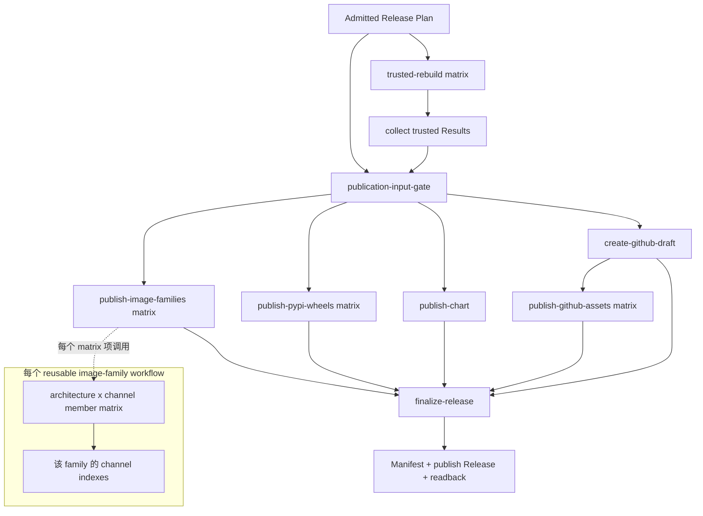

# UCM 向前兼容发布矩阵设计

- 状态：已批准实施架构
- 日期：2026-08-21
- 对应计划：`docs/superpowers/plans/2026-08-21-ucm-forward-compatible-release-matrix.md`
- 配置版本：Schema v3

## 1. 目标、边界与迁移原则

本设计把当前由 `wheel_profiles`、固定 Distribution、固定 Python ABI、固定
Mooncake 和固定六项矩阵驱动的发布链，改成一个由上游事实驱动的闭环：发现能力，
展开候选，构建并记录结果，按上一版正式 Manifest 准入，最后只发布准入闭包。
新增 CUDA、CANN、Variant、Mooncake、Python ABI 或 CPU 架构时，只要上游暴露了
可验证能力且现有模板能够表示，流水线不需要再修改 `release.yaml`。

本设计只规定新的 v3 能力、产品、准入、构建和发布架构。PR #26 至 #28 已合入的
growth-safe 行为继续成立：

- vLLM 和 vLLM-Ascend Builder 仍从上游源码直接发现，Builder 同步保持只新增；
- 只直接过滤 `310p`，未来其他 Variant 进入候选流程；
- 未声明的仓库 Dockerfile 不让整个 Catalog 失败，已声明配方仍严格校验；
- 不支持、已被更新版本替代或缺少匹配规则的上游目标形成结构化 exclusion，
  不升级为全局失败；
- 规则重叠、坐标重复、选中 Builder 缺失、上游证据损坏、扫描或矩阵超过硬上限
  仍然失败，且绝不静默截断；
- 正式发布的任务和资产闭包继续从计划派生，不使用 `6/6/3/7` 一类数量常量；
- Workflow 以行为契约验证，不恢复工作流字节指纹；源码、任务、制品和 OCI 摘要等
  功能性绑定继续保留。

以下不在范围内：重新设计生产信任边界、增加新的安全或审计系统、删除或 yank
历史包、为旧 Schema 增加兼容解析器、自动声明硬件或 Kubernetes 集群验收。

Schema v3 是一次切换，不双读、不降级、不保留 v2 适配层。旧 v2 在途 run 完成或
取消后才合入 v3。历史无版本 Distribution 和历史镜像保留为只读对象，但不再写入；
`uc-manager-cuda`、`uc-manager-cann-a2`、`uc-manager-cann-a3` 也不作为滚动别名继续发布。

## 2. 总体数据流与所有权

```mermaid
flowchart LR
    Config["release.yaml Schema v3"] --> Catalog["Capability Catalog"]
    Upstream["上游源码、镜像与 Builder"] --> Catalog
    Planner["planner checkout"] --> Authority["Current Builder Authority"]
    Catalog --> Selection["CandidateSelection"]
    Config --> Selection
    Authority --> Selection
    Previous["上一版 Release Manifest"] --> Admission["Admission"]
    Selection --> Dependencies["DependencyResolution"]
    Selection --> Candidate["Candidate Plan"]
    Dependencies --> Candidate
    Candidate --> Build["Build matrices"]
    Build --> BuildResults["Build Result Artifacts"]
    Candidate --> Admission
    BuildResults --> Admission
    Admission --> Admitted["Admitted Release Plan"]
    Admitted --> Trusted["Trusted rebuild and byte compare"]
    Trusted --> TrustedResults["Trusted Build Result Artifacts"]
    Admitted --> PublishGate["Publication input gate"]
    TrustedResults --> PublishGate
    PublishGate --> Publication["并行 Publication DAG"]
    Publication --> PublicationResults["Publication Result Artifacts"]
    Admitted --> Finalize["Finalize barrier"]
    PublicationResults --> Finalize
    Finalize --> Manifest["Release Manifest"]
    Finalize --> Public["GitHub Release 与公共回读"]
```



权威所有权如下。CLI 和 Workflow 只编排这些模块，不复制规则。

| 所有者 | 权威职责 | 不拥有的知识 |
| --- | --- | --- |
| `.github/release/release.yaml` + `schemas/config.schema.json` | 静态产品规则、模板、上游版本范围、依赖精确 pins、渠道开关、扫描与矩阵上限、首次 v3 bootstrap 策略 | 已发现版本、ABI、架构和构建结果 |
| `ucm_release/capabilities.py` | 上游读取、规范化、去重、exclusion、Capability Catalog、Python coordinate 编译 | Distribution 命名和发布准入 |
| `ucm_release/builders.py` | planner checkout 的当前 Builder recipe/toolchain 权威、Builder 同步与精确 revision 证据 | runtime 选择和 baseline 准入 |
| `ucm_release/products.py` | 模板编译、产品选择、CandidateSelection、精确任务坐标和纯 Candidate Plan | 网络/索引访问和构建是否成功 |
| `ucm_release/dependencies.py` | dependency request exact closure、兼容 wheel 排序、索引解析和 DependencyResolution | 产品/runtime 选择和 Candidate graph |
| `ucm_release/results.py` | Build/Trusted Build/Publication Result 的统一写入、校验与闭包收集 | 产品选择和 baseline 决策 |
| `ucm_release/admission.py` | baseline 读取、状态机、依赖传播、Admitted Release Plan | 构建与发布动作 |
| `ucm_release/publication.py` | 发布矩阵、渠道坐标、Release Manifest、最终闭包和 readback 判定 | 上游能力发现 |
| Workflow | 触发、权限、矩阵 fan-out、Artifact 搬运和失败传播 | 业务映射、固定产品列表、文件 glob 推断 |

`capabilities.py`、`builders.py`、`products.py` 和 `dependencies.py` 是核心深模块。其余
支持模块可以在实现时合并，
但以上知识只能有一个权威所有者。例如 Workflow 不得重新实现 Distribution 模板，
生产 Controller 不得保留 `_PROFILES` 或 `EXPECTED_IMAGE_SPECS`。

所有 v3 JSON 对象采用封闭 Schema：顶层包含 `kind`、`schema_version: 3`，禁止未知
字段；数组按规范坐标排序；重复键、重复坐标、非规范字符串或摘要不匹配均失败。
每个持久对象包含其规范 JSON 的 `sha256`，后继对象记录所消费对象的摘要。自摘要使用
明确的 canonical projection：复制完整对象，排除且只排除对象自身的摘要字段（例如
`catalog_sha256` 或 `result_sha256`），保留所有嵌套对象摘要，按键排序并用 UTF-8、无
额外空白的规范 JSON 编码后计算 SHA256。作为集合的数据数组必须先按其规范坐标排序，
具有显式顺序语义的数组保留原顺序。摘要字段本身不参与自身计算，避免递归；校验器以
相同 projection 重算并拒绝缺失或不匹配。

## 3. Schema v3 配置权威

### 3.1 单文件配置形态

`release.yaml` 只保存策略和模板，不保存发现结果。至少包含以下概念：

```yaml
kind: release-config
schema_version: 3

source:
  default_branch: develop
  protected_environment: release-production

discovery:
  exclude_variants: [310p]
  python_requires: ">=3.10"
  bootstrap: all-passing
  scan_limits: {}
  matrix_limits: {}

products:
  cuda:
    accelerator: cuda
    distribution: "uc-manager-cuda{runtime.compact}"
  cann:
    accelerator: ascend
    distribution: "uc-manager-cann{runtime.compact}-{variant}-mc{mooncake.compact}"

dependencies:
  build:
    packaging: "24.2"
    pyyaml: "6.0.2"
  runtime: {}

publish:
  pypi: {enabled: false, index: "https://upload.pypi.org/legacy/"}
  ghcr: {enabled: true, namespace: "ghcr.io/{owner}"}
  dockerhub: {enabled: false, namespace: "docker.io/{owner}"}
  chart_oci: {enabled: true, namespace: "ghcr.io/{owner}/charts"}
  github_release: {enabled: true}
```

每个 `upstream_products[]` 还必须声明有序 `runtime_tag_selectors[]`。每个 selector
是 exact template，字段 allowlist 只有 `{version}`、`{variant}` 和
`{runtime.major_minor.compact}`；未知字段、空展开、重复 template 或非 OCI tag 结果是配置
错误。`{version}` 是不含前导 `v` 的规范 PEP runtime version；`{variant}` 是 Catalog
已规范化的非空 Variant。数组顺序是显式选择优先级，不得排序或按摘要重排。Schema 和
products 必须按 `runtime_product` 绑定以下 exact policy，不能只把三个 template 放进宽泛
enum 后任意组合或重排：

```yaml
vllm: ["v{version}", "v{version}-cu{runtime.major_minor.compact}"]
vllm-ascend: ["v{version}", "v{version}-{variant}"]
```

示例只表达字段职责，最终配置还保留现有上游版本范围、渠道、运行时 patch、Chart、
原生依赖和 runner 映射。以下 v2 字段在 v3 中非法：`wheel_profiles`、PyPI `dists`、
Profile Builder 注入、固定 `python_abi`、固定 `dist_name` 以及固定产品资产列表。
配置加载器看到 `schema_version` 不是整数 `3` 或出现这些残留字段时直接失败，不能把
它们忽略为未知扩展。

`dependencies` 名称必须是非空 canonical PEP 503 name；每个值只能是 exact canonical
PEP 440 version，不能是范围、通配符、epoch 或 local version。显式配置的 version 就是
resolution version；prerelease 只在配置明确 pin 该 prerelease 时允许。纯 Candidate planner
不访问网络或包索引；Task 4A1 只生成规范
dependency requests，Task 4A2 的 `dependencies.py` resolver 在 GitHub Hosted Runner 上
解析 compatible binary wheels 并冻结文件名、URL 和 SHA256，随后纯 planner 消费该
Resolution。构建 Job 不重新选择版本或依赖，也不从宽泛 glob 猜测文件。

### 3.2 模板编译与规范化

模板在读取配置时编译一次。允许变量按字段建立 allowlist；Distribution 模板只允许：

- CUDA：`{runtime.compact}`；
- CANN：`{runtime.compact}`、`{variant}`、`{mooncake.compact}`。

未知变量、未闭合占位符、属性链越界、空展开、非 PEP 503 Distribution 名称、模板
缺失必需变量，以及不同能力展开到同一 Distribution 都是配置错误。模板只在 Python
中以结构化上下文展开，不交给 shell、`envsubst` 或 GitHub expression 二次解析。

规范化函数是配置和所有计划的单一权威：

```text
compact_accelerator_runtime("cuda-13.0")       = "130"
compact_accelerator_runtime("cann-9.1.0")      = "910"
compact_mooncake_version("0.3.11.post1")       = "0311post1"
```

因此典型 Distribution 为：

```text
uc-manager-cuda130
uc-manager-cann910-a2-mc0311post1
uc-manager-cann910-a3-mc0311post1
```

compact 结果必须是小写字母数字，版本必须先通过对应版本解析器；不得通过简单删除任意
标点接受非法版本。Variant 规范化为小写 OCI/PEP 503 安全 token，原始值同时保留在
Catalog 中用于来源追踪。

## 4. Capability Catalog

### 4.1 发现来源

`ucm_release catalog discover` 生成唯一的 `ucm-capability-catalog` Artifact：

- vLLM Builder：读取 Buildkite release pipeline 中每个 `BUILD_BASE_IMAGE`，由任务和
  image 同时确定 CUDA runtime 与 CPU architecture；不使用手写 CUDA 列表；
- vLLM-Ascend Builder：扫描全部 `Dockerfile.buildwheel.*`，文件名产生 Variant，
  只跳过精确 Variant `310p`；`a2`、`a3` 和任何未来非 `310p` Variant 都进入发现；
- Python：在每个真实 Builder 镜像的对应原生 GitHub Runner 中列举全部
  `/opt/python/cp*-cp*/bin/python`，运行解释器读取 version/ABI，并用项目
  `requires-python >=3.10` 过滤；目录名、解释器报告和 wheel tag 必须一致；
- Runtime：扫描 vLLM 和 vLLM-Ascend runtime image，并读取与镜像版本对应的 Git Tag
  源码。registry tag、镜像 digest 和源码 Tag commit 都进入来源记录；
- Mooncake：从匹配的 vLLM-Ascend runtime Dockerfile 读取 `MOONCAKE_TAG`，然后在
  每个 runtime architecture 的 Hosted Runner 中检查镜像实际安装版本。声明和实装
  不一致只排除该能力；无法唯一读取来源则是来源证据错误；
- Ascend Builder：从匹配 runtime image 复制 Mooncake headers 和 libraries，验证
  版本后形成 Builder capability；不再 clone 固定 `0.3.9`。

发现阶段先收集完整事实，再应用唯一的产品过滤 `variant == 310p`。不能把当前配置的
版本范围、当前 A2/A3 数量或当前 Python 版本提前变成扫描过滤器；这些属于候选展开。

### 4.2 Catalog 条目契约

Catalog 不把稳定 Builder capability、具体 Builder 构建实例和 runtime 塞进一个会覆盖
历史 revision 的唯一键。它包含四个规范数组：

- `builder_capabilities[]`：稳定语义能力，即“可以构建什么”；
- `builder_revisions[]`：该能力的某一次不可变 Builder 构建实例；
- `runtime_candidates[]`：每一个发现到的 runtime Tag/digest 是什么；
- `bindings[]`：一个精确 Builder revision 与一个 runtime candidate 是否组成可构建产品。

Builder capability 至少包含 `builder_capability_id`、`accelerator`、`accelerator_runtime`、
`variant`、`cpu_architecture`、`manylinux`、`python_version`、`python_abi`、
`mooncake_version` 和排序后的 `builder_revision_ids[]`。Ascend 的 Mooncake 是构建能力
要求的版本；CUDA 为显式 `null`。稳定 capability key 为：

```text
accelerator + accelerator_runtime + variant + python_version + python_abi
+ cpu_architecture + manylinux + mooncake_version
```

`builder_capability_id` 是该 key 的 canonical digest。它不包含 source/target image 或
recipe revision，因此同一能力可以 append-only 保留多个 Builder revision。相同
capability key 的重复声明只合并 revision IDs；所有能力语义已包含在 key 中，source/
target/recipe/toolchain 字段不允许出现在 capability 记录中，也不会形成 capability 冲突。

每个 `builder_revisions[]` 条目至少包含：

```text
builder_revision_id, builder_capability_id
source_image_repository, source_image_digest
recipe_path, recipe_source_commit, recipe_sha256
toolchain_sha256
target_repository, target_tag, target_builder_digest
revision_sha256
```

`source_image_digest` 和 `target_builder_digest` 必须是不可变 OCI digest；recipe 绑定路径、
源码 commit 和文件摘要；`toolchain_sha256` 绑定 Builder 配置、锁文件和构建参数的规范
投影。唯一 builder revision identity 为：

```text
builder_capability_id + source_image_digest + recipe_source_commit
+ recipe_sha256 + toolchain_sha256 + target_builder_digest
```

`builder_revision_id` 是该 identity 的 canonical digest。相同 capability 下不同 source
digest、recipe/toolchain revision 或 target digest 是允许共存的不同 revision。只有两个
条目声称相同 `builder_revision_id`，但任一 identity/坐标字段不同，才是硬冲突。target
tag 只是可读 locator；读取后必须等于冻结的 `target_builder_digest`，不能用可变 Tag
代替 revision identity。

Runtime candidate 至少包含 `runtime_id`、`product_id`、`runtime_version`、`channel`、
`variant`、`cpu_architecture`、`accelerator`、`accelerator_runtime`、
`mooncake_version`、`runtime_image`、`git_tag` 和 `git_commit`。其 identity 为：

```text
product_id + runtime repository + runtime tag + variant + cpu_architecture
```

相同 identity 必须解析到唯一 image digest、Git commit、accelerator runtime 和
Mooncake；不一致是硬失败。不同 Tag/version 各自保留为独立 runtime candidate，不能
由“最新版本”覆盖或被 Builder capability/revision identity 去重。因此 growth-safe
选择器可以从完整多版本集合中依次评估最新候选、回退候选和 baseline 保留候选。

每个 `bindings[]` 条目以 `builder_revision_id + runtime_id` 为唯一键，同时记录
`builder_capability_id`，并投影出计划所需的完整
字段：`accelerator`、`accelerator_runtime`、`variant`、`cpu_architecture`、
`manylinux`、`python_version`、`python_abi`、`source_image`、`target_image`、
`mooncake_version`、recipe/toolchain revision 和 target Builder digest。绑定只在
architecture、accelerator runtime、Variant 和 Mooncake 兼容时产生；同一 runtime
可以绑定多个 Python ABI/revision，同一 Builder revision 也可以绑定多个兼容 runtime
candidate。Binding 不得把 revision 降格成 capability-level lookup。

去重分两层进行：capability 只按稳定 capability key 去重并合并排序后的 revision IDs；
revision 只按完整 builder revision identity 去重。不得按 capability key 选择“最新”后
丢弃旧 revision，也不得因为 source/target digest 变化覆盖旧条目。

`exclusions[]` 指向 `builder_capability_id`、`builder_revision_id`、`runtime_id` 或来源坐标，
并包含规范 reason code 和证据，不伪造 binding。`310p` 使用
`variant-filtered-310p`；声明/实装 Mooncake 不同使用 `mooncake-version-mismatch`。

Catalog 还记录 `source_sha`、上游读取集合、Builder sync 结果和 `catalog_sha256`，不把
运行墙钟时间写进内容对象；时间只属于外层 run evidence。重跑相同来源应得到相同能力、
revision、候选、绑定和摘要。Builder inventory 保留本次发现 revision 与所有 active
baseline Manifest 引用的 revision；同步只新增 content-addressed/revision-suffixed target，
不覆盖或删除旧 revision。Manifest 引用的 target digest 无法回读时保留该 revision 记录
并让 baseline build 产生失败 Result，不能静默换成相同 capability 的其他 revision。

`capabilities.py` 公开唯一 `compile_python_coordinate(validated_fields)`。输入是 public
capability 中已验证的 `python_version + python_abi + cpu_architecture + manylinux`；输出封闭
`python_tag + interpreter_path + expected_soabi + expected_wheel_tag`。普通 `cpXY` 与
free-threaded `cpXYt` 共用该函数：`python_tag` 始终为 `cpXY`，ABI 保留可选 `t`，路径为
`/opt/python/{python_tag}-{python_abi}/bin/python`。Catalog assembly 用它校验 probe，
`products.py` 用它冻结 task；不得扩展 Catalog shape，也不得在任一模块复制公式。

`capabilities.py` 还公开唯一 `validate_selected_capability_evidence(value)`，校验冻结的
capability/revision/runtime/binding evidence：重算三个 identity、revision self-digest、
binding projections 与 runtime compatibility。每个 selected capability 的
`builder_revision_ids[]` 必须 exact 等于本次 evidence 中实际携带的该 capability revisions，
不能复制完整 Catalog historical list 或保留 dangling ID。
`products.validate_candidate_selection` 必须调用该 public seam，再自行校验 discovered
`product_id` exact 等于其 runtime；不得复制 Catalog 语义。`products.py` 同样必须调用
`builders.validate_current_builder_authority`，不得维护第二份 authority validator/policy。

## 5. Candidate Plan 与精确任务坐标

Task 4 分为顺序边界：Task 4A1 冻结 current Builder authority、runtime selector 选择、
Python coordinate 和 dependency requests，生成 CandidateSelection；Task 4A2 先独立解析
DependencyResolution，再由纯 planner 生成精确 Candidate graph；Task 4B 在 Candidate Plan
不再变化后定义 Build Result 闭包、baseline/evaluation 状态机和 Admitted Release Plan。
Task 4 到 Admitted Plan Artifact 为止，不实现 trusted rebuild、publication DAG、远端写入
或 Release Manifest；这些仍由 Task 6 及后续阶段拥有。

`ucm_release plan prepare-candidates` 只消费 Schema v3 配置、一个已验证 Catalog 与
`ucm-current-builder-authority`。A1 CLI 没有 baseline Manifest 参数或 loader；public API
收到非 null baseline 也直接拒绝。Catalog 没有
“current”标记。新 discovered selection 按
`product + binding/Builder accelerator_runtime family + variant + cpu_architecture` 分组；
例如同一 runtime version 的 `cuda-12.9` 与 `cuda-13.0` 必须独立选择。每组内再按
`runtime_version` 分桶并以 PEP 440 version 降序检查，
Ascend 必须先完成真实 Variant 提取，再进入 tag selector。
在同一 version 内严格按该 product 的 `runtime_tag_selectors[]` 顺序求 exact tag：第一个恰好
匹配一个 runtime candidate 的 selector 胜出；同一 selector 匹配多个候选是硬歧义；全部
selector 无匹配则记录 `runtime-flavor-unsupported` 并继续同组下一旧版本。禁止用 tag
字典序、Catalog 数组顺序、摘要顺序或 Registry 创建时间决定选择。

Catalog 保留全部 runtime tags。上述 selector 只决定新 discovered selection；baseline
carry-forward 按 Manifest 的 exact `runtime_id` 直接重开，不经过 selector，也不能被同组
更新 runtime 替换。某个 discovered 目标不支持形成 exclusion 并继续检查同组下一版本；
规则重叠、模板冲突或任务坐标重复仍然全局失败。

上述 baseline carry-forward 是 Task 4B 的最终语义，不属于 A1：只有 Section 9 Manifest
拥有 closed projection 与 public validator 后，Task 4B 才能读取它并把 exact evidence 交给
A2/B enrich。A1 不预测 Manifest shape、摘要或 blocker。

选择“最新”只决定新的 discovered selection，不能删除 baseline。Candidate task set 是
以下集合的规范并集：

1. 上一版 Manifest 中状态为 `active` 的每个 admission key 对应的
   `baseline_carry_forward`；
2. 本次 discovery 选中的每个新候选；
3. 配置中尚未生效但显式请求评估的 retirement/supersession 目标。

baseline carry-forward 必须在 Catalog bindings 中按 Manifest 的 `runtime_id +
builder_revision_id` 精确重建；若当前 registry 扫描已不列出旧 Tag，Catalog 仍保留
Manifest 冻结的 runtime digest/commit 和 append-only Builder revision。旧 revision 无法
回读时保留一个绑定该 revision 的失败任务并产生 `baseline-source-unavailable` Result，
不能改选相同 capability 的新 revision，也不能直接从计划中消失。这样旧 baseline 和新
候选在同一 run 共存并分别产生 Build Result。

Catalog 同样没有 Builder “current”标记。`builders.py` 从 planner checkout 冻结封闭且
自摘要的 `ucm-current-builder-authority`：

```text
kind, schema_version, source_sha, toolchain_sha256
recipes[{recipe_path, recipe_source_commit, recipe_sha256}]
authority_sha256
```

`recipes[]` 按上述三字段规范排序；`authority_sha256` 使用通用 self-digest projection，只
排除自身。新 discovered selection 只从 `recipe_source_commit + recipe_sha256 +
toolchain_sha256` 与该 authority exact 相等的 revision 中选择，并在 Candidate Plan 冻结
其 `builder_revision_id`。零个匹配 revision 形成该新候选 local exclusion；多个匹配
revision 是硬歧义。选择器不使用 target Tag 创建时间、Catalog/字典顺序或摘要顺序。
baseline carry-forward 按 Manifest 的 exact `builder_revision_id` 重开并绕过 current
authority；不可回读时按 baseline failure 处理，不能改选 current revision。新 revision
若替换旧 revision，必须作为独立 successor task 走
promoted/quarantined/superseded 状态机。

### 5.1 CandidateSelection

`plan prepare-candidates` 输出封闭、自摘要的 `ucm-candidate-selection`。它至少包含
`kind/schema_version/route/source_sha/ucm_version/release_tag/config_sha256/catalog_sha256/
current_builder_authority_sha256`、按 exact ID 冻结的 selected
capability/revision/runtime/binding evidence、discovered selections、exclusions、规范唯一
`dependency_requests[]` 和 `selection_sha256`。为保持后续 closed shape，A1 的
`baseline_manifest_sha256` 必须为 null，`baseline_selections[]` 与 `blockers[]` 必须为空；
它不包含 build tasks，也不访问网络或包索引。

每个 dependency request 是封闭记录：`request_id`、coordinate
`{python_tag, python_abi, cpu_architecture, manylinux}`，以及规范排序且唯一的 exact
requirements `[{requirement_id, scope, name, version}]`。`requirement_id` 是
`{scope, name, version}` 的 canonical digest；`request_id` 是 coordinate + 完整 requirements
的 canonical digest。`version` 必须 exact 等于配置 pin。相同 request 不因多个 image
consumer 重复；missing/duplicate requirement、unknown scope、非 canonical version 或 ID
不匹配是 selection 硬失败。

从 A2/B 开始使用的 `blockers[]` 是封闭记录：
`{reason_code, admission_key, dependency_request_id, affected_coordinate, evidence}`。五个字段
始终存在，`reason_code` 与非空封闭 `evidence` 不可为 null；仅当 blocker 确实不对应 baseline
admission、dependency request 或已形成的 coordinate 时，对应字段才为 null，已存在的 exact
值不得省略、猜测或置空。记录按 canonical JSON 唯一并排序，纳入后续 Candidate Plan
摘要；A1 不实例化该记录。

对 discovered selection，`CandidateSelection.source_sha`、`Capability Catalog.source_sha`
与 `CurrentBuilderAuthority.source_sha` 必须 exact 相等；后续 Candidate Plan 继承同一
`source_sha`。baseline exact-ID 重开与 current authority bypass 延后到 Task 4B。

### 5.2 DependencyResolution

`ucm_release dependencies resolve --selection` 是唯一网络/索引 owner。它显式消费按
`--release/--schema-dir/--repository-root` 加载并规范化的 config 与 raw persisted
CandidateSelection；`dependencies.py` 必须先调用唯一的 public
`products.validate_candidate_selection`，再校验 `config_sha256` exact 相等，然后检查
dependency request 数不超过
`config.discovery.matrix_limits.max_wheel_tasks`；两项都必须在第一次索引读取前完成。索引固定
为 `https://pypi.org/simple/`，每个 canonical project 只读取
`https://pypi.org/simple/<canonical-name>/`，并发送 exact
`Accept: application/vnd.pypi.simple.v1+json` 解析 PEP 691 project response；CLI 不接受任意
index override。依赖方向固定为 `dependencies -> products`，`products.py` 不得反向 import
`dependencies.py`。输出封闭、自摘要的
`ucm-dependency-resolution`：

```text
kind, schema_version, source_sha, config_sha256, catalog_sha256, selection_sha256, index_url
requests[{request_id, coordinate, requirements, status, resolved[], failures[]}]
resolution_sha256
```

`requests[]` 按 `request_id` 规范排序。coordinate/requirements 与 CandidateSelection
exact 相等；`status` 只能是 `success` 或 `failure`。`resolved[]` 的每条记录重复 exact
`{requirement_id, scope, name, version}`，并冻结
`{filename, url, sha256, requires_python, wheel_tags}`；记录按 `requirement_id` 排序，
`wheel_tags` 规范唯一排序。当前只接受 `meta.api-version: "1.0"`；project response required
fields 是 `meta/name/files`，file required fields 是 `filename/url/hashes`，
`requires-python` 可选且缺失时冻结为 null。parser 必须忽略不认识的 meta/project/file
extension keys，不把 PEP 700 `versions`、size 或 v1.1 字段变成本 resolver 的前置要求。PEP
691 file 只提供这些 raw evidence；canonical name/version/tags、SHA256 和 frozen
`requires_python` 均由
`dependencies.py` 解析/规范化，fixture/index 不声明派生 truth。filename 必须按 wheel 标准
解析出与 request exact 相等的 canonical name/version；URL 必须是 absolute HTTPS，PEP 691
`hashes.sha256` 必须存在且规范。resolver
只从 request coordinate 构造 target tags，禁止使用 host `sys_tags`。`requires_python` 为
Simple API 的字符串或 null；非 null 时必须由从 request ABI 推导的 target Python version
满足。`success` 要求 `failures[]` 为空，且每个
`requirement_id` 恰有一个 compatible resolved record、没有多余记录；`failure` 要求
`resolved[]` 为空且 `failures[]` 非空并使用稳定 code，禁止输出部分成功数据。
resolver 必须把本次读取实际观察到的全部失败 requirement 规范唯一排序输出。纯 validator
不重读 index，只能证明 failures 非空、closed、canonical unique、code 合法且 repeated identity
引用 request 内 requirement；删除一个仍合法的 in-request failure 或为另一个 in-request
requirement 添加 failure，在 reseal 后没有独立证据可判定，不能伪称 validator 可恢复该 index
truth。

Resolution 的 request IDs 与每个 request 内 requirement IDs 必须与 Selection 完全闭包，
拒绝 missing、duplicate、unexpected、scope/name/version drift、coordinate drift 和不兼容
wheel tags。resolver 不选择版本，只解析显式 pin；它只接受 standards-based compatible
binary wheel，并按标准 wheel-tag 兼容度排名，同一最高 rank 多解是硬歧义。禁止 sdist、
环境 fallback、Catalog/索引数组顺序或文件名顺序成为选择规则。

当前 4A2 输入是 A1 discovered-only Selection：`baseline_manifest_sha256` 为 null，且没有
baseline selection/request。失败 request 只能为每个受影响 discovered selection 生成
`dependency-unavailable` exclusion，不能生成 `baseline-dependency-unavailable` blocker；当前
graph 的全部 `baseline_required` 为 false。Task 4B 在 public Manifest validator 完成后才重开
baseline、扩充 dependency request closure 并重新调用同一 resolver/graph builder，由此产生
baseline blocker 与 `baseline_required: true`。

`ucm_release plan candidates --selection --dependency-resolution` 是纯函数：显式消费规范化
config，先校验其摘要、两个输入对象的 source/config/catalog identity 和 exact request set，
再把 resolved URL/filename/SHA256 冻结进 Candidate Plan。validator 只重算闭包与摘要，
绝不重新选择 runtime、Builder
revision 或依赖。未解析的新 dependency 形成 `dependency-unavailable` local exclusion 且
不生成相关 task。当前 A2 discovered-only graph 不含 baseline request，`blockers[]` 只能原样
保留 Selection blockers（合法 A1 输入为空），不得猜测 Resolution blocker。Task 4B 的
baseline-enriched planning input 才允许把未解析 baseline dependency 规范加入
`baseline-dependency-unavailable` blocker。两阶段都不得消费 `failure` request 的任何
resolved 数据，blocker/exclusion 均按各自 closed shape canonical 去重排序。

每个任务除 `admission_key` 外还有 `lineage_key`。Lineage 保留 accelerator runtime、
Variant、ABI 和 architecture，但不包含 UCM version、上游 runtime version 或 Mooncake
patch version。不同 accelerator runtime 是可并存的新产品线；同一 lineage 内更高的
runtime/Mooncake 候选可以由产品规则产生显式 `supersedes` 关系。默认是共存，不允许仅因
“不是最新”而隐式删除 baseline。`retired` 只来自 Schema v3 中包含旧 key、原因、替代项
和生效版本的显式 retirement 声明。

### 5.3 坐标

产品坐标和构建实例坐标都是结构化字段的规范 JSON，不以数组下标、当前 Profile 名或
文件名代替：

```text
Wheel publication coordinate
      = distribution + ucm_version + python_abi + cpu_architecture

Wheel build instance
      = Wheel publication coordinate + builder_revision_id

Runtime Image binding key
      = accelerator + accelerator_runtime + variant
      + mooncake_version + python_abi + cpu_architecture

Image build instance
      = Runtime Image binding key + ucm_version + runtime_id + wheel_task_id

Family publication coordinate
      = product_id + accelerator + accelerator_runtime + variant
      + mooncake_version + runtime_version + python_abi

Family build instance
      = Family publication coordinate + ucm_version
      + ordered unique member_image_task_ids
      + exact enabled target-channel coordinates
```

Catalog binding 不新增字段。Task 4 在 Candidate graph 内从 exact pair 独立派生：

```text
binding_id = sha256(canonical JSON {
  "builder_revision_id": <exact ID>,
  "runtime_id": <exact ID>
})
```

该 ID 只标识本次计划消费的 Builder revision/runtime 组合；校验器重算并拒绝 pair drift，
不得把数组位置或 Catalog binding 的完整投影纳入 identity。

CUDA Runtime Image 的 `mooncake_version` 使用显式 `null`，不能省略。计划要求的 Runtime
Image 绑定键保持上述六字段精确闭包；`runtime_id` 只用于区分同一绑定键下的 baseline
runtime revision 与新 upstream revision；`builder_revision_id/wheel_task_id` 则区分同一
产品坐标下的新旧 Builder revision。`task_id` 是 build instance 规范 JSON 的
`wheel-<sha256>`、`image-<sha256>` 或 `family-<sha256>`；family task ID 必须 hash 上述 exact
build instance，不能只 hash stable admission key；新增 architecture/member 会形成新 task ID。
Actions UI 另用动态 label 显示
Distribution、runtime、Variant、ABI 和 architecture。Artifact 名称使用
`task_id + run_id + run_attempt`，不会因产品数量增长冲突。

每个任务还携带不含本次 UCM version 的稳定 `admission_key`。Wheel 的 admission key
为 `distribution + python_abi + cpu_architecture`；image 的 admission key 就是上面的
Runtime Image 绑定键；family admission key 为
`product_id + accelerator + accelerator_runtime + variant + mooncake_version + python_abi`，
不含 architecture、上游 runtime patch version 或 UCM version。这样
正常的 UCM 版本递增仍能匹配上一版正式能力，而新的 accelerator runtime、Mooncake、
Variant、ABI 或 architecture 会被识别成新能力。`admission_key` 只用于 baseline 状态机，
不能代替带 UCM version 的精确构建和发布坐标。

同一个 admission key 的 `admission_requirements[]` 中允许至多一个
`candidate_role: baseline` 和一个由最新选择器产生的 `candidate_role: successor`；二者
引用不同 `runtime_id/task_id`，并由显式 `supersedes` 边连接。若 selection 与 baseline
的 runtime identity 完全相同，则去重为一个 `candidate_role: baseline-current`
requirement。task records 不复制这些 role。没有 role/edge 的重复 admission key 是计划
歧义并失败。

Candidate Plan 允许 baseline/successor Wheel build instances 共享一个 publication
coordinate，但 `builder_revision_id/task_id` 必须不同；Admitted Plan 对每个 publication
coordinate 必须恰好选择一个 lifecycle active revision，否则 publication closure 失败。
Wheel task 按完整 Wheel build instance 坐标唯一生成；多个 image 需要同一坐标时共享一个
`wheel_task_id`，不能为每个 binding 重复建 wheel。一个已选择 wheel 可以供多个 runtime
image 使用，但 image 必须通过其 `wheel_task_id`
精确绑定 Builder revision，不能按 `*.whl` 或 capability key 搜索。Runtime Image 键包含
Mooncake、ABI 和 architecture，防止 CANN runtime 与错误 Mooncake 或 Python wheel
拼接。Family 明确列出其 member task IDs 和 publication channels，不假设只有
`amd64/arm64`。

### 5.4 Candidate Plan 契约

`ucm-candidate-plan` 至少包含：

- `route`、`source_sha`、`ucm_version`、`release_tag`、`config_sha256`、
  `catalog_sha256`、`current_builder_authority_sha256`、`selection_sha256`、
  `dependency_resolution_sha256`、可选 `baseline_manifest_sha256`；
- `capabilities[]`、`builder_revisions[]` 和 `bindings[]`：实际被产品展开消费的精确 IDs；
  其中每个 Task 4 `binding_id` 按 exact Builder revision/runtime pair 重算；
- `wheel_tasks[]`：精确坐标、动态 Distribution、Builder digest、manylinux、Python、
  `builder_capability_id`、`builder_revision_id`、source/recipe/toolchain/target digests、
  `python_tag`、exact `interpreter_path`、expected SOABI/wheel tag、native/ELF 规则、冻结
  依赖、`baseline_required`、预期 wheel 文件名和 Artifact 名；
- `image_tasks[]`：精确坐标、`wheel_task_id`、runtime digest、Mooncake、目标 repository
  与 member tag、`runtime_id`、`builder_revision_id`、derived `baseline_required`、预期 OCI
  输出和 Artifact 名；
- `family_tasks[]`：动态 family 坐标、member task IDs、derived `baseline_required`、每个
  启用 channel 的目标 index；
- `baseline_carry_forward[]`、`discovered_selections[]`、显式 `supersessions[]` 和
  `retirements[]`；当前 A2 discovered-only graph 的三个 baseline/lifecycle 数组为空；
- `blockers[]`：当前 A2 原样继承 CandidateSelection blockers；Task 4B baseline-enriched
  final graph 才可加入规范化的 `baseline-dependency-unavailable` blockers；
- `admission_requirements[]`：封闭记录
  `{admission_key, candidate_role, required_task_ids[]}`，其中 task IDs 规范排序且唯一；
- `chart_task`：唯一的 Chart 输入、版本、文件名、derived `baseline_required` 和目标 OCI
  坐标；
- `expected_build_results[]`、`exclusions[]`、动态 Actions matrices 和资源计数；
- `candidate_plan_sha256`。

Candidate graph 先冻结全部依赖边，再从每个 baseline role 的
`admission_requirements[].required_task_ids[]` 反向传播 `baseline_required`。任何被 baseline
active revision 直接或间接需要的 wheel/image/family/chart task 都是 baseline required；共享
wheel 只要服务任一 baseline consumer 就必须标记为 true。该字段不能由任务类型、失败原因
或是否也被 successor 复用来猜测。Admission 只消费这份显式 requirement graph 决定
baseline block 与 new quarantine。
`candidate_role` 只存在于 `admission_requirements[]`；task records 不复制 role，只携带上述
graph 派生的 `baseline_required`。

计划中的 wheel 文件名由 Distribution、UCM version、ABI 和 architecture 冻结；
依赖 wheel 也逐项冻结文件名和摘要。`plan select` 只能按 `task_id` 返回恰好一个任务，
且校验整个计划摘要；`_build-wheel.yml` 和 `_build-image.yml` 只接收任务 ID 和冻结计划。

## 6. Build Result Artifacts

每个 wheel、image 和 Chart 任务无论成功或失败都尝试上传一个规范化
`ucm-build-result` JSON。构建步骤把退出状态交给结果写入步骤；结果上传使用
`if: always()`，上传后 Job 再按结果失败。Runner 丢失、取消或 Artifact 缺失无法伪造
结果，收集器把“缺少期望 Result”当作该任务失败。

统一契约包含：

```text
kind, schema_version, result_type, status
route, source_sha, run_id, run_attempt
candidate_plan_sha256, task_id, task_coordinate
builder_capability_id, builder_revision_id, binding_id
started_at, completed_at, outputs, failure, result_sha256
```

`status` 只有 `success` 或 `failure`。成功时 `failure` 为 `null`，`outputs` 必须闭合；
失败时 `outputs` 只保留已经验证的诊断输出，`failure` 包含稳定 `code`、阶段和简短摘要，
不得把 token 或完整环境写入 Result。Builder/binding 身份字段按任务类型闭包且必须与任务
一致：wheel 的 `builder_capability_id/builder_revision_id` 非空且
`binding_id` 显式 `null`；image 三者都非空；Chart 三者都显式 `null`。

- wheel 输出：唯一文件名、Distribution、UCM version、Python ABI、architecture、
  wheel tag、SHA256、精确 source/recipe/toolchain/target Builder revision、
  METADATA/RECORD/ELF/依赖闭包结论；
- image 输出：OCI archive/manifest/config/layer 摘要、runtime digest、绑定 wheel 摘要、
  accelerator runtime、Variant、Mooncake、ABI 和 architecture；
- Chart 输出：唯一 tgz 文件名、Chart/app version、SHA256 和全部动态 family 渲染结论。

`libascend_hal.so` 始终记录为
`external-required / transitive / device-runtime`，不能进入 wheel 或 image 文件闭包。
Image 构建在安装前核对精确 wheel 文件名、Distribution、ABI、accelerator runtime 与
Mooncake；任何一项不同都写失败 Result，不尝试“最接近”匹配。

Task 4 wheel task 把 public capability 的 validated fields 传给
`capabilities.compile_python_coordinate`，冻结 `python_tag`、`python_abi`、`python_version`、
expected SOABI、expected wheel tag，以及 exact：

```text
/opt/python/{python_tag}-{python_abi}/bin/python
```

Task 5 只消费这些冻结字段并打开 exact interpreter path，不从 Python version、目录 glob、
SOABI 或当前 Profile 重新推导 ABI，也不回退到 `python{python_version}`/`python3`。运行时
报告的 version、SOABI、ABI 和 wheel tag 任一项与任务不一致即失败。不能恢复 `cp312`
特判或 Profile 常量；例如 free-threaded `cp314t` 使用
`python_tag=cp314` 和 `/opt/python/cp314-cp314t/bin/python`。

## 7. Baseline 与准入状态机

Task 4B 首先为 Section 9 Manifest 定义 closed projection 与 public validator；在此之前任何
raw JSON、CLI path 或 guessed digest 都不能充当 baseline authority。validator 就绪后，
Task 4B 才按 exact `builder_revision_id + runtime_id` 从同一 Catalog 重开 baseline，绕过
current authority/selector；missing exact source 产生结构化 `baseline-source-unavailable`
blocker/evidence，不能替换为 current revision。

正式 `ucm_release plan admit` 消费 Candidate Plan、所有期望 Build Result，以及
Candidate Plan 已绑定的最近一个公开且成功回读的 Schema v3 Release Manifest（存在时）。
`baseline_manifest_sha256: null` 只允许首个 v3 RC 的 `bootstrap: all-passing`。baseline
只能来自配置所指 GitHub Release 渠道中的 Manifest asset；按正式版本顺序选择，验证其
Schema、Repository、渠道、Manifest 摘要和公共 readback 状态。Admission 必须重开同一
Manifest 并与 Candidate Plan 中的 `baseline_manifest_sha256` 相等，Actions Artifact、
Draft 或本地文件不能充当正式 baseline。

Admission 在读取或判定 Build Results 前先消费 Candidate Plan 的 planning `blockers[]`。
formal route 发现任一 blocker 时直接输出 blocked decisions 与 `releasable: false`；evaluation
route 对同一记录输出 `would-block`，保持 `publishable: false`。planning blocker 不能被成功
Result、successor 或 quarantine 规则抵消；`baseline-dependency-unavailable` 因而始终阻断
formal 发布，而新候选的 `dependency-unavailable` 仍只存在于 local exclusions。

状态机逐项保留任务精确坐标，并用稳定 `admission_key` 加 `candidate_role` 与 baseline
active revision 建立关系；`successor` 即使复用同一 admission key 仍按新候选评估：

| 候选角色 | 本次构建 | 决策 | 发布影响 |
| --- | --- | --- | --- |
| baseline active revision | success | `admitted` | 保留正式产品 |
| baseline active revision | failure 或 Result 缺失 | `blocked-baseline-failure` | 整个发布在任何写入前失败 |
| successor 或全新 capability | success | `promoted` | 本次进入 admitted 发布闭包 |
| successor 或全新 capability | failure 或 Result 缺失 | `quarantined` | 仅隔离新项，其他项继续 |

表中的 baseline 关系通过稳定 `admission_key`、Manifest active runtime identity 和
`candidate_role` 建立。上一版 Manifest 中 `active` 的 key
必须出现在 `baseline_carry_forward[]` 并产生 Result；缺失产生
`baseline-capability-missing` blocker，不能把消失解释成自动退役。

同一 lineage 的 baseline 与 successor 按以下顺序决策：

1. 先独立评估 baseline；其 failure/missing 仍是 blocker，不能被新候选成功掩盖；
2. 再评估 successor；success 为 `promoted`，failure 为 `quarantined`；
3. 只有 baseline 和 successor 本次都 success，且 Candidate Plan 存在显式
   `supersedes: old_task_id -> new_task_id`，Admitted Plan 才把旧 revision 的 lifecycle
   标为 `superseded`、新 revision 标为 `active`；两者的 admission decision 仍分别是 `admitted`
   和 `promoted`。否则两者 lifecycle 都保持 `active` 共存；
4. `retired` 只接受配置中已绑定原因、生效版本和可选替代 key 的显式 retirement，写入
   Manifest 后从下一版 baseline active set 移除。没有声明的缺失永远不是 retirement。

被 `superseded` 或 `retired` 的历史远端包不删除、不 yank，也不进入本次 publication
matrix；状态和 successor/原因写入 Manifest。若新候选失败，它只 quarantine，旧 baseline
继续 active 并发布当前 UCM 版本，因此自动发现升级不会让旧产品线静默消失。

依赖失败沿依赖边传播。例如新 wheel 失败时，所有绑定它的新 image/member/family 都
quarantine；baseline image 依赖的新生成 wheel 失败时属于 baseline failure，不能降级
为 quarantine。Chart 和计划/结果收集器没有“新能力”语义，任一失败始终阻断发布。
quarantine 项保留坐标、失败 Result 和 reason，绝不进入任何发布矩阵。

首个 v3 RC 没有 v3 baseline，必须显式使用 `bootstrap: all-passing`：Candidate Plan
中的所有期望构建任务均成功才产生可发布的 Admitted Plan；任一失败都阻断首次 v3
发布，不能用 quarantine 缩小首版 baseline。该 RC 成功后的 Release Manifest 成为
后续唯一 baseline。非 RC 正式运行不能自行启用 bootstrap。

PR 和 daily 在首个 v3 RC 前没有正式 baseline 时，不生成
`ucm-admitted-release-plan`。它们调用 `plan admit --mode evaluation`，输出单独的
`ucm-admission-evaluation`：`formal: false`、`baseline_state: unavailable-pre-v3`、
`publishable: false`，并把任务标为 `observed-success` 或 `observed-failure`，同时给出
`bootstrap_all_passing_would_pass`。若已有正式 baseline，PR/daily 仍只输出
`would-admit`、`would-promote`、`would-quarantine`、`would-block` 的 evaluation，不得
输出可发布矩阵、取得 Environment 或把预测状态写成正式 admitted/promoted。只有 RC/
formal route 能生成 Admitted Release Plan。

### 7.1 Admitted Release Plan

`ucm-admitted-release-plan` 包含 Candidate Plan 身份、baseline Manifest 身份、每个任务
的 `decision`（`admitted/promoted/quarantined/blocked`）和 `lifecycle_state`
（`active/superseded/retired`，仅成功或显式退役项可用）、准入 Build Result 摘要，以及：

- 精确 `wheel_publication_tasks[]`；
- 精确 `image_family_publication_tasks[]`，每个 family 内含 member/channel matrix；
- 唯一 `chart_publication_task`；
- 精确 `github_asset_tasks[]`；
- 精确 `expected_trusted_build_results[]`；
- `expected_publication_results[]`；
- `releasable`、`blockers[]`、`quarantine[]` 和 `admitted_plan_sha256`。

正式入口只有 `releasable: true` 才启动只读 trusted rebuild；只有后续
`publication-input-gate.ready: true` 的 publication Jobs 才能取得发布 Environment。
任何 blocker、Schema 错误、Result 重复、未计划 Result、trusted compare 失败或精确闭包
不等都在创建 Draft 或登录 Registry 前失败。

### 7.2 Trusted rebuild 与 publication input gate

Trusted rebuild 位于 Admission 之后、任何 publication 之前。它只消费不可变 Admitted
Plan、Candidate Build Result 中的成功 wheel bytes，以及默认分支可信控制代码；不会
回写 Candidate/Admitted Plan，因此数据流无环：

```text
Candidate Plan -> candidate build Results -> Admitted Plan
Admitted Plan -> trusted rebuild/compare Results -> publication input gate
Admitted Plan + trusted closure -> publication matrices
```

`trusted-rebuild` 按 Admitted Plan 中 lifecycle 为 `active` 且 decision 为
`admitted/promoted` 的 wheel task 动态展开。每个任务由默认分支可信控制器重开 Admitted
Plan 冻结的精确 `builder_revision_id`，核对其 source image digest、recipe commit/hash、
toolchain hash 和 target Builder digest，不能替换成相同 capability 的当前 revision。
随后独立构建 A、B 两份 wheel，逐字节校验 `A == B == candidate wheel`，并重新核对
Distribution、version、ABI、architecture、METADATA、RECORD、ELF 与依赖闭包。它只读
且不取得发布 Environment。

每个任务无论比较成功或失败都上传 `ucm-trusted-build-result`，复用 Result envelope 并
增加 `admitted_plan_sha256`、`candidate_build_result_sha256`、`candidate_wheel_sha256`、
`builder_revision_id`、`builder_revision_sha256`、`rebuild_a_sha256`、
`rebuild_b_sha256`、三个 byte-equality 判定和验证结论。失败、取消或 Result 缺失均不能
成为 publication 输入。

`collect-trusted-build-results` 以 `if: always()` 运行，按 Admitted Plan 的
`expected_trusted_build_results[]` 拒绝 missing/duplicate/unexpected/failure，生成
`ucm-trusted-build-closure`。随后的 `publication-input-gate` 只校验 Admitted Plan 与该
closure 的摘要和精确任务集，输出 `ready: true|false`；不重新做准入，也不产生第二份
Admitted Plan。所有 publication 分支同时依赖此 gate，只有 `ready: true` 才能取得写
权限。Image member publisher 只使用 closure 中已比较的 wheel，并继续按 Candidate image
Result 的 OCI closure 验证装配结果。

## 8. 全并行 Publication DAG

正式发布不能把产品或渠道放在单个 shell `for/while` 中串行处理，也不能声明
`publish-cuda`、`publish-a2`、`publish-a3` 等固定 Job。唯一拓扑如下：



`publication-input-gate` 成功后，`publish-image-families` 使用 Admitted Plan 产生的
顶层动态 family matrix，并调用 reusable `_publish-image-family.yml`。reusable workflow
内部再以该 family 的
`architecture × enabled channel` member matrix 并行发布；其 index Job 只 `needs`
该 family 的 member matrix，声明 `if: always()`，并从 Result Artifacts 对计划中实际
member 坐标做精确闭包。全部 member success 时才创建 index；任一 member failure、
cancelled、skipped 或 Result 缺失时，index 不写 Registry，但仍上传状态为 failure、
code 为 `member-closure-incomplete` 的 index Publication Result，然后让 Job 失败。它不
等待其他 family、PyPI、Chart 或 GitHub assets，也不假设 architecture 是固定两项。

其他分支互不串行依赖：

- `publish-pypi-wheels` 对 Admitted Plan 中每个精确 wheel task 建 matrix；
- `publish-chart` 是独立单 Job；
- `create-github-draft` 只创建或复用精确 Tag 的 Draft；
- `publish-github-assets` 只依赖 Draft 和 Admitted Plan，对精确资产清单建 matrix；
  它不等待 image、PyPI 或 Chart 渠道发布完成。

每个 member、index、PyPI wheel、Chart OCI、Draft 和 GitHub asset 单元都上传一个
`ucm-publication-result`，字段与 Build Result 的共同 envelope 一致，另包含
`channel`、远端规范坐标、发布后 digest/version/asset ID 和渠道 readback 摘要。
即使命令失败，Result 仍记录 `failure`；Result 缺失同样是失败。

`finalize-release` 是唯一允许 `needs` 全部发布分支的 barrier。它从 Admitted Plan 的
`expected_publication_results` 计算精确集合，拒绝缺失、重复、失败、quarantine 或
未计划 Result。GitHub job 必须声明 `if: always()`，不能因任一 `needs` 为 failure、
cancelled 或 skipped 而被默认跳过；它通过 Actions Artifact API/本 run artifact pattern
收集 Result，不依赖失败 Job 的 outputs。Draft 创建失败时，asset matrix 也以
`if: always()` 运行，为每个计划资产生成 `draft-unavailable` failure Result。通过精确
闭包后才按顺序：

1. 生成 Release Manifest 并上传到现有 Draft；
2. 校验 Draft 的精确 asset 集合后把 GitHub Release 从 Draft 封板为目标 prerelease
   或 stable 状态；
3. 对 PyPI、每个 OCI member/index、Chart OCI、GitHub Release assets 和 Manifest
   执行公共 readback；
4. 所有 readback 闭合后才输出 `release-loop-success`。

发布中途失败可能留下 Draft 或远端渠道的部分对象；实现不做推测性回滚、删除或 yank。
相同 Tag 重跑必须按 Admitted Plan 的精确坐标幂等核对已有对象。只要最终 barrier 未
完成，就没有新的有效 Release Manifest，也不能声称该 run 完成正式发布。

## 9. Release Manifest

`ucm-release-manifest` 是一次正式发布的持久 baseline，而不是运行日志。它至少包含：

- Repository、Tag、UCM version、stage、source SHA、run ID/attempt；
- config、Catalog、Candidate Plan、Admitted Plan 的摘要；
- bootstrap 或 previous Manifest 的来源；
- 每个 lifecycle 为 active 且 decision 为 admitted/promoted 的 wheel 精确坐标、文件名
  和摘要，以及 `builder_capability_id`、`builder_revision_id`、source/recipe/toolchain/
  target Builder revision identity；
- 每个 runtime member/family 的精确坐标、channel、digest 和绑定 wheel；
- 每个 lineage 的 active、superseded、retired 状态及 successor/retirement reason；
- Chart 坐标和摘要；
- quarantine 项及其失败 Result 摘要；
- 全部成功 Trusted Build Result 和 trusted closure 摘要；
- 全部成功 Publication Result 的精确集合；
- 预期公共渠道坐标和 `manifest_sha256`。

Manifest 不把 Hosted 构建写成硬件或集群通过，也不把 Draft 存在写成发布成功。
Manifest 只在所有 publication Result 成功后生成；它自身与 GitHub Release 一起经过
公共 readback。后续 admission 只读取完成这条闭环的 Manifest。

## 10. 触发、路由与写边界

所有入口共享 `catalog discover` → `plan prepare-candidates` → `dependencies resolve` →
`plan candidates` → build。PR/daily 随后执行 `plan admit --mode evaluation`；只有 RC/
formal 执行正式 `plan admit`，再进入
`trusted rebuild -> publication input gate -> publication`。route 同时决定选择范围、
保留时长和写权限，evaluation 不能通过字段或 Workflow output 冒充正式 Admitted Plan。

| route | 触发与 source | 允许写入 | 禁止与完成条件 |
| --- | --- | --- | --- |
| PR | `pull_request` 或通过权限检查的 `/ucm-build`，绑定 PR head SHA | Actions Artifact；受信同仓库 `/ucm-build` 可更新共享 Builder pool 和显式 PR 临时 GHCR tag | 只生成 Admission Evaluation，不写 PyPI、正式 GHCR、Chart OCI 或 GitHub Release；完成只表示 Hosted candidate evidence |
| daily | `schedule` 或默认分支 `workflow_dispatch`，必须是 `develop` 的不可变 SHA | Actions Artifact；共享 Builder pool；配置明确启用的 staging/candidate 临时对象 | 只生成 Admission Evaluation，不创建正式 Tag/Release，不写 PyPI 或正式产品坐标；完成表示 daily candidate loop |
| RC/formal | 受保护的 `refs/tags/v*`，Tag/source/默认分支可信控制身份继续沿用现有生产边界 | 准入和 trusted rebuild 只读；`releasable: true` 且 publication input gate ready 后，由 `release-production` Environment 授予 PyPI、正式 Registry、Chart 和 GitHub Release 写权限 | baseline/trusted failure 或首次 bootstrap 非全绿时写入前终止；完成必须有 Manifest 和全部公共 readback |

普通 PR Gate 不依赖 fork secret。GitHub 对 reusable workflow 的静态最大权限要求，不得
被解释成 PR Job 实际拥有发布权；实现必须用事件、同仓库身份、授权评论者和 job-level
条件把 Builder/临时 PR 写入限制在受信入口。PR 临时镜像使用 PR/run 坐标并由现有清理
流程处理，不等于正式 GHCR 发布。

RC 仍保留现有“候选 Tag 只读、默认分支可信 Controller、受保护 Environment 发布”
责任边界，但其固定 `spec_id`、固定 cache key、固定 Distribution、固定资产列表和
生产 `_PROFILES` 全部由动态 Admitted Plan 替代。trusted rebuild 的双构建和 wheel
逐字节比较继续保留，任务集合来自 Admitted Plan。

## 11. 失败语义

失败按拥有层处理，不增加跨层 fallback：

- 配置/模板错误、重复坐标、规则歧义、Catalog 来源损坏、资源上限、baseline 身份错误
  是全局失败；
- 可明确归因到单一新 capability 的不支持、Mooncake 不一致或构建失败形成 quarantine；
- 任何 baseline 任务失败、Result 缺失或依赖闭包破坏都阻断正式发布；
- baseline 引用的 Builder revision 不可回读时阻断，不能用同 capability 的其他 revision
  自动替换；
- trusted rebuild/compare 的 Result 缺失、失败或字节不等在 publication input gate 阻断，
  不回退到 Candidate bytes 直接发布；
- publication 单元失败阻断 final barrier，但不把已写远端对象称为 Release，也不自动
  删除历史或部分对象；
- final 精确集合存在 missing、duplicate、unexpected 或 digest mismatch 时失败；
- Registry/GitHub Release readback、真实硬件、集群接受是不同证据域，不能相互代替。

任务失败不能通过 `fail-fast` 隐藏同矩阵其他结果；构建、trusted rebuild 和发布矩阵
使用 `fail-fast: false`，让所有独立单元产生 Result。所有 Result 上传步骤、trusted
collector、family index 和 finalize 使用 `if: always()`；其中 collector/index/finalize
在上传规范失败 Result 或 barrier 报告后再令 Job 失败。只有本 family index 对本
family member 存在必要依赖，finalize 对全部 publication 分支存在必要依赖；其他
`needs` 必须能由数据依赖解释。

## 12. 证据边界

证据结论必须使用以下词义：

| 证据 | 能证明 | 不能证明 |
| --- | --- | --- |
| Source check | Schema、Controller、Workflow 和测试契约在源码中存在 | GitHub 实际执行或远端产物存在 |
| Hosted build | 指定 head SHA 的 GitHub Runner 构建、校验和 Artifact | Registry/Release 已发布、GPU/NPU 可运行 |
| Registry/Release readback | 精确公共包、digest、asset 和 Manifest 可回读 | 真实设备推理或集群验收 |
| Hardware E2E | 指定 GPU/NPU Runner 上的设备行为 | Kubernetes 部署验收 |
| Cluster acceptance | 指定集群、存储和工作负载的端到端结果 | 其他硬件或公共渠道状态 |

无设备 GitHub Hosted Runner 只能产出 Hosted build evidence。`hardware-e2e.yml` 使用真实
设备 Runner，集群验收使用独立入口；二者不进入本设计的 release publication barrier，
也不能被空跑或静态 YAML 检查替代。

## 13. Hosted-only RED/GREEN 验证

本迁移禁止在本地运行 pytest、actionlint、Docker、wheel/image build 或发布模拟。
本地只允许源码检查和 `git diff --check`；所有行为性 RED/GREEN 在 GitHub Hosted
Actions 上完成。

每个实现任务按两次不可变提交验证：

1. RED 提交只增加预期契约/fixture，Hosted Job 必须因尚未实现的特定行为失败；
2. GREEN 提交增加最小实现，同一个检查和同一测试选择在新 head SHA 上通过；
3. 记录两次 run，而不是用最终绿灯覆盖 RED 证据；
4. 真实 Builder/Catalog、wheel、image、Chart 和 publication 验证必须检查 Actions
   Artifact 或远端 readback，fixture 只证明控制逻辑。

每个 run 在 `docs` 下维护结构化 evidence record，至少包含：

```yaml
phase: schema-v3|catalog|candidate-admission|build|publication|acceptance
expectation: red|green|real-build|formal-readback
run_id: 123456789
run_url: https://github.com/<owner>/<repo>/actions/runs/123456789
head_sha: <40-hex>
event: pull_request|push|workflow_dispatch|schedule|issue_comment
workflow: <name and path>
jobs:
  - name: <job>
    conclusion: success|failure|cancelled|skipped
    expected_failure: <test and reason or null>
artifacts:
  - name: <exact artifact name>
    count: 1
    sha256: <downloaded payload digest when applicable>
quarantine: []
publication:
  attempted: false
  channels: []
```

基线 Hosted 检查必须在 `push-check.yml` 和 `pull-request.yml` 执行主 release tests、
production tests、actionlint 和 `git diff --check`，并汇总 source SHA、测试数量与失败
阶段。最终验收要求 PR Gate、Push Commit Checks 和 `/ucm-build all` 位于同一 head SHA；
daily 与首个 v3 RC 另有各自 run evidence。只有 RC 的 Publication Result、Release
Manifest 和公共 readback 全部闭合，才能记录 `release-loop-success`。

## 14. 实施完成条件

实现完成必须同时满足：

- active `release.yaml` 仅接受 Schema v3，且不存在 `wheel_profiles` 或固定 Distribution
  列表；
- Capability Catalog 分离稳定 Builder capability、append-only Builder revision、Runtime
  candidate 和 revision-level binding，对 CUDA/CANN、未来非 310P Variant、多 runtime、
  多 ABI 和 architecture 动态增长，Mooncake 来源与实装一致；
- Candidate 与 Admitted Plan 使用本文精确坐标、baseline carry-forward、显式 lifecycle
  状态和 baseline 状态机；
- 正式 publication 只消费通过双 trusted rebuild 和逐字节比较的 trusted closure；
- wheel/image/production 控制代码没有固定 `cp312`、固定 Profile、固定六项 cache 或资产；
- 发布 Workflow 使用动态 family/reusable member 两级矩阵，PyPI、Chart、GitHub assets
  并行；family index 与 finalize 即使上游失败也产生闭包 Result，只有 finalize 是全局 barrier；
- PR、daily、RC 三条 Hosted loop 分别有不可变 run evidence；
- 首个 v3 RC 以 `bootstrap: all-passing` 成功并公开回读 Manifest；
- 后续新增上游能力无需修改 `release.yaml`，可自动晋级或 quarantine；
- Hosted build、公共发布、硬件和集群结论在报告中继续分开。
