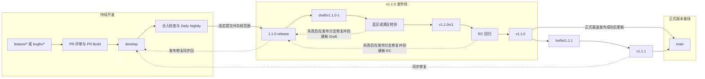
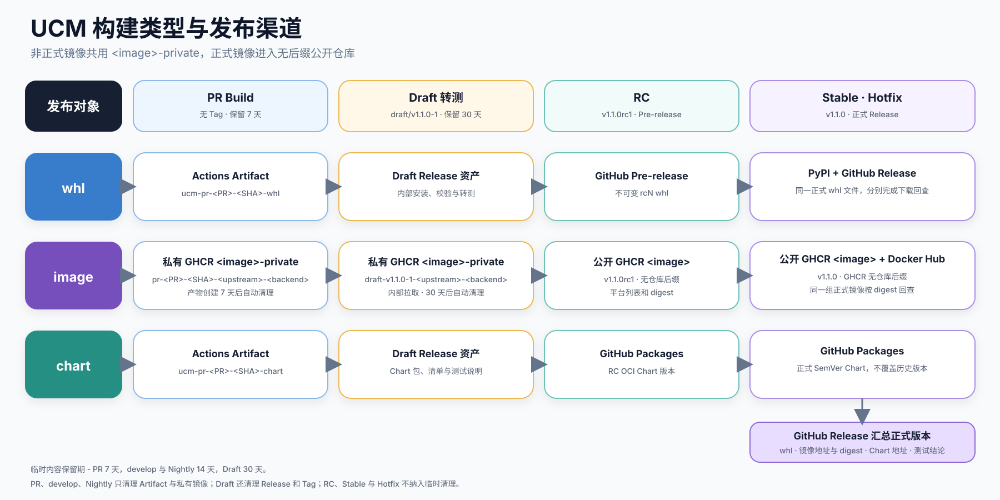
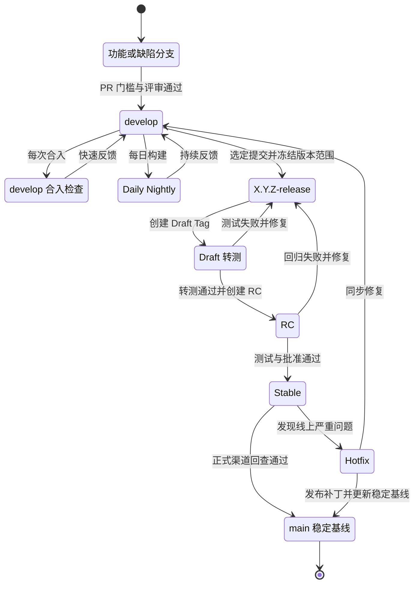
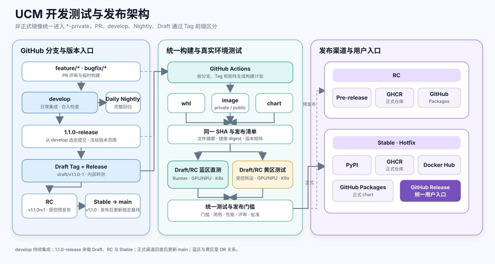
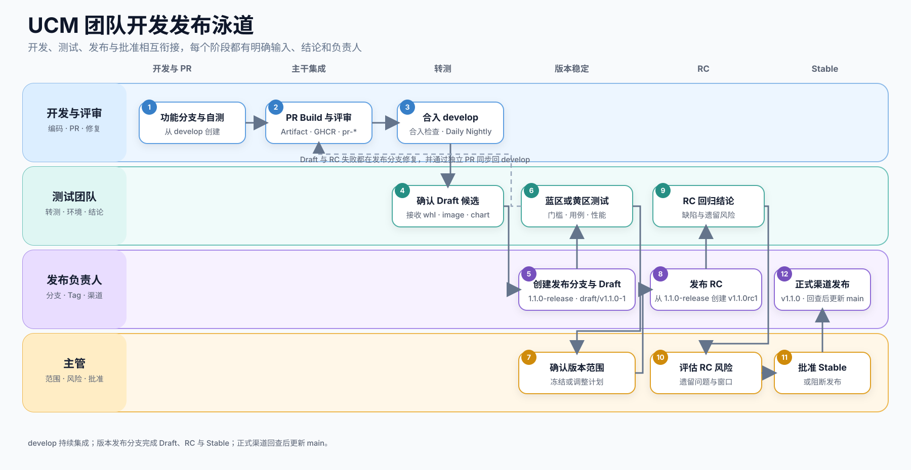
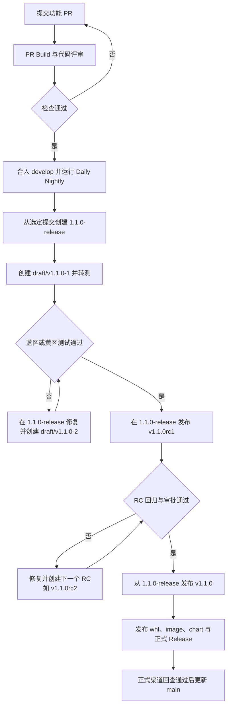
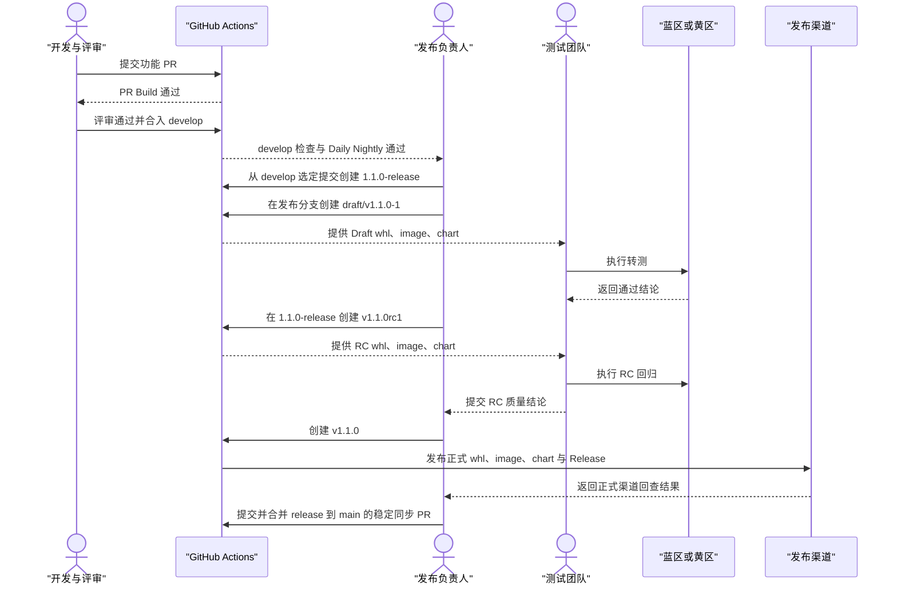
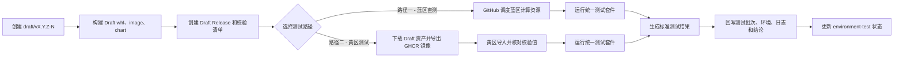
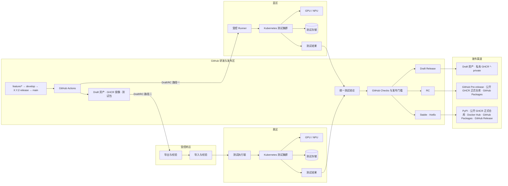

# UCM 开发、测试与发布流程规范

## 1. 目标与适用范围

本文规定 UCM 团队从需求开发、代码评审、主干集成、转测、预发布到正式发布的完整流程。适用角色包括开发人员、评审人、模块负责人、测试人员、测试负责人、发布负责人和主管。

流程围绕三类发布对象展开：

| 发布对象 | 主要内容 | 正式发布位置 |
| --- | --- | --- |
| `whl` | `uc-manager-cuda`、`uc-manager-cann-a2`、`uc-manager-cann-a3` 等 Python 安装包 | PyPI、GitHub Release |
| `image` | UCM 与不同基础推理镜像、运行后端、CPU 架构的组合 | GHCR、Docker Hub |
| `chart` | `unified-cache-pd` Helm OCI 包 | GitHub Packages |

GitHub Release 是正式版本的统一入口，记录 `whl` 文件、`image` 地址、`chart` 地址、安装命令、兼容范围、摘要、测试结论和已知问题。

本规范遵循以下原则：

1. 正常开发从短期分支发起 PR，统一合入 `develop`；`develop` 是日常集成分支。
2. 准备转测时，从选定的 `develop` 提交切出 `X.Y.Z-release` 分支；Draft、RC 和 Stable 都从这条发布分支推进。
3. `main` 只记录已经正式发布的稳定基线，不承担 Draft 转测和 RC 稳定工作，也不承接普通功能开发。
4. 内部转测使用 `draft/vX.Y.Z-N` Tag 和 Draft Release；RC 使用 `vX.Y.ZrcN` Tag 和 Pre-release；Stable 使用 `vX.Y.Z` Tag 和正式 Release。
5. 每次构建都绑定完整 Git SHA，不能只用分支名或可变标签代表代码版本。
6. 测试必须针对准备交付的 `whl`、`image` 和 `chart`，不能测试一份、发布另一份。
7. 蓝区直测和黄区测试是二选一，两条路径执行同一套测试并使用相同通过标准。
8. PR Build、`develop` 合入检查、Daily Nightly 和 Draft 的镜像统一进入 `ghcr.io/<org>/<image>-private`，通过 Tag 前缀区分；PyPI 和 Docker Hub 只接收 Stable 与 Hotfix。
9. 临时内容统一设置有效期：PR Build 保留 7 天，`develop` 合入检查和 Daily Nightly 保留 14 天，Draft 转测保留 30 天。PR、`develop` 和 Nightly 到期后删除 Actions Artifact 与私有镜像；Draft 还要删除 Draft Release 和 Draft Tag。

## 2. 分支模型与团队职责

### 2.1 分支模型

| 分支 | 来源 | 允许合入内容 | 主要用途 | 生命周期 |
| --- | --- | --- | --- | --- |
| `feature/*`、`bugfix/*` | `develop` | 单个需求、缺陷或工程改进 | 开发、自测、PR Build | PR 合入后删除 |
| `develop` | 长期分支 | 通过评审和门槛检查的正常 PR | 日常集成、Nightly、转测候选 | 长期保留 |
| `X.Y.Z-release` | 选定的 `develop` 提交 | 当前版本范围内的发布修复 | Draft 转测、RC 稳定、Stable 发布 | 版本维护期内保留 |
| `main` | 已发布的 Stable 提交 | 已完成发布的稳定版本 | 保存正式版本基线 | 长期保留 |
| `hotfix/X.Y.Z` | 最近的 Stable Tag 或对应发布分支 | 线上严重问题的最小修复 | 紧急补丁验证 | Hotfix 发布并同步后删除 |

所有正常代码先进入 `develop`。每次合入立即执行快速集成检查，Daily Nightly 再覆盖完整矩阵和依赖漂移。测试负责人选定转测提交后，由发布负责人从该提交创建 `X.Y.Z-release`，例如 `1.1.0-release`。发布分支一旦建立，版本范围随即冻结；后续 Draft、RC 和 Stable 都以该分支上的不可变 Tag 为入口。

Draft 或 RC 阶段发现问题时，从 `X.Y.Z-release` 创建短期修复分支，通过 PR 合回发布分支，随后创建新的 Draft 或 RC。每个发布修复都必须通过独立 PR 同步回 `develop`，避免后续版本重新引入同一问题。与此同时，`develop` 可以继续下一版本开发，不必等待当前版本完成发布。

Draft 测试通过后，在同一发布分支创建 `vX.Y.ZrcN`；RC 回归通过并完成批准后，再从该分支创建 `vX.Y.Z`。Stable 发布成功后，发布负责人发起从 `X.Y.Z-release` 到 `main` 的同步 PR；该 PR 的源码树必须与 Stable Tag 完全一致，不能夹带其他提交。合入后，`main` 表示最近一次已经完成发布和回查的正式基线。

`X.Y.Z-release` 不是日常集成分支，也不接收下一个版本的新功能。它在当前版本支持期内保留，用于补丁和问题追溯；版本停止维护后可以删除分支，但正式 Tag、Release 和发布记录继续保留。

### 2.2 分支关系图



图中的分支和 Tag 不是同一个对象：`1.1.0-release` 是持续稳定该版本的分支；`draft/v1.1.0-N`、`v1.1.0rcN` 和 `v1.1.0` 是从该分支不同提交创建的不可变版本坐标。测试失败时移动的是发布分支，不修改已经创建的 Tag。

### 2.3 团队角色

| 角色 | 主要职责 | 关键输出 |
| --- | --- | --- |
| 需求负责人 | 明确范围、优先级、验收条件和目标版本 | 需求说明、验收条件、版本范围 |
| 开发人员 | 设计、编码、自测、提交 PR、修复缺陷 | 代码、单元测试、变更说明 |
| 评审人 / 模块负责人 | 评审设计、代码、兼容性、测试范围和发布分支修复 | PR 评审结论、发布修复评审结论 |
| 测试负责人 | 制定测试计划、接收转测、选择蓝区或黄区、汇总质量结论 | 测试计划、测试报告、准出结论 |
| 测试人员 | 执行门槛测试、用例测试、回归和性能测试 | 用例结果、日志、问题单 |
| 发布负责人 | 创建和维护版本发布分支、创建 Tag、更新 `main`、检查发布位置 | Draft、RC、Stable 发布记录 |
| 主管 | 批准正式发布、重大风险和测试例外 | 发布批准或阻断决定 |
| 平台维护人员 | 维护 Actions、Runner、蓝区接入、黄区转运和结果回传 | 可用的构建与测试基础设施 |

低风险 PR 可以由一名非作者评审人批准；涉及公共接口、数据格式、CUDA/CANN 公共路径、依赖升级、构建配置或发布流程的变更，应由模块负责人参与。Stable 和 Hotfix 必须由测试负责人、发布负责人和主管分别确认。

### 2.4 分支保护规则

- `develop` 禁止直接推送，必须通过 PR、必选检查和非作者评审。
- `X.Y.Z-release` 禁止直接推送和普通功能 PR，只允许当前版本的发布修复进入；修复合入后必须同步回 `develop`。
- `main` 禁止直接推送和普通功能 PR，只接受 Stable 或 Hotfix 发布成功后的同步 PR；同步结果的源码树必须与对应正式 Tag 完全一致。
- Draft、RC、Stable 和 Hotfix Tag 只能由发布负责人创建；Draft Tag 不得覆盖，RC、Stable 和 Hotfix Tag 还必须经过发布环境审批。
- 任何已发布 Tag、版本文件和远端摘要不得覆盖；修复必须创建新的预发布编号或补丁版本。

## 3. 构建与发布类型

### 3.1 类型总表

| 类型 | 来源 | 触发方式 | 主要目的 | 真实环境测试 | 发布性质 |
| --- | --- | --- | --- | --- | --- |
| PR Build | `feature/*`、`bugfix/*` | PR 新建/更新，或 `/ucm-build` | 支持评审和开发自测 | 高风险改动按需执行 | 临时 |
| `develop` 合入检查 | `develop` 新 SHA | 每次 PR 合入 | 尽快发现合并后的集成问题 | 默认不执行 | 临时检查 |
| Daily Nightly | `develop` 最新 SHA | 每日定时 | 覆盖完整矩阵、依赖漂移和跨模块回归 | 不要求 | 滚动构建 |
| Draft 转测 | `X.Y.Z-release` 上的 `draft/vX.Y.Z-N` | 发布负责人创建 Tag | 形成可下载、可拉取、可追踪的内部测试批次 | 必须，蓝区或黄区任选一条 | Draft Release |
| RC | `X.Y.Z-release` 上的 `vX.Y.ZrcN` | 受保护 Tag | 验证拟发布版本，原则上只修阻断问题 | 必须 | 受控预发布 |
| Stable | `X.Y.Z-release` 上的 `vX.Y.Z` | 受保护 Tag | 面向普通用户正式发布，并更新 `main` | 必须 | 正式版本 |
| Hotfix | 最近 Stable Tag 对应的发布线 | 受保护 Tag | 修复已发布版本的严重问题 | 必须，可缩小回归范围 | 正式补丁版本 |

### 3.2 为什么默认不设置 Alpha 和 Beta

UCM 默认采用以下主线：

```text
PR Build → develop 合入检查 → Daily Nightly → Draft 转测 → RC → Stable
```

当前版本体系不设置 Alpha 和 Beta，原因是：

- PR Build 已经支持开发和评审阶段获取临时 `whl`、`image`、`chart`；
- `develop` 合入检查提供及时反馈，Daily Nightly 覆盖完整矩阵和依赖漂移；
- Draft 转测已经提供内部可冻结、可重复的测试版本；
- RC 已经承担功能完成后的外部预览和发布前验证；
- 少设两个版本阶段可以降低测试批次、渠道清理和版本解释成本。

如果未来确有“功能未冻结但需要长期外部预览”的需求，应作为独立方案引入 Alpha 或 Beta，并同时定义目标用户、兼容范围、退出条件和渠道保留策略，不能临时增加一个标签代替转测。

### 3.3 各类型的发布位置

| 类型 | `whl` | `image` | `chart` | GitHub 页面 |
| --- | --- | --- | --- | --- |
| PR Build | Actions Artifact | 私有 GHCR `<image>-private` | Actions Artifact | PR 机器人回复 |
| `develop` 合入检查 | 按需 Actions Artifact | 私有 GHCR `<image>-private` | 按需 Actions Artifact | 分支检查结果 |
| Daily Nightly | Actions Artifact | 私有 GHCR `<image>-private` | Actions Artifact | Actions 运行摘要 |
| Draft 转测 | Draft Release 资产 | 私有 GHCR `<image>-private` | Draft Release 资产 | GitHub Draft Release |
| RC | GitHub Pre-release 资产 | 公开 GHCR 正式仓库 | GitHub Packages RC 版本 | GitHub Pre-release |
| Stable | PyPI、GitHub Release | 公开 GHCR 正式仓库、Docker Hub | GitHub Packages 正式版本 | GitHub Release |
| Hotfix | PyPI、GitHub Release | GHCR、Docker Hub | GitHub Packages 正式版本 | GitHub Release |

GitHub Release 状态固定如下，不能把 Draft、Pre-release 当成同一种“非正式版本”：

| 阶段 | Tag 示例 | `draft` | `prerelease` | 外部可见 |
| --- | --- | --- | --- | --- |
| Draft 转测 | `draft/v1.1.0-1` | `true` | `false` | Release 不可见，公开仓库中的 Tag 可见 |
| RC | `v1.1.0rc1` | `false` | `true` | 可见，标记为 Pre-release |
| Stable | `v1.1.0` | `false` | `false` | 可见，正式 Release |



Draft Release 保存内部转测使用的 `whl`、Chart、checksums、测试说明和镜像坐标，不保存大型镜像归档。GHCR 的可见性按镜像仓库设置，不能按 Tag 分别设置，因此所有非正式镜像统一进入 `<image>-private` 私有仓库，PR、`develop`、Nightly 和 Draft 通过 Tag 前缀区分；RC 和 Stable 进入无后缀的 `<image>` 公开仓库。阶段推进不表示把临时镜像改名或提升到正式仓库，RC 和 Stable 都按各自 Tag 在正式仓库重新构建、验证并完成渠道回查。

### 3.4 版本命名

| 类型 | `whl` 版本示例 | `image` 标签示例 | `chart` 版本示例 |
| --- | --- | --- | --- |
| PR Build | `1.1.0.dev123+pr456.gabcdef0` | `pr-456-abcdef0-<upstream>-<backend>` | `1.1.0-pr.456.123` |
| `develop` 合入检查 | `1.1.0.dev124+gabcdef0` | `develop-abcdef0-<upstream>-<backend>` | `1.1.0-develop.124` |
| Daily Nightly | `1.1.0.dev20260811+gabcdef0` | `nightly-20260811-abcdef0-<upstream>-<backend>` | `1.1.0-nightly.20260811` |
| Draft 转测 | `1.1.0.dev124+draft1.gabcdef0` | `draft-v1.1.0-1-<upstream>-<backend>` | `1.1.0-draft.1` |
| RC | `1.1.0rc1` | `v1.1.0rc1-<upstream>-<backend>` | `1.1.0-rc.1` |
| Stable | `1.1.0` | `v1.1.0-<upstream>-<backend>` | `1.1.0` |
| Hotfix | `1.1.1` | `v1.1.1-<upstream>-<backend>` | `1.1.1` |

`<upstream>` 表示经过评审的基础推理镜像版本，例如 vLLM 或 vLLM Ascend 的版本；`<backend>` 表示 CUDA、CANN A2 或 CANN A3。两个字段都来自发布配置，不允许在 Workflow 中临时拼接未审核组合。

Git Tag 与产物标签使用不同字符规则，映射必须固定：

| 阶段 | Git Tag | GHCR 镜像仓库 | GHCR 镜像标签 |
| --- | --- | --- | --- |
| PR Build | 无，由 PR 事件和 head SHA 触发 | `ghcr.io/<org>/<image>-private` | `pr-<PR号>-<短SHA>-<upstream>-<backend>` |
| `develop` 合入检查 | 无，由 `develop` push 事件触发 | `ghcr.io/<org>/<image>-private` | `develop-<短SHA>-<upstream>-<backend>` |
| Daily Nightly | 无，由定时任务触发 | `ghcr.io/<org>/<image>-private` | `nightly-<日期>-<短SHA>-<upstream>-<backend>` |
| Draft 转测 | `draft/vX.Y.Z-N` | `ghcr.io/<org>/<image>-private` | `draft-vX.Y.Z-N-<upstream>-<backend>` |
| RC | `vX.Y.ZrcN` | `ghcr.io/<org>/<image>` | `vX.Y.ZrcN-<upstream>-<backend>` |
| Stable | `vX.Y.Z` | `ghcr.io/<org>/<image>` | `vX.Y.Z-<upstream>-<backend>` |

`<image>` 表示正式镜像仓库基名，例如 `ucm-vllm` 或 `ucm-vllm-ascend`。以 `ucm-vllm` 为例，只建立 `ucm-vllm-private` 和 `ucm-vllm` 两个仓库；前者保存所有非正式镜像，后者只保存 RC、Stable 和 Hotfix。仓库名固定，来源和构建批次由 Tag 区分。

Git Tag 可以包含 `/`，镜像标签不能包含 `/`，因此 Draft 镜像把 `/` 确定性转换为 `-`。`-private` 是访问边界，`pr-`、`develop-`、`nightly-`、`draft-` 是用途和生命周期边界；同一阶段不得出现另一套缩写或可变 `latest` 标签。

临时内容按构建批次管理。PR、`develop` 和 Nightly 产物以各自创建时间计算有效期；Draft 从附注 Tag 的创建时间起算，即使构建失败、尚未生成 Draft Release，也会在 30 天后进入清理范围。新提交、新 Nightly 或新 Draft 不会延长旧批次的有效期。

| 类型 | 保留期 | GitHub Release 与 Git Tag | `whl`、`chart` 和报告 | `image` |
| --- | --- | --- | --- | --- |
| PR Build | 7 天 | 不创建 | Actions Artifact 到期自动删除 | 删除 `<image>-private` 中对应的 `pr-*` 镜像版本 |
| `develop` 合入检查 | 14 天 | 不创建 | Actions Artifact 到期自动删除 | 删除对应的 `develop-*` 镜像版本 |
| Daily Nightly | 14 天 | 不创建 | Actions Artifact 到期自动删除 | 删除对应的 `nightly-*` 镜像版本 |
| Draft 转测 | 30 天 | 删除 Draft Release 及 `draft/vX.Y.Z-N` Tag | 随 Draft Release 删除 `whl`、Chart、校验文件、构建清单和测试说明 | 删除对应的 `draft-*` 镜像版本 |
| RC、Stable、Hotfix | 不纳入临时清理 | 保留 Release 与 Tag | 保留已发布内容 | 保留正式仓库中的镜像版本 |

Actions Artifact 在上传时直接设置 `retention-days`，PR Build 使用 7，`develop` 合入检查和 Daily Nightly 使用 14。定时清理任务每天同时检查 `draft/*` Tag、Draft Release 和 `<image>-private`，用 Draft Tag 名称关联同一批次：批次到期后，Release、附件、镜像或 Tag 只要存在就删除，某个对象尚未生成不影响其余对象清理。其他临时镜像按照 `pr-*`、`develop-*`、`nightly-*` 前缀及创建时间删除。镜像清理必须删除对应的 GHCR 包版本或清单，不能只去掉标签；如果同一摘要仍被未到期标签引用，则保留共享内容。

清理任务只处理约定的临时命名空间，不匹配 `vX.Y.ZrcN`、`vX.Y.Z` 和 Hotfix 标签。一次清理没有全部成功时记录失败对象并在下一轮重试，不能把“部分删除”报告为成功。Draft 转测结论如果需要随版本长期保存，必须在 Draft 到期前写入 RC 或 Stable 的发布记录，不能依赖已经过期的 Draft Release。

Python 包版本遵循 PyPA 的版本顺序：`.devN < rcN < final`。Nightly 使用 `.devN`，RC 使用 `rcN`，避免同一版本在不同工具中出现不同排序。

### 3.5 版本与平台矩阵

构建矩阵按维度配置，不把某个版本的所有组合硬编码在 Workflow 中：

| 维度 | 枚举示例 | 组合约束 |
| --- | --- | --- |
| 发布类型 | PR、`develop` 合入检查、Nightly、Draft、RC、Stable、Hotfix | 决定版本格式、测试门槛和发布位置 |
| UCM 版本 | `1.1.0.devN`、`1.1.0rc1`、`1.1.0` | 由 Git SHA 和受保护 Tag 决定 |
| 基础镜像 | `vLLM v0.21.0`、`vLLM Ascend v0.22.1rc1`、`vLLM Ascend v0.22.1rc1-a3` | 必须锁定经过评审的标签或 digest |
| 运行后端 | `CUDA 13.0`、`CANN 9.0 A2`、`CANN 9.0 A3` | 基础镜像与运行后端按兼容关系配对 |
| CPU 架构 | `amd64`、`arm64` | 使用对应架构 Runner 构建和检查 |
| Python | `CPython 3.12`、`cp312` | `whl` 文件必须使用匹配的 Python ABI |

`whl` 矩阵由 UCM 版本、运行后端、CPU 架构和 Python ABI 决定；`image` 矩阵由 UCM 版本、已配对的“基础镜像 + 运行后端”和 CPU 架构决定；`chart` 版本由 UCM 版本和发布类型决定。新增版本只修改发布配置，不复制 Workflow。

### 3.6 版本状态图



`develop` 合入检查负责及时反馈，Daily Nightly 负责完整覆盖；它们都不是发布版本。`X.Y.Z-release` 从确定转测候选开始接管当前版本，Draft 和 RC 的失败都在这条发布线上闭环。RC 是唯一的正式预发布门槛；`main` 只在 Stable 或 Hotfix 发布完成后更新。

## 4. 开发流程总览

### 4.1 整体架构图



GitHub 管理分支、评审、构建和版本入口。`develop` 每次合入都执行快速检查，Daily Nightly 再覆盖完整矩阵；两者和 PR、Draft 的镜像共用 `<image>-private` 私有仓库。进入转测时从 `develop` 切出 `X.Y.Z-release`，由该分支承载 Draft、RC 和 Stable；`main` 只在正式发布完成后更新。真实环境验证可以选择蓝区直测，也可以把同一批 `whl`、`image`、`chart` 转入黄区。

### 4.2 团队泳道图



开发与评审负责让代码进入 `develop`，并评审发布分支上的修复；测试团队负责给出 Draft 转测和 RC 结论；发布负责人负责创建和维护 `X.Y.Z-release`、创建 Tag、发布渠道回查以及 Stable 后更新 `main`；主管只处理正式发布批准和风险例外。

### 4.3 完整流程图

下面以发布 `v1.1.0` 为例，只展示从 PR 到正式发布的关键门槛：



### 4.4 完整发版时序图

时序图继续使用 `v1.1.0`，只展示一次成功发版的职责交接；失败后统一回到 PR 修复，具体回路见上面的流程图。



图中的 `v1.1.0` 只是具体示例，用来说明发布分支、Draft、RC 和 Stable 的命名与先后关系；实际版本由发布计划确定。创建 `1.1.0-release` 负责冻结范围，Draft Tag 固定内部测试批次，RC Tag 固定预发布候选，Stable Tag 触发正式发布，四者不能互相替代。

## 5. 正常开发与 PR 规范

### 5.1 开发入口

开发人员从最新 `develop` 创建 `feature/*` 或 `bugfix/*`。一个分支只处理一个明确目标，并在 PR 中说明：

- 解决的问题和不包含的范围；
- 影响的 `whl`、`image`、`chart` 或公共接口；
- 自测结果和建议测试范围；
- 是否涉及 CUDA、CANN、CPU 架构、基础镜像或 Kubernetes 环境；
- 是否需要蓝区或黄区真实环境测试。

PR 的目标分支必须是 `develop`。普通开发不得直接向 `main` 提交 PR。

### 5.2 PR Build 与命令

PR 新建或更新时自动运行快速门槛；有权限的评审人员可以使用命令按需构建完整内容：

```text
/ucm-build whl [profile=<cuda|cann-a2|cann-a3>]
/ucm-build image backend=<cuda|cann-a2|cann-a3> [base=<version>]
/ucm-build chart
/ucm-build all
/ucm-build status
/ucm-build cancel
```

命令始终绑定收到命令时的 PR head SHA。PR 更新后，旧结果仍可用于问题分析，但不能作为新提交的合入依据。

### 5.3 PR 必选门槛

| 类别 | 必选检查 | 示例 |
| --- | --- | --- |
| 代码 | 格式、静态检查、编译、依赖和密钥扫描 | Ruff、Clang-Tidy、secret scan |
| 单元测试 | 公共逻辑、异常和边界条件 | 配置解析、缓存键、淘汰、错误重试 |
| `whl` | 元数据、构建矩阵、干净环境安装 | `pip check`、导入包、原生库加载 |
| `image` | Dockerfile、基础镜像、启动入口 | 构建成功、容器启动、`whl` 版本匹配 |
| `chart` | 语法、模板和打包 | `helm lint`、`helm template`、`helm package` |
| 文档和配置 | 链接、Schema、版本配置 | 配置解析、兼容矩阵检查 |

快速门槛全部通过、指定评审人批准、讨论已解决后，PR 才能合入 `develop`。涉及后端原生代码、关键依赖或设备行为时，评审人可以要求 PR 在蓝区或黄区完成专项测试。

### 5.4 PR Build 输出

机器人回复至少包含：

- PR 编号和完整 head SHA；
- 实际运行的检查项；
- `whl` 文件名、SHA256、安装命令和过期时间；
- `image` 地址、digest、平台列表、拉取命令和过期时间；
- `chart` 地址或文件、digest、安装命令和过期时间；
- 失败步骤、日志地址和重试命令。

PR Build 的保存位置固定如下：

| 内容 | 保存位置 | 命名 |
| --- | --- | --- |
| `whl` | Actions Artifact | `ucm-pr-<PR号>-<短SHA>-whl` |
| `chart` | Actions Artifact | `ucm-pr-<PR号>-<短SHA>-chart` |
| `image` | `ghcr.io/<org>/<image>-private` 私有仓库 | `pr-<PR号>-<短SHA>-<upstream>-<backend>` |
| 构建清单与测试报告 | Actions Artifact | `ucm-pr-<PR号>-<短SHA>-evidence` |

PR 更新后使用新的短 SHA 生成新标签，不覆盖旧镜像。所有 PR 镜像只进入 `<image>-private` 私有仓库，不进入正式仓库或 Docker Hub；它们不使用 `latest`。每个 PR Build 产物从创建时起保留 7 天，到期后自动删除 Actions Artifact 和对应的 `pr-*` 镜像版本；PR 是否仍处于打开状态不延长旧批次的有效期。

来自外部 Fork 的 PR 默认不能获得 Registry 写权限。此类 PR 先运行只读检查；获得项目成员确认后，再由可信上下文构建并推送 GHCR PR 镜像。

## 6. develop 合入检查与 Nightly 规范

### 6.1 合入后的责任

PR 合入 `develop` 不等于功能已经发布。开发人员仍需关注合入后的快速检查、Daily Nightly 和跨模块回归；若合入提交导致主干持续失败，模块负责人可以要求回滚或优先修复。

`develop` 应尽量保持可转测状态。计划进入当前版本的功能必须在发布冻结前完成代码、测试和文档；未达到条件的功能移到下一版本，不能在 RC 阶段通过例外带入。

### 6.2 develop 合入检查

每次 PR 合入 `develop` 后立即运行快速集成检查，目标是在下一次合入前发现合并提交、公共接口和组件组合问题。检查内容包括：

- 代码质量、编译和全部单元测试；
- 按变化范围构建受影响的 `whl`、`image` 和 `chart`；
- 对代表性镜像执行容器启动和安装一致性检查；
- 将需要保留的 `whl`、Chart 和报告放入 Actions Artifact；
- 将镜像推送到 `ghcr.io/<org>/<image>-private`，标签为 `develop-<短SHA>-<upstream>-<backend>`。

连续合入时只保留最新 `develop` SHA 的运行，旧运行可以取消，因为最新提交已经包含前面的合入内容。已生成的 Actions Artifact 和 `develop-*` 镜像从创建时起保留 14 天，到期自动删除。快速检查失败时立即把 `develop` 标记为不可转测，并通知对应开发人员；它不进入蓝区或黄区完整测试。

### 6.3 Daily Nightly

Daily Nightly 每天从 `develop` 最新 SHA 构建完整计划矩阵。现阶段只保留以下两层自动检查：

| 检查项 | `develop` 合入检查 | Daily Nightly |
| --- | --- | --- |
| 触发 | 每次合入 | 每日定时 |
| 代码与单元测试 | 全部 | 全部 |
| `whl` | 按变化范围 | 全矩阵 |
| `image` | 受影响组合和代表性启动 | 完整计划矩阵 |
| `chart` | lint、render、package | 完整检查 |
| 结果 | 分支检查与按需 Artifact | Nightly 报告与 Actions Artifact |

Daily Nightly 的 `whl`、Chart 和报告使用 Actions Artifact；镜像进入同一个 `<image>-private` 私有仓库，标签为 `nightly-<日期>-<短SHA>-<upstream>-<backend>`。每个 Nightly 产物从创建时起保留 14 天，到期自动删除 Actions Artifact 和对应的 `nightly-*` 镜像版本。Daily Nightly 不创建 Git Tag、Draft Release 或 GitHub Release，也不进入 PyPI、Docker Hub 和正式 GHCR 仓库。

`develop` 合入检查和 Daily Nightly 不自动调度蓝区或黄区真实设备、集群部署、长时间稳定性和性能测试。标准发布流程从固定了 Tag 和构建清单的 Draft 转测开始执行这些测试；高风险 PR 仍可由评审人按需发起专项验证。

Nightly 失败后自动创建或更新问题单，记录首次失败 SHA、最近成功 SHA、失败组合和负责人。Nightly 是主干回归，不能代替带固定 Tag 和测试结论的 Draft 转测。

### 6.4 Draft 转测候选

测试负责人只能从满足以下条件的 `develop` SHA 中选择 Draft 转测候选，并由发布负责人从该提交创建 `X.Y.Z-release`：

- 对应 PR 均已合入且评审完成；
- 对应 `develop` 合入检查和最近一次相关 Nightly 通过；
- 版本范围、兼容矩阵和已知问题明确；
- `whl`、`image`、`chart` 可以从同一 SHA 重建；
- 没有已确认的阻断级回归。

## 7. Draft 转测与环境测试

### 7.1 Draft Tag 与 Draft Release

转测候选通过基础检查后，由发布负责人先从选定的 `develop` SHA 创建版本发布分支，例如：

```text
1.1.0-release
```

随后在该发布分支上创建附注 Tag：

```text
draft/vX.Y.Z-1
draft/vX.Y.Z-2
draft/vX.Y.Z-3
```

`N` 表示同一目标版本的第 N 个内部测试批次。Tag 创建后不可移动或覆盖；测试失败并修复后必须创建下一个编号。

Draft Tag 触发以下动作：

1. 构建同一 SHA 的 `whl`、`image` 和 `chart`；
2. 创建 `draft=true`、`prerelease=false` 的 GitHub Draft Release；
3. 把 `whl`、Chart、checksums、构建清单和测试说明上传到 Draft Release；
4. 把镜像推送到 `ghcr.io/<org>/<image>-private` 私有仓库，标签为 `draft-vX.Y.Z-N-<upstream>-<backend>`；
5. 在 Draft Release 中记录镜像地址、digest、平台列表和拉取命令，不上传大型镜像 tar；
6. 将这一批内容交给蓝区或黄区测试。

Draft Release 只有具备仓库写权限的成员可以查看，但公开仓库中的 Draft Tag 本身仍然可见；Draft 镜像与其他非正式镜像共用 `<image>-private` 私有仓库，通过 `draft-*` 标签与 PR、`develop` 和 Nightly 构建区分。每个 Draft 批次从 `draft/vX.Y.Z-N` 附注 Tag 创建时起保留 30 天；到期后，定时清理任务自动删除 Draft Release、Draft Tag、Release 中的 `whl` 与 Chart 等附件，以及 `<image>-private` 中对应的 `draft-*` 镜像版本。构建在创建 Release 前失败时，也按 Tag 识别并删除已经生成的部分内容。

Draft 测试通过后，不再把候选提交提升到 `main`，而是在同一条 `X.Y.Z-release` 上创建第一个 RC Tag。发布分支的规则如下：

- 创建发布分支时即冻结当前版本范围，`develop` 可以继续下一版本开发；
- Draft 或 RC 发现问题，从发布分支创建短期修复分支，通过 PR 合回发布分支；
- 每个发布修复都通过单独 PR 同步到 `develop`，不能依赖发布结束后一次性回灌；
- 发布分支每次变化都要创建新的 Draft 或 RC，旧测试结果不能自动覆盖变化部分；
- Draft、RC 和 Stable 都从发布分支的受保护 Tag 触发；
- Stable 发布和所有渠道回查成功后，才发起到 `main` 的同步 PR；同步后的源码树必须与 Stable Tag 完全一致。

从 Draft Tag 开始，以发布分支上的 Tag SHA 和发布清单作为后续验证、回查和正式发布的统一身份。不得把未经转测的 `develop` 新提交合入当前版本发布分支。

### 7.2 蓝区与黄区二选一

GitHub 可访问环境不一定具备 GPU、NPU 或完整 Kubernetes 集群。测试执行采用二选一模型：有蓝区资源时直接调度；没有时将同一批 `whl`、`image` 和 `chart` 带入黄区。



两条路径不要求同时执行。只要其中一条针对当前转测批次完整通过，统一状态 `environment-test` 就可以通过。若 SHA、`whl` SHA256、`image` digest 或 `chart` digest 不一致，测试结果无效。

### 7.3 部署拓扑图



蓝区路径由 GitHub 直接调度受控 Runner；黄区路径只通过受控转运交换 `whl`、OCI `image`、`chart`、测试脚本和结果。两条路径只需其中一条针对当前发布清单通过。

### 7.4 门槛测试与用例测试

门槛测试回答“这批 `whl`、`image` 和 `chart` 是否有资格进入完整用例测试”，必须 100% 通过。

| 对象 | 门槛测试 | 用例测试示例 |
| --- | --- | --- |
| `whl` | 干净安装、依赖检查、导入、动态库加载、后端识别 | CUDA、CANN A2、CANN A3 核心缓存流程 |
| `image` | 拉取、平台检查、容器启动、`whl` 一致性、后端初始化 | vLLM 集成、缓存命中、重启和异常恢复 |
| `chart` | 拉取、lint、render、安装、就绪、卸载 | 扩容、重启、升级、回退和资源清理 |
| 公共接口 | API、配置和数据格式兼容 | 旧配置兼容、错误配置提示、版本升级 |
| 稳定性 | 无崩溃、死锁和持续资源泄漏 | 多客户端、长时间运行、反复启停 |
| 性能 | 指标采集方法和基线有效 | 命中延迟、吞吐、CPU/内存、设备利用率 |

例如，CANN A3 `whl` 在 GitHub 上构建成功只表示文件生成成功；它还需要在真实 A3 环境完成安装、动态库加载和最小功能调用，才能通过环境门槛。

### 7.5 测试通过标准

- 门槛测试 100% 通过；
- 核心用户用例 100% 通过；
- 没有未关闭的阻断级和严重级缺陷；
- 一般缺陷有影响说明、规避方式、负责人和计划修复版本，并经主管批准；
- 性能结果满足本次版本计划；
- 蓝区或黄区至少一条真实环境路径通过；
- 测试报告中的 SHA、`whl` SHA256、`image` digest 和 `chart` digest 与转测记录一致。

## 8. RC 预发布规范

### 8.1 RC

RC 是正式管理的预发布版本，不是随时覆盖的测试标签。它必须来自当前 `X.Y.Z-release`，且要求功能范围冻结、Draft 转测通过、主要文档完成、门槛测试通过、核心用例通过。

RC 发布顺序：

1. 发布负责人在 `X.Y.Z-release` 创建 `vX.Y.ZrcN`；
2. 根据 Tag 构建 RC `whl`、`image` 和 `chart`；
3. 执行干净安装、容器启动、`chart` 拉取和模板检查；
4. 创建 `draft=false`、`prerelease=true`、`latest=false` 的 GitHub Pre-release，并上传 `whl`；
5. 推送 `image` 到公开的 `ghcr.io/<org>/<image>` 正式仓库，使用 RC 标签；
6. 推送 `chart` 到 GitHub Packages RC 版本；
7. 从三个位置重新下载或拉取；
8. 在蓝区或黄区执行 RC 回归；
9. 在 GitHub Pre-release 中记录安装方法、兼容矩阵、摘要、测试结论和已知问题。

RC 发现阻断问题后，从发布分支创建修复分支，通过 PR 合回 `X.Y.Z-release`，同时以独立 PR 同步到 `develop`，然后创建新的 `rcN`。RC 不上传 PyPI 和 Docker Hub，也不更新正式别名。

## 9. Stable 与 Hotfix 规范

### 9.1 Stable

正式发布前需要满足：测试负责人给出通过结论，模块负责人确认技术风险，发布负责人确认版本和渠道，主管批准发布时间和遗留问题。

发布负责人在 `X.Y.Z-release` 为已经批准的提交创建 `vX.Y.Z`，触发：

1. 构建正式 `whl`、`image` 和 `chart`；
2. 对正式版本重新执行安装、启动和 `chart` 部署前检查；
3. 发布 `whl` 到 PyPI，并把同一文件上传 GitHub Release；
4. 将同一组 `image` 发布到公开的 `ghcr.io/<org>/<image>` 正式仓库和 Docker Hub；
5. 将 `chart` 发布到 GitHub Packages；
6. 从所有正式地址重新安装、拉取并读取摘要；
7. 汇总安装命令、版本矩阵、摘要、测试结论和已知问题；
8. 所有检查通过后公开 `draft=false`、`prerelease=false` 的正式 GitHub Release。
9. 正式渠道全部回查成功后，发起从发布分支到 `main` 的同步 PR；PR 合入后的源码树必须与 Stable Tag 完全一致。

RC 和 Stable 的版本号不同，不能简单把 RC 文件改名后发布。如果最后一个 RC 与 Stable 使用同一源码 SHA 和构建配置，可以继承完整功能测试结论，但 Stable 文件仍要重新完成安装、启动、拉取和渠道回查。

### 9.2 Hotfix

Hotfix 从最近 Stable Tag 创建 `hotfix/X.Y.Z`，只处理明确的线上严重问题。仍然需要：

- 关联问题单和影响说明；
- 正常 PR 和代码评审；
- PR Build 与全部门槛测试；
- 受影响功能回归；
- 蓝区或黄区真实环境验证；
- 测试负责人、发布负责人和主管批准；
- 新的补丁版本 Tag。

紧急情况下可以不发布 RC，但不能跳过 PR、门槛测试、真实环境测试和正式渠道回查。

### 9.3 修复同步

Hotfix 发布后，发布负责人必须确认修复同时存在于：

- 对应版本发布分支和 `main` 的补丁版本提交；
- `develop` 的后续开发代码。

如果发布分支与 `develop` 因结构变化不能直接应用同一提交，应分别提交 PR，并在问题单中记录对应 SHA，避免下一个版本再次引入已修复问题。`main` 只在 Hotfix 正式渠道回查完成后更新。

## 10. 各阶段准入与准出

| 阶段 | 准入条件 | 准出条件 | 负责人 |
| --- | --- | --- | --- |
| PR Build | PR 目标为 `develop`，head SHA 明确 | 快速门槛通过，临时三类构建结果可用 | 开发人员 |
| 合入 `develop` | 必选检查完成 | 评审批准、讨论解决 | 模块负责人 |
| Nightly | `develop` 有新提交 | 回归结果清楚，失败有负责人 | 模块负责人 |
| 创建发布分支 | `develop` 健康、范围明确 | `X.Y.Z-release` 从选定 SHA 建立并受保护 | 发布负责人 |
| Draft 转测 | 发布分支建立、范围冻结 | `draft/vX.Y.Z-N`、Draft Release 和三类结果可获取，真实环境测试通过 | 测试负责人、发布负责人 |
| RC | Draft 转测通过 | Pre-release、GHCR RC、RC `chart` 可回查，RC 测试通过 | 发布负责人、测试负责人 |
| Stable | RC 观察完成，风险已批准 | 所有正式渠道回查通过，并更新 `main` 稳定基线 | 发布负责人、主管 |
| Hotfix | 线上问题确认，修复范围明确 | 补丁发布并同步到相关分支 | 发布负责人、主管 |

测试负责人对“质量是否达到版本要求”负责；发布负责人对“版本是否正确进入目标渠道”负责；主管对正式发布风险负责，三者不能互相替代。

## 11. 失败、重试与回退

| 情况 | 处理方式 |
| --- | --- |
| PR 检查失败 | 修复代码并更新 PR，重新执行对应检查 |
| Nightly 失败 | 标记 `develop` 不可转测，定位最近成功 SHA，修复或回滚 |
| Draft 转测失败 | 在 `X.Y.Z-release` 通过 PR 修复，同步到 `develop`，创建下一个 Draft Tag |
| RC 发现阻断问题 | 阻断 Stable，在发布分支通过 PR 修复，同步到 `develop`，创建新的 RC |
| 正式上传中断 | 文件内容不变时只重试失败的发布位置 |
| 发布后发现阻断问题 | 停止推荐该版本，更新发布说明，准备 Hotfix |

已经上传成功且摘要正确的文件不重新构建。代码、依赖、基础镜像或构建配置发生变化时，必须生成新的构建批次并重新执行受影响测试。

## 12. Workflow 规划

建议将入口和可复用构建能力分开。这里是目标结构，不代表仓库当前已经具备这些 Workflow。

```text
入口 Workflow
├── PR Build                feature/*、bugfix/* → develop
├── Develop Integration     develop 每次合入
├── Daily Nightly           develop 每日定时
├── Draft Test Release      X.Y.Z-release 上的 draft/vX.Y.Z-N
├── RC Release              X.Y.Z-release 上的 RC Tag
├── Stable / Hotfix Release X.Y.Z-release 上的 Stable、Hotfix Tag
└── Lifecycle Cleanup       每日清理到期临时内容

可复用 Workflow
├── build-whl
├── build-image
├── package-chart
├── environment-test
└── publish-and-readback
```

入口 Workflow 只负责识别分支、Tag、版本类型和目标渠道；可复用 Workflow 负责实际构建、测试和回查。所有入口都必须输出同一种发布清单，保证同一 SHA、版本和矩阵可以贯穿开发、测试与发布。`Lifecycle Cleanup` 只读取构建批次、创建时间和命名前缀，不参与构建或发布；它按 7/14/30 天规则删除到期内容，并输出本轮已删除、跳过和失败的对象清单。

## 13. 实施计划

| 阶段 | 实施内容 | 完成标准 |
| --- | --- | --- |
| 0. 流程与分支规则 | 保护 `develop`、`X.Y.Z-release` 和 `main`，确定 Draft、RC、Stable 的 Tag 规则 | 普通 PR 只能进入 `develop`；Draft、RC、Stable 只能来自版本发布分支；`main` 只接收已发布版本 |
| 1. PR Build | 自动门槛、`/ucm-build`、`whl/chart` Artifact、GHCR `<image>-private`、机器人回复 | 评审人可获得绑定 head SHA 的结果 |
| 2. develop 与 Nightly | 每次合入快速检查、Daily Nightly、问题单联动 | 合入问题及时反馈，完整矩阵在转测前覆盖 |
| 3. 发布分支与 Draft 转测 | 创建 `X.Y.Z-release`、`draft/*` Tag、Draft Release、GHCR `<image>-private`、蓝区直测、黄区转运 | 任一路径可以在发布分支完成同一测试门槛，并进入 RC |
| 4. 预发布 | RC、GitHub Pre-release、GHCR、GitHub Packages | RC 可安装、可拉取、可回查 |
| 5. Stable | PyPI、GHCR、Docker Hub、GitHub Packages、正式 Release、人工批准 | 一个 Stable Tag 得到完整正式版本并通过远端回查 |
| 6. Hotfix 与运营 | 补丁流程、分支同步、告警、7/14/30 天自动清理和发布指标 | 严重问题可以快速修复且不绕过质量门槛；到期临时 Release、Tag 和产物可完整删除并回查 |

建议先落实 `develop`、发布分支和 `main` 的保护规则及 PR Build，再打通一种真实环境测试路径。首个版本应完整验证“创建发布分支、Draft 转测、RC、Stable、更新 `main`、修复同步”的闭环。

## 14. 成熟项目经验与依据

PyPA 明确定义了开发版、RC 和最终版的排序，且安装工具通常默认排除预发布版本。这说明 RC 应作为明确、不可变的版本，而不是滚动覆盖的 Nightly 别名。[Python Packaging Version Specifiers](https://packaging.python.org/en/latest/specifications/version-specifiers/)

vLLM 从持续开发主线选定提交后建立版本分支，在版本分支上连续发布 RC，只挑选经过批准的修复。UCM 采用同样的核心结构：`develop` 负责持续开发，`X.Y.Z-release` 负责版本冻结、Draft、RC 和 Stable，`main` 保存已经完成发布的稳定基线。[Keeping vLLM Production Quality](https://blog.vllm.ai/2026/07/16/keeping-vllm-production-quality.html)

LMCache 将代码质量、普通测试、PR 完整构建、Nightly 和正式发布拆成不同 Workflow，说明 Nightly 和正式版本应复用构建能力，但不应共享发布权限和渠道。[LMCache Workflows](https://github.com/LMCache/LMCache/tree/dev/.github/workflows)

GitHub Environment 可以限制允许部署的分支或 Tag、设置人工批准，并在批准后再向任务提供发布凭据，适合承载版本发布分支上 RC 和 Stable 的审批边界。[GitHub Deployment Environments](https://docs.github.com/en/actions/concepts/workflows-and-actions/deployment-environments)

Actions Artifact 支持在每次上传时设置 `retention-days`，适合直接落实 7 天和 14 天的保留期；该值不能超过仓库或组织设定的上限。[GitHub Actions Artifact Retention](https://docs.github.com/en/actions/tutorials/store-and-share-data#configuring-a-custom-artifact-retention-period)

GitHub 支持删除 Release、Release 资产和 GHCR 包版本。自动清理 GHCR 需要清理任务对目标 Package 具备管理员权限；GitHub Actions 通过 REST API 删除或恢复 Package 的能力目前仍属于公开预览，因此实施时必须保留失败告警和人工补偿入口。[Managing Releases](https://docs.github.com/en/repositories/releasing-projects-on-github/managing-releases-in-a-repository) [Deleting and Restoring a Package](https://docs.github.com/en/packages/learn-github-packages/deleting-and-restoring-a-package)

## 15. 总结

UCM 的开发主线是：开发人员从 `develop` 创建短期分支，通过 PR Build 和评审后合入 `develop`；每次合入立即执行快速检查，Daily Nightly 再覆盖完整矩阵。准备转测时，从选定的 `develop` 提交建立 `X.Y.Z-release`；内部 Draft、RC 和 Stable 都在这条发布线上依次推进，期间修复通过 PR 合入发布分支并同步回 `develop`。Stable 的正式渠道全部发布和回查成功后，再把对应提交更新到 `main`。

默认版本链路是 `PR Build → develop 合入检查 → Daily Nightly → X.Y.Z-release → Draft 转测 → RC Pre-release → Stable Release → main`。`develop` 负责持续开发，版本发布分支负责当前版本稳定，`main` 保存正式版本基线。PR Build 保留 7 天，`develop` 与 Nightly 保留 14 天，Draft 保留 30 天；到期内容由定时任务完整清理，RC、Stable 和 Hotfix 不受该规则影响。
