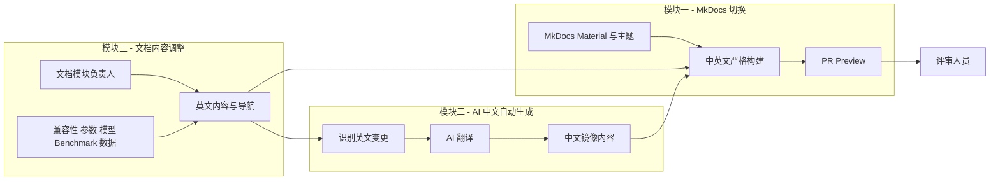
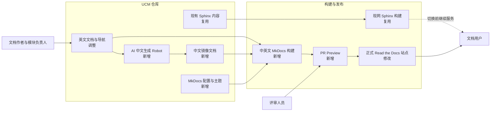
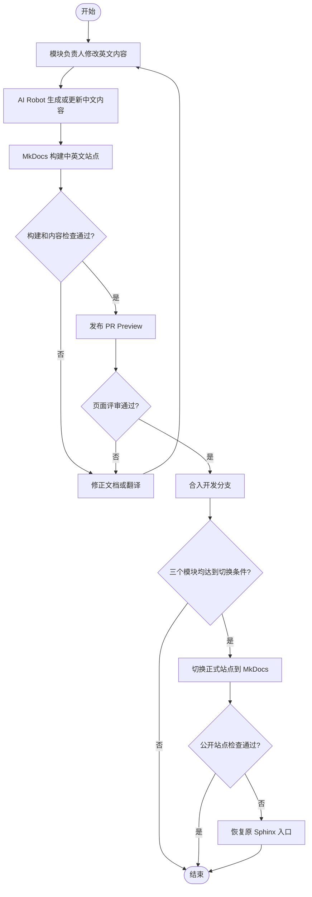

# UCM 文档网站重构技术评审

| 项目 | 内容 |
| --- | --- |
| 状态 | Proposed |
| 日期 | 2026-08-15 |
| 评审范围 | MkDocs 切换、AI 中文自动生成、文档内容调整 |
| 当前站点 | [UCM Documentation](https://ucm.readthedocs.io/) |

本次重构只包含三项开发工作：将网站从 Sphinx 切换到 MkDocs Material，接入 AI 自动生成中文文档，以及按新的信息架构调整现有内容。三项工作可以并行开发，但统一通过中英文构建和 PR Preview 完成评审，全部验收后再切换正式站点。

## 1. 背景与问题

### 1.1 当前情况

UCM 已有基于 Sphinx 和 Read the Docs 的对外站点，也有可以继续复用的英文内容。新站希望采用接近 vLLM 和 vLLM Ascend 的 MkDocs Material 体验，并补充中文站点。开发期间现网站点继续服务，新站独立建设和预览。

### 1.2 存在的问题

- 在现有 Sphinx 工程上继续扩展目标 UI、双语和交互能力需要较多定制，需要建立新的 MkDocs 构建与发布链路。
- 中文内容缺少自动生成和持续同步能力，完全依赖人工翻译会使中英文长期不一致。
- 现有内容需要按用户任务重新组织，并明确每个文档模块的负责人，否则页面补齐和后续维护没有稳定归属。

### 1.3 问题原因

站点工程、双语生产和内容维护缺少独立的责任边界：发布链路绑定现有 Sphinx 工程，中文依赖人工同步，内容目录也没有稳定的模块负责人。因此每次改版都会同时牵动技术栈、翻译和页面迁移。

## 2. 目标与范围

### 2.1 目标

- **MkDocs 切换：**完成新站工程、目标 UI、PR Preview 和正式站点切换能力，开发期间不影响现网。
- **AI 中文自动生成：**英文变更后自动生成同路径中文内容，并在同一个 PR 中完成中英文检查和评审。
- **文档内容调整：**按新的导航重组、迁移和补齐内容，为每个文档模块指定负责人。

### 2.2 适用范围

| 开发模块 | 范围 |
| --- | --- |
| MkDocs 切换 | MkDocs Material、导航与主题、搜索、版本和语言入口、构建、Preview 与正式切换 |
| AI 中文自动生成 | 英文变更识别、AI 翻译、中文文件更新、中英文构建与 PR 评审 |
| 文档内容调整 | Home、User Guide、Reference、Benchmark、Developer Guide、Toolkit 的迁移、补齐和维护 |

### 2.3 不包含的内容

- 不修改 UCM 运行时、推理引擎、Kthena、Helm Chart 或 PyMotor[TODO：仓库内暂无 PyMotor 痕迹，需确认是否为既存组件] 的产品行为。
- AI 生成的中文是待评审内容，不替代文档负责人对技术准确性的确认。
- 不在 UCM 仓库复制并长期维护完整的上游 API 或跨仓库实现文档。

## 3. 方案对比与选择

### 3.1 可选方案

本轮重构已将 MkDocs Material 作为目标技术栈：它可以直接提供所需的导航、搜索、主题和扩展基础，减少在 Sphinx 主题上持续定制 UI 的成本。因此这里的核心决策是**如何迁移到 MkDocs**；保留 Sphinx 方案作为成本和收益基线，而不是目标方案。

#### 方案一：继续使用 Sphinx，仅调整主题和导航

保留现有目录与构建链路，通过更换主题、重排 `toctree` 和补充页面改善体验。该方案迁移量最小，但安装选择器、结构化数据渲染、双语协作和 UI 扩展仍需较多定制。

#### 方案二：在现有目录中原位切换到 MkDocs

直接把 `docs/source` 改造成 MkDocs 内容目录，并修改根目录 Read the Docs 配置。技术栈统一较快，但开发期间会持续触碰现网站点的入口、依赖和目录，预览、回滚与内容迁移彼此耦合。

#### 方案三：使用 `docs-next` 并行建设 MkDocs 站点

在仓库内新建隔离的 MkDocs 目录，复用并迁移现有内容，通过独立 Read the Docs Preview 进行评审。新站通过验收后，再切换正式构建入口。

### 3.2 Sphinx 与 MkDocs 技术栈差异

Sphinx 与 MkDocs 都能构建高质量静态文档站，差异主要在默认内容模型和擅长场景，而不是简单的功能强弱。Sphinx 更偏向通用技术出版、对象引用和代码 API 文档；MkDocs 更偏向 Markdown 优先的 Web 文档站，配合 Material 主题更容易形成目标中的导航和交互体验。

| 对比维度 | Sphinx + MyST（现状） | MkDocs Material（目标） | 对 UCM 的影响 |
| --- | --- | --- | --- |
| 主要用途 | 通用技术出版和多格式输出 | Markdown 优先的 Web 文档站 | UCM 当前目标是对外 Web 文档 |
| 内容与导航 | MyST/reStructuredText、指令和分布式 `toctree` | Markdown 与集中式 `nav` | MkDocs 更适合统一维护任务型导航 |
| API 文档 | 原生支持对象域和源码 API 生成 | 通常依赖插件或构建前生成 | UCM 当前不依赖完整的源码 API 生成 |
| UI 与交互 | 依赖主题和模板定制 | Material 已提供导航、搜索、主题和响应式基础 | MkDocs 更接近目标 UI，定制工作更少 |
| 国际化 | 主要使用 gettext 翻译链路 | 多份内容与配置组合构建 | 本方案可直接接入同路径 AI 中文生成 |
| 迁移成本 | 保持现状成本最低 | 需要转换导航、MyST 指令（figure、raw HTML、toctree、colon_fence、substitution）和 URL | 采用旁路目录控制迁移风险 |

当前公开内容以 Markdown 为主，没有依赖完整的代码 API 自动生成链路，因此迁移成本可控。若以后需要从源码生成完整 API 文档，再为 MkDocs 增加专门生成能力或独立 API 子站。技术差异依据 [Sphinx 文档](https://www.sphinx-doc.org/en/master/)和 [MkDocs 文档](https://www.mkdocs.org/)整理。

### 3.3 迁移方式对比

| 对比项 | 方案一：保留 Sphinx | 方案二：原位切换 | 方案三：并行建设 |
| --- | --- | --- | --- |
| 对现网站点影响 | 低 | 高 | 最低 |
| UI 与交互扩展 | 中 | 高 | 高 |
| 内容迁移风险 | 低 | 高 | 中 |
| 独立预览 | 一般 | 较弱 | 最好 |
| 回滚难度 | 低 | 高 | 低 |
| 初始投入 | 低 | 中 | 中 |
| 长期维护 | 中 | 低 | 低 |

### 3.4 最终选择

选择**方案三：使用 `docs-next` 并行建设 MkDocs 站点**。

决定性原因有三个：

1. MkDocs Material 能以较少主题定制实现目标导航、搜索、响应式布局和交互扩展，满足已锁定的 UI 方向。
2. `docs-next` 让新站开发、内容迁移和现网发布彼此隔离，不会把未完成结构暴露给现有用户。
3. 每个 PR 都可以生成独立 Preview；验收后再切换正式构建入口，失败时可以恢复原 Sphinx 站点。

### 3.5 方案代价

- 迁移期需要同时维护 Sphinx 现网站点和 MkDocs 新站。
- 新站、AI 翻译和各文档模块都需要明确负责人，避免形成新的无人维护内容。

## 4. 技术原理与方案设计

### 4.1 核心原理

三个开发模块通过文档内容串联：内容调整模块产出英文 Markdown 和必要的结构化数据，AI 模块根据英文变更生成对应中文内容，MkDocs 模块构建两种语言并发布 Preview。三者可以分别开发，但最终以同一个 PR 中的英文内容、中文内容和页面效果作为共同交付物。

### 4.2 原理图



内容模块决定写什么，AI 模块解决中文同步，MkDocs 模块负责展示和发布。模块边界清晰后，站点工程、翻译能力和内容建设可以并行推进。

### 4.3 整体方案

| 开发模块 | 主要工作 | 主要交付 | 前置依赖 |
| --- | --- | --- | --- |
| MkDocs 切换 | 建立隔离的新站工程，完成主题、导航、搜索、双语构建、Preview 和正式切换 | 可独立预览和发布的 MkDocs Material 站点 | 英文与中文内容目录 |
| AI 中文自动生成 | 识别英文变更，调用 AI 生成中文，更新同路径文件并参加 PR 检查 | 同一个 PR 中可评审的中文内容 | 稳定的英文页面路径和术语约定 |
| 文档内容调整 | 确定导航，迁移和重写现有内容，补齐缺失模块并完成技术校验 | 完整英文内容、必要的结构化数据和模块验收结果 | 文档负责人和真实验证信息 |

三个模块从项目开始即并行：MkDocs 先提供页面骨架和 Preview，内容负责人按新导航迁移英文页面，AI 流程先用少量样例页面验证，待路径和术语稳定后覆盖全部内容。现有 Sphinx 站在三项工作完成前继续服务。

### 4.4 整体架构图



文档负责人维护英文内容，AI Robot 生成中文镜像，MkDocs 统一构建两种语言并提供 Preview。正式切换前，Sphinx 站点继续服务；三项开发均通过评审后，MkDocs 才接管正式入口。

### 4.5 组件说明

| 开发模块 | 作用 | 本次变化 |
| --- | --- | --- |
| MkDocs 切换 | 建设、预览和发布中英文站点 | 新增 MkDocs 工程，复用 Read the Docs |
| AI 中文自动生成 | 根据英文变更生成并更新中文内容 | 新增 AI Robot 与双语检查 |
| 文档内容调整 | 重组导航，迁移、补齐和维护页面 | 修改并扩展现有内容 |

### 4.6 关键流程图



日常 PR 只更新新站内容和 Preview，不影响现网。正式切换要求 MkDocs 工程、AI 中文生成和文档内容三个模块同时完成验收；切换失败时恢复原 Sphinx 入口。

### 4.7 关键设计点

#### 4.7.1 MkDocs 切换

`docs-next` 作为独立的新站目录，使用 MkDocs Material 建设中英文站点。开发期间通过独立 Preview 评审，现有 Sphinx 站点继续服务；内容和页面体验通过验收后，再切换正式 Read the Docs 构建入口，异常时恢复原入口。

页面布局参考 vLLM 和 vLLM Ascend：顶部提供主导航、搜索、语言、版本和主题入口，桌面端使用左侧章节树、中间正文和右侧页内目录，移动端优先展示正文。

安装选择器参考 [PyTorch Get Started](https://pytorch.org/get-started/locally/) 的交互模式：单一页面承载选择器，用户按 UCM 版本、引擎、设备（GPU/NPU）、操作系统、架构和安装方式选择维度，由前端脚本从一份静态安装矩阵数据动态渲染对应的安装命令（Docker、Helm、pip wheel 或源码构建），不为每个组合生成独立页面。仓库内已有 `docs/source/_static/model-configs.js` 用同样的"静态数据 + 前端脚本"模式驱动 KV Cache Calculator，可直接复用该模式承载安装矩阵。兼容矩阵和 Benchmark 表格同样采用静态数据驱动的交互筛选，但必须保留可搜索的静态内容。

#### 4.7.2 AI 中文自动生成

英文是主内容来源，中文目录保持同路径镜像。作者修改英文文档后，AI Robot 按以下机制生成中文：

1. **变更检测**：CI 任务对 PR 中 `docs-next` 英文目录相对 base 分支执行 `git diff`，列出新增或变更的英文页面，未变更页面不重复翻译。
2. **AI 调用**：对每个变更页面调用一份固定配置的 AI 翻译服务，端点与模型通过 CI secret 注入（具体模型待选定，需与安全策略一致，不在计划里硬编码）。
3. **术语注入**：将版本化的术语表 `docs-next/glossary.yml`（英文→中文术语映射）注入 prompt，保证命令、参数名和专有名词跨页面一致；术语表本身随英文内容评审。
4. **回写 PR**：翻译结果由一个具备写权限的 GitHub App 提交到同一 PR 分支，仅覆盖作者未手动修改的中文镜像文件，避免与作者改动冲突；作者手动改过的中文文件以作者版本为准。

结果更新到同一个 PR。

中英文页面同时执行 MkDocs 构建并生成 Preview。文档负责人需要检查技术含义、命令、链接和关键术语；AI 负责提高翻译效率，不承担最终技术责任。中文未生成或评审未通过时，相关内容不能作为双语页面合入。

#### 4.7.3 文档内容调整

顶层导航统一为：

`Home / User Guide / Reference / Benchmark / Developer Guide / Toolkit`

`Engines & APIs` 和 `Deploy` 不单独占用顶层导航：引擎接入和部署教程进入 `User Guide`，OpenAI-Compatible API、参数和兼容矩阵进入 `Reference`。

以下负责人列刻意留空，由项目评审后填写。内容迁移开始前，每一行都应确定一名负责人。

| 一级模块 | 二级模块或主要内容 | 首期交付重点 | 负责人 |
| --- | --- | --- | --- |
| Home | 项目定位、核心能力、Quickstart、支持概览 | 重写首页和主要任务入口 |  |
| User Guide | Installation | 参考 PyTorch 安装选择器：单页交互 + 静态安装矩阵 + 前端脚本动态渲染安装命令，复用现有 model-configs.js 模式，不为组合生成独立页面 |  |
| User Guide | Model Tour - GLM | 完成首个可验证的 Docker 部署教程 |  |
| User Guide | Model Tour - Qwen3 | 选择经典模型并补齐部署教程 |  |
| User Guide | Model Tour - DeepSeek | 完成代表模型的部署与验证 |  |
| User Guide | Model Tour - MiniMax | 确认代表模型和支持范围后建设教程 |  |
| User Guide | Model Tour - Kimi | 确认代表模型和支持范围后建设教程 |  |
| User Guide | Engines | vLLM、vLLM Ascend、SGLang、MindIE |  |
| User Guide | Deploy | Docker、Kubernetes with Helm and Kthena、PyMotor[TODO：仓库内暂无痕迹，需确认] |  |
| User Guide | 核心能力与排障 | Prefix Cache、Sparse Attention、PD、监控和常见问题 |  |
| Reference | API 与参数 | OpenAI-Compatible API、引擎参数、UCM 配置和环境变量 |  |
| Reference | 兼容性与指标 | 支持矩阵、Metrics 和 CLI |  |
| Benchmark | 方法、使用、数据和性能对比 | 建立可复现的 Benchmark 入口和对比表 |  |
| Developer Guide | 架构、功能与参数原理、扩展和贡献 | 重组开发者内容和关键流程 |  |
| Toolkit | 工具安装、部署和使用 | KV Cache Calculator 及其他工具入口 |  |

兼容性、参数、模型状态和 Benchmark 等重复事实使用结构化数据维护，由对应文档负责人确认来源和结果。页面状态只有具备可追溯验证记录时才能标记为已验证。

### 4.8 异常处理

| 异常场景 | 影响 | 处理方式 |
| --- | --- | --- |
| 中文内容或结构化数据检查失败 | 双语页面或重复事实不一致 | 由对应文档负责人修正后重新构建 |
| Preview 构建失败 | 无法进行页面级评审 | 保留现网站点，修复新站构建后重新生成 Preview |
| 文档模块未明确负责人或未完成验证 | 内容无法持续维护 | 暂不迁移该模块，不影响其他模块并行开发 |
| 正式切换后关键页面异常 | 公开访问受影响 | 恢复旧构建入口，并在 Preview 中修复后再次切换 |

## 5. 使用方式

### 5.1 使用场景

- **MkDocs 开发人员**建设站点骨架、主题和构建链路，并为每个 PR 提供中英文 Preview。
- **文档负责人**维护所属模块的英文内容，检查 AI 生成的中文，并确认页面中的技术结论。
- **评审人员**直接通过 Preview 检查导航、内容、翻译和页面效果。

### 5.2 环境要求

- 锁定版本的 Python、MkDocs Material 和必要插件；
- 可由 CI 调用的 AI 服务、模型配置和项目术语约定；
- GitHub PR 与 Read the Docs Preview；
- 验证模型、GPU、NPU、集群和性能内容所需的真实运行环境。

### 5.3 使用示例

以下命令表示计划提供的统一入口，具体参数在实现时固定：

```bash
python docs-next/tools/site.py generate
python docs-next/tools/site.py translate --changed
python docs-next/tools/site.py validate
python docs-next/tools/site.py build --lang en --strict
python docs-next/tools/site.py build --lang zh-cn --strict
python docs-next/tools/site.py serve --lang en
```

作者先更新英文内容或结构化数据，AI Robot 生成中文，再统一校验和构建两种语言。

`site.py generate` 需接管仓库内已有的生成内容：`docs/source/getting-started/docker-recipes.generated.md` 文件头声明由 `.github/release/release.yaml` 生成，但当前作为静态文件提交且仓内无重生成脚本。新流程应在该步骤从 `release.yaml` 重生成此文件，避免新站携带陈旧的 recipe 表；其他 `.generated.*` 内容同理。

### 5.4 实施计划

三个开发模块并行推进，整体预计 8–10 周。技术负责人列保持空白，由项目评审后填写。

| 开发模块 | 时间安排 | 主要工作 | 完成结果 | 技术负责人 |
| --- | --- | --- | --- | --- |
| MkDocs 切换 | 第 1–2 周完成骨架，第 9–10 周完成正式切换 | 建站、UI、导航、搜索、双语 Preview、正式切换和回滚 | 新站可独立预览并接管正式入口 |  |
| AI 中文自动生成 | 第 2–5 周 | 接入 AI，识别英文变更，在同一个 PR 更新中文并执行双语检查 | 英文变更能够稳定生成可评审的中文页面 |  |
| 文档内容调整 | 第 2–8 周 | 确定负责人，重组导航，迁移和补齐重点内容，完成技术验证 | 六个顶层模块和主要用户路径完成 |  |

第 1–2 周先完成站点骨架、AI 样例链路和负责人分配；第 3–8 周并行建设内容与翻译能力；第 9–10 周集中完成中英文验收、旧 URL 检查和正式切换。

## 6. 总结

本次重构不再作为一个笼统的网站改版推进，而是拆成 MkDocs 切换、AI 中文自动生成和文档内容调整三个开发模块。三者职责清晰，可以并行开发，也能分别安排负责人和验收结果。

MkDocs 提供新站 UI、Preview 和发布能力，AI Robot 提高中文同步效率，文档负责人保证内容完整性和技术准确性。现有 Sphinx 站在三项工作完成前继续服务，全部通过评审后再切换正式入口。
