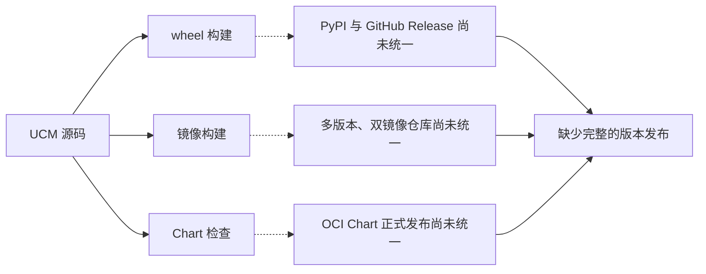
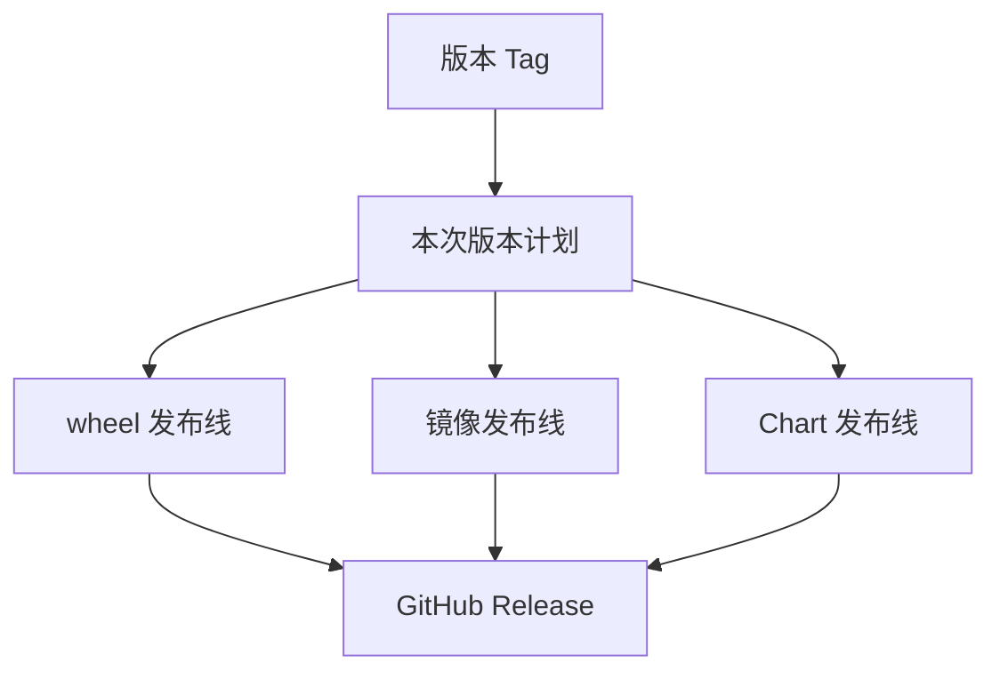
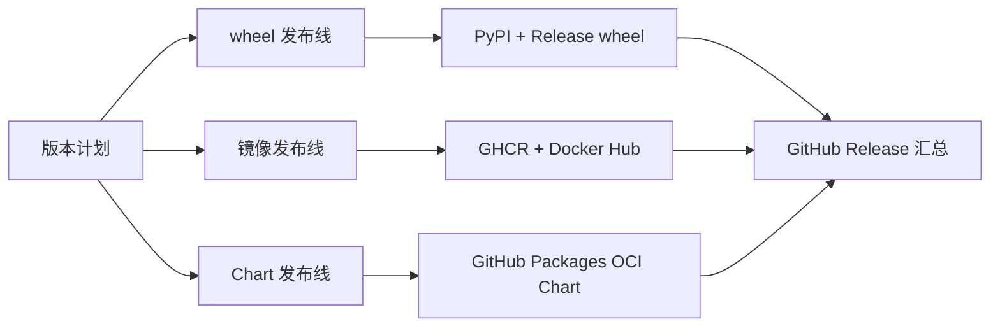
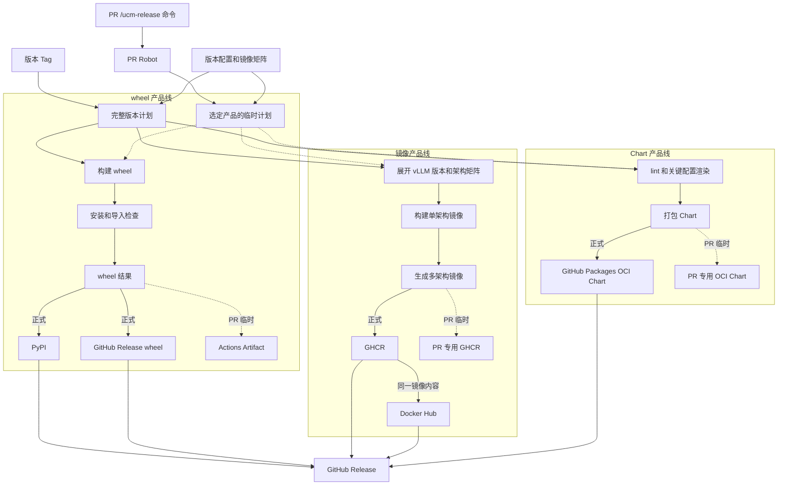
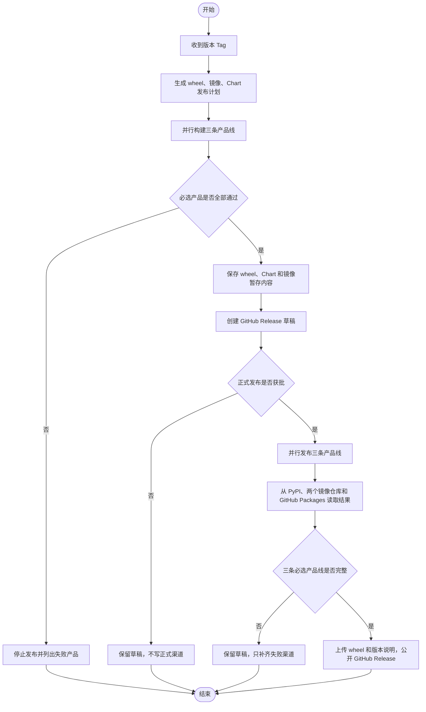
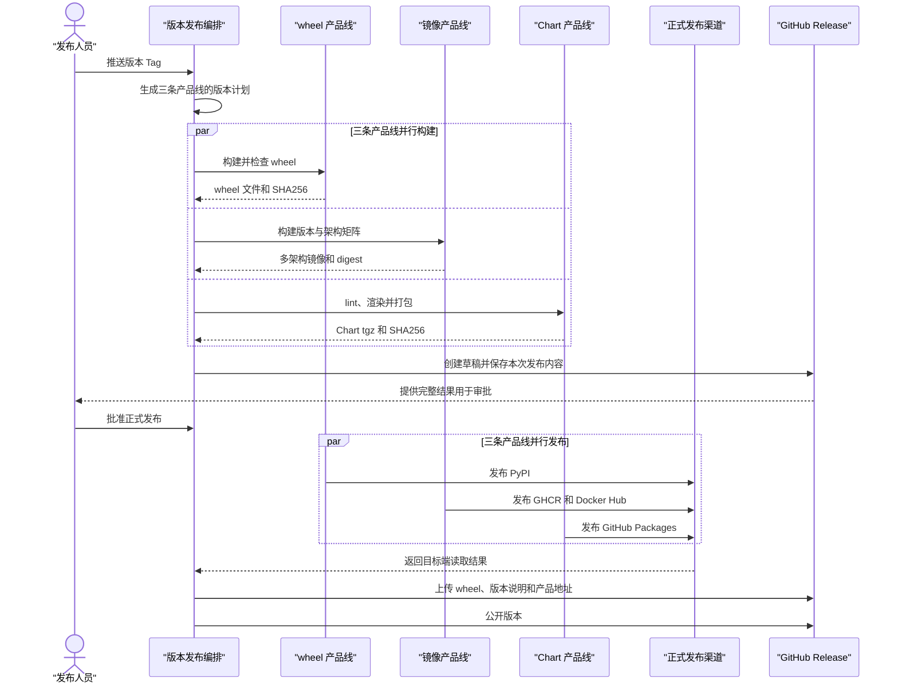
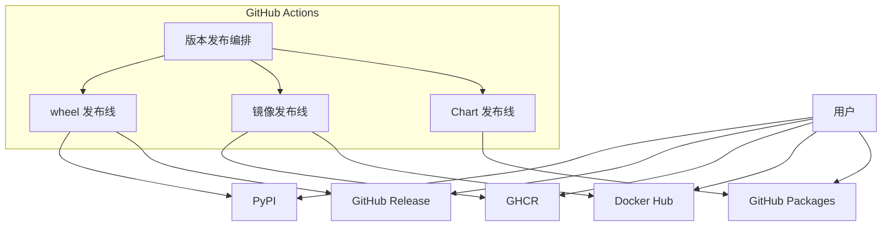

# UCM 产品发布自动化技术方案

UCM 的发布目标只有三项：

1. 构建 wheel，正式发布到 PyPI，并随版本上传到 GitHub Release；
2. 构建多个 vLLM 版本、多个 CPU 架构的 UCM 镜像，正式发布到 GHCR 和 Docker Hub；
3. 打包 Helm Chart，以 OCI Chart 的形式发布到 GitHub Packages。

这三类产品由同一个版本 Tag 组织，但各自拥有独立的构建、检查和发布过程。GitHub Release 最后汇总本版本的 wheel、版本说明以及镜像和 Chart 地址。

PR 中的 `/ucm-release` Robot 是辅助能力。它复用三条产品线的构建方式，为评审提供临时 wheel、镜像和 Chart，但不会向 PyPI、Docker Hub 或正式版本地址写入内容。

本文说明目标方案和实施计划，不把尚未完成的正式渠道发布写成现有能力。

## 1. 背景与问题

### 1.1 当前情况

仓库已经具备 wheel、镜像和 Chart 的部分构建能力：

- `_build-wheel.yml` 构建 UCM wheel；
- `_build-image.yml` 构建单个架构的镜像；
- `release-vllm-images.yml` 组织镜像矩阵；
- `charts/ucm` 保存 Chart 源码；
- `release-ucm.yml` 承担现有发布编排。

这些工作主要解决“能不能构建”，还没有完整解决“产品怎样交给用户”：

- wheel 需要同时进入 PyPI 和当前版本的 GitHub Release；
- 镜像需要覆盖多个上游版本和 CPU 架构，并同时进入 GHCR 和 Docker Hub；
- Chart 需要以标准 OCI 包发布到 GitHub Packages；
- 三条产品线全部完成后，GitHub Release 才能作为本版本的统一入口。

此外，代码合并前也需要复用这些构建能力。评审人员应当能够在 PR 中按需构建某一类产品，并直接下载或拉取临时产物。

### 1.2 存在的问题

- 现有流程围绕构建任务组织，没有把 wheel、镜像和 Chart 当作三条完整产品线；
- wheel 的 PyPI 发布和 GitHub Release 上传还没有形成同一版本、同一文件的保证；
- 镜像矩阵偏固定，新增 vLLM 版本或架构需要修改工作流；
- GHCR 和 Docker Hub 分别发布时，可能出现版本相同但镜像内容不同；
- Chart 缺少正式 OCI 地址、版本转换和 `helm pull` 检查；
- 三类产品发布到不同系统，任一系统失败都会留下不完整版本；
- GitHub Release 何时创建、包含什么、什么时候公开，没有统一规则；
- PR 临时构建如果另写一套配方，会与正式发布逐渐产生差异。

### 1.3 问题原因

构建任务只关心输入代码和输出文件，产品发布还需要处理版本、渠道和用户入口。

三类产品的发布方式并不相同：PyPI 接收 Python 包，镜像仓库接收 OCI 镜像和多架构索引，GitHub Packages 接收 OCI Chart。不能用一套通用上传脚本掩盖这些差异，也不应该为每个入口复制一遍构建逻辑。

因此，方案需要同时保留两种关系：

- 横向由一个版本 Tag 组织三条产品线，确保它们属于同一次 UCM 发布；
- 纵向由每条产品线独立完成构建、检查、发布和目标端确认。

PR Robot 只是在产品线前面增加一个临时入口，不改变三条产品线本身。

### 1.4 现状图（可选）



问题不在某个命令缺失，而在三条产品线还没有从源码一直连接到用户使用的渠道。

---

## 2. 目标与范围

### 2.1 目标

正式版本由一个受保护的版本 Tag 触发，产出以下内容：

| 产品线 | 正式发布结果 | GitHub Release 中的内容 | 用户入口 |
| --- | --- | --- | --- |
| Python wheel | PyPI 中的正式包 | 同一份 wheel 文件、安装说明、SHA256 | `pip install` 或 Release 下载 |
| 多版本镜像 | GHCR 和 Docker Hub 中的多架构镜像 | 镜像版本、平台列表、两个仓库地址和 digest | `docker pull` |
| Helm Chart | GitHub Packages 中的 OCI Chart | Chart 版本、OCI 地址和 SHA256 | `helm pull` / `helm install` |

镜像的“GitHub 发布”指 GitHub Container Registry，也就是 GitHub Packages 中的容器镜像仓库。

正式发布需要满足以下目标：

- 一个 Tag 对应一个 UCM 版本、一个 Chart 版本和一组镜像标签；
- PyPI 与 GitHub Release 使用同一份 wheel 文件；
- GHCR 与 Docker Hub 使用同一组镜像内容；
- Chart 从 GitHub Packages 拉回后可以通过 lint 和关键配置渲染；
- 三条必选产品线都完成后，GitHub Release 才公开；
- 某个渠道失败时继续补齐缺失部分，不重新构建另一份内容。

PR 临时产物的目标是支持评审：

| 产品线 | PR 临时产物 | 不会发布到 |
| --- | --- | --- |
| Python wheel | Actions Artifact | PyPI、GitHub Release |
| 多版本镜像 | PR 专用 GHCR 镜像 | Docker Hub、正式 GHCR 地址 |
| Helm Chart | PR 专用 OCI Chart + Actions Artifact | 正式 Chart 地址、GitHub Release |

### 2.2 适用范围

本方案适用于：

- UCM 的正式版和 RC wheel；
- UCM 支持的不同后端、Python ABI 和 CPU 架构；
- 多个 vLLM、vLLM Ascend 版本及其 amd64、arm64 镜像；
- `charts/ucm` 的检查、打包和 OCI 发布；
- GitHub Actions、PyPI、GHCR、Docker Hub、GitHub Packages 和 GitHub Release；
- 仓库内 PR 以及经过维护者确认的 Fork PR。

### 2.3 不包含的内容

- PR 临时 wheel 不进入 PyPI；
- PR 临时镜像不进入 Docker Hub；
- PR 不创建临时 Git Tag 或 GitHub Release；
- 首版不把 PR 产物直接提升为正式产品，版本 Tag 会重新构建；
- 不发布未经单独治理的 `latest`、`stable` 等可变镜像标签；
- 首版不处理签名、SBOM、Attestation 和 Transparency Log；
- 不把完整 OCI 镜像归档放入 GitHub Release；
- CUDA、NPU 和 Kubernetes 集群测试平台不在本次实现范围内；如果 Stable 发布需要这些结果，由正式发布审批确认。

---

## 3. 方案对比与选择

### 3.1 可选方案

#### 方案一：三条产品线完全独立发布

wheel、镜像和 Chart 分别维护独立的触发方式、版本来源和发布记录。

这种方式容易分工，但同一个 UCM 版本可能在三个时间点发布，GitHub Release 很难准确说明哪些产品已经可用。

#### 方案二：所有构建和发布放进一个大工作流

版本 Tag 触发一个工作流，按固定顺序完成 wheel、镜像、Chart 和所有外部渠道。

这种方式入口统一，但产品线之间耦合过重。新增一个镜像版本、重试 Docker Hub 或调整 PyPI 包结构，都可能影响整个工作流。

#### 方案三：一个版本编排，三条产品发布线

版本 Tag 先生成本次发布范围，再并行调用 wheel、镜像和 Chart 三条产品线。每条产品线独立构建、检查和发布，最后将结果交给 GitHub Release 汇总。

PR Robot 复用同样的产品线，但只打开对应的临时出口。

### 3.2 方案对比

| 对比项 | 方案一 | 方案二 | 方案三 |
| --- | --- | --- | --- |
| 版本一致性 | 三条线容易不同步 | 一致 | 一致 |
| 产品线独立演进 | 好 | 差 | 好 |
| 多版本镜像扩展 | 单独处理 | 大工作流持续膨胀 | 修改镜像矩阵即可 |
| 单渠道重试 | 容易 | 容易牵动全流程 | 在对应产品线内处理 |
| GitHub Release 汇总 | 困难 | 容易 | 容易 |
| PR 临时构建复用 | 容易复制实现 | 与正式流程强耦合 | 复用三条产品线 |
| 实现成本 | 中 | 低到中 | 中 |
| 长期维护 | 版本关系复杂 | 工作流复杂 | 职责清楚 |

### 3.3 方案对比图（可选）



方案三的重点不是增加一个公共上传层，而是让三条产品线共享版本范围、各自完成发布。

### 3.4 最终选择

选择方案三：一个版本编排，三条产品发布线。

决定性原因如下：

1. wheel、镜像和 Chart 的发布方式不同，应当分别实现和验证；
2. 三条产品线必须共享版本 Tag 和源码 SHA，才能组成一个 UCM Release；
3. 镜像版本扩展不应迫使 wheel 或 Chart 修改；
4. GitHub Release 需要等三条必选产品线完成后再公开；
5. PR Robot 可以复用产品线的构建任务，不需要另写一套临时构建系统。

### 3.5 方案代价

- 需要定义三条产品线共同使用的版本计划和结果格式；
- 需要分别接入 PyPI、GHCR、Docker Hub 和 GitHub Packages；
- 三个外部发布系统不能一次提交，必须处理部分成功；
- 正式发布前需要保存 wheel、Chart 和镜像内容，确保重试时不重新构建；
- PR 临时镜像和 Chart 需要单独地址和到期清理；
- 后端 wheel 的 PyPI 项目名需要在实施前确认。

这些成本换来的是三条产品线可以独立演进，同时仍然组成一个完整版本。

---

## 4. 技术原理与方案设计

### 4.1 核心原理

方案的核心是：**一个版本计划，三条产品发布线，一个 GitHub Release。**

版本计划只说明本次发布的公共信息：Git Tag、源码 SHA、UCM 版本、Chart 版本、wheel 组合以及镜像版本矩阵。它不替代各产品线自己的构建和发布逻辑。

三条产品线分别返回可供用户使用的结果：

- wheel 发布线返回 PyPI 项目、版本、文件名和 SHA256；
- 镜像发布线返回每个镜像版本在 GHCR、Docker Hub 的地址、平台列表和 digest；
- Chart 发布线返回 OCI 地址、Chart 版本和 SHA256。

GitHub Release 只汇总这些结果，并保存 wheel 文件。它不是镜像或 Chart 的第二存储位置。

### 4.2 原理图（按需提供）



### 4.3 整体方案

正式发布由版本 Tag 启动。`release-ucm.yml` 读取发布配置，生成本次版本计划，然后并行启动三条产品线：

1. wheel 发布线完成构建、安装检查、PyPI 发布和 GitHub Release wheel 准备；
2. 镜像发布线展开 vLLM 版本与架构矩阵，生成多架构镜像并发布到 GHCR、Docker Hub；
3. Chart 发布线完成 lint、关键配置渲染、打包和 GitHub Packages 发布。

三条产品线开始对外发布前，先保存本次构建结果并创建 GitHub Release 草稿。正式发布审批通过后，各产品线写入目标渠道，再从目标渠道读取一次。三条必选产品线全部通过，才公开 GitHub Release。

PR Robot 使用同一份产品配置和构建任务，但只执行评论中选择的产品。wheel 留在 Actions Artifact，镜像和 Chart 使用 PR 专用 GitHub Packages 地址。PR 结果通过评论和 Check 返回，不进入正式 GitHub Release。

### 4.4 整体架构图（必须）



图中实线是正式版本，虚线是 PR 临时产物。PR 和 Tag 可以调用相同的构建任务，但只有 Tag 路径能进入正式渠道。

### 4.5 组件说明

| 组件 | 主要职责 | 本次变化 |
| --- | --- | --- |
| `release-ucm.yml` | 读取版本 Tag，生成版本计划，并行组织三条产品线，最终发布 GitHub Release | 修改 |
| `_build-wheel.yml` | 构建、安装并检查 wheel | 修改并复用 |
| wheel 发布任务 | 发布 PyPI，并把同一份 wheel 交给 GitHub Release | 新增 |
| `release-vllm-images.yml` | 展开多版本、多架构镜像矩阵 | 修改并复用 |
| `_build-image.yml` | 构建并检查单架构镜像 | 修改并复用 |
| 镜像发布任务 | 生成多架构镜像，发布 GHCR 并复制到 Docker Hub | 新增 |
| Chart 构建与发布任务 | lint、渲染、打包并发布 OCI Chart | 新增 |
| `pr-release-command.yml` | 解析 PR 命令，选择要临时构建的产品 | 新增 |
| `pr-release-build.yml` | 调用三条产品线的构建部分，并返回临时产物 | 新增 |
| `.github/release` | 保存版本、产品地址、镜像矩阵和结果检查代码 | 修改 |

### 4.6 关键流程图（必须）

关键流程和 4.7 的时序图都以正式版本发布为主；PR 临时构建的补充设计见 4.8.6。



正式发布开始后，重跑必须使用已经保存的 wheel、Chart 和镜像内容。重新构建会使同一个版本在不同渠道出现不同文件，因此不允许作为自动恢复方式。

### 4.7 关键时序图（按需提供）



### 4.8 关键设计点

#### 4.8.1 版本计划

版本 Tag 是正式版本的来源：

| 对象 | RC 示例 | Stable 示例 |
| --- | --- | --- |
| Git Tag | `v1.2.0rc1` | `v1.2.0` |
| Python 版本 | `1.2.0rc1` | `1.2.0` |
| Chart 版本 | `1.2.0-rc.1` | `1.2.0` |
| GitHub Release | `v1.2.0rc1` | `v1.2.0` |

`.github/release/release.yaml` 保存产品名、正式地址和版本转换；`compatibility.yaml` 保存 vLLM 版本、加速器类型、CPU 架构以及必选/可选关系。

正式发布前需要确认：

- PyPI 的项目名以及不同后端 wheel 如何区分；
- GHCR 和 Docker Hub 的正式仓库名；
- GitHub Packages 中的 Chart 地址；
- 首版需要发布的镜像版本和架构；
- 哪些镜像是必选，哪些允许在版本说明中标记为暂不可用。

#### 4.8.2 wheel 发布线

wheel 发布线按照以下顺序执行：

1. 根据发布计划构建 wheel；
2. 执行 wheel 元数据检查；
3. 在干净 Python 环境安装，执行 `pip check` 和导入检查；
4. 保存 wheel 文件和 SHA256；
5. 正式审批后通过 PyPI Trusted Publishing 上传；
6. 从 PyPI 下载文件，确认 SHA256 与本次构建一致；
7. 将同一份 wheel 上传到 GitHub Release 草稿。

现有后端 wheel 如果使用 `+cuda`、`+cann` 等 local version，需要在接入 PyPI 前确定公开包结构。建议首版按后端拆分 PyPI 项目，并保持相同 Python import name；最终项目名和升级方式在实施第一阶段确认。相关版本规则参考 [Python Packaging Version Specifiers](https://packaging.python.org/en/latest/specifications/version-specifiers/)，发布认证使用 [PyPI Trusted Publishers](https://docs.pypi.org/trusted-publishers/)。

#### 4.8.3 镜像发布线

镜像发布线由配置声明需要支持的 vLLM 版本，不把某一次固定矩阵写进工作流。

每个镜像条目至少说明：上游项目和版本、基础镜像 digest、加速器类型、CPU 架构、对应 wheel 以及最终镜像标签。

发布过程如下：

1. 为每个镜像版本分别构建 amd64、arm64 等单架构镜像；
2. 在镜像内检查 wheel 安装、Python 导入和需要的动态库；
3. 所有必选架构通过后，生成多架构镜像；
4. 先发布到 GHCR；
5. 按同一镜像内容发布到 Docker Hub；
6. 从两个仓库读取平台列表和 digest，确认结果一致；
7. 将两个仓库的地址写入 GitHub Release。

必选镜像失败会阻止正式 GitHub Release；可选镜像失败会写进版本说明，不影响其他产品。多架构构建方式参考 [Docker multi-platform builds](https://docs.docker.com/build/building/multi-platform/)。

#### 4.8.4 Chart 发布线

Chart 版本由 UCM Tag 转换得到，例如 `v1.2.0rc1` 对应 `1.2.0-rc.1`。

Chart 发布线执行：

1. `helm lint`；
2. 使用 CUDA、A2、A3 等关键配置执行 `helm template`；
3. `helm package` 生成 tgz；
4. 正式审批后发布到 GitHub Packages OCI 地址；
5. 使用 `helm pull` 下载，核对版本和 SHA256；
6. 对下载后的 Chart 再执行一次关键配置渲染；
7. 将 OCI 地址写入 GitHub Release。

Chart tgz 可以保留在正式发布包中用于恢复，但正式用户入口是 GitHub Packages，不重复作为 GitHub Release 二进制资产。OCI 使用方式参考 [Helm OCI registries](https://helm.sh/docs/topics/registries/)。

#### 4.8.5 正式版本汇总与失败恢复

三条产品线完成构建后，工作流先生成 `ucm-release-<tag>-<plan-sha>` Actions Artifact，保存 wheel、Chart、版本计划、校验文件和镜像暂存地址，至少保留 90 天。单架构镜像以 digest 保存在私有 GHCR 暂存区，同样至少保留 90 天。GitHub Release 草稿记录对应的 Actions run、Artifact ID 和 digest，重跑时据此找到原始内容。

GitHub Release 先创建为草稿。正式审批通过后，三条产品线开始写外部渠道。如果某个渠道失败：

- 已经成功的内容保留，不删除、不覆盖；
- 重跑按 Tag 和计划摘要找到原发布包和镜像暂存内容；
- 内容一致的渠道直接复用，只重试缺失渠道；
- 找不到原内容或发现同名不同内容时停止自动发布；
- 三条必选产品线都从目标渠道确认后，才公开 GitHub Release。

GitHub Release 至少包含 wheel、版本说明、`checksums.txt`、`release-manifest.json`、镜像地址和 Chart 地址。GitHub Release 的能力参考 [About GitHub Releases](https://docs.github.com/en/repositories/releasing-projects-on-github/about-releases)。

#### 4.8.6 PR 临时产物

PR Robot 可以按产品构建 wheel、镜像或 Chart，也可以由维护者发布临时镜像和 Chart。命令示例统一放在 5.4。

每次命令绑定 PR 当前 head SHA。PR 更新后旧任务停止，旧产物标记为过期。处理评论的任务运行默认分支代码，不在 `pull_request_target` 中 checkout 或执行 PR 代码。执行 PR 代码的构建任务不读取发布凭据；临时发布只允许仓库维护者或管理员执行，只能写配置中固定的 PR 包地址，而且不会执行 PR 中的脚本。

临时 wheel 和 Chart Artifact 建议保留 7 天，镜像传输文件保留 1 天，PR 镜像和 OCI Chart 保留 7 天。PR 关闭或到期后按 PR 号和 SHA 清理。

相关事件行为参考 [GitHub Actions 事件说明](https://docs.github.com/en/actions/reference/workflows-and-actions/events-that-trigger-workflows) 和 [`pull_request_target` 安全建议](https://docs.github.com/en/actions/reference/security/securely-using-pull_request_target)。

#### 4.8.7 实施计划

实施工作直接围绕三条产品线展开。

| 阶段 | 主要工作 | 可见结果 | 完成标准 |
| --- | --- | --- | --- |
| 0. 确认产品和地址 | 确认 PyPI 项目、镜像仓库、Chart 地址、版本规则和首版镜像矩阵 | 一份可评审的发布配置 | 三条产品线的正式与临时输出没有歧义 |
| 1. 完成 wheel 发布线 | 整理 wheel 构建；接入 TestPyPI 和 GitHub Release 草稿 | wheel 可安装，可从测试渠道下载 | 下载文件与构建文件 SHA256 一致 |
| 2. 完成镜像发布线 | 配置多版本矩阵；构建多架构镜像；接入 GHCR、Docker Hub 测试地址 | 两个仓库可拉取相同版本镜像 | 平台列表和镜像内容一致 |
| 3. 完成 Chart 发布线 | lint、渲染、打包；接入测试 OCI 地址 | `helm pull` 后可安装或渲染 | 版本、SHA256 和渲染结果一致 |
| 4. 汇总正式版本 | 启用三条产品线的正式地址，接入发布包、镜像暂存、正式审批、GitHub Release 草稿和失败恢复 | 一个 Tag 可以正式发布三类产品 | 任一必选产品缺失时 Release 不公开；重跑不重新构建 |
| 5. 接入 PR Robot | 实现命令、PR SHA 检查、临时地址、评论和清理 | 评审人员可以按产品获取临时产物 | PR 不能写 PyPI、Docker Hub 或正式地址 |

阶段 1、2、3 可以在阶段 0 完成后并行推进；阶段 4 等待三条产品线完成；阶段 5 复用已经稳定的构建任务，可以在各产品线完成后逐步接入。

### 4.9 异常处理

| 异常场景 | 影响 | 处理方式 |
| --- | --- | --- |
| wheel 安装或导入失败 | Python 包不可用 | 不发布 PyPI，不上传 GitHub Release |
| PyPI 已有同版本不同文件 | 无法安全替换 | 停止正式发布，人工处理版本 |
| 某个必选镜像架构失败 | 多架构镜像不完整 | 不发布该镜像，不公开正式 Release |
| GHCR 成功但 Docker Hub 失败 | 镜像产品发布不完整 | 保留 GHCR，按相同内容重试 Docker Hub |
| 两个镜像仓库的平台列表不同 | 用户在不同渠道得到不同结果 | 保持 GitHub Release 草稿，修复后重新读取 |
| Chart lint 或渲染失败 | Chart 不可交付 | 不发布 OCI Chart |
| Chart 已有同版本不同内容 | OCI 版本冲突 | 不覆盖，停止正式发布 |
| 任一必选产品线未完成 | UCM 版本不完整 | GitHub Release 保持草稿 |
| PR 在构建期间更新 | 临时产物不代表当前代码 | 停止旧任务，要求重新执行命令 |

---

## 5. 使用方式

### 5.1 使用场景

- 用户从 PyPI 安装 UCM，从 GHCR 或 Docker Hub 拉取镜像，从 GitHub Packages 安装 Chart；
- 用户从 GitHub Release 查看版本说明、wheel 和全部产品地址。
- 发布人员创建 RC 或 Stable Tag，一次发布三类产品；
- Python 开发者在 PR 中构建 wheel，验证安装和导入；
- 镜像维护者为新增 vLLM 版本构建临时镜像；
- Chart 维护者发布临时 OCI Chart，在测试集群安装。

### 5.2 环境要求

- GitHub 仓库配置受保护的 `release-production` Environment；
- PyPI 为正式 wheel 工作流配置 Trusted Publisher；
- Docker Hub 配置专用发布 Token；
- GHCR 正式镜像、PR 镜像、正式 Chart 和 PR Chart 使用不同地址；
- amd64、arm64 使用对应的原生 Runner；
- Python、Buildx、Helm 和 OCI 工具使用固定版本；
- 默认分支包含 PR Robot 和三条产品线的工作流。

### 5.3 部署拓扑图（按需提供）



### 5.4 使用示例

正式发布后安装 wheel：

```bash
python3.12 -m pip install uc-manager-cuda==1.2.0rc1
```

拉取正式镜像：

```bash
docker pull ghcr.io/example/ucm-vllm:1.2.0rc1-cuda-vllm-0.11
docker pull example/ucm-vllm:1.2.0rc1-cuda-vllm-0.11
```

安装正式 Chart：

```bash
helm pull oci://ghcr.io/example/charts/ucm --version 1.2.0-rc.1
helm upgrade --install ucm ./ucm-1.2.0-rc.1.tgz -f values.yaml
```

发布人员创建正式 RC：

```bash
git tag v1.2.0rc1 <approved-source-sha>
git push origin v1.2.0rc1
```

评审人员在 PR 中按需构建产品：

```text
/ucm-release build wheel
/ucm-release build image cuda-vllm-0.11
/ucm-release build chart
```

需要临时镜像或 Chart 时，由维护者执行：

```text
/ucm-release publish-temp all
```

文档中的 `example`、PyPI 项目名和镜像标签只表示使用方式，最终名称在实施阶段 0 确认。

---

## 6. 总结

UCM 发布自动化围绕三条产品线建设：wheel 发布到 PyPI 并进入 GitHub Release；多版本、多架构镜像发布到 GHCR 和 Docker Hub；Chart 发布到 GitHub Packages。

一个版本 Tag 负责组织三条产品线，GitHub Release 在最后汇总。每条产品线完成自己的构建、检查和发布，再用共同版本把结果连起来。

PR Robot 只复用三条产品线的构建能力，为评审提供临时产物。它不改变正式渠道，也不成为方案主线。
