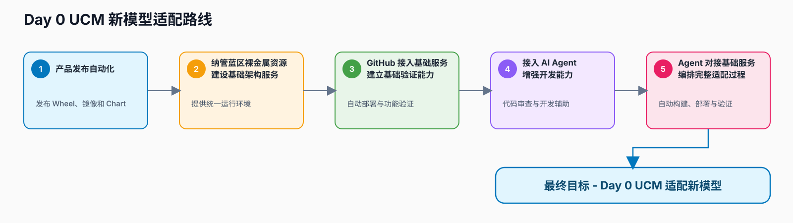
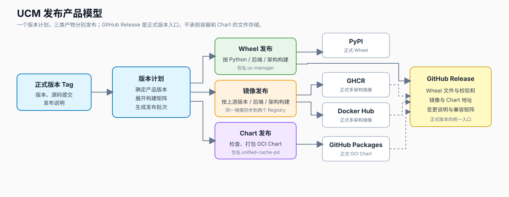
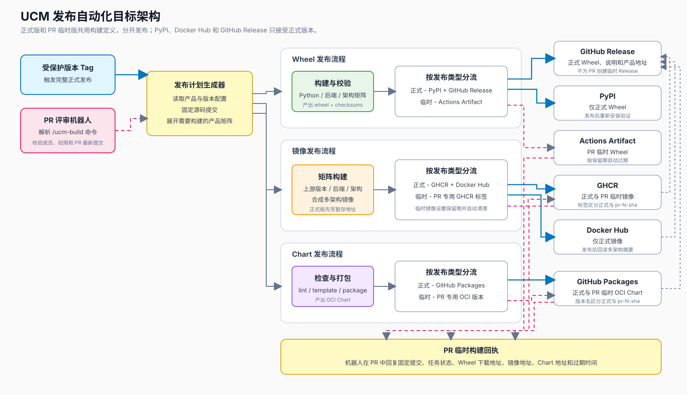
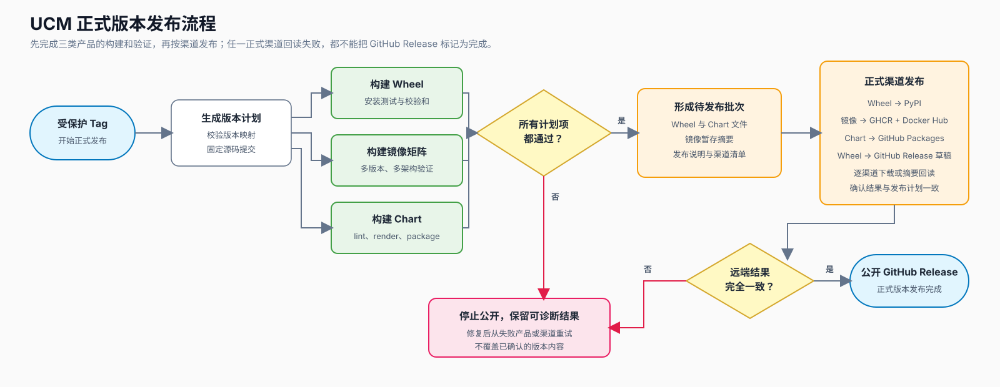

# UCM 产品发布自动化技术评审



> UCM 产品发布自动化是 Day 0 新模型适配路线的第一步。后续还需要依次完成蓝区裸金属资源纳管与基础架构建设、GitHub 到真实环境的验证通路、AI Agent 开发辅助，以及 AI Agent 对基础服务的自动编排，才能形成完整的 Day 0 适配能力。
>
> 本文评审的是 UCM 目标发布体系和实施计划，不是现有流水线说明。当前代码库尚未提交正式的产品发布流水线；工作区中的未提交实现属于个人原型，不作为现状能力，也不作为方案已完成的依据。

## 1. 背景与问题

### 1.1 当前情况

UCM 已经具备 Python 包、容器镜像和 Helm Chart 的构建基础：

- Python 发行包名为 `uc-manager`；
- 代码需要面向不同 Python、CPU 架构和加速后端产出 Wheel；
- 镜像需要组合 UCM 版本、上游推理框架版本、加速后端和 CPU 架构；
- Helm Chart 位于 `charts/ucm`，包名为 `unified-cache-pd`。

但代码库目前没有一套正式提交、可供项目共同维护的产品发布流水线。版本发布、各类产物构建、渠道上传和发布结果汇总还没有形成统一流程，也没有 PR 评审阶段的临时产物服务。

这里需要先纠正一个容易混淆的前提：本地未提交的 Workflow 可以用于验证想法，但不能写成“系统当前已经支持”。本文从“没有正式发布流水线”出发，设计目标完成后的体系，并给出分阶段实施计划。

### 1.2 存在的问题

- **用户没有稳定的正式下载入口。** Wheel、镜像和 Chart 分散在不同构建方式中，版本之间缺少统一说明和可复制的安装命令。
- **三个产品的发布节奏容易失配。** Wheel 已经发布，不代表镜像和 Chart 使用的是同一份源码、同一个 UCM 版本或相互兼容的上游版本。
- **镜像矩阵会持续扩大。** 新增上游 vLLM 版本、CUDA/CANN 版本或 CPU 架构时，如果把组合硬编码在 Workflow 中，维护成本会快速增长。
- **跨渠道失败无法简单回滚。** PyPI、GHCR、Docker Hub、GitHub Packages 和 GitHub Release 是彼此独立的系统，发布到一半失败时，需要能够安全续跑，而不是重新覆盖已经发布的内容。
- **PR 评审缺少可直接试用的产物。** 评审者只能看测试结果，不能通过 `/` 命令按需获得当前 PR 对应的 Wheel、镜像和 Chart。
- **正式版和临时版容易串线。** 如果两者共用版本名、标签或发布凭据，PR 构建可能污染 PyPI、Docker Hub 和正式版本页面。

### 1.3 问题原因

这不是“再写一个 GitHub Actions 文件”就能解决的问题。三个产品的构建输入、发布渠道和失败方式并不相同：

| 产品 | 构建特点 | 正式发布位置 | 临时产出位置 |
| --- | --- | --- | --- |
| Wheel | Python、后端、CPU 架构共同决定文件 | PyPI、GitHub Release | Actions Artifact |
| 镜像 | UCM、上游版本、后端、CPU 架构共同决定矩阵 | GHCR、Docker Hub | GHCR 的 PR 专用标签 |
| Chart | Chart 版本必须与应用版本建立映射 | GitHub Packages OCI | GitHub Packages 的 PR 专用版本 |

真正需要建立的是一套产品发布模型：先确定本次要发布哪些产品和版本，再让三类产物各自完成构建、检查和发布，最后由 GitHub Release 汇总正式版本的使用入口。

### 1.4 现状图（可选）

当前不存在值得固化为架构图的正式发布链路。现状可以概括为“有构建材料，没有统一发布系统”：版本触发、产品矩阵、渠道上传、发布结果汇总和 PR 临时产出都需要新增。为避免把本地原型画成现有能力，本文只在第 4 章展示目标架构。

---

## 2. 目标与范围

### 2.1 目标

方案完成后，UCM 对外提供三类正式产品，并通过 GitHub Release 形成一个版本入口。

| 产品 | 正式版本交付 | PR 临时交付 | 用户入口 |
| --- | --- | --- | --- |
| Wheel | PyPI；同一批 Wheel 作为 GitHub Release 资产 | Actions Artifact | `pip install` 或 Release 下载 |
| 多版本镜像 | GHCR、Docker Hub | GHCR 的 PR 专用标签 | `docker pull`，生产部署使用摘要 |
| Helm Chart | GitHub Packages 中的 OCI Chart | GitHub Packages 中的 PR 专用版本 | `helm pull` / `helm install` |
| 版本说明 | GitHub Release | PR 机器人评论，不创建临时 Release | 一个页面查看变更、兼容矩阵和所有产品地址 |

核心目标如下：

- 一个正式 Tag 对应一个 UCM 版本计划，Wheel、镜像、Chart 和 GitHub Release 都能追溯到同一源码提交；
- 镜像矩阵由配置描述，可以同时覆盖多个上游版本、多个加速后端和多个 CPU 架构；
- 同一份 Wheel 同时用于 PyPI 和 GitHub Release，同一组镜像从同一构建结果同步到 GHCR 和 Docker Hub；
- PyPI、Docker Hub 和 GitHub Release 只接收正式版本；
- PR 评审者可以用 `/ucm-build` 命令按需构建 Wheel、镜像或 Chart，并在评论中拿到地址、状态和过期时间；
- 任一正式渠道发布失败时，版本页面保持草稿状态，修复后从失败处续跑，不重新生成已经确认过的产物。

### 2.2 适用范围

本方案覆盖：

- 正式版、候选版的 Tag 发布；
- Wheel 的构建、安装验证、PyPI 发布和 GitHub Release 归档；
- UCM 与多个上游版本组合的镜像构建，以及 amd64、arm64 多架构发布；
- 镜像向 GHCR 和 Docker Hub 的正式发布；
- Helm Chart 的检查、打包和 GitHub Packages OCI 发布；
- GitHub Release 的草稿创建、正式发布和使用信息汇总；
- PR 评论机器人的命令解析、权限检查、临时构建、结果回复和过期清理。

正式版与临时版使用同一套产品配置和构建定义，但使用不同的触发条件、版本命名和发布位置。

### 2.3 不包含的内容

- 不把当前工作区中的未提交流水线视为已实施方案；
- 不把 PR 临时产物提升为正式版本，正式版必须从受保护 Tag 重新发起；
- 不向 PyPI 或 Docker Hub 发布 PR 临时版本；
- 不为 PR 创建 GitHub Release，也不把完整容器镜像作为 Release 附件上传；
- 首期不发布 `latest`、`stable` 等会被覆盖的别名；
- 首期不建设自托管发布平台，也不引入额外的制品库；
- 代码签名、SBOM、供应链证明可以在主流程稳定后补充，不作为第一阶段前置；
- 真机和集群验证可以作为正式发布前的质量门槛，但不在本文中设计硬件测试平台。

---

## 3. 方案对比与选择

### 3.1 可选方案

#### 方案一：单个 Workflow 完成全部发布

一个 Tag 触发一个大型 Workflow，在同一个文件中依次构建 Wheel、镜像、Chart，并发布到所有渠道。

优点是入口少、开始实现快；缺点是三个产品互相牵制，镜像矩阵扩大后文件会迅速变复杂，某个渠道重试时也容易重复执行无关步骤。

#### 方案二：一个发布协调器加三类产物发布流程

正式 Tag 先生成一份版本计划，再并行调用 Wheel、镜像和 Chart 三类发布流程。每类产物独立完成构建和检查，正式发布阶段再按渠道发布；GitHub Release 负责汇总版本说明、Wheel 文件以及镜像和 Chart 地址。

PR 机器人使用同一套产品构建定义，但只写入临时位置。正式版和临时版在入口处分开，不复制两套构建逻辑。

#### 方案三：三个产品完全独立发布

Wheel、镜像和 Chart 各自维护版本和发布入口，需要时由人工在 GitHub Release 中整理结果。

该方案让单条产品线最自由，但项目需要自行保证三套版本之间的兼容关系。对于用户而言，“安装哪个 Wheel、拉哪个镜像、配哪个 Chart”仍然需要人工判断。

### 3.2 方案对比

| 对比项 | 方案一：单体流水线 | 方案二：协调器 + 三条产品线 | 方案三：完全独立 |
| --- | --- | --- | --- |
| 核心思路 | 所有步骤写在一起 | 统一版本计划，各类产物独立执行 | 产品各自触发、各自发布 |
| 初期实现成本 | 低 | 中 | 中 |
| 多版本镜像扩展 | 差，矩阵会挤占主流程 | 好，镜像线独立扩展 | 好 |
| 版本一致性 | 好 | 好 | 依赖人工维护 |
| 单产品重试 | 差 | 好 | 好 |
| PR 临时构建复用 | 一般 | 好 | 需要分别实现 |
| 发布渠道隔离 | 一般 | 好 | 好 |
| GitHub Release 汇总 | 容易 | 容易 | 需要额外协调 |
| 长期维护成本 | 高 | 中 | 高 |
| 适用场景 | 产品少、矩阵固定 | 多产品、多渠道、需要统一版本 | 产品生命周期完全独立 |

### 3.3 方案对比图（可选）

三种方案的关键差异已经在上表中体现：方案一按步骤组织，方案二按产品组织，方案三则放弃统一版本协调。为避免用大图重复表格，本节不再增加对比图；最终选择的产品关系见 4.2，完整架构见 4.4。

### 3.4 最终选择

建议采用方案二：一个发布协调器加三类产物发布流程，并增加独立的 PR 评论机器人。

决定性原因有三个：

1. **三个产品需要共享版本，但故障应该彼此隔离。** 镜像构建失败不应迫使 Wheel 重新构建，Chart 发布重试也不应重新跑整个镜像矩阵。
2. **镜像的变化最快。** 上游版本和硬件组合会持续增加，单独维护矩阵最符合后续扩展方式。
3. **正式版和临时版可以复用构建能力。** PR 机器人只负责把命令变成临时发布计划，不需要再复制 Wheel、镜像和 Chart 的构建实现。

本次评审通过后，才进入流水线实现和渠道联调。文档中的组件均为目标设计，不代表代码库当前已经具备这些能力。

### 3.5 方案代价

- 需要维护一份产品与版本配置，明确 Wheel 变体、上游镜像版本和 Chart 版本之间的关系；
- 需要分别管理 PyPI、Docker Hub 和 GitHub Packages 的发布凭据及项目权限；
- 正式发布跨越多个平台，不可能获得真正的跨平台事务，只能通过“先构建、后发布、逐渠道确认、失败续跑”降低不一致风险；
- PR 临时镜像和 Chart 会占用包存储，需要设置保留期并在 PR 关闭后清理；
- GitHub Release 是版本入口，不是所有产物的存储位置，用户仍需从 PyPI、容器 Registry 和 GitHub Packages 获取对应产品。

---

## 4. 技术原理与方案设计

### 4.1 核心原理

方案建立在三个简单原则上。

**第一，一个触发动作先生成发布计划。**

正式 Tag 固定版本号和源码提交；PR 命令固定 PR 编号、最新提交和命令参数。系统先把这些输入展开为明确的 Wheel、镜像和 Chart 任务，再开始构建。Workflow 不直接保存产品矩阵，矩阵来自经过评审的配置文件。

**第二，每个产品只构建一次，再发送到对应渠道。**

- Wheel 完成构建和安装验证后，同一批文件用于 PyPI 与 GitHub Release；
- 镜像按架构构建并合成多架构索引，再从同一构建结果同步到 GHCR 与 Docker Hub；
- Chart 完成 `lint`、模板渲染和打包后，以 OCI 方式推送到 GitHub Packages。

**第三，正式版和临时版共用构建定义，但绝不共用发布坐标。**

正式版使用语义化版本；临时版使用 `pr-<编号>-<提交>` 身份。PR 临时结果可以用于评审和试装，但不能进入 PyPI、Docker Hub 或 GitHub Release，也不能改名成为正式版本。

### 4.2 原理图（按需提供）

下图展示一个正式版本如何展开为三类产品，并分别进入适合自己的发布渠道。



### 4.3 整体方案

目标系统包含两个入口和三类产物的发布流程。

- **正式入口**：受保护版本 Tag 触发完整发布。系统生成版本计划，构建 Wheel、镜像和 Chart，完成检查后形成待发布批次。发布人确认后，系统依次写入 PyPI、GHCR、Docker Hub 和 GitHub Packages，逐一检查远端结果，最后公开 GitHub Release。
- **临时入口**：仓库成员在 PR 中发送 `/ucm-build` 命令。机器人固定当前 PR 提交，生成只包含指定产品的临时计划，调用相同的构建定义，并把结果地址和有效期回复到 PR。

GitHub Release 作为正式版本的用户入口，至少包含：

- Release notes；
- 本次发布对应的源码提交；
- Wheel 文件及其校验和；
- PyPI 安装命令；
- GHCR 和 Docker Hub 的镜像标签、摘要及兼容矩阵；
- GitHub Packages 中的 Chart 地址和安装命令；
- 生成上述内容所使用的版本计划。

镜像的“GitHub 发布”使用 GHCR，不把体积巨大的 OCI 归档上传为 GitHub Release 资产。Release 页面只提供镜像坐标、摘要和使用说明。

### 4.4 整体架构图（必须）



架构中的两类入口只共享版本解析、产品配置和构建逻辑。发布渠道在构建结束后分开：正式 Tag 可以进入全部正式渠道；PR 命令只能进入 Actions Artifact、PR 专用 GHCR 标签和 PR 专用 OCI Chart 版本。

### 4.5 组件说明

| 组件 | 作用 | 本次变化 |
| --- | --- | --- |
| 发布协调器 | 接收正式 Tag，生成版本计划，汇总三条产品线，控制 GitHub Release 状态 | 新增 |
| PR 评审机器人 | 解析 `/ucm-build` 命令，固定 PR 提交，启动临时构建并回复结果 | 新增 |
| 产品与版本配置 | 描述 Wheel 变体、镜像矩阵、Chart 版本映射和目标渠道 | 新增 |
| Wheel 发布线 | 构建、安装验证、发布 PyPI、上传 GitHub Release 或临时 Artifact | 新增 |
| 镜像发布线 | 构建多版本、多架构镜像，同步到 GHCR、Docker Hub 或 PR 临时标签 | 新增 |
| Chart 发布线 | 检查、渲染、打包并推送正式或临时 OCI Chart | 新增 |
| GitHub Release 汇总器 | 生成草稿，写入 Wheel、校验和、镜像与 Chart 地址，完成后公开 | 新增 |
| `pyproject.toml` 与现有构建脚本 | 提供 Python 包定义和原生构建入口 | 复用并按发布要求调整 |
| 现有 Docker 构建材料 | 提供 UCM 注入上游镜像的构建基础 | 复用并参数化 |
| `charts/ucm` | 提供 `unified-cache-pd` Chart 源文件 | 复用并补充发布检查 |

实现时建议把逻辑组件映射为一个正式发布入口、一个 PR 命令入口和三个可复用产品 Workflow。这里描述的是建议结构，具体文件名应在实现阶段确定，不能反过来把工作区中的实验文件当作既有接口。

### 4.6 关键流程图（必须）



正式发布分为“构建批次”和“渠道发布”两段。这样做不能消除跨平台的部分成功，但可以保证发布动作发生前，三个产品已经构建完成；渠道发布失败后，也可以复用已确认的产物继续处理，而不是重新构建并产生另一份内容。

### 4.7 关键时序图（按需提供）

正式发布和 PR 临时构建的关键顺序如下，不再单独增加一张与流程图重复的图。

| 阶段 | 正式 Tag | PR `/ucm-build` |
| --- | --- | --- |
| 固定输入 | Tag、源码提交、正式版本 | PR 编号、当前 head SHA、命令参数 |
| 生成计划 | 默认包含全部正式产品 | 只包含命令指定的产品 |
| 构建 | 三条产品线可并行 | 指定产品按需执行 |
| 发布 | 等待全部计划项通过后进入正式渠道 | 构建完成后写入临时位置 |
| 对外结果 | GitHub Release 公开后完成 | 机器人评论包含地址、提交和过期时间 |
| 代码变化 | 同一 Tag 内容不得变化 | PR 更新后旧结果保留原 SHA 标识，新命令产生新结果 |

等待点主要有两个：正式发布需要等待全部计划项完成；PR 机器人需要等待命令对应任务结束后再更新评论。构建超时、渠道限流和网络错误可以重试，版本冲突、摘要变化和无权限命令不能自动重试。

### 4.8 关键设计点

#### 4.8.1 版本模型和产品命名

版本 Tag 是正式发布的起点，但三个产品遵循不同的版本格式：

| 对象 | 正式版本示例 | PR 临时版本示例 |
| --- | --- | --- |
| Git Tag / UCM 版本 | `v1.2.0rc1` / `1.2.0rc1` | 不创建 Tag |
| Wheel | `1.2.0rc1`，后端变体按最终包模型区分 | `1.2.0.dev123+gabcdef0`，仅作为 Artifact |
| 镜像 | `ucm-1.2.0rc1-<upstream>-<backend>` | `pr-123-abcdef0-<upstream>-<backend>` |
| Chart | `1.2.0-rc.1` | `0.0.0-pr.123.abcdef0` |

产品配置至少包含以下字段：

```yaml
release:
  ucm_version: 1.2.0rc1
  chart_version: 1.2.0-rc.1

wheels:
  - profile: <backend-profile>
    python: "3.12"
    platforms: [linux-amd64, linux-arm64]

images:
  - family: <image-family>
    upstream_repository: <upstream-repository>
    upstream_versions: [<reviewed-version-1>, <reviewed-version-2>]
    wheel_profile: <backend-profile>
    platforms: [linux/amd64, linux/arm64]

chart:
  path: charts/ucm
  package: unified-cache-pd
```

配置变化必须通过普通 PR 评审。新增上游版本只增加一条配置，不应复制一套 Workflow。

#### 4.8.2 Wheel 发布流程

UCM 当前针对 CUDA、CANN A2 和 CANN A3 构建不同的原生二进制，同一 Python 版本和 CPU 架构下会产生内容不同的 Wheel。PyPI 的平台标签只能表达 Python、ABI 和操作系统架构，不能帮助用户选择 CUDA 或 CANN；公开版本也不使用 `+cuda`、`+cann` 这类本地版本后缀区分后端。

首版采用独立发行包，与 CuPy、ONNX Runtime 等项目按运行后端拆包的做法一致：

- CUDA 发布为 `uc-manager-cuda`；
- CANN A2 发布为 `uc-manager-cann-a2`；
- CANN A3 发布为 `uc-manager-cann-a3`。

三个发行包使用相同的正式版本号，安装后仍通过 `import ucm` 使用。它们包含不同的原生库，因此同一个 Python 环境只允许安装其中一个。流水线需要在干净环境分别验证每个发行包，并增加混装检查；发现多个 UCM 后端发行包时应直接报错，避免文件覆盖后仍继续运行。后续如果公共 Python 代码和原生后端形成稳定边界，可以再演进为 `uc-manager` 公共包加后端插件，但这不作为首版发布自动化的前置改造。

Wheel 只构建一次，验证通过的同一文件进入不同发布渠道：

1. 按后端、Python 版本和 CPU 架构构建 Wheel，检查发行包名、版本和平台标签；
2. 在干净环境安装，执行 `pip check`、`import ucm` 和对应后端的原生库加载检查；
3. 保存文件名、大小和 SHA256，形成当次发布的 Wheel 清单；
4. 正式 Tag 通过 PyPI Trusted Publishing 上传，再从 PyPI 下载并核对 SHA256；
5. 将构建阶段保存的同一份 Wheel 上传到 GitHub Release，不为 GitHub Release 重新构建；
6. PR 命令触发的临时 Wheel 只保存到 Actions Artifact，并在 PR 回执中给出下载地址，不上传 PyPI，也不进入正式 GitHub Release。

#### 4.8.3 多版本镜像发布流程

镜像矩阵由四个维度组成：UCM 版本、上游镜像版本、运行后端和 CPU 架构。每一个“上游版本 + 后端”构成一个镜像系列，每个系列分别构建 amd64、arm64 成员，再生成一个用户可直接拉取的多架构标签。

构建矩阵的各个维度由产品配置统一维护：

| 维度 | 枚举值 |
| --- | --- |
| UCM 版本 | `0.5.0rc1`，后续版本由正式 Tag 派生 |
| 基础镜像版本 | `vLLM v0.21.0`、`vLLM Ascend v0.22.1rc1`、`vLLM Ascend v0.22.1rc1-a3` |
| 运行后端 | `CUDA 13.0`、`CANN 9.0 A2`、`CANN 9.0 A3` |
| CPU 架构 | `amd64`、`arm64` |

矩阵展开前先按兼容关系过滤基础镜像与运行后端，避免生成没有意义的组合；过滤后的组合再与 UCM 版本和 CPU 架构做笛卡尔积。新增版本或架构时只修改配置，不复制发布流程。

正式版先完成全部成员的构建和基本检查，再从同一组镜像内容同步到 GHCR 和 Docker Hub。两个 Registry 都需要按标签和摘要重新读取，确认用户拉取到的是计划中的内容。Docker Hub 只接收正式版；PR 镜像只使用 GHCR 中带 PR 编号和提交号的临时标签。

GitHub Release 不保存镜像 tar，只记录以下信息：

- 镜像系列和支持的上游版本；
- GHCR 与 Docker Hub 地址；
- 多架构标签和不可变摘要；
- 支持的平台、后端及使用限制。

#### 4.8.4 Chart 发布流程

Chart 发布前执行 `helm lint` 和代表性 Values 的 `helm template`，然后打包并推送到 GitHub Packages 的 OCI 地址。Chart `version` 使用 Helm 可识别的 SemVer，`appVersion` 对应 UCM 用户版本。

正式和临时 Chart 使用同一个包名、不同版本号：正式版使用由 Tag 映射出的版本，PR 临时版使用 `0.0.0-pr.<编号>.<提交>`。PR 关闭后清理临时版本；正式版本不覆盖。

GitHub Release 记录正式 Chart 的 OCI 地址和安装命令，不需要再上传一份重复的 `.tgz`，除非后续确认用户确实需要离线下载入口。

#### 4.8.5 GitHub Release 与失败恢复

GitHub Release 是正式版本的最后一步，而不是最先宣布成功的地方。

1. Tag 触发后先创建草稿；
2. 三条产品线完成构建，形成待发布批次；
3. 发布 Wheel、镜像和 Chart，并从各自渠道重新安装、拉取或读取摘要；
4. 将最终地址、摘要、校验和和兼容矩阵写入草稿；
5. 全部结果一致后再公开 Release。

跨平台发布不可能完全原子化。例如 PyPI 已成功而 Docker Hub 失败时，不应尝试删除或覆盖 PyPI 文件。正确的恢复方式是保留 Release 草稿，修复失败渠道后续跑；重跑发现某个正式版本已经存在时，内容一致则复用，内容不一致则停止并人工处理。

#### 4.8.6 PR 评审机器人

机器人建议提供一个清晰的命令空间：

```text
/ucm-build wheel [profile=<name>]
/ucm-build image family=<name> [upstream=<version>]
/ucm-build chart
/ucm-build all
/ucm-build status
/ucm-build cancel
```

执行规则如下：

- 只接受仍处于打开状态的 PR；
- 默认只接受项目成员或具有写权限的协作者，外部贡献者需要成员批准后执行；
- 每次命令固定当时的 PR head SHA，机器人回复中必须显示该 SHA；
- 同一命令、同一 SHA、同一参数只复用或重跑同一任务，避免重复消耗资源；
- PR 更新后，旧产物仍属于旧 SHA，机器人明确标记为过期，不把它冒充为最新结果；
- PR 任务不获得 PyPI 和 Docker Hub 发布凭据；
- 临时 Wheel 作为 Artifact 下载，临时镜像和 Chart 使用 PR 专用名称，并配置保留期和关闭 PR 后清理。

#### 4.8.7 谁能触发和发布

权限设计用两个问题表达即可：谁能要求系统消耗构建资源，谁能把产物发到正式渠道。

- 普通 PR 检查只读取代码，不接触正式发布凭据；
- `/ucm-build` 命令需要仓库成员身份，来自 fork 的代码在成员批准前不能接触任何写入凭据；
- 正式发布只接受受保护 Tag，并在发布渠道写入前经过发布环境审批；
- PyPI、Docker Hub、GitHub Packages 分别使用独立凭据，一个渠道的凭据不能代替另一个渠道；
- 构建任务和发布任务分开，发布任务只接收已经完成检查的产物及版本计划。

#### 4.8.8 实施计划和完成标准

建议按产品价值分五个阶段推进，不从“先写完整总流程”开始。

| 阶段 | 实施内容 | 完成标准 |
| --- | --- | --- |
| 0. 产品合同 | 确定 Wheel 包模型、镜像命名、Chart OCI 地址、版本映射和产品配置格式 | 给定一个版本，可静态生成完整产品与渠道清单 |
| 1. Wheel 发布 | 构建、安装验证、TestPyPI 联调、GitHub Release 草稿资产 | 从测试索引安装的 Wheel 与草稿中的 Wheel 文件一致 |
| 2. 镜像发布 | 多上游版本矩阵、多架构索引、GHCR 测试仓库、Docker Hub 测试仓库 | 两个 Registry 的标签、平台列表和摘要符合发布计划 |
| 3. Chart 发布 | lint、render、package、GitHub Packages 测试地址 | 可以从 OCI 地址拉取并完成代表性模板渲染 |
| 4. 正式 Tag 汇总 | 版本计划、三类产物编排、草稿 Release、只重试失败渠道、正式公开 | 一次受保护 Tag 可以得到三类正式产品和完整 Release 页面 |
| 5. PR 机器人 | `/ucm-build` 命令、临时命名、评论回执、权限控制、过期清理 | 评审者能对指定 SHA 获取三类临时产物，正式渠道无任何写入 |

每个阶段都先在测试地址联调，再接入正式命名空间。阶段 4 完成前，不能把任一实验 Workflow 描述为正式发布能力。

### 4.9 异常处理

| 异常场景 | 影响 | 处理方式 |
| --- | --- | --- |
| Tag 与项目版本不一致 | 三类产品版本无法统一 | 在任何构建前停止，修正版本后重新创建 Tag |
| Wheel 某个变体失败 | 正式版本不完整 | 不发布 PyPI，不公开 GitHub Release；修复后重跑 Wheel 线 |
| 一个镜像架构失败 | 无法形成完整多架构镜像 | 不发布该镜像系列；正式发布保持草稿 |
| GHCR 成功、Docker Hub 失败 | 两个正式入口暂时不一致 | 保留已发布内容，只重试 Docker Hub；一致后再公开 Release |
| PyPI 版本已存在且内容不同 | PyPI 不允许用同版本替换 | 立即停止，人工判断是否更换版本；禁止覆盖 |
| Chart 版本已存在且内容不同 | 用户无法确认版本内容 | 停止发布，禁止覆盖，修正版本或配置后重新发起 |
| PR 命令来自无权限用户 | 可能消耗资源或接触写入凭据 | 不启动任务，机器人回复所需权限 |
| PR 在构建期间更新 | 结果不再对应最新代码 | 完成当前任务但标记旧 SHA；需要新命令构建新提交 |
| 临时产物超过保留期 | 占用包存储 | 定期清理，并在机器人回复中提前写明过期时间 |

---

## 5. 使用方式

### 5.1 使用场景

- 发布人创建受保护版本 Tag，得到 PyPI Wheel、GHCR/Docker Hub 镜像、GitHub Packages Chart 和 GitHub Release；
- Python 用户通过 PyPI 安装正式 Wheel，或从 GitHub Release 下载指定平台文件；
- 镜像用户根据 GitHub Release 中的兼容矩阵选择上游版本和后端，从 GHCR 或 Docker Hub 拉取；
- Kubernetes 用户从 GitHub Packages 拉取 OCI Chart；
- PR 评审者通过评论命令获取当前提交对应的临时 Wheel、镜像或 Chart。

### 5.2 环境要求

- GitHub 仓库启用 Actions、Packages、Release 和受保护发布环境；
- PyPI 项目及可信发布配置，或等价的短期发布凭据；
- Docker Hub 组织、目标仓库和发布凭据；
- amd64、arm64 构建环境；需要原生编译的后端应使用对应架构的 Runner；
- Docker Buildx、Python 构建工具和 Helm；
- PR 机器人能够读取 Issue Comment、PR head SHA 和评论者仓库权限；
- 临时 GHCR 镜像和 OCI Chart 需要可配置的保留与清理任务。

### 5.3 部署拓扑图（按需提供）

本方案是 CI/CD 发布系统，不是一个常驻在线服务。它的运行拓扑已经在 4.4 的目标架构图中体现：GitHub 提供触发、编排和结果页面，Runner 执行构建，PyPI、GHCR、Docker Hub 和 GitHub Packages 保存正式产品。无需再绘制一张与整体架构重复的节点部署图。

### 5.4 使用示例

发布正式版本：

```bash
git tag -a v1.2.0rc1 -m "UCM v1.2.0rc1"
git push origin v1.2.0rc1
```

用户安装正式 Wheel：

```bash
python -m pip install "uc-manager==1.2.0rc1"
```

用户从 GHCR 或 Docker Hub 拉取同一正式镜像：

```bash
docker pull ghcr.io/<org>/<image>:ucm-1.2.0rc1-<upstream>-<backend>
docker pull <dockerhub-org>/<image>:ucm-1.2.0rc1-<upstream>-<backend>
```

生产部署建议使用 GitHub Release 中记录的不可变摘要：

```bash
docker pull ghcr.io/<org>/<image>@sha256:<digest>
```

用户安装正式 Chart：

```bash
helm pull oci://ghcr.io/<org>/charts/unified-cache-pd --version 1.2.0-rc.1
helm upgrade --install ucm oci://ghcr.io/<org>/charts/unified-cache-pd \
  --version 1.2.0-rc.1 \
  --namespace ucm --create-namespace
```

PR 评审者按需构建：

```text
/ucm-build wheel profile=<name>
/ucm-build image family=<name> upstream=<version>
/ucm-build chart
```

机器人回复应包含：执行状态、PR head SHA、产物地址、安装或拉取命令、过期时间。临时产物只用于评审，不进入正式版本页面。

---

## 6. 总结

这项工作的目标不是把一个本地实验 Workflow 整理成说明书，而是从零建立 UCM 的产品发布体系。

最终方案围绕三类产物展开：Wheel 发布到 PyPI 并随版本进入 GitHub Release；多版本、多架构镜像发布到 GHCR 和 Docker Hub；Chart 以 OCI 包发布到 GitHub Packages。一个正式 Tag 生成统一版本计划，三类产物独立执行，GitHub Release 在所有正式渠道确认后成为用户入口。

PR 评审机器人是同一体系的临时入口。它复用产品构建能力，通过 `/ucm-build` 命令为指定 PR 提供 Wheel、镜像和 Chart，但不写入 PyPI、Docker Hub或 GitHub Release。

建议先评审产品合同和渠道边界，再按 Wheel、镜像、Chart、正式 Tag 汇总、PR 机器人五个阶段实施。只有正式命名空间联调、用户侧重新安装或拉取、失败续跑都通过后，才能把这套能力写成“已经支持”。
