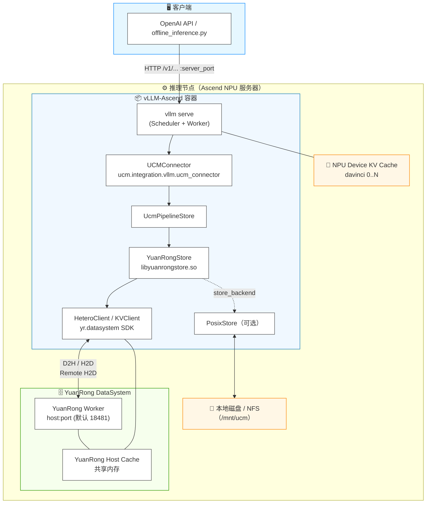
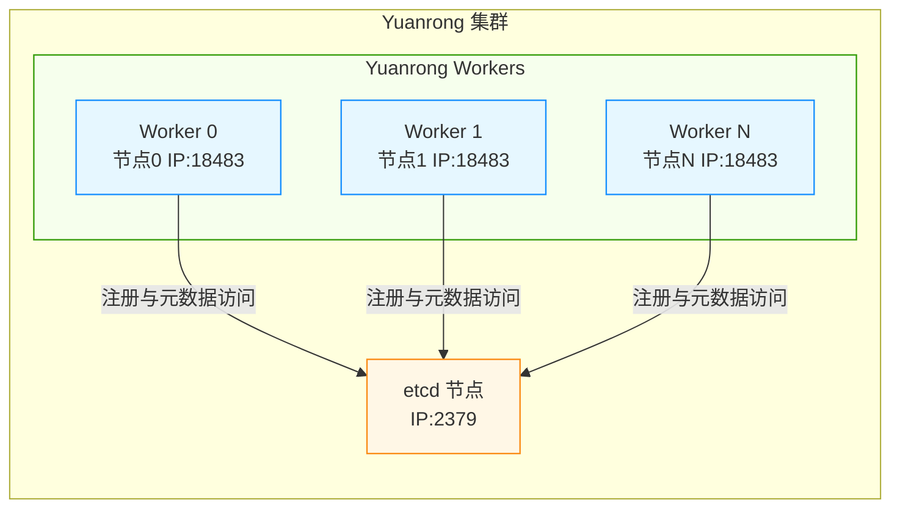

# UCM-YuanRongStore 部署指导

本文档描述 vLLM-Ascend + UCM + YuanRong的部署视图与部署流程。YuanRongStore 是 UCM 的一种 Store 实现，通过 YuanRong DataSystem 的异构传输（`HeteroClient::MSetD2H/MGetH2D`）与共享内存能力，完成 Device 与 Host Cache 之间的 KV Cache 传输，可选串联 Posix 作为持久化后端。

本文基于vllm-ascend：0.23.0rc1进行部署

## 1. 部署视图

### 1.1 组件拓扑



### 1.2 组件职责

| 组件                                               | 部署形态                                                  | 职责                                                    |
| -------------------------------------------------- | --------------------------------------------------------- | ------------------------------------------------------- |
| vLLM-Ascend                                        | 容器/进程                                                 | 推理引擎，通过 `--kv-transfer-config` 挂载 UCMConnector |
| UCM (UCMConnector + PipelineStore + YuanRongStore) | 随 vLLM 进程加载的 Python 包 + `.so`                      | KV Cache 的 Lookup/Load/Dump 调度                       |
| YuanRong DataSystem (Worker + SDK)                 | 独立部署的 Worker 进程；SDK 以 pip 包形式在 vLLM 容器安装 | 异构 D2H/H2D 传输与 Host 共享内存缓存                   |
| PosixStore（可选）                                 | 随 UCM 加载                                               | 本地磁盘/NFS 持久化与冷恢复                             |

数据路径：

```text
YuanRong:       Device <-> YuanRong Host Cache
YuanRong|Posix: Device <-> YuanRong Host Cache <-> Posix
```

### 1.3 元戎集群视图

元戎集群包含至少一个 etcd 节点和若干个 Yuanrong Worker。所有 Yuanrong Worker 均连接到同一个 etcd，由 etcd 提供集群元数据管理和服务发现能力。



> etcd 只需在一个节点部署（生产环境建议使用ETCD集群）。各节点启动 Yuanrong Worker 时，应将 `--etcd_address` 配置为该 etcd 节点的同一地址。

## 2. 部署前置条件

1. **Ascend 环境**：已安装 CANN toolkit（`/usr/local/Ascend`），`ascend-toolkit/set_env.sh` 与 `nnal/atb/set_env.sh` 可正常 source；NPU 驱动就绪（`/dev/davinci*`、`/dev/davinci_manager` 等设备节点可见）。
2. 【HDK】≥ 25.5.0
3. 【CANN版本】≥ 9.1.0
4. **vLLM-Ascend 镜像**：`quay.io/ascend/vllm-ascend:0.23.0rc1-a3`
5. **存储目录**：Posix 后端目录（如 `/mnt/ucm`）已挂载且可读写；多机场景使用 NFS 共享。

## 3. 部署流程

### 3.1 配置内存大页

根据Hugepagesize大小选择配置方法，在每个宿主机执行对应命令，分配500G大页内存

>  查看页大小：`grep Huge /proc/meminfo`；	

**Hugepagesize 2M**

```bash
# 分配256000页共500G
echo 256000 > /proc/sys/vm/nr_hugepages 
```

**Hugepagesize 512M**

```sh
# 分配1000页共500G
echo 1000 > /proc/sys/vm/nr_hugepages
```

执行`grep Huge /proc/meminfo`查看是否配置成功

### 3.2 安装并启动 etcd

>   示例为单实例部署，etcd 只需在节点0安装和启动，其他节点无需操作。

#### 安装 etcd

Yuanrong 服务启动脚本依赖 `etcd` 和 `etcdctl`。至少在节点0安装，其他节点的元戎worker连接同一个 etcd。

```bash
ETCD_VERSION="v3.5.12"
if [ "$(uname -m)" = "aarch64" ]; then
  ETCD_ARCH="linux-arm64"
else
  ETCD_ARCH="linux-amd64"
fi
wget https://github.com/etcd-io/etcd/releases/download/${ETCD_VERSION}/etcd-${ETCD_VERSION}-${ETCD_ARCH}.tar.gz
tar -xvf etcd-${ETCD_VERSION}-${ETCD_ARCH}.tar.gz
cd etcd-${ETCD_VERSION}-${ETCD_ARCH}
cp etcd etcdctl /usr/local/bin/
```

> 若已有安装包，则跳过 wget 下载步骤，直接执行以下命令：
>
> ```bash
> tar -xvf etcd-v3.5.12-linux-arm64.tar.gz
> cd etcd-v3.5.12-linux-arm64
> cp etcd etcdctl /usr/local/bin/
> ```

验证安装

```bash
etcd --version
etcdctl version
```

#### 启动 etcd

创建启动脚本 `run_etcd.sh`，在节点0启动 etcd：

```sh
#!/bin/bash

export ETCD_IP="<节点IP>" 
export ETCD_PORT=2379
export ETCD_PEER_PORT=2380

etcd \
  --name etcd-single \
  --data-dir /tmp/etcd-data \
  --listen-client-urls http://0.0.0.0:${ETCD_PORT} \
  --advertise-client-urls http://${ETCD_IP}:${ETCD_PORT} \
  --listen-peer-urls http://0.0.0.0:${ETCD_PEER_PORT} \
  --initial-advertise-peer-urls http://${ETCD_IP}:${ETCD_PEER_PORT} \
  --initial-cluster etcd-single=http://${ETCD_IP}:${ETCD_PEER_PORT} \
  > /tmp/etcd.log 2>&1 &

sleep 3

etcdctl --endpoints "${ETCD_IP}:${ETCD_PORT}" put key "value"
etcdctl --endpoints "${ETCD_IP}:${ETCD_PORT}" get key

echo "ETCD start finished, log dir: /tmp/etcd.log"
```

验证：

```sh
# 方式1，预期输出：{"health":"true","reason":""}
etcdctl --endpoints "${ETCD_IP}:${ETCD_PORT}" endpoint health

# 方式2，预期输出：100.100.xxx.xxx:2379 is healthy: successfully committed proposal: took = 1.43913ms
curl -L http://${ETCD_IP}:${ETCD_PORT}/health
```

### 3.3 安装ucm

```sh
pip install wrapt-1.17.2-cp312-cp312-manylinux_2_17_aarch64.manylinux2014_aarch64.whl

pip install uc_manager-0.5.0-cp312-cp312-linux_aarch64.whl --force-reinstall --no-deps
```

>   注意：若通过源码编译安装ucm，需要先安装元戎whl包

### 3.4 配置 UCM Connector

#### 单机

新建文件`ucm_yuanrong_config.yaml`

```yaml
ucm_connectors:
  - ucm_connector_name: "UcmPipelineStore"
    ucm_connector_config:
      store_pipeline: "YuanRong|Posix"		# 纯YuanRong不带Posix 时改为 "YuanRong"
      yuanrong_host: "当前节点IP"					# 指向 3.3 启动的 Worker
      yuanrong_port: 18483
      yuanrong_enable_remote_h2d: false		# 关闭rh2d
      yuanrong_timeout_ms: 20000
      yuanrong_waiting_queue_depth: 8192
      yuanrong_load_worker_count: 4
      # Posix cold recovery pipeline batch size.
      yuanrong_dump_prerequisite_worker_count: 2
      yuanrong_recovery_batch_size: 32
      yuanrong_h2d_stream_count: 4
      yuanrong_backfill_worker_count: 1
      yuanrong_backfill_queue_depth: 128
      yuanrong_posix_max_inflight_gb: 1

      #share_buffer_enable: true
      storage_backends: "/mnt/ucm"      # Posix 后端目录
      posix_io_engine: "aio"						# aio 仅 io_direct=true
      io_direct: true										# 为true时，元戎worker启动参数需要带`memory_alignment=4096`

enable_event_sync: true
use_layerwise: false
```

#### 多机

新建文件`ucm_yuanrong_config.yaml`

```yaml
ucm_connectors:
  - ucm_connector_name: "UcmPipelineStore"
    ucm_connector_config:
      store_pipeline: "YuanRong|Posix"		# 纯YuanRong不带Posix 时改为 "YuanRong"
      yuanrong_host: "当前节点IP"				 # 
      yuanrong_port: 18483
      yuanrong_enable_remote_h2d: true		# 开启rh2d
      yuanrong_timeout_ms: 20000
      yuanrong_waiting_queue_depth: 8192
      yuanrong_load_worker_count: 4
      # Posix cold recovery pipeline batch size.
      yuanrong_dump_prerequisite_worker_count: 2
      yuanrong_recovery_batch_size: 32
      yuanrong_h2d_stream_count: 4
      yuanrong_backfill_worker_count: 1
      yuanrong_backfill_queue_depth: 128
      yuanrong_posix_max_inflight_gb: 1

      #share_buffer_enable: true
      storage_backends: "/mnt/ucm"      # Posix 后端目录
      posix_io_engine: "aio"						# aio 仅 io_direct=true
      io_direct: true										# 为true时，元戎worker启动参数需要带`memory_alignment=4096`

enable_event_sync: true
use_layerwise: false
```

#### 参数说明

| 配置 | 默认值 | 说明 |
|---|---:|---|
| `yuanrong_host` |  | YuanRong Worker 地址 |
| `yuanrong_port` | `18483` | YuanRong Worker 端口 |
| `yuanrong_namespace` | `unique_id` | key 隔离命名空间，dsv4需设置为"" |
| `yuanrong_enable_remote_h2d` | `true` | 是否启用 Remote H2D |
| `yuanrong_timeout_ms` | `20000` | SDK、任务及 Buffer 等待超时 |
| `yuanrong_waiting_queue_depth` | `8192` | Load/Dump 等待队列上限 |
| `yuanrong_load_worker_count` | `4` | Load worker 数 |
| `yuanrong_dump_prerequisite_worker_count` | `2` | prerequisite event worker 数 |
| `yuanrong_recovery_batch_size` | `32` | Posix 恢复批大小 |
| `yuanrong_h2d_stream_count` | `4` | 每个 Load worker 的 H2D stream 数 |
| `yuanrong_backfill_worker_count` | `1` | 异步回填 worker 数 |
| `yuanrong_backfill_queue_depth` | `128` | 异步回填队列深度 |
| `yuanrong_posix_max_inflight_gb` | `1` | 每进程后台 Posix Dump 持有 Buffer 上限，单位GB |

### 3.5 安装并启动 Yuanrong 服务

#### 安装元戎

```
pip install openyuanrong_datasystem-0.9.2-cp312-cp312-manylinux_2_35_aarch64.whl --force-reinstall
```

#### 启动元戎

所有节点都需要启动 Yuanrong Worker，并连接到节点 0 上的 etcd，根据3.4中`ucm_connectors`不同的配置选择不同的参数。

> 注意：ucm中io_direct: true时如下脚本需要带上--memory_alignment 4096，为false时去除

##### 单机

创建 `run_yr_worker.sh`，修改`HOST_IP`、`ETCD_IP`、`SHM_SIZE`、`spill_directory`、`spill_size_limit`：

```bash
#!/bin/bash

export HOST_IP="当前节点IP"
export ETCD_IP="ETCD节点IP"
export WORKER_PORT=18483
export ETCD_PORT=2379
export SHM_SIZE=512000	# 共享内存大小，500G

dscli start --interleave 0-7 -t 120 -w \
  --worker_address ${HOST_IP}:${WORKER_PORT} \
  --etcd_address ${ETCD_IP}:${ETCD_PORT} \
  --shared_memory_size_mb ${SHM_SIZE} \
  --node_timeout_s 20 \
  --node_dead_timeout_s 30 \
  --log_only_write_info_file false \
  --rpc_thread_num 64 \
  --sc_regular_socket_num 0 \
  --sc_stream_socket_num 0 \
  --oc_thread_num 64 \
  --arena_per_tenant 1 \
  --enable_huge_tlb true \
  --spill_directory "/spill_ssd_dir" \
  --spill_size_limit 100000000000 \
  --memory_alignment 4096 
```

##### 多机

创建 `run_yr_worker.sh`，修改`HOST_IP`、`ETCD_IP`、`SHM_SIZE`、`spill_directory`、`spill_size_limit`：

```bash
#!/bin/bash

export HOST_IP="当前节点IP"
export ETCD_IP="ETCD节点IP"
export WORKER_PORT=18483
export ETCD_PORT=2379
export SHM_SIZE=512000	# 共享内存大小，500G

dscli start --interleave 0-7 -t 120 -w \
  --worker_address ${HOST_IP}:${WORKER_PORT} \
  --etcd_address ${ETCD_IP}:${ETCD_PORT} \
  --shared_memory_size_mb ${SHM_SIZE} \
  --node_timeout_s 20 \
  --node_dead_timeout_s 30 \
  --log_only_write_info_file false \
  --rpc_thread_num 64 \
  --sc_regular_socket_num 0 \
  --sc_stream_socket_num 0 \
  --oc_thread_num 64 \
  --arena_per_tenant 1 \
  --enable_huge_tlb true \
  --spill_directory "/spill_ssd_dir" \
  --spill_size_limit 100000000000 \
  --remote_get_policy "MEMORY_ONLY" \
  --enable_memory_rebalance true \
  --enable_worker_worker_batch_get true \
  --remote_h2d_device_ids "0,1,2,3,4,5,6,7,8,9,10,11,12,13,14,15" \
  --remote_h2d_link_type "HCCS" \
  --remote_h2d_hccs_buffer_pool "4:8" \
  --memory_alignment 4096 
```

##### 参数说明

| 参数类别 | 参数 | 示例值 | 说明 | 适用场景 |
| --- | --- | --- | --- | --- |
| 内存大页 | `arena_per_tenant` | `1` | 每个租户的 arena 数量 | 单机、多机 |
| 内存大页 | `enable_huge_tlb` | `true` | 是否开启大页内存 | 单机、多机 |
| SSD | `spill_directory` | `/spill_ssd_dir` | 本地 SSD 溢出目录 | 单机、多机 |
| SSD | `spill_size_limit` | `100000000000` | 本地 SSD 溢出目录的容量上限，单位为 Byte；示例约为 100 GB | 单机、多机 |
| SSD | `remote_get_policy` | `MEMORY_ONLY` | 仅从远端内存读取数据，不读取远端 SSD | 多机 |
| 内存 Rebalance | `enable_memory_rebalance` | `true` | 开启内存再均衡，将数据溢出到有空闲内存的节点 | 多机 |
| RH2D | `enable_worker_worker_batch_get` | `true` | 开启 Worker 间批量获取 | 多机 |
| RH2D | `remote_h2d_device_ids` | `0,1,...,15` | 配置用于 Remote H2D 的 NPU 设备 ID | 多机 |
| RH2D over HCCS | `remote_h2d_link_type` | `HCCS` | 指定 Remote H2D 使用 HCCS 链路 | 多机使用 HCCS 时 |
| RH2D over HCCS | `remote_h2d_hccs_buffer_pool` | `4:8` | 配置 Remote H2D 的 HCCS 缓冲池 | 多机使用 HCCS 时 |
| `io_direct` | `memory_alignment` | `4096` | 设置内存对齐字节数 | UCM `io_direct` 配置为 `true` 时 |

### 3.6 添加补丁

添加补丁到VLLM-ascend

```sh
cd /vllm-workspace/vllm-ascend
git am /workspace/0001-delete-yuanrong_backend-param-enable_exclusive_conne.patch
```

### 3.7 升级CANN (单机可跳过)

升级 Hixl 

```sh
bash cann-hixl_9.1.0_linux-aarch64.run  --upgrade --quiet --pylocal
```

查看 Hixl 版本

```sh
cat /usr/local/Ascend/cann-9.0.0/share/info/hixl/version.info

# 显示Version=9.1.0
    Version=9.1.0
    version_dir=cann
    required_package_runtime_version=">=8.5"
    required_package_metadef_version=">=8.5"
    required_package_hcomm_version=">=8.5"
    timestamp=20260805_232201954
```

### 3.8 拉起服务

#### 单机

```sh
export LD_LIBRARY_PATH=/usr/local/python3.12.13/lib/python3.12/site-packages/yr/datasystem/lib:$LD_LIBRARY_PATH
export DATASYSTEM_LOG_ONLY_WRITE_INFO_FILE=false
export DS_H2D_MEMCPY_POLICY=ffts
export DS_D2H_MEMCPY_POLICY=ffts
export DS_H2D_FFTS_PARALLEL_WORKER_NUM=4
export DS_D2H_FFTS_PARALLEL_WORKER_NUM=4
export DS_H2D_FFTS_PARALLEL_MIN_BYTES=25165824
export DS_D2H_FFTS_PARALLEL_MIN_BYTES=0

.... 	# 	其他配置省略

vllm serve /tmp/GLM-5.1-W8A8 \
... 	# 	其他配置省略
  --kv-transfer-config \
'{
    "kv_connector": "UCMConnector",
    "kv_connector_module_path": "ucm.integration.vllm.ucm_connector",
    "kv_role": "kv_both",
    "kv_connector_extra_config": {"UCM_CONFIG_FILE": "/workspace/ucm_yuanrong_config.yaml"}
}'
```


#### 多机

```sh
export LD_LIBRARY_PATH=/usr/local/python3.12.13/lib/python3.12/site-packages/yr/datasystem/lib:$LD_LIBRARY_PATH
export DATASYSTEM_LOG_ONLY_WRITE_INFO_FILE=false 
export DS_H2D_MEMCPY_POLICY=ffts
export DS_D2H_MEMCPY_POLICY=ffts
export DS_H2D_FFTS_PARALLEL_WORKER_NUM=4
export DS_D2H_FFTS_PARALLEL_WORKER_NUM=4
export DS_H2D_FFTS_PARALLEL_MIN_BYTES=25165824
export DS_D2H_FFTS_PARALLEL_MIN_BYTES=0
export DS_RH2D_LINK_TYPE=HCCS   # 使用RH2D over HCCS时需要配置

.... 	# 	其他配置省略

vllm serve /tmp/GLM-5.1-W8A8 \
... 	# 	其他配置省略
  --kv-transfer-config \
'{
    "kv_connector": "UCMConnector",
    "kv_connector_module_path": "ucm.integration.vllm.ucm_connector",
    "kv_role": "kv_both",
    "kv_connector_extra_config": {"UCM_CONFIG_FILE": "/workspace/ucm_yuanrong_config.yaml"}
}'
```
